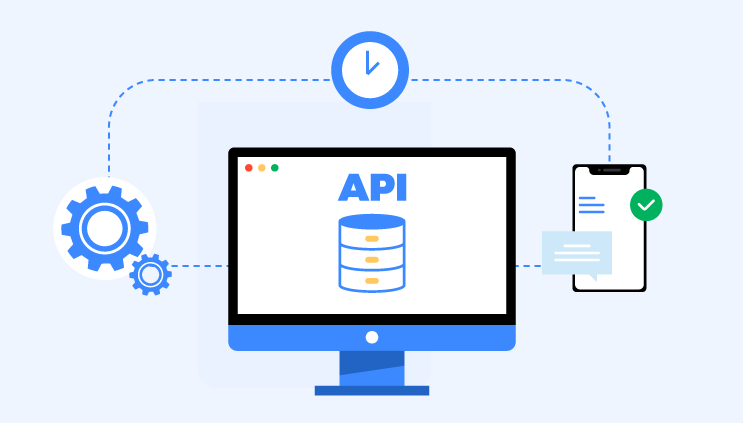

---
title: "5 Key Metrics for API health"
date: 2024-03-01T11:10:00+00:00
featured_image: 5 Key Metrics for API health.png
description: "Maintaining a healthy API is crucial for ensuring its smooth operation, user satisfaction, and overall business success."
author: elliot
categories:
  - API
--- 

Maintaining a healthy API is crucial for ensuring its smooth operation, user satisfaction, and overall business success. By closely monitoring a comprehensive set of API health metrics, you gain valuable insights into your API's performance, identify potential issues, and proactively address them. 

## Types of API Metrics you should Monitor

The specific metrics chosen for monitoring will depend on the type of assets and services you're tracking

- Request Rate
- Latency (Response Time)
- Error Rate
-  Uptime
- API Usage Growth

**Note:** Your chosen metrics should be aligned with your overall business objectives, user experience expectations, and industry-specific KPIs (Key Performance Indicators).

## Why you Need a Perfect API health

### Enhanced User Experience

Smooth API operation translates to a faster and more responsive user experience. Users expect applications to function flawlessly, and any sluggishness or downtime caused by an unhealthy API can lead to frustration and ultimately, customer churn.

### Improved Brand Reputation

A reliable and efficient API fosters user trust and builds a positive brand image. When users consistently experience positive interactions with your API-driven applications, it strengthens brand loyalty and advocacy.

### Increased Revenue Potential

A well-maintained API paves the way for new revenue streams. By offering a robust and valuable API to developers, you can potentially unlock new partnerships, expand your market reach, and create opportunities for monetization through various pricing models.

### Boosted Innovation

A healthy API empowers developers to build innovative applications and services on top of your platform. This fosters a collaborative ecosystem where external developers can contribute to the overall value proposition of your offerings.

### Streamlined Operations

By proactively monitoring API health, you can identify and address issues before they escalate into larger problems. This reduces the risk of costly downtime and minimizes the need for reactive troubleshooting, allowing your team to focus on strategic initiatives.

## Key Metrics for API health

### Request Rate

The request rate signifies the volume of traffic it handles, measured in Requests Per Minute (RPM). By closely monitoring the RPM, you gain a clear understanding of the API's workload. This metric is crucial for effective resource scaling.  

During peak usage periods, surges in traffic can overwhelm the API, leading to performance degradation. By tracking the RPM, you can proactively scale resources (e.g., servers) to ensure smooth operation even during high traffic times.

The average RPM can vary significantly depending on the industry and API purpose. However, a well-designed API should be able to handle 10,000+ RPM without performance degradation.

### Latency (Response Time)

Latency measures the time it takes for an API to respond to a request. Faster response times translate to a smoother and more enjoyable user experience. Continuously monitoring both average and maximum latency is crucial. 

Analyzing these values can help pinpoint performance bottlenecks within the API code. By optimizing the code for efficiency, you can significantly reduce latency and ensure users experience rapid response times.

Ideally, strive for an average latency below 100 milliseconds for optimal user experience. Latency exceeding 250 milliseconds can negatively impact user satisfaction.

### Error Rate

A high error rate indicates potential issues with the API's functionality. This metric reflects the number of API requests that result in errors per minute (Errors Per Minute - EPM).  To minimize errors and ensure API stability, implement error logging. 

By analyzing error codes, you can diagnose the root cause of issues and take corrective actions. APIToolkit.io offers advanced error monitoring capabilities, enabling you to identify and troubleshoot errors efficiently, ensuring a frustration-free experience for your users. A well-functioning API should have an EPM close to zero.

### Uptime
 
Uptime, measured as the percentage of time the API is accessible and operational, is paramount. Strive for an uptime target exceeding 99.9%. To achieve this gold standard, robust monitoring tools are essential. 

APIToolkit.io provides comprehensive solutions for monitoring API uptime, allowing you to promptly detect and rectify outages, ensuring minimal disruption to your users.

Aim for a minimum uptime of 99.5%, with the ultimate goal exceeding 99.9%. Leading tech companies strive for even higher uptime targets (e.g., Google: 99.99%).
 
### API Usage Growth
 
A steadily increasing API usage growth signifies a successful and valuable API. This metric reflects the growth in the number of API requests over time.  Monitoring API usage growth provides valuable insights into the API's adoption rate and overall value proposition. 

A stagnant or declining trend might indicate the need for further development to enhance the API's usefulness and attract more users.

Consistent growth indicates a successful API. A stagnant or declining trend might necessitate further development efforts to enhance the API's functionalities and attract a wider user base.

