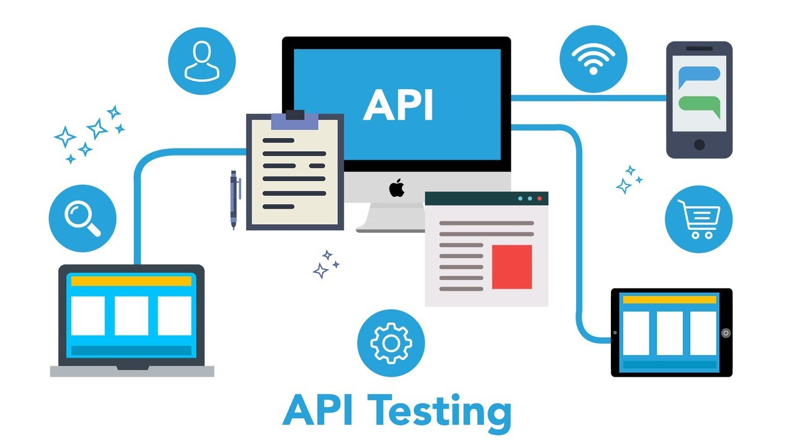

# Role of API Automation Testing in API Management

Manual testing alone often proves inadequate for meeting most challenges as APIs rapidly evolve. This is where automated API testing comes into play as a transformative solution. In this blog, we will explore the fundamentals of API testing, distinctions from API management, and most importantly, the immense value delivered through API test automation. 

We will uncover how automated testing enhances efficiency, coverage and accuracy while reducing human error. Whether just starting out with APIs or looking to optimize existing systems, the powerful capabilities of automated API testing are well worth understanding.

## The Challenges of Manual API Testing

While manual testing retains an important role, relying solely on human testers for API quality assurance brings considerable limitations. Testing APIs manually is time and resource intensive, requiring dedicated staff to send requests, validate responses and document issues around the clock. Even large teams quickly hit barriers in achieving comprehensive test coverage across the myriad of possible API use cases and scenarios.

With frequent iterative deployments, keeping pace with manual testing for each API change becomes burdensome. Human testers also inherently bring the risk of overlooking test cases, misconfiguring tests, and introducing inconsistencies. As today's ultra-agile software lifecycles demand rapid feedback on API quality, the tiresome slog of manual testing simply can't keep up.

## Automated API Testing as a Solution

Automated API testing provides the enhanced efficiency, breadth and accuracy that manual testing lacks. By using specialized tools and scripts to simulate API calls and validate responses, tedious manual processes are eliminated. Automated testing facilitates expansive test coverage across numerous use cases, far beyond feasible human capabilities.

With tests defined in executable code, inconsistencies are eliminated while enabling reliable repetition across the entire development lifecycle. Automation integrates seamlessly into modern CI/CD pipelines, allowing for continuous feedback on each API change. In essence, automated testing overcomes the bottlenecks of manual testing to enable holistic and iterate API quality assurance.

## What is API Testing?

API testing focuses on evaluating application programming interfaces (APIs) to ensure correct functionality and performance.

## Types of API tests

 ### Functional Testing
Functional testing confirms that API logical operations meet expectations across parameters, payloads and responses.

**a. Positive Testing** verifies that APIs produce the expected output for valid inputs.

**b. Negative Testing** provides invalid or malformed inputs to confirm that errors are properly handled.

### Non-Functional Testing
Non-Functional Testing focuses on aspects beyond base functionality, such as:

**a.  Usability Testing**  evaluates API ease-of-use and accessibility.
**b. Reliability Testing** assesses API stability and readiness for production.
**c. Performance Testing** determines how an API performs under varied real-world conditions and load.

## What is API Management?
API management provides tools and processes for publishing, documenting, analyzing and optimizing APIs throughout their lifecycle. Key capabilities include access control, rate limiting, analytics and developer portals.

API management streamlines consuming and interacting with APIs for both internal and external audiences. For API providers, management solutions enhance oversight, foster adoption and deliver business insights.

## API Gateway vs API Management
API Gateways provide a single entry point to internally route API calls and handle cross-cutting concerns like security, rate limiting and load balancing.

API Management offers these gateway capabilities while also providing lifecycle processes like developer portals, API design, testing, monitoring and analytics. Management platforms take a holistic governance approach.

For simple traffic management, an API gateway suffices. But full-fledged management solutions are recommended for complex ecosystems with diverse API consumers and needs for oversight.

## Benefits of API Test Automation

### Boost Efficiency and Accelerate Release Cycles
Automated testing delivers tremendous time savings compared to manual repetition of tests. With efficient test execution, test cycles can be run on demand or continuously integrated into the deployment pipeline.

Test automation supports accelerated delivery by enabling fast feedback on each code change. Issues can be caught early to prevent accumulating technical debt. Engineering productivity is boosted by eliminating tedious manual testing.

### Achieve Broader Test Coverage
The workload needed for comprehensive manual testing of APIs quickly becomes unrealistic. There are simply too many possible permutations of parameters, requests, and user scenarios.

Automated tools can easily handle thousands of tests without fatigue or human oversight. Complex conditional logic and data combinations further expand test coverage. By exploring edge cases that human testers would miss, automation better exposes overlooked defects.

### Enhance Accuracy and Reliability

Even rigorous manual testing is prone to inconsistent results and human error. Testing distracted or under pressure leads to overlooked issues that can create problems down the road.

Automated tests deliver reliable and repeatable results unaffected by external factors. Code-based tests don't miss details or take mental shortcuts. Automated regression testing also verifies that existing functionality remains intact through future changes.

## Types of API Test Automation
There are a variety of testing types that can be automated to enhance API quality:

**Contract Testing**

Automated contract tests validate that APIs adhere to their defined specifications and expectations. Contract testing is ideal for external-facing APIs consumed across organizations.

**Security Testing**

Automating API penetration testing and scanning for vulnerabilities aids in identifying security weaknesses before exposure. OWASP guidelines can be programmatically checked.

**Performance Testing**

Instead of time-intensive manual load tests, automating tests across simulated loads exposes how APIs respond under varied real-world conditions.

## Why Choose APItoolkit for API  Test Automation
APItoolkit offers the following advantages over other test automation platforms:

**Intuitive Interface for All Levels**

At Apitoolki we keep in mind of a user-friendly interface packed with robust testing capabilities, empowering our clients and their teams of all skill levels to leverage its full potential. The platform is meticulously designed to ensure maximum usability, allowing you to get started quickly and efficiently.

**Seamless Integration for Frictionless Workflow**

Effortlessly integrate Apitoolki with your existing development tools and frameworks. Our platform can seamlessly blends into your current workflow, eliminating any disruption to your established practices.

**Customization and Flexibility**

We offers a comprehensive suite of pre-built testing features, while also providing exceptional flexibility to tailor tests to your specific needs. This empowers you to strike the ideal balance between functionality and configuration, ensuring your tests perfectly align with your unique requirements.

For intuitive, adaptable, and powerful API test automation that delivers tangible results, we stands out as the premier solution.

### Quantifiable Benefits

**Reduce Testing Time:** Apitoolkit automation capabilities can help you reduce API testing time by up to 70%, freeing up valuable resources for other critical tasks.

**Improve Test Coverage:** Achieve comprehensive test coverage with Apitoolkit wide range of features and customization options, ensuring all aspects of your APIs are thoroughly tested.

**Boost Development Speed:**  By enabling continuous testing and delivery, Apitoolkit can help you accelerate development speed by identifying and resolving issues early in the development cycle.

Apitoolkit empowers you to streamline your API testing process, achieve exceptional quality, and accelerate your development efforts. [Sign up](https://apitoolkit.eu.auth0.com/u/login?state=hKFo2SAxdGcza1hWOFVZVEZwclFFS0lfcGJCMFNxcVQtVE9WWaFur3VuaXZlcnNhbC1sb2dpbqN0aWTZIGVhY2pBV0ZDQ09NbFFuR25rVUVqcEdQTkpteGlYdnpao2NpZNkgQ0NoZnE2bGVSR2RuOWhhSFdzS0Q5RHRtbVl2RDlYYUM) for a free trial today and experience the difference!
