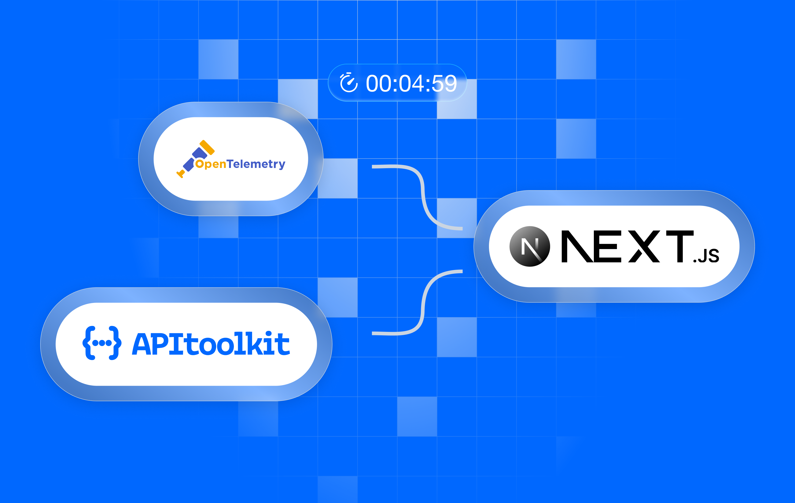
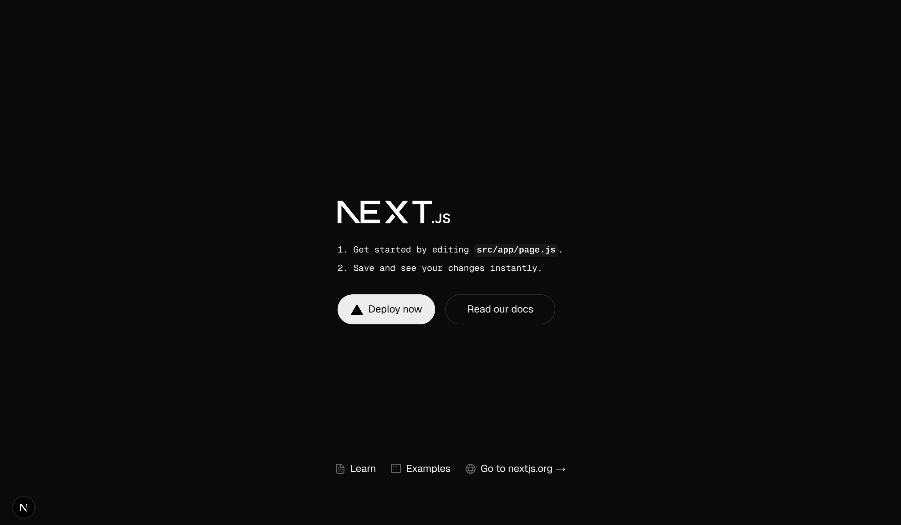
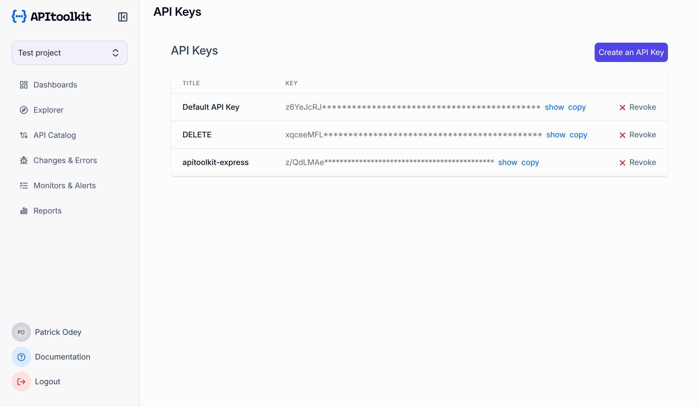
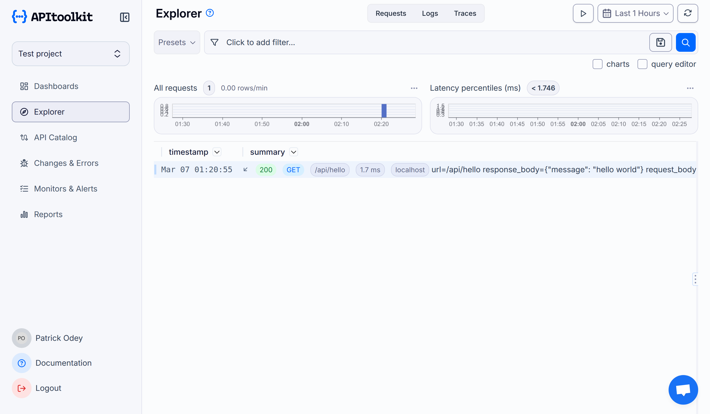
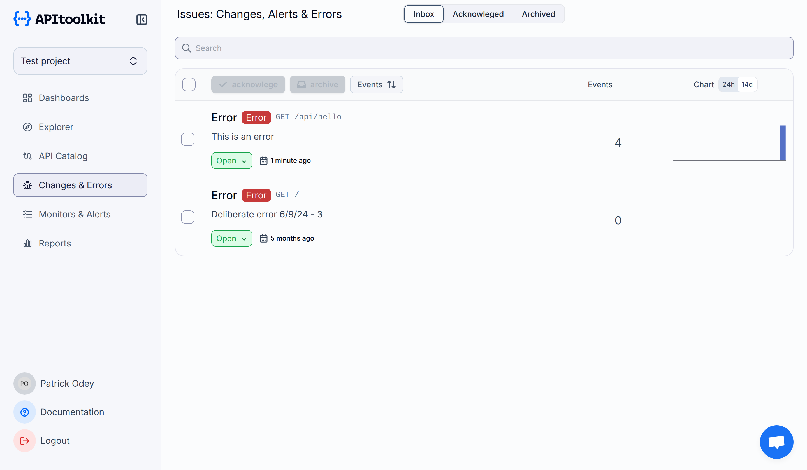

# Add APIToolkit To Your Next.js Application In 5 Minutes



In this article, we will learn to integrate [APIToolkit](https://apitoolkit.io/) into our [Next.js](https://nextjs.org/) application in just a few simple steps. For this to work, we need OpenTelemetry. [OpenTelemetry](https://opentelemetry.io/) will help us gather traces about our application and send this information to APIToolkit. APIToolkit provides you with a variety of features out-of-the-box, including, but not limited to, API Observability and Monitoring, API Testing, Error Tracking, API Analytics, API Log Explorer, and a lot more.

## Setting Up Your Next.js Project

Create a new Next.js application by running the following command in your terminal.

```javascript
  npx create-next-app@latest my-nextjs-app
```

{=Note:=} We didn't use TypeScript in this project, but please choose TypeScript during the installation if you want.

Navigate into your newly created Next.js application:

```javascript
  cd my-nextjs-app
```

Run the development server:

```javascript
  npm run dev
```

If you did everything correctly, when you visit `http:localhost:3000` on your browser, you should see a similar page like the one below:



## Adding APIToolKit to your application

{=Note:=} To add APIToolkit, you need to create an account [here](app.apitoolkit.io). This onboarding [video](https://www.youtube.com/watch?v=_uqxNTpcEOI&pp=ygUVYXBpdG9vbGtpdCBvbmJvYXJkaW5n) will walk you through the process. 

Let's install APIToolKit's [Next.js SDK](https://apitoolkit.io/docs/sdks/nodejs/nextjs/) with the following command. This command adds the core OpenTelemetry API and also includes Vercel's OpenTelemetry integration.

```javascript
  npm install --save apitoolkit-next @opentelemetry/api @vercel/otel
```

## Setup OpenTelemetry


Create a `.env` file with the following configuration. Replace the `service name` and `API key` with your actual API and service name.

```javascript
  OTEL_EXPORTER_OTLP_ENDPOINT="http://otelcol.apitoolkit.io:4318"
  OTEL_SERVICE_NAME="my-service" # Specifies the name of the service.
  OTEL_RESOURCE_ATTRIBUTES="at-project-key={YOUR_API_KEY}" # Adds your API KEY to the resource.
  OTEL_EXPORTER_OTLP_PROTOCOL="http/protobuf" #Specifies the protocol to use for the OpenTelemetry exporter.
```

{=Note:=} You can get your API key from your APIToolKit Dashboard.



Navigate to the `src` folder and create an `instrumentation.js`  or `(.ts)` file, then add the following code:

```javascript
  import { registerOTel } from "@vercel/otel";

  export function register() {
    registerOTel("{YOUR_PROJECT_NAME}");
  }
```

This code initializes [OpenTelemetry](https://opentelemetry.io/) with your project name, enabling the capture of telemetry data.

## Monitoring HTTP Requests

Create an API route `/app/api/hello/route.js` and update it with the following code:

```javascript
  import { withAPItoolkitAppRouter } from "apitoolkit-next";
  import { NextResponse } from "next/server";

  async function handleRequest(request) {
    return NextResponse.json({ message: "hello world" });
  }

  // Optional configuration
  const config = {
    captureResponseBody: true,
  }

  export const GET = withAPItoolkitAppRouter(handleRequest, config);
```

{=Note:=} If you are using `Pages Router`, use the code below:

```javascript
  import { withAPItoolkitPagesRouter } from "apitoolkit-next";

  function handler(req, res) {
    res.status(200).json({ message: "Hello from Next.js!" });
  }

  // Optional configuration
  const config = {
    captureResponseBody: true,
  };

  export default withAPItoolkitPagesRouter(handler, config);
```

On your browser, navigate to `http://localhost:3000/api/hello`. You should get a response like the one below: 

```javascript
  {
  "message": "hello world"
  }
```

Now, let's check if the route is monitored in APIToolKit. Navigate to your project dashboard, on the `Explorer` tab, you should see the API route we visited.



## Tracking Errors on APIToolkit

We are going to simulate some errors on our Next.js app and then track them on APIToolkit. To report errors, we are going to use the `reportError` function. Update your `/app/api/hello/route.js` api route with the following code:

```javascript
  import { withAPItoolkitAppRouter, reportError } from "apitoolkit-next";
  import { NextRequest, NextResponse } from "next/server";
  const config = {
    captureResponseBody: "true",
  }
  async function handleRequest(request) {
    try {
      throw new Error("This is an error");
    } catch (error) {
      reportError(error); //this will send the error to APIToolkit
    } 
    return NextResponse.json({ message: "hello world" });
  }

  export const GET = withAPItoolkitAppRouter(handleRequest, config);
```

As you can see below, the error we simulated has been reported to APIToolkit.



## Conclusion

We just set up [APIToolkit](https://apitoolkit.io/) in our Next.js app in just 5 minutes. With [OpenTelemetry](https://opentelemetry.io/), we quickly collected essential data about our API's performance. Now, we can easily monitor our API, track errors, and view simple analytics to keep our app running smoothly.

**Relavant resources**

[APIToolkit Next.js SDK](https://apitoolkit.io/docs/sdks/nodejs/nextjs/)

[OpenTelemetry](https://opentelemetry.io/)

[Next.js](https://nextjs.org/)

**Keep Reading**

[Monitoring your Express.js application using OpenTelemetry with APIToolkit](https://apitoolkit.io/blog/monitoring-your-express-application-using-opentelemetry-with-apitoolkit/)

[The Top 3 API ToolKit Features That Solve Developer's Pain Points](https://apitoolkit.io/blog/the-top-three-api-toolkit-features-that-solve-developers-pain-points/)

[Ultimate Guide to API Testing Automation](https://apitoolkit.io/blog/api-testing-automation/)

[Web API Performance Best Practices - the Ultimate Guide](https://apitoolkit.io/blog/web-api-performance/)

[How to Analyze API Logs and Metrics for Better Performance](https://apitoolkit.io/blog/api-logs-and-metrics/)

[API Documentation and Monitoring: the Truth You Must Know](https://apitoolkit.io/blog/api-documentation-and-observability-the-truth-you-must-know/)

[Mastering API Debugging and Monitoring: Best Practices for Seamless Integration](https://apitoolkit.io/blog/mastering-api-debugging/)
