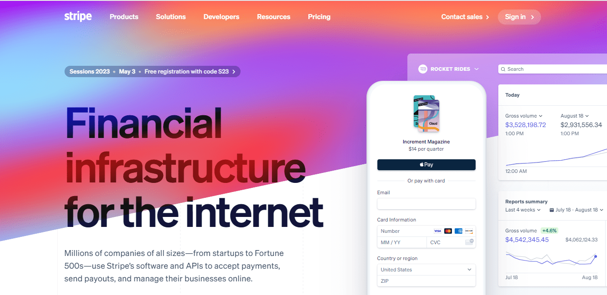
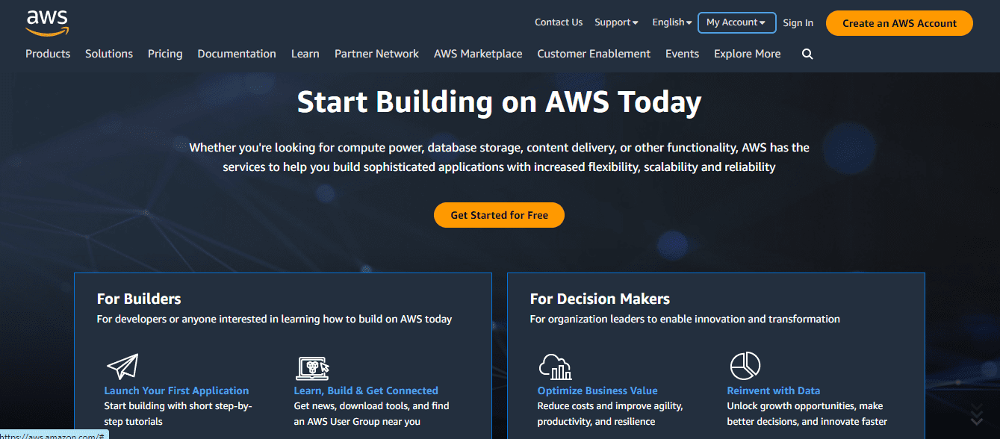

# The Rise of API-as-a-Product: How Companies are Leveraging APIs to Drive Revenue

Image source: Getty Images

**As technology continues to evolve, companies are finding new ways of leveraging it to drive revenue. One of the latest trends is the use of APIs as a Product. According to a recent report by Grand View Research, the global API management market size is expected to reach $25.1 billion by 2025, with a compound annual growth rate of 19.5%. This growth is being driven by the increasing demand for automation and digitalization across industries, as well as the proliferation of cloud computing and mobile devices.**

## Understanding what an API really is

An API (Application Programming Interface), is a set of rules and protocols that allow different software applications to communicate with each other. In simpler terms, it's a messenger that allows software applications to exchange data with each other in a standard way.

Here's a real-world example to illustrate how an API works: Let's say you're using a weather app on your smartphone. This app needs to get the current weather data from a weather service, but the app itself doesn't have this data. Instead, the app sends a request to the weather service's API, asking for the current weather data. The API then retrieves this data from the weather service's servers and sends it back to the app in a standardized format, like JSON or XML. The weather app can then use this data to display the current weather conditions to you.

APIs are used in a wide range of sectors for different purposes. For instance, social media platforms like Facebook and Twitter have APIs that allow developers to build third-party applications that can interact with their platforms. This enables these developers to create apps that can access users' social media data, post updates, and perform other tasks.

Another example is in e-commerce. Many online marketplaces, like Amazon and eBay, have APIs that enable third-party sellers to manage their inventory, sales, and orders on those platforms.

In the financial industry, APIs are used to connect financial institutions and payment processors to enable transactions and streamline processes.

## Understanding API-as-a-Product

API-as-a-Product is a business model that involves creating [APIs](https://apitoolkit.io/blog/api-trends/) (Application Programming Interfaces) that can be sold as standalone products. These APIs can be used by other businesses and developers to build applications that can integrate with existing systems.

APIs provide a standardized way of accessing data and functionality, making it easier for developers to create new applications. By selling APIs as a product, companies can monetize their data and functionality and create new revenue streams.

According to a [Google Cloud Apigee article](https://cloud.google.com/files/apigee/apigee-api-product-mindset-ebook.pdf) (The API Product Mindset), "APIs aren’t just some back office technical detail, in other words—they’re both products for the developers who build today’s customer experiences and the mechanisms through which value is increasingly exchanged in modern economies."

Google Cloud also goes on to state that a company like "Salesforce has generated half its revenue through APIs."

> “APIs make digital society and [digital business](https://www.informalli.com/powerful-seo-tools-for-digital-marketing) work by connecting people, businesses and things. Those connections enable new digital products and business models and create new business channels,” research firm Gartner states in its article “Put APIs at the Center of Your Digital Business Platform."

Initially, APIs were used primarily for internal purposes, but the rise of API as a product has seen companies using them to drive revenue and create new business opportunities.

According to a recent report by Grand View Research, the global API management market size is expected to reach $25.1 billion by 2025, with a compound annual growth rate of 19.5%. This growth is being driven by the increasing demand for automation and digitalization across industries, as well as the proliferation of cloud computing and mobile devices.

The rise of API-as-a-Product has been particularly evident in the financial industry, where companies are using APIs to provide access to financial data and services. A recent report by Deloitte noted that "APIs have become a critical component of the financial services ecosystem," with many banks and financial institutions using APIs to offer new services to customers and create new revenue streams.

## API-as-a-Product Use Cases

API-as-a-product has become increasingly popular in the following industries:

- Banking
- Healthcare
- Telecom
- Transportation
- Insurance
- Agriculture
- Insurance
- Loans
- Wealth management
- Retail
- Internet of Things (IoT)

Read: [API Monitoring and Documentation: the Truth You Must Know](https://apitoolkit.io/blog/api-documentation-and-observability-the-truth-you-must-know/)

Also, the following examples represent the best use cases for API-as-a-product:

### [Stripe](https://stripe.com/)

One prominent use case of API-as-a-product is Stripe, a payment processing company that has built its business around its API. Stripe's API allows developers to integrate payment processing functionality into their own applications, and the company charges a fee for each transaction processed through its platform. According to a recent report by Forbes, Stripe has internally cut its valuation to about $63 billion, making it one of the most valuable startups in the world.

### [Twilio](https://www.twilio.com/docs/usage/api)

Twilio (owner of [SendGrid](https://sendgrid.com/) and [Segments](https://segment.com/)) is another example of a company leveraging APIs to drive revenue. This cloud communications platform allows businesses to build and deploy messaging and voice applications. Twilio's API enables developers to integrate messaging and voice capabilities into their own applications, and the company charges a fee for each message or call made through its platform.
According to a recent report by The Motley Fool, Twilio's revenue has grown by over 50% year-over-year for the past several quarters, largely due to the success of its API business.

### [AccuWeather](https://developer.accuweather.com/)

The largest weather media and big data firm in the world, AccuWeather serves over two billion people every day and manages trillions of API data queries. AccuWeather's JSON-formatted, readily cached, and highly effective APIs are designed to handle the massive volumes of data needed in a world where new device kinds are increasingly in control. The company uses APIs to share its weather data with a wide range of partners globally and across a wide range of use cases, such as weather apps that are available on smartphones, smart TVs, wearables, as well as in smart homes and connected cars.

### [WeatherAPI](https://www.weatherapi.com/)

WeatherAPI is a big weather data provider that offers a range of APIs for developers to access weather data for their own applications. The APIs of WeatherAPI are well-documented and easy to use, which has allowed developers to create a variety of weather applications on their platform. WeatherAPI's APIs are a standalone product that they market and sell to third-party developers and businesses.

### [Google Maps](https://www.google.com/maps)

Google Maps is arguably the most popular naviagtion app out there. It provides a range of APIs that developers can use to embed maps, routes, and location data into their own applications. The Maps API allows developers to create custom maps, add markers, and display directions and traffic data.

### [Amazon Web Services (AWS)](https://aws.amazon.com/)

The API Gateway provided by Amazon Web Services (AWS) enables programmers to design, implement, and maintain APIs for their applications. The API enables programmers to build unique APIs that may be used to access information and services from a number of different AWS services.

### [Salesforce](https://developer.salesforce.com/developer-centers/integration-apis)

Salesforce is a popular tech company that provides APIs for its CRM platform, enabling developers to build custom applications that integrate with Salesforce.

### [OpenAI](https://openai.com/)

OpenAI is an artificial intelligence and machine learning company that provides a range of APIs for natural language processing, such as language translation and question-answering systems. Their products, ChatGPT-3.5, ChatGPT-4, and DALL-E have revolutionized the use of AI as we know it. The company's APIs allow developers to create custom applications that can understand and respond to human language.

Read: [10 API Tools for Developers](https://apitoolkit.io/blog/top-api-tools-for-developers/)

The rise of API as a product has also seen the emergence of API marketplaces, where companies can offer their APIs for others to use. These marketplaces provide a centralized location for developers to discover and access APIs, enabling them to quickly and easily integrate new functionality into their own applications. Some examples of API marketplaces include [RapidAPI](https://rapidapi.com/), Mashape, and APIhub.

As the demand for automation and digitalization continues to grow, it is likely that we will see more and more companies leveraging APIs to drive revenue and create new business opportunities.

As Matt McLarty, Global Leader of API Strategy at MuleSoft, noted in a recent interview with Forbes,

> "APIs are no longer just a technical solution, but a business solution. Companies that are leveraging APIs as products are gaining competitive advantage in their respective markets."

Read: [How to Write API Documentation: 10 Essential Guidelines](https://apitoolkit.io/blog/how-to-write-api-docs/)

## The Relationship Between API-as-a-Product and API-first

Although marginally distinct, API-as-a-product and API-first are often mentioned in the same breath by techies and enthusiasts.

API-as-a-Product is a business strategy that treats APIs as standalone products to generate revenue and drive business growth. In this approach, the API is marketed and sold to third-party developers, businesses, and customers for use in building their own applications.

On the other hand, API-first is an approach to building a software platform where the API is designed and developed first, and all other products and services are built around it. In an API-first approach, the API is the primary product, and all other products and services are built to support it. This approach allows companies to create a platform that is easy to integrate with and can scale quickly.

While both API-as-a-Product and API-first prioritize the API as a core part of the business strategy, they differ in their focus. API-as-a-Product is focused on marketing and selling the API as a standalone product to generate revenue and drive business growth. API-first, on the other hand, is focused on building a software platform where the API is the primary product and all other products and services are built around it.

However, API-as-a-Product and API-first are not mutually exclusive. In fact, many API-first companies also adopt an API-as-a-Product approach to generate revenue and drive business growth. By providing well-documented, standardized, and secure APIs, API-first companies can attract developers and partners to their platform, which can help them expand their product offering and drive revenue growth.

Examples of API-first companies include Plaid, Okta, Stripe, Twilio, Slack, Zendesk, Dropbox, Algolia, etc.

According to a recent report by the API management platform, Postman, "API-first development is becoming a new norm," with 61% of organizations surveyed saying they are using APIs as a strategic tool for business growth. The report also found that 90% of organizations are planning to increase investment in APIs in the next year, highlighting the growing importance of APIs in today's business landscape.

Read: [How to Use Notion for Documentation](https://apitoolkit.io/blog/using-notion-for-documentation/)

## How API Technology is Revolutionizing Business

API technology is revolutionizing the way businesses operate by enabling them to share data and functionality with other businesses and developers. This has led to the creation of new business models and revenue streams, as well as increased collaboration and innovation.

API technology also allows businesses to create more personalized experiences for their customers. By integrating with other systems, businesses can provide more tailored services and recommendations, improving customer satisfaction and loyalty.

## Benefits of using an API as a Product

There are several benefits to using APIs as a product.

First, it allows companies to monetize their data and functionality, creating new revenue streams.

Second, it can lead to increased innovation and collaboration, as other developers and businesses can build on top of the API.

Third, it can improve customer experience by enabling more personalized services and recommendations.

Fourth, using APIs as a product also provides businesses with more control over how their data and functionality are used. By creating their own APIs, they can set their own terms and conditions, ensuring that their data and functionality are used in a way that aligns with their business goals and values.

## The Future of API-first Companies

The future of API-first companies looks bright. As more businesses recognize the benefits of using APIs as a product, we can expect to see increased investment in API technology and more companies adopting an API-first approach.

API-first companies will continue to prioritize the developer experience, providing tools and resources to make it easier for developers to use their APIs. They will also focus on creating APIs that are easy to use and integrate with other systems to attract a larger developer community.

According to Apigee, "An API-driven business may move far faster than a traditional enterprise; after all, one of the advantages of implementing an API management layer is to decouple partner onboarding and new, rapidly evolving apps from relatively lethargic and brittle enterprise systems."

Read: [How to Generate Automated API Documentation](https://apitoolkit.io/blog/how-to-generate-automated-api-documentation/)

## API Monetization Strategies

There are several API [monetization strategies](https://www.informalli.com/how-to-start-a-blog-and-make-money-online) that businesses can use. These include:

- **Per-transaction fees:** Businesses can charge a fee every time their API is used to perform a transaction.
- **Subscription-based pricing:** Businesses can offer access to their API on a subscription basis, charging a monthly or yearly fee.
- **Freemium model:** Businesses can offer a basic version of their API for free, while charging for more advanced features and functionality.
- **Developer ecosystem:** Businesses can build a developer ecosystem around their API, providing tools and resources to make it easier for developers to use their API. This can lead to increased adoption and usage of the API.

## Tools for Building and Managing APIs

There are many tools available for building and managing APIs. Some of these include:

- **Swagger:** Swagger is an open-source tool for designing, building, and documenting APIs.
- **Apigee:** Apigee is a full-featured API platform that provides tools for building, testing, and managing APIs.
- **Postman:** Postman is a popular tool for testing and debugging APIs.
- **AWS API Gateway:** AWS API Gateway is a fully managed service for building, deploying, and managing APIs on AWS.

## Conclusion

API-as-a-Product is a business model that is revolutionizing the way businesses operate. By creating APIs that can be sold as standalone products, companies can monetize their data and functionality and create new revenue streams. This also applies to API-first companies that prioritize the creation and use of APIs in their operations.

By making APIs a central part of their business strategy, API-first companies will stay ahead of the curve in this rapidly API-reliant world of science and technology.

## API Monitoring and Observability

Building and managing APIs, whether as API-as-a-Product or as an API-first company, is not complete if API monitoring and observability are not added to the equation. Every day, millions of API requests are sent, making it difficult to monitor the integrity of every call. Hence, frequent cases of API downtime.

This is why we built [APIToolkit](https://apitoolkit.io), an API monitoring and observability tool that gives you a bird's eye view over your entire API. APIToolkit tracks anomalies and ensures that your payloads are returning accurate data, notifying you of any changes in real time.

In addition, the tool ensures that your API documentation is up-to-date, by automatically generating documentation for you based on your API traffic.

APIToolkit is featured on TechCrunch and the GoLang Podcast in Berlin, Germany.

[Try APIToolkit It Here](https://apitoolkit.io)

**Also Read**

[Top 7 Reasons Why Your Team Should Use A Plug-and-play API Monitoring Tool](https://apitoolkit.io/blog/why-you-need-an-api-monitoring-tool/)

[Incident Management: How to Resolve API Downtime Issues Before It Escalates](https://apitoolkit.io/blog/api-downtime/)

[Key Benefits of API Integration for Developers](https://apitoolkit.io/blog/benefits-of-api-integration/)

[Must-Know API Trends in 2023](https://apitoolkit.io/blog/api-trends/)
