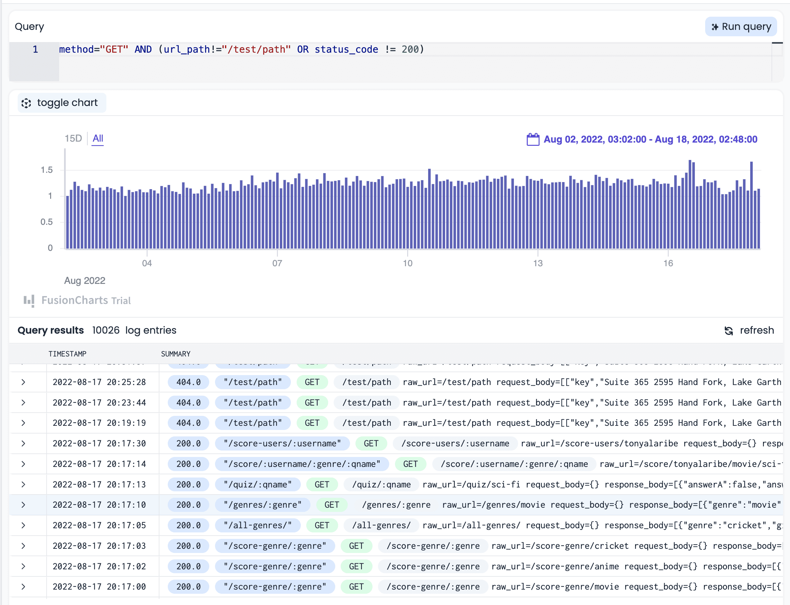
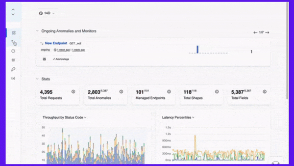

Imagine waking up to an API outage that has cost your business $100,000 in just five hours. That, my friend, can be so heart-rending. Truth is, APIs are great, but APIs can fail. And this, without warning. In this blog post, we’ll explore incident recovery and how to solve API downtime issues before they escalate.

## What is API Downtime?

API downtime, also known as an API outage, occurs when an endpoint is unavailable due to errors or service disruptions. This means the API fails to meet its expected service level agreement (SLA) or quality of service (QoS) standards, crucial metrics that define its availability, performance, reliability, and security. For example, an API with an SLA promising 99.9% uptime should be operational 99.9% of the time. Falling short of this, even by 0.1%, constitutes a breach of its SLA.

Technical factors heavily influence API performance, necessitating tools to ensure their health. Inadequate performance and poor security are primary causes of API downtime.

## Understanding API Downtime

While APIs remain the backbone of [modern digital businesses](https://apitoolkit.io/blog/api-as-a-product/), they are susceptible to downtime. Downtime is the period when an API is unavailable or unresponsive due to technical issues, network failures, security threats, human errors, or malicious attacks. Downtime can have serious consequences for businesses and users who rely on APIs for their daily operations and interactions. These server issues like hardware failures or bandwidth limitations, application bugs, cyberattacks like DDoS, or simple human errors like accidental deletion can disrupt API functionality. This disruption can result in direct financial losses or indirect damages such as reduced customer satisfaction.

## Causes of API Downtime

There are many possible causes of API downtime, such as:

- **Server or network issues**: Issues like hardware malfunctions, power disruptions, limited bandwidth, network congestion, or misconfigurations can critically impact the servers or networks hosting or connecting to the API.

- **Application issues**: Software bugs, memory leaks, resource exhaustion, or incompatible updates can cause the API to malfunction or crash.

- **Security issues**: Cyber threats like denial-of-service (DoS), distributed denial-of-service (DDoS) attacks, or data breaches can threaten the security and accessibility of the API and its data.

- **Human issues**: Cyber threats like denial-of-service (DoS), distributed denial-of-service (DDoS) attacks, or data breaches can threaten the security and accessibility of the API and its data.

## Impact of API Downtime on Businesses

API downtime can have a significant impact on businesses and users who depend on APIs for their core functions and features. Some of the negative effects of API downtime include:

- **Financial losses**: Businesses may face revenue loss, increased costs, or even contractual penalties due to API downtime. For instance, an e-commerce platform with a malfunctioning payment API could miss sales, while a cloud provider facing storage API issues might need to compensate clients for SLA breaches.

- **Brand damage**:  API downtime can tarnish a business's reputation. Users frustrated by a downed social media messaging API or patients endangered by an inaccessible healthcare data API might lose trust in these platforms.

- **Competitive disadvantage**: Businesses can lose their competitive edge due to API downtime. For example, if a travel booking site's flight information API is down, it may lose customers to its competitors who offer more reliable and accurate information.

## The Cost of API Downtime

API downtime can be very costly for businesses in terms of both direct and indirect losses. Direct losses are the measurable financial losses that result from reduced revenue, increased expenses, or legal liabilities due to API downtime. Indirect losses are intangible losses that result from reduced customer satisfaction, loyalty, retention, or acquisition due to API downtime.

The exact cost of API downtime depends on various factors such as:

- **The type and scale of the business**: Different businesses have different revenue models and customer bases that affect how much they rely on APIs and how much they lose when APIs are down. For example, a large online retailer may lose more money per minute of downtime than a small local store.

- **The type and scope of the API**: Different APIs have different functionalities and dependencies that affect how critical they are for the business and how widespread their impact is when they are down. For example, a core API that supports multiple features or services may cause more disruption than a peripheral API that supports a single feature or service.

- **The type and severity of the downtime**: Different downtimes have different durations and frequencies that affect how long and how often they affect the business and its customers. For example, a prolonged outage may cause more damage than a brief interruption.

- **The type and size of the audience**: Different audiences have different expectations and behaviors that affect how they react to and cope with API downtime. For example, a loyal customer may be more forgiving than a new customer.

A [report by the IDC](https://www.devopsdigest.com/idc-survey-appdynamics-devops-application-performance#:~:text=Unplanned%20application%20downtime%20costs%20the%20Fortune%201000%20from,of%20Downtime%3A%20Fortune%201000%20Best%20Practice%20Metrics%20Quantified.) suggests that Fortune 1000 companies lose between $1.25 billion and $2.5 billion every year because of application outages. A company that brings in more than $1 billion in annual revenue could lose around $686,000 in revenue per minute of downtime. 

According to some incident management estimates, the average cost of API downtime for a large enterprise can range from $5,600 to $11,600 per minute, depending on the industry and the scenario. This translates to $336,000 to $696,000 per hour, or $8.06 million to $16.7 million per day. For some high-profile cases, the cost of API downtime can be even higher. For example, in 2017, Amazon's S3 cloud storage service [experienced a four-hour outage](https://www.datacenterknowledge.com/archives/2017/03/02/aws-outage-that-broke-the-internet-caused-by-mistyped-command/) that affected many websites and services that relied on it. The outage was estimated to have cost Amazon and its customers around $150 million in lost revenue.

Read: [API Management: How to Tackles Anomalies in RESTful APIs (the Right Way)](https://apitoolkit.io/blog/anomalies-in-restful-apis/)

## Proactive Approach to API Downtime Prevention

The best way to minimize the cost and impact of API downtime is to [prevent it from happening in the first place](https://apitoolkit.io/blog/why-you-need-an-api-monitoring-tool/). This is proper incident management. And it requires a proactive approach that involves:

- Implementing robust monitoring and alert systems
- Conducting regular performance and stress testing, and 
- Following best practices for API design and development.

### Implementing Robust Monitoring and Alert Systems

Monitoring and alert systems are [essential tools for detecting and diagnosing API issues](https://apitoolkit.io/blog/best-api-monitoring-and-observability-tools/) before they escalate into downtime incidents. They help businesses measure and track the health and performance of their APIs, identify and isolate the root causes of problems, and notify and alert the relevant stakeholders and teams when issues occur.

Some of the key components of a robust monitoring and alert system are:

- **Real-time monitoring tools**: These are software applications or services that collect and analyze data from various sources such as servers, networks, applications, APIs, or users. They provide metrics and indicators such as availability, response time, throughput, error rate, or user satisfaction. They also provide dashboards and visualizations that display the current status and trends of the API performance and health.

- **Proactive alert mechanisms**: These are software applications or services that send notifications or warnings to the appropriate parties when certain conditions or thresholds are met or exceeded. They can use various channels such as email, SMS, phone call, or push notifications. They can also trigger automated actions such as restarting a server, scaling up a resource, or launching a backup system.

[Try APIToolkit - an Advanced API Monitoring and Observability Tool](https://apitoolkit.io)

### Conducting Regular Performance and Stress Testing

Performance and stress testing are methods of evaluating the capacity, scalability, reliability, and resilience of an API under various load and stress scenarios. They help businesses ensure that their APIs can handle the expected and unexpected demand from their users and customers, as well as cope with potential failures or attacks.

Some of the key aspects of performance and stress testing are:

- **Load testing**: This is the process of simulating normal or peak traffic conditions to measure how the API performs under different load levels. It helps businesses determine the optimal configuration and allocation of resources for their APIs, as well as identify any performance bottlenecks or issues.

- **Stress testing**: This is the process of simulating extreme or abnormal traffic conditions to measure how the API performs under high-stress levels. It helps businesses determine the maximum capacity and limit of their APIs, as well as identify any scalability or resilience issues.

## Building Redundancy for High Availability

Redundancy is the practice of having multiple copies or backups of an API or its components in case one fails or becomes unavailable. Redundancy helps businesses achieve high availability (HA), which is the ability of an API to remain operational and accessible at all times. HA is often measured by uptime percentage, which is the ratio of the time that an API is available to the total time that it is expected to be available.

Read: [Must-Know API Trends for Developers](https://apitoolkit.io/blog/api-trends/)

### Real-Time Monitoring and Alerting

[API monitoring](https://apitoolkit.io/blog/how-to-generate-automated-api-documentation/) and alerting are essential for ensuring the availability, performance, and security of your APIs. They can help detect issues and notify stakeholders, proactively addressing problems before they escalate.

Efficient API monitoring tools serve as the first line of defence, resolving issues before they affect your customers and users.

In addition, API monitoring can help you collect and analyze data from your servers, applications, and APIs. It can help you [measure various metrics](https://apitoolkit.io/api-logs-and-metrics/), such as response time, error rate, throughput, availability, and more. It can also help you [identify anomalies](https://apitoolkit.io/api-anomalies-validation-and-checks/), trends, and patterns in your data.

There are different types of monitoring tools that you can use for your APIs, such as:

1. **Server monitoring and log analysis**

Server monitoring tools help you track the health and performance of the servers that host your APIs. They can help you monitor the CPU, memory, disk, network, and other resources. They can also help you collect and analyze server logs, which are records of events and activities that occur on your servers.

Server logs can provide valuable information about your API operations, such as requests, responses, errors, exceptions, transactions, and more. They can help you troubleshoot issues, debug errors, optimize performance, and audit security.

2. **API-specific monitoring solutions**

API-specific monitoring tools help you monitor the functionality, performance, and quality of your APIs. They can help you simulate API calls from different locations and devices, measure API response time and availability, validate API responses and payloads, track API usage and performance metrics, and more.

API-specific monitoring tools can help you ensure that your APIs are meeting your service level agreements (SLAs), delivering a consistent user experience, and complying with industry standards and best practices.

[Try APIToolkit - an Advanced Monitoring Solution](https://apitoolkit.io)

## Analyzing the Root Cause of Downtime Incidents

The first step in resolving any API downtime incident is to understand what caused it. This will help you find the most effective solution and avoid repeating the same mistake in the future. To analyze the root cause of downtime incidents, you need to:

1. **Investigate error logs and performance metrics**

APIToolkit's metrics and log explorer

Error logs are records of events that occur when an API fails or behaves unexpectedly. They can provide valuable information about the error message, the timestamp, the request parameters, the response code, and the stack trace. Performance metrics are measurements of how well an API performs under different conditions. They can include indicators such as response time, throughput, availability, latency, and error rate. By examining error logs and performance metrics, you can pinpoint where and when the problem occurred, how severe it was, and how it affected your users.

2. **Identify common patterns or recurring issues**

APIToolkit's [anomaly detection tool](https://apitoolkit.io/api-anomalies-validation-and-checks/).

Sometimes, API downtime incidents are not isolated events, but symptoms of underlying problems that affect your system as a whole. By looking for common patterns or recurring issues in your error logs and performance metrics, you can identify the root causes of your API downtime and address them at their source. For example, you might notice that your API experiences frequent timeouts during peak hours, indicating a scalability issue. Or you might find that your API returns invalid data for certain requests, suggesting a data quality issue.

Read: [Key Benefits of API Integration for Developers (with Statistics)](https://apitoolkit.io/blog/benefits-of-api-integration/)

### Troubleshooting and remediation steps

Once you have analyzed the root cause of your API downtime incident, you need to take action to fix it and restore your service as soon as possible. To troubleshoot and remediate your API downtime incident, you need to:

1. Prioritize incident response based on the severity

Not all API downtime incidents are equally urgent or impactful. Some might affect only a small subset of users or features, while others might bring down your entire system or expose sensitive data. To prioritize your incident response, you need to assess the severity of your API downtime incident based on factors such as:

- The number of users affected
- The duration of the outage
- The business impact or revenue loss
- The reputational damage or customer dissatisfaction
- The security risk or compliance violation

Based on these factors, you can assign a severity level to your API downtime incident and determine the appropriate response time and resources.

2. Apply appropriate fixes and optimizations

Depending on the nature and severity of your API downtime incident, you might need to apply different types of fixes and optimizations to resolve it. Some common examples are:

- Restarting or redeploying your API service
- Rolling back to a previous version of your code
- Updating or patching your dependencies or libraries
- Scaling up or down your infrastructure or resources
- Changing or adding configuration settings or parameters
- Refactoring or rewriting your code logic or algorithms
- Improving or enhancing your data quality or validation
- Implementing or enforcing security measures or policies

When applying fixes and optimizations, you should always test them in a staging environment before deploying them to production. You should also document them in a changelog or release notes for future reference.

Read: [API Documentation vs API Specification - What it means for you](https://apitoolkit.io/blog/api-documentation-vs-api-specification/)

## Preventing Future Downtime Incidents

The final step in resolving any API downtime incident is to prevent it from happening again. This will help you improve your API reliability and availability, as well as your user satisfaction and loyalty. To prevent future downtime incidents, you need to:

1. **Implement proactive monitoring and alerting tools**

APIToolkit's [endpoint explorer](https://apitoolkit.io/api-performance-monitoring-and-compliance/).

Proactive monitoring and alerting tools are essential for detecting and preventing API downtime incidents before they escalate or affect your users. They can help you track and measure your API performance metrics, identify and diagnose errors or anomalies, notify and escalate issues to relevant stakeholders, and automate actions or workflows based on predefined rules or triggers.

2. **Adopt best practices and standards for API design and development**

Best practices and standards for API design and development are guidelines and recommendations that help you create APIs that are consistent, reliable, secure, and easy to use and maintain. They can help you avoid common pitfalls and errors that lead to API downtime incidents, such as:

- Poor documentation or communication
- Incompatible or outdated versions or formats
- Inconsistent or unclear naming or structure
- Insufficient or incorrect error handling or validation
- Inadequate or missing authentication or authorization
- Unoptimized or inefficient code or queries
- Lack of testing or quality assurance

Some examples of best practices and standards for API design and development are:

- **REST**: A set of architectural principles that define how to create stateless, uniform, and scalable APIs that use HTTP methods and status codes.
- **OpenAPI**: A specification that defines a standard, language-agnostic format for describing the structure and behavior of RESTful APIs.
- **JSON**: A lightweight, human-readable, and widely used data format for exchanging information between APIs and clients.

Read: [How to Write API Documentation: 10 Essential Guidelines](https://apitoolkit.io/blog/how-to-write-api-docs/)

## The APIToolkit Solution

[APIToolkit](https://apitoolkit.io) is a toolbox that contains all the tools you need to design, test and monitor the most reliable APIs.

What You Get:

- Advanced API monitoring and observability
- Error logs and metrics explorer
- Proactive alert mechanism
- Seamless API design and testing
- Auto-generated API documentation
- Dedicated technical support
- Bird’s eye view over your entire API

Get started for free [here](https://apitoolkit.io).

Or [book a call](https://calendly.com/tonyalaribe/30min) with our technical team for a free consultation about your APIs and backend services.

## Conclusion

In incident management, API downtime is inevitable, but it doesn't have to be disastrous. By following the steps outlined in this post (and using APIToolkit), you can analyze the root cause of downtime incidents, troubleshoot and remediate them, and prevent them from happening again. This will help you improve your API reliability and availability, as well as your user satisfaction and loyalty.

## Keep Reading

[How to Analyze API Logs and Metrics for Better Performance](https://apitoolkit.io/blog/api-logs-and-metrics/)

[Comprehensive API Management Strategies for Businesses](https://apitoolkit.io/blog/the-ultimate-api-management-strategy/)

[Top 8 Documentation Tools for Developers](https://apitoolkit.io/blog/top-8-api-documentation-tools-for-developers/)

[Top 7 Reasons Why Your Team Should Use an API Monitoring Tool](https://apitoolkit.io/blog/why-you-need-an-api-monitoring-tool/)
