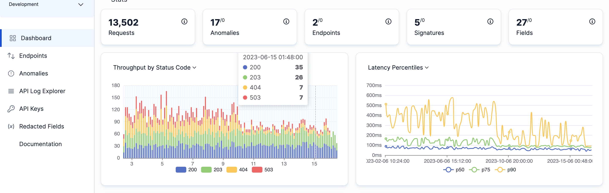
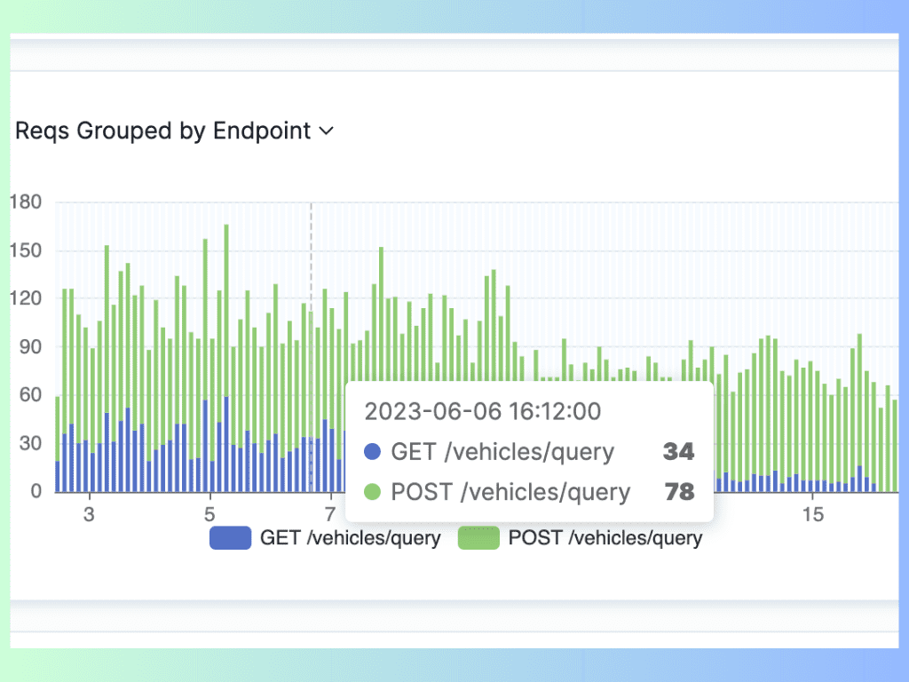
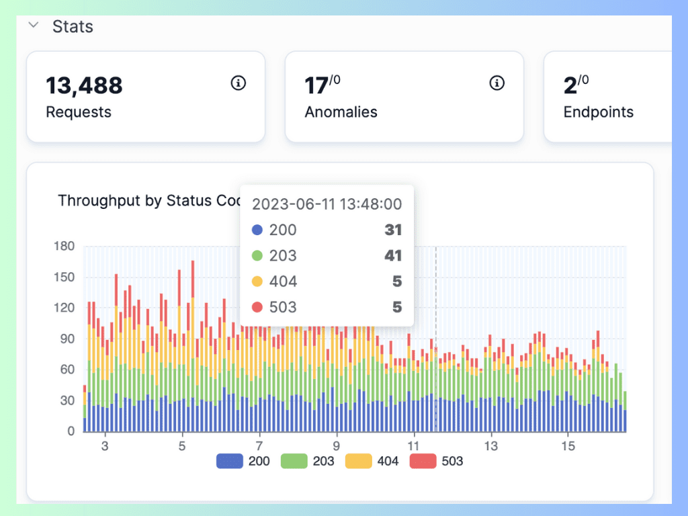
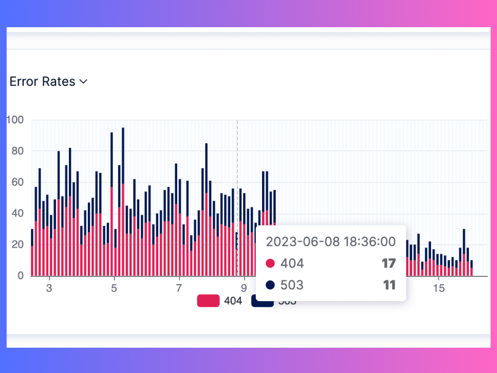

APIs are the backbone of modern web applications. They enable communication and data exchange between different systems and services. Its use has grown rapidly. In 2022, there were an estimated 20 billion APIs in use, and this number is expected to grow to 50 billion by 2025. This growth is being driven by the increasing popularity of [microservices](https://apitoolkit.io/blog/api-trends/) architecture, which relies on APIs to communicate between different services.

However, APIs are also prone to performance issues such as slow response time, high error rate, or low throughput. These issues can affect the user experience, the reliability, and the scalability of the application.

To ensure optimal API performance, developers and operators need to monitor and analyze [API logs and metrics](https://apitoolkit.io/api-logs-and-metrics/). These are the data sources that provide insights into how the API is functioning, what problems it is facing, and how it can be improved.

In this article, we will explain what API logs and metrics are, how they can be used to measure and optimize API performance, and what tools and best practices are available for API logging and monitoring.

## The Importance of API Performance

API performance is a key factor that determines the quality and success of a web application. A well-performing API can deliver fast, consistent, and accurate results to users and clients, enhancing satisfaction and loyalty. A slow, unreliable, or poorly performing API can cause frustration, confusion, and dissatisfaction among users and clients, leading to lower retention and conversion rates.

Moreover, API performance can also affect the efficiency and productivity of the development and operations teams. A [well-performing API](https://apitoolkit.io/blog/api-observability-and-api-monitoring/) can reduce the complexity and cost of development and maintenance, as well as enable faster feedback and iteration cycles. Conversely, a poorly performing API can increase the risk of errors and failures, as well as require more time and resources to debug and fix.

Therefore, it is essential to monitor and analyze an API’s performance regularly and proactively. This is to identify and resolve any issues before they impact users and clients.

## Understanding API Logs and Metrics

Image source: APIToolkit's dashboard

API logs and metrics are two types of data that can help developers and operators understand the behavior and performance of an API. They are complementary sources of information that can provide different perspectives and levels of detail on how the API is functioning.

API logs are records of events that occur during the execution of an API request or response. They can capture various information about the request or response, such as the timestamp, the method, the URL, the status code, the headers, the body, etc. They can also include custom data that developers or operators want to log for specific purposes.

API metrics are numerical measurements that quantify various aspects of an API's performance over time. They can include indicators such as response time, throughput, error rate, availability, etc. They can also be aggregated or segmented by different dimensions such as time range, endpoint, client, etc.

Read: [Best API Monitoring and Observability Tools in 2023](https://apitoolkit.io/blog/best-api-monitoring-and-observability-tools/)

## Types of API Logs

The different types of API logs are:

### 1. Access logs

Access logs are a type of API log that records every incoming or outgoing request or response that passes through an API gateway or server. They are also known as request logs or traffic logs.

The purpose of access logs is to provide a comprehensive overview of API activity and usage patterns. They can help developers and operators answer questions such as:

- How many requests or responses are processed by the API per minute, hour, day, etc.?
- What are the most or least popular endpoints or methods?
- Who are the most or least active clients or users?
- What are the average or peak response times or sizes?
- What are the most common status codes or errors?

### Common data captured in access logs

Access logs can capture various types of data about each request or response that passes through an API gateway or server. Some of the common data captured in access logs are:

- Timestamp: The date and time when the request or response was processed.
- Method: The HTTP verb used for the request or response (e.g., GET, POST, PUT, DELETE).
- URL: The full URL of the request or response (e.g., https://example.com/api/v1/users/123).
- Status code: The HTTP status code returned by the server for the request or response (e.g., 200 OK, 404 Not Found).
- Headers: The HTTP headers sent or received with the request or response (e.g., Content-Type: application/json).
- Body: The payload sent or received with the request or response (e.g., {"name": "Alice", "age": 25}).
- Duration: The time elapsed between receiving the request and sending the response (e.g., 150 ms).
- Size: The size of the request or response in bytes (e.g., 1024 B).

### 2. Error logs

Error logs are a type of API log that records any errors or exceptions that occur during the execution of an API request or response. They are also known as exception logs or fault logs. Error logs typically include error messages, stack traces, error codes, and any additional context that can aid in identifying the root cause of the issue. Analyzing error logs helps in pinpointing recurring errors, understanding their impact, and implementing necessary fixes.

The main purpose of error logs is to provide a detailed diagnosis of API problems and failures. They can help developers and operators answer questions such as:

- What are the root causes or sources of the errors or exceptions?
- What are the symptoms or impacts of the errors or exceptions?
- How often or when do the errors or exceptions occur?
- How can the errors or exceptions be reproduced or resolved?

To identify and log errors or exceptions, developers and operators need to use a logging framework or library that can capture and handle different types of errors or exceptions that may occur in the API code. For example, some common types of errors or exceptions are:

- **Syntax errors**: Errors that occur when the code does not follow the rules or conventions of the programming language (e.g., missing a semicolon, using an undefined variable).
- **Runtime errors**: Errors that occur when the code encounters an unexpected situation or condition during execution (e.g., dividing by zero, accessing a null object).
- **Logic errors**: Errors that occur when the code does not produce the expected or desired output or behavior (e.g., using the wrong operator, looping infinitely).
- **External errors**: Errors that occur when the code interacts with external systems or services that are unavailable, unreliable, or incompatible (e.g., network failure, API timeout, authentication error).

Error logs can capture various details about each error or exception that occurs during the execution of an API request or response. Some of the common details captured in error logs are:

- **Timestamp**: The date and time when the error or exception occurred.
- Message: A brief description of the error or exception (e.g., "Division by zero", "Null pointer exception").
- **Type**: The name or class of the error or exception (e.g., ArithmeticException, NullPointerException).
- **Stack trace**: A list of the methods or functions that were called before the error or exception occurred, showing the line number and file name where the error or exception occurred (e.g., "at com.example.api.MathService.divide(MathService.java:42)").
- **Context**: Any additional information that can help to understand the context or state of the API when the error or exception occurred, such as the request parameters, the response data, the environment variables, etc.

Read: [API Documentation and Observability: the Truth You Must now](https://apitoolkit.io/blog/api-documentation-and-observability-the-truth-you-must-know/)

## API Metrics for Performance Analysis

### A. Response time

Response time is a metric that measures how long it takes for an API to process a request and return a response. It is also known as latency.

Image source: Latency distribution on APIToolkit

Response time is one of the most important indicators of API performance, as it directly affects the user experience and satisfaction. Users and clients expect APIs to respond quickly and consistently without causing delays or timeouts.

### Measuring and interpreting response time

To measure response time, developers and operators need to use a [monitoring tool](https://apitoolkit.io/blog/best-api-monitoring-and-observability-tools/) or service that can track and record the duration of each request and response processed by an API. For example, [APIToolkit](https://apitoolkit.io/) is a core API monitoring tool, a solution that monitors and analyzes the performance of an application and its components, including APIs, databases, servers, etc.

To interpret response time, developers and operators need to use a that can visualize and summarize the response time data collected by the monitoring tool or service. For example, some common ways to visualize and summarize response time are:

- Histogram: A chart that shows how many requests fall into different ranges of response time (e.g., 0-100 ms, 100-200 ms, etc.).
- Percentile: A statistic that shows what percentage of requests have a response time below a certain value (e.g., 95th percentile means 95% of requests have a response time below this value).
- Average: A statistic that shows the typical or expected value of response time across all requests.
- Minimum: A statistic that shows the fastest value of response time across all requests.
- Maximum: A statistic that shows the slowest value of response time across all requests.

Read: [Must-Know API Trends in 2023](https://apitoolkit.io/blog/api-trends/)

### Identifying bottlenecks in API logs and metrics

Image source: API requests grouped by endpoints on APIToolkit

A bottleneck is a situation where a component or a process in an API slows down the overall performance of the API. For example, some common causes of bottlenecks are:

- **High demand**: When an API receives more requests than it can handle, it may cause congestion or queueing in the API gateway or server.
- **Slow dependency**: When an API depends on another system or service that is slow or unreliable, it may cause delays or failures in the API request or response.
- **Inefficient code**: When an API has code that is poorly written, unoptimized, or buggy, it may cause unnecessary computation or memory usage in the API server.

To identify bottlenecks, developers and operators can use an API log and metrics explorer tool like [APIToolkit](https://apitoolkit.io/).

You can use APIToolkit to view detailed API logs about your request/response cycle. You can also use our console tab to see the time taken by each request, the size of the response, and any errors or warnings. Also, APIToolkit can present your API performance data in charts and graphs. It can help set up an alert and notification system to get you notified when your app's performance degrades.

### B. Throughput

Throughput is the amount of data or requests that your API can process in a given time period. It is usually measured in requests per second (RPS) or megabytes per second (MBPS). Throughput indicates the capacity and scalability of your API. A high throughput means that your API can handle a large volume of traffic without compromising performance. A low throughput means that your API is struggling to keep up with demand and may be overloaded or underutilized.

#### Calculating and monitoring throughput

To calculate the throughput of your API, you need to divide the total number of requests or data processed by your API by the time interval in which they were processed. For example, if your API processed 10,000 requests in 10 seconds, then its throughput is 1,000 RPS.

To monitor the throughput of your API, you need to use a tool or service that can collect and visualize your API logs and metrics in real time. Use [APIToolkit](https://apitoolkit.io/). We can help you track the throughput of your API over time and alert you when it deviates from a normal range or exceeds a predefined threshold.

Image source: Calculating throughput on APIToolkit

#### Evaluating API capacity

To evaluate the capacity of your API, you need to compare its throughput with its expected or desired load. The expected load is the amount of traffic that your API is designed or intended to handle. Also, the desired load is the amount of traffic that you want your API to handle based on your business goals or user expectations.

If your throughput is lower than your expected or desired load, then it means that your API is underperforming and may have a bottleneck somewhere in its system. You need to identify the root cause of the bottleneck and take appropriate actions to resolve it. Some possible causes of low throughput are:

- Insufficient server resources (CPU, memory, disk space, etc.)
- Network congestion or latency
- Poorly designed or implemented code
- Inefficient database queries
- External dependencies or integrations
- Security issues or attacks

If your throughput is higher than your expected or desired load, then it means that your API is overperforming and may have excess capacity or resources. You need to evaluate whether this is beneficial or detrimental to your API's performance. Some possible implications of high throughput are:

- Increased operational costs
- Wasted resources or opportunities
- Reduced flexibility or agility
- Over-reliance on a single system or service
- Potential scalability issues

Read: [Key Benefits of API Integration for Developers (with Statistics)](https://apitoolkit.io/blog/benefits-of-api-integration/)

### C. Error rate

Error rate is the percentage of requests that result in an error when processed by your API. It is usually measured in errors per 100 requests (EPR) or errors per 1,000 requests (EPM). Error rate indicates the reliability and quality of your API. A low error rate means that your API is functioning properly and delivering the expected results. A high error rate means that your API is failing or malfunctioning and causing dissatisfaction or frustration for your users.

### Tracking and analyzing error rates

To track the error rate of your API, you need to log and classify every request that results in an error. An error is any response that has a status code other than 2xx (success) or 3xx (redirection). The most common types of errors are 4xx (client errors) and 5xx (server errors). You need to assign a category and a message to each error to identify its type and cause. For example, a 404 error can be categorized as "Not Found" and have a message like "The requested resource does not exist".

To analyze the error rate of your API, you need to use a tool or service that can aggregate and visualize your API logs and metrics in real time. Try [APIToolkit](https://apitoolkit.io/). We can help you calculate the error rate of your API over time and alert you when it deviates from a normal range or exceeds a predefined threshold.

Image source: Tracing and analyzing error rates on APIToolkit

### Identifying recurring issues

To identify recurring issues in your API, you need to look for patterns or trends in your error logs and metrics. You need to find out which errors are occurring frequently or consistently, which requests or endpoints are causing them, and which factors or conditions are triggering them. Some possible ways to identify recurring issues are:

- Filtering and sorting your errors by category, message, status code, request method, endpoint, etc.
- Grouping and aggregating your errors by time interval, user segment, device type, location, etc.
- Comparing and correlating your errors with other metrics, such as throughput, latency, availability, etc.
- Using root cause analysis techniques, such as the 5 Whys method, to drill down into the underlying causes of your errors.

By identifying recurring issues in your API, you can prioritize and address the most critical or impactful ones and improve your API performance.

Read: [How to Resolve API Downtime Issues Before It Escalates](https://apitoolkit.io/blog/api-downtime/)

## Best Practices for API Log and Metrics Analysis

1. **Regular monitoring and analysis**

Image source: API query explorer on APIToolkit

One of the key aspects of API log and metrics analysis is to establish a routine of checking and reviewing the data generated by your APIs. This can help you understand how your APIs are performing, how they are being used, and how they are impacting your content. Some of the benefits of regular monitoring and analysis are:

- You can spot trends and patterns in your API usage, such as peak times, popular endpoints, or common errors.
- You can detect anomalies and outliers in your API behavior, such as spikes, drops, or deviations from normal values.
- You can identify potential issues or risks in your API performance, such as slow response times, high error rates, or resource bottlenecks.

To establish a monitoring routine, you need to define what metrics and logs you want to collect from your APIs, how often you want to collect them, and how you want to visualize and analyze them. You can use [APIToolkit](https://apitoolkit.io/) to help you with this process. You also need to set up alerts and notifications that can inform you of any significant changes or problems in your API data.

2. **Collaborative analysis and troubleshooting**

Another best practice for API log and metric analysis is to involve cross-functional teams in the process. This can help you gain different perspectives and insights from different stakeholders, such as developers, testers, product managers, or content writers. Some of the benefits of collaborative analysis and troubleshooting are:

- You can leverage the expertise and experience of different team members to understand and interpret the API data better.
- You can share your findings and recommendations with other team members to align on the goals and expectations of the API performance and content quality.
- You can collaborate on solving any issues or challenges that arise from the API data, such as fixing bugs, optimizing code, or updating content.

To facilitate collaborative analysis and troubleshooting, you need to establish a communication channel and a workflow that can enable easy and timely sharing of information and feedback. You can use tools like [Slack](https://slack.com/) or [Jira](https://www.atlassian.com/software/jira) to help you with this process. You also need to document your analysis, troubleshooting steps, and outcomes for future reference and learning.

3. **Incident response and remediation**

The final best practice for API log and metric analysis is to react promptly and effectively to any incidents or emergencies that occur in your API performance or content delivery. This can help you minimize the impact and damage of any issues or errors that affect your users or customers. Some of the benefits of incident response and remediation are:

- You can restore your API functionality and availability as soon as possible, reducing downtime and service disruption.
- You can investigate and resolve the root cause of the issue or error, preventing recurrence or escalation.
- You can communicate transparently and proactively with your users or customers about the issue or error, maintaining trust and satisfaction.

To implement incident response and remediation, you need a clear plan and procedure that can guide you through the steps of detection, diagnosis, resolution, recovery, and prevention. You can use tools like [APIToolkit](https://apitoolkit.io/), PagerDuty or Opsgenie to help you with this process. You also need to review and evaluate your incident response and remediation performance and outcomes for continuous improvement.

Read: [Top 7 Reasons Why Your Team Needs an API Monitoring Tool](https://apitoolkit.io/blog/why-you-need-an-api-monitoring-tool/)

## Conclusion

API logs and metrics analysis is a vital part of ensuring the quality and reliability of your APIs and content. By following these best practices, you can monitor and analyze your API data effectively, collaborate with your team members efficiently, and respond swiftly to any incidents or errors. This way, you can create better content for your audience and deliver better results for your business.

**Keep Reading**:

[How to Generate Automated API Documentation](https://apitoolkit.io/blog/how-to-generate-automated-api-documentation/)

[How to Tackle Anomalies in RESTful APIs (the Right Way)](https://apitoolkit.io/blog/anomalies-in-restful-apis/)

[How to Write API Documentation: 10 Essential Guidelines](https://apitoolkit.io/blog/how-to-write-api-docs/)

[What You Need to Know About REST APIs](https://apitoolkit.io/blog/everything-about-rest-apis/)

[API Documentation vs API Specification - What it means for you](https://apitoolkit.io/blog/api-documentation-vs-api-specification/)

