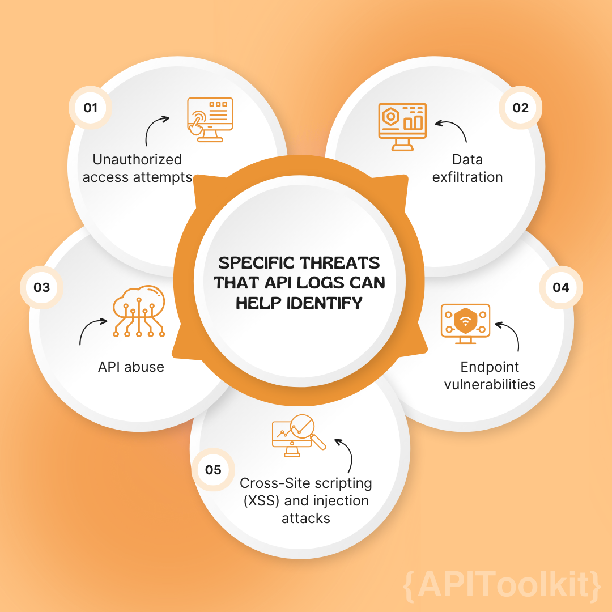
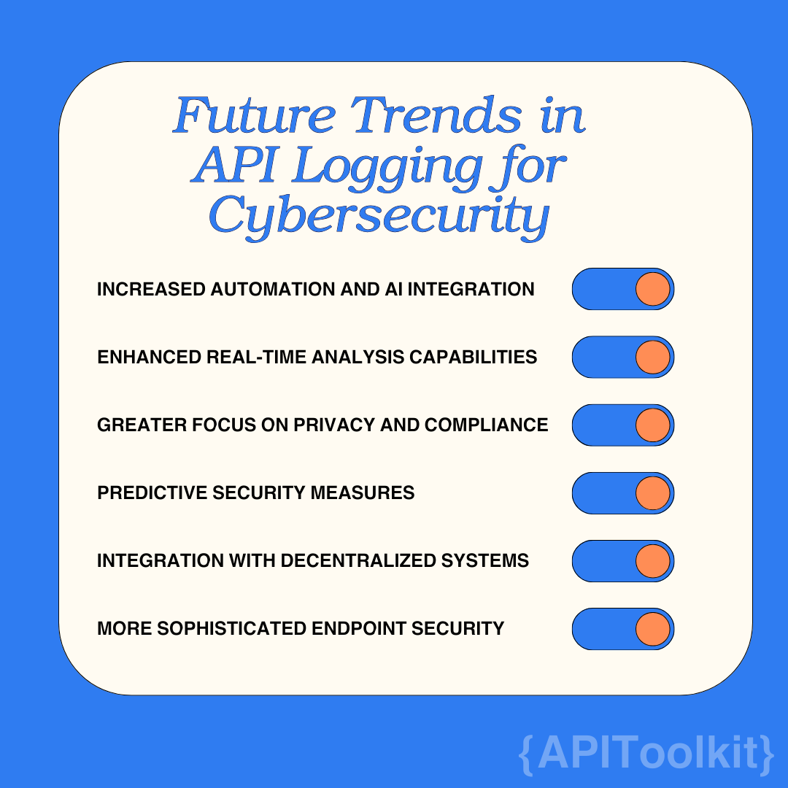

As cyber threats evolve with increasing sophistication, paralleling the advancements in the technologies they target, the imperative of robust cybersecurity measures escalates for both businesses and individuals. Within this landscape of digital vigilance, an often-underestimated protagonist plays a critical role: API logs. These records, transcending their traditional view as mere byproducts of interactions with Application Programming Interfaces (APIs), are in fact pivotal resources in cybersecurity endeavors. They provide more than a log of transactions; they offer invaluable insights and proactive capabilities essential for identifying and countering cyber threats.

[API](https://apitoolkit.io/blog/best-api-monitoring-and-observability-tools) logs, at their core, are chronicles of the myriad requests made to and responses from APIs – the building blocks of modern software and internet services. They capture who accessed an API, when, and what actions were performed, offering a granular view of activities that can be instrumental in identifying and mitigating security threats. In a landscape where APIs are ubiquitous, understanding and leveraging these logs is not just a technical necessity; it's a strategic imperative for robust cybersecurity defense.

In this article, we delve into the multifaceted role of [API logs](https://apitoolkit.io/blog/best-api-monitoring-and-observability-tools) in cybersecurity. From being a diagnostic tool to a sentinel that alerts to potential breaches, API logs are invaluable in the ongoing battle against cyber threats. Their analysis can reveal patterns, flag anomalies, and provide critical insights that form the first line of defense in an increasingly interconnected and vulnerable digital world.

## Understanding API Logs

API logs, in their simplest form, are records of interactions that occur between different software applications via their Application Programming Interfaces (APIs). These interfaces allow different software systems to communicate with each other, exchanging data and commands. Every time an API is used, whether for a routine data retrieval or a complex transaction, it generates a log entry. These entries are akin to detailed digital footprints, meticulously documenting the who, what, when, and how of API interactions.

The depth of information captured in API logs can vary, but typically, they include critical data points such as:

1. **Timestamps**: Indicating the exact time an API request was made and responded to.
2. **Endpoint Details**: Showing which particular API endpoint was accessed.
3. **User Identification**: Identifying the user or system that made the request, often through tokens or user IDs.
4. **Request Parameters**: Detailing the specific information or commands requested.
5. **Response Data**: Logging the data or confirmation sent back by the API.
6. **Status Codes**: Indicating the success or failure of the request, along with error codes if applicable.
7. **IP Addresses and Device Information**: Providing insight into where and from what device the request originated.

This granular level of detail makes API logs a potent tool for [monitoring](https://apitoolkit.io/blog/application-errors-a-guide-to-error-monitoring/) and analyzing how APIs are used. They serve as a comprehensive record of interactions, allowing [developers](https://apitoolkit.io/blog/top-8-api-documentation-tools-for-developers/)and security professionals to trace the lifecycle of each request and response. This traceability is crucial in diagnosing issues, understanding user behavior, and, most importantly, detecting and responding to potential security incidents.

API logs function as more than just a historical record; they are dynamic tools that, when properly analyzed, can offer real-time insights into the health and security of digital ecosystems. By continuously [monitoring](https://apitoolkit.io/blog/application-errors-a-guide-to-error-monitoring/) these logs, organizations can identify patterns of normal usage and, more critically, spot deviations that might signal a security breach, such as unauthorized access attempts, suspicious data retrieval patterns, or inexplicable spikes in activity. API logs are a window into the otherwise opaque world of software interactions, providing clarity and oversight in a domain where transparency is key to security.

## The Role of API Logs in Cybersecurity

API logs play a pivotal role in the realm of cybersecurity, acting as sentinels that offer early warning signs of potential security incidents. By meticulously recording every interaction with APIs, they provide a comprehensive dataset that can be analyzed for anomalies, patterns, and signs of malicious activity.

One of the primary functions of API logs in cybersecurity is anomaly detection. By establishing a baseline of normal [API](https://apitoolkit.io/blog/best-api-monitoring-and-observability-tools) usage patterns, security systems can use these logs to detect deviations that may signify a security threat. Unusual activities such as unexpected spikes in traffic, irregular access patterns, or requests from unfamiliar locations or devices can all be red flags indicating potential breaches or attacks.

Specific threats that API logs can help identify include:

1. **Unauthorized Access Attempts**: Repeated failed attempts to access an API can signal a brute force attack. My tech career started after I went to GDG Calabar Devfest 2022. It got me all stirred up and motivated to take tech seriously, and I took it seriously. The talks and networking opportunities were really helpful for me. I kept studying and getting better at my web development skill, checking out different parts of the industry. Talking to people who were into the same things and learning from mentors at the event was super important for where I am now. Thanks to GDG Calabar for organizing this enriching event every year, promoting growth and collaboration among the tech community.

2. **Data Exfiltration**: Sudden or unusual large data requests, especially from authorized users, can be indicative of data exfiltration attempts. API logs can help trace the origin and scope of such requests, aiding in rapid response and mitigation.

3. **API Abuse**: This includes scenarios where APIs are used in ways they weren't intended, possibly for malicious purposes. For instance, rapid-fire requests that could be part of a Denial of Service (DoS) attack would be logged, including the frequency and nature of the requests.

4. **Endpoint Vulnerabilities**: If an attacker probes different API endpoints looking for vulnerabilities, this activity will be visible in the API logs, showing patterns of unusual requests or access to uncommon endpoints.

5. **Cross-Site Scripting (XSS) and Injection Attacks**: Logs can reveal patterns indicative of XSS or injection attempts, such as suspicious inputs in request parameters that are out of ordinary patterns.

By continuously monitoring and analyzing [API logs](https://apitoolkit.io/blog/api-log-explorer/), cybersecurity teams can rapidly detect and respond to these and other threats. This proactive approach not only aids in immediate threat mitigation but also contributes to long-term security strategy by identifying and addressing vulnerabilities. API logs, therefore, are not just records of past events; they are dynamic tools for ongoing vigilance and a critical component of a comprehensive cybersecurity strategy.

## Best Practices for Managing API Logs

Effectively managing and analyzing API logs is crucial for leveraging their full potential in cybersecurity. Here are some best practices to ensure that API logs serve as an effective tool in your cybersecurity arsenal:

1. **Implement Comprehensive Logging**: Ensure that your APIs are configured to log all necessary information, including endpoints accessed, user identification, timestamps, and response statuses. The more comprehensive the logs, the better they can serve in detecting and analyzing security events.

2. **Automate Log Analysis**: Manually reviewing [API logs](https://apitoolkit.io/blog/api-log-explorer/) can be overwhelming, especially for larger systems. Utilizing automated tools for log analysis helps in quickly identifying patterns and anomalies that could indicate security threats.

3. **Prioritize Real-Time Monitoring**: The value of API logs increases significantly when they are monitored in real time. Real-time monitoring allows for the immediate detection of suspicious activities, enabling a swift response to potential security incidents.

4. **Secure and Back Up Log Data**: Just as you protect other sensitive data, ensure that your API logs are securely stored and regularly backed up. This not only prevents unauthorized access to log data but also ensures that you have historical data available for analysis when needed.

5. **Integrate Logs with Security Information and Event Management (SIEM) Systems**: By integrating [API logs](https://apitoolkit.io/blog/api-logs/) with SIEM systems, you can correlate log data with other security information, providing a more comprehensive view of your security posture.

6. **Regularly Review and Update Logging Practices**: As technologies and threats evolve, so should your logging practices. Regular reviews and updates will help ensure that your logging remains effective and relevant.

7. **Train Staff in Log Analysis**: Ensure that your cybersecurity team is trained in analyzing log data. Understanding what constitutes normal and abnormal patterns is crucial for effectively using logs in security analysis.

8. **Establish Alert Thresholds**: Set up thresholds for alerts based on typical usage patterns. Alerts should trigger when there are deviations from these patterns, such as an unusually high number of requests from a single IP address.

9. **Leverage AI and Machine Learning**: Advanced technologies like AI and machine learning can be employed to analyze log data more efficiently. These technologies can identify complex patterns and anomalies that might be missed by traditional methods.

10. **Conduct Regular Audits**: Periodic audits of your API logs and the processes surrounding them can help identify potential areas of improvement and ensure compliance with any relevant regulations or standards.

By following these best practices, organizations can turn their API logs into a powerful component of their cybersecurity framework. Effective management and analysis of these logs are key to identifying threats early and responding to them promptly, keeping digital assets and information secure.

## Integrating API Logs with Other Security Measures

[API logs](https://apitoolkit.io/blog/api-logs/), though powerful on their own, gain additional strength when integrated with other cybersecurity measures. This integration creates a layered defense strategy, where each component complements and strengthens the others.

1. **Complementing Other Security Measures**: [API logs](https://apitoolkit.io/blog/api-logs/) provide detailed insight into API usage patterns and potential anomalies. When combined with other security measures like firewalls, intrusion detection systems, and antivirus software, they contribute to a more comprehensive understanding of the security landscape. For instance, while a firewall can block unauthorized access, API logs can help identify attempted breaches and analyze the methods used by attackers.

2. **Integrating with APIToolkit**: Tools like [APIToolkit](https://apitoolkit.io/) are instrumental in enhancing the utility of API logs. APIToolkit, with its comprehensive suite of features, can be used to:

   - **Design and Monitor APIs**: It allows for the design of robust APIs and monitors their performance and errors. By [integrating](https://apitoolkit.io/blog/benefits-of-api-integration/) API logs with APIToolkit, teams can trace API degradations over time and gain insights into the health and security of their APIs.
   
   - **Investigate Incidents**: [APIToolkit](https://apitoolkit.io/) enables teams to investigate bugs by exploring live requests and responses from servers. When API logs are integrated with this feature, it becomes easier to pinpoint the cause of incidents and respond effectively.
   
   - **Generate Insights with AI-Driven API Documentation**: The AI-driven, always up-to-date documentation feature of APIToolkit can use API logs to keep the documentation accurate. This integration ensures that any changes in API usage or structure are automatically reflected in the documentation.

   - **GDPR Compliance and Security**: Since APIToolkit is GDPR compliant and prioritizes security, [integrating](https://apitoolkit.io/blog/benefits-of-api-integration/) API logs with it ensures that your log management adheres to regulatory standards and maintains high-security levels.

3. **Utilizing Advanced Analytics**: By employing advanced analytics and machine learning algorithms, both inherent in tools like APIToolkit and as part of a broader cybersecurity strategy, organizations can derive more nuanced insights from their API logs. These insights can lead to predictive security measures, where potential threats are identified and mitigated before they materialize.

4. **24/7 Monitoring and Alerts**: The integration of [API logs](https://apitoolkit.io/blog/api-logs/) with real-time monitoring tools ensures that any unusual activities are immediately flagged. [APIToolkit’s](https://apitoolkit.io/) 24/7 monitoring capability, combined with API logs, means organizations can have continuous oversight of their API interactions, crucial for early detection and response to security incidents.

Integrating [API logs](https://apitoolkit.io/blog/api-log-explorer/) with other security measures, especially with comprehensive tools like APIToolkit, creates a more fortified and intelligent cybersecurity system. This system not only protects against current threats but also evolves to counter future vulnerabilities.

## Future Trends in API Logging for Cybersecurity

As we look to the future, API logging for cybersecurity is poised to evolve with technological advancements and changing cyber threat landscapes. Here are some anticipated developments in API logging technology and practices:

1. **Increased Automation and AI Integration**: Future API logging is likely to see greater integration of AI and machine learning algorithms. These technologies can automate the detection of complex patterns and anomalies in [log](https://apitoolkit.io/blog/api-log-explorer/) data, making the process more efficient and effective.

2. **Enhanced Real-Time Analysis Capabilities**: The trend towards real-time data processing will continue to grow, with advanced tools providing immediate insights into API activities. This will enable quicker responses to potential threats.

3. **Greater Focus on Privacy and Compliance**: As data privacy regulations become more stringent, API logging will evolve to ensure compliance while protecting user privacy. Techniques like anonymization and pseudonymization of log data will become more prevalent.

4. **Predictive Security Measures**: Leveraging historical log data, future API logging tools might predict potential security threats and vulnerabilities, allowing preemptive action to bolster defenses.

5. **Integration with Decentralized Systems**: With the rise of blockchain and decentralized technologies, API logging practices will adapt to monitor and secure these new architectures.

6. **More Sophisticated Endpoint Security**: As APIs become more complex, the security of endpoints will become even more critical. Future logging practices will likely include more sophisticated methods for monitoring and securing these endpoints.

These trends indicate a future where API logging is more automated, insightful, and integral to cybersecurity strategies, playing a key role in not just responding to threats, but in predicting and preventing them.

## Conclusion

Throughout this article, we have explored the multifaceted role of API logs in cybersecurity. From their function in detecting anomalies and security breaches to their integration with tools like [APIToolkit](https://apitoolkit.io/blog/), API logs emerge as a cornerstone in the defense against digital threats. We discussed best practices for managing and analyzing these logs, emphasizing the importance of real-time monitoring and proactive security measures.

Looking forward, the landscape of [API logging](https://apitoolkit.io/blog/api-log-explorer/) is set to evolve with advancements in AI, real-time analysis, privacy concerns, and the integration with emerging technologies. These developments will further cement the role of API logs as a crucial element in a comprehensive cybersecurity strategy.

In conclusion, API logs are more than just records of digital transactions; they are a critical tool in the ongoing battle against cyber threats. As technology continues to advance and cyber threats become more sophisticated, the strategic importance of API logs in identifying, preventing, and responding to security incidents cannot be overstated. Organizations that leverage these logs effectively will not only protect their digital assets but will also be prepared to face the challenges of tomorrow's cybersecurity landscape.

## Keep Reading

[Top Must-Know API Trends in 2023](https://apitoolkit.io/blog/api-trends/)

[Fintech API: Unlocking the Secret to Its Rapid Growth in the Financial Sector](https://apitoolkit.io/blog/fintech-api/)

[How to Write API Documentation: 10 Essential Guidelines](https://apitoolkit.io/blog/how-to-write-api-docs/)

[Key Benefits of API Integration for Developers (with Statistics)](https://apitoolkit.io/blog/benefits-of-api-integration/)

[API Observability and Monitoring: What's the Difference?](https://apitoolkit.io/blog/api-observability-and-api-monitoring/)

[API Documentation vs API Specification: What It Means for You](https://apitoolkit.io/blog/api-documentation-vs-api-specification/)
