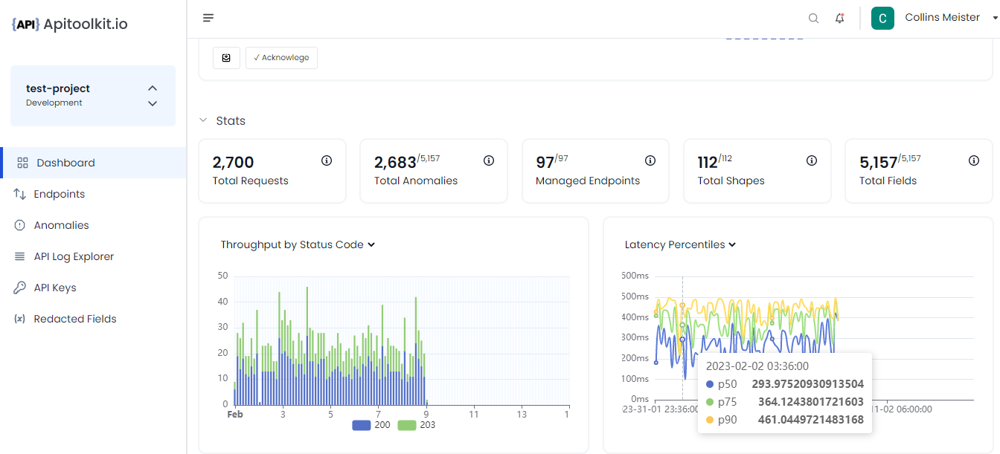

[APIs](https://apitoolkit.io/blog/best-api-monitoring-and-observability-tools/) (Application Programming Interfaces) play a vital role in modern software development. They facilitate communication and data exchange between different applications. APIs have become the backbone of many digital services, enabling seamless integration and enhancing the functionality of various software systems.

As an [API developer](https://apitoolkit.io/blog/top-8-api-documentation-tools-for-developers/) or provider, it is crucial to gain meaningful insights from [API logs](https://apitoolkit.io/blog/api-logs-and-metrics/) to optimize performance, identify issues, and enhance user experience. API logs contain a wealth of information about the requests and responses exchanged between clients and servers.

By analyzing these logs, you can gain valuable insights into the behavior of your APIs and make data-driven decisions to improve their performance and reliability.

### Analyzing Customer Journeys with APIToolkit

[APIToolkit](https://apitoolkit.io) is a powerful API analytics platform that allows you to gather and analyze data from your API logs. With APIToolkit, you can unlock the full potential of your API logs and gain a deeper understanding of how users interact with your APIs.

One of the key features of APIToolkit is its ability to analyze customer journeys. By tracking and analyzing the sequence of API calls made by a user, you can gain insights into their behavior and preferences. This information can be invaluable in optimizing your APIs to meet the specific needs and expectations of your users.

For example, let's say you have an e-commerce application with an API that allows users to browse products, add items to their cart, and make purchases. By analyzing the customer journeys of your users, you may discover that a significant number of users abandon their carts at a specific step in the checkout process. Armed with this insight, you can investigate the issue further and identify potential reasons for cart abandonment, such as a confusing user interface or a slow API response time. This can then help you make targeted improvements to your API and enhance the user experience, ultimately increasing conversion rates and driving more sales.

In addition to analyzing customer journeys, APIToolkit offers a wide range of other analytics features. You can track [API performance metrics](https://apitoolkit.io/api-logs-and-metrics/), such as response times and error rates, to identify bottlenecks and optimize your API infrastructure.

APIToolkit also provides powerful visualization tools that allow you to create custom dashboards and reports, making it easy to communicate insights and share them with your team.

Furthermore, with APIToolkit, you can easily capture and analyze API logs from your existing infrastructure without any additional setup or configuration.

In conclusion, gaining actionable insights from your API logs is essential for optimizing your APIs and delivering a superior user experience. With APIToolkit, you can unlock the full potential of your API logs and gain valuable insights into customer journeys.

A proper understanding of how users interact with your APIs can help you make data-driven decisions to improve performance, identify issues, and ultimately enhance the overall success of your API-driven applications.

## Unlocking Hidden Value in Your API Logs

API logs can provide valuable insights beyond tracking usage and performance. By analyzing patterns and trends in your API logs, you can uncover hidden value and opportunities for improvement.

## Decoding the Messages in Your API Log Data

API logs contain a wealth of information that can be valuable for troubleshooting, performance optimization, and security analysis. However, interpreting API log data can be challenging if you don't have the right tools and techniques.

## Exploring Alternatives to Kibana for API Logs

While Kibana is a popular tool for log analysis, there are alternative solutions like [APIToolkit](https://apitoolkit.io) that offer unique advantages for API log analysis.

### The Benefits of Using APIToolkit for API Log Analysis

APIToolkit provides a user-friendly interface that simplifies the process of analyzing API logs. It offers advanced filtering and search capabilities, allowing you to quickly find the information you need. Additionally, APIToolkit provides built-in visualization tools that make it easy to understand complex log data.

### Considerations When Using Kibana for API Logs

Although Kibana is widely used for log analysis, it may not be the best fit for all use cases. Kibana's learning curve can be steep, and its configuration and setup can be time-consuming. Additionally, Kibana's visualization capabilities may not be as intuitive for API log analysis compared to dedicated solutions like APIToolkit.

## Gain Deeper Insights from Your API Logs with APIToolkit

APIToolkit provides a comprehensive set of features and tools to help you gain deeper insights from your API logs. It allows you to track and analyze key metrics, such as API usage, error rates, and response times. By leveraging these insights, you can optimize your APIs and deliver a better user experience to your customers.

### Cost-Effective API Monitoring with APIToolkit

APIToolkit offers cost-effective API monitoring solutions that help you track the health and performance of your APIs. With APITookit’s comprehensive monitoring capabilities, you can proactively identify and resolve issues before they impact your users.

In conclusion, harnessing the power of your API logs is not just about collecting data; it's about turning that data into actionable insights that can drive meaningful improvements in your systems, processes, and ultimately, your business. By following the steps outlined in this blog post, you can unlock the hidden gems within your API logs, gaining valuable information about performance bottlenecks, user behavior, and potential security threats.

Remember, the process begins with effective log collection and storage, followed by thoughtful analysis using the right tools and techniques.

Harness the power of APIToolkit to understand your API logs.

[Get started here](https://apitoolkit.io).

**Also read**:

[Best API Monitoring and Observability Tools in 2023](https://apitoolkit.io/blog/best-api-monitoring-and-observability-tools/)

[10 Must-Know API Trends in 2023](https://apitoolkit.io/blog/api-trends/)

[Ultimate Guide to API Testing Automation](https://apitoolkit.io/blog/api-testing-automation/) 

[Web API Performance Best Practices - the Ultimate Guide](https://apitoolkit.io/blog/web-api-performance/)

[How to Analyze API Logs and Metrics for Better Performance](https://apitoolkit.io/blog/api-logs-and-metrics/)

[API Documentation and Monitoring: the Truth You Must Know](https://apitoolkit.io/blog/api-documentation-and-observability-the-truth-you-must-know/)