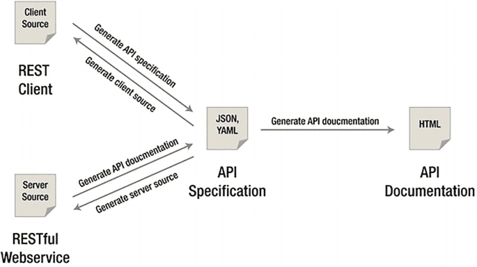

In today's interconnected world, [application programming interfaces (APIs)](https://apitoolkit.io/blog/api-documentation-and-observability-the-truth-you-must-know/) have become the backbone of modern software development. APIs enable different software systems to communicate and share data seamlessly, unlocking endless possibilities for innovation and integration. As the demand for robust and efficient APIs continues to grow, the practice of API modelling has emerged as a crucial discipline in designing and implementing successful API architectures.

## Understanding API Modeling:

API modeling refers to the process of designing and structuring APIs to ensure effective communication between different software components. It involves defining the data models, endpoints, request/response formats, authentication mechanisms, and other elements necessary for creating a well-defined and usable API. Proper API modeling lays the foundation for building scalable, maintainable, and interoperable systems.

Simply put, API modeling is a breakdown of how an API design will look in order to establish better communication procedures before designing the API.

API modeling was made to assist designers in answering some critical questions that appear to be the core of the design in the long run. Questions such as why my API exists, what problems it wants to answer, and what solution I am providing to my users.

[source](https://link.springer.com/chapter/10.1007/978-1-4842-9200-6_4)

## Significance of API Modelling:

- **Improved Developer Experience:** API modelling enhances the developer experience by providing clear and consistent guidelines for API consumption. Well-designed APIs with intuitive models reduce the learning curve and enable developers to work efficiently.

- **Streamlined Collaboration:** Modelling APIs facilitates collaboration between multiple teams involved in the development process. By establishing a common language and clear specifications, API modelling helps bridge the gap between stakeholders, including developers, product managers, and designers.

- **Reduced Development Time:** Properly modelled APIs allow for efficient development cycles. With well-defined interfaces and specifications, developers can focus on implementing business logic rather than spending time on guesswork or deciphering poorly designed APIs.

- **Scalability and Interoperability:** API modelling promotes scalability and interoperability, enabling seamless integration with existing systems and accommodating future enhancements. APIs that adhere to widely adopted standards and best practices foster interoperability among different applications and platforms.

Read: [Top 8 API Documentation Tools for Developers](https://apitoolkit.io/blog/top-8-api-documentation-tools-for-developers/)

## Diverse Perspectives on API Modelling:

- **Developer Perspective:** From a developer's standpoint, API modeling provides a clear understanding of how to consume and interact with an API. It offers insights into the data structures, available endpoints, and authentication mechanisms, enabling developers to leverage the API effectively.

- **Business Perspective:** Businesses benefit from API modeling through increased agility and innovation. By providing [well-documented APIs](https://apitoolkit.io/blog/how-to-write-api-docs/) with consistent models, organizations can attract developers, foster partnerships, and expand their ecosystem. This, in turn, drives innovation and accelerates time-to-market for new products and services.

- **Security Perspective:** API modeling plays a crucial role in addressing security concerns. By incorporating robust authentication, authorization, and data protection mechanisms into the API models, potential vulnerabilities can be identified and mitigated early in the development process.

## The Process Involved in API Modeling

### 1. **Identify the audience for your API**
Determining who will use your API is the first step in API modeling. Participants, performers, or users are some other names for them. APIs, in contrast to user interfaces, may be utilized both directly by developers and covertly by end users. Understanding the needs of both sides is crucial. The diverse applications and gadgets that could use our API in various ways are another thing we need to consider. We might want to be a little more explicit when identifying active users accessing the API. Instead of just naming developers as participants, we could want to make a distinction between internal developers, operations engineers, and external developers. The same is true for differentiating end users, regular users, account administrators, and system administrators because they all utilize different techniques and expect different results when using your API.

### 2. **Determine the desired outcomes**
More than your expensive database or the fine method your code was designed, your end users are interested in the outcomes that your API makes attainable. Your users need answers to questions. Always remember that they want a problem solved. If your model can't solve the problem then it is an issue.

Read: [API Documentation and Monitoring: the Truth You Must Know](https://apitoolkit.io/blog/api-documentation-and-observability-the-truth-you-must-know/)

### 3. **Sketch out the processes necessary to obtain these results.**
To obtain the desired outcomes a sketch of how these results will be obtained is necessary.  This sketch will fuel each stage. Decomposing results into discrete phases necessitates a deeper comprehension of how your API will address practical issues and solve problems. Make sure to include a subject matter expert (SME) in your API modeling approach because this knowledge is typically reserved for SMEs.

### 4. **Define your API model**
You will see the emergence of an API once all the processes have been recognized. Resources and actions will be the components of this API. As we begin the process of designing an API, we may group these to begin identifying the resources and actions that we will require. Just keep in mind that, before going on to the more involved process of API design, the purpose of this phase is to merely capture the APIs and methods to confirm your API needs. Different resources will be discovered in this step like creating a new project, finding a new project, etc. Take note of how our actions and results are assisting us in locating the resources connected to our API. They also assist us in visualizing how the API will be used, giving us a suggestion as to how our ultimate API design might appear. Just keep in mind that these are only potential resources; we might not require all of them or we could require ones that we haven't yet discovered. Making a rough draft of our API before doing the more difficult task of mapping it to HTTP and constructing it is the goal of API modeling.

Read: [Must-Know API Trends in 2023](https://apitoolkit.io/blog/api-trends/)

### 5. **Validate your API model**
Validating your API against well-known requirements is the last stage in the modeling process. Your responsibility is to guarantee that your API will satisfy the needs of every user, much like a good quality assurance (QA) team. Verify that your API model can satisfy the indicated demands by using wireframes, user stories, test cases, and other criteria.
Look for missing participants, outcomes, and steps when you validate your APIs. Additionally, you might wish to make a note of APIs that depend on others or that might be heavily used. Even though it's not required, this might help you make confident decisions when you enter the design and development phases.

Read: [Best API Monitoring and Observability Tools](https://apitoolkit.io/blog/best-api-monitoring-and-observability-tools/)

## The Goal of API Modeling
The goal of API modeling is to transform the specifications of a product into the fundamentals of high-level API architecture. API modeling guarantees that the objectives of developers and end users are met.

## Current Trends in API Modelling:

1. **OpenAPI Specification (OAS):** The OpenAPI Specification, formerly known as Swagger, has gained widespread adoption as a standard for API modelling. OAS provides a machine-readable format to describe APIs, making it easier to generate [documentation](https://apitoolkit.io/blog/how-to-generate-automated-api-documentation/), perform automated testing, and generate client SDKs. Its popularity has resulted in extensive tooling and support from the developer community.

2. **GraphQL:** GraphQL, an alternative to traditional REST APIs, introduces a new approach to API modelling. It allows clients to request specific data and define their data requirements, resulting in reduced network overhead and improved performance. GraphQL schemas play a central role in API modelling, enabling clients to understand the available data and interact with the API efficiently.

3. **Event-Driven APIs:** With the rise of event-driven architectures, API modelling has expanded beyond request-response paradigms. Event-driven APIs enable real-time communication between systems and provide a scalable foundation for building reactive applications. Modelling such APIs requires careful consideration of events, event schemas, and message formats.

## Conclusion

API modelling is a critical discipline in the realm of software development, providing a structured approach to designing and implementing effective APIs.

Recommended Post: [How to Tackle Anomalies in RESTful APIs](https://apitoolkit.io/blog/anomalies-in-restful-apis/)

Recommended Post: [Everything You Need to Know About SOAP API](https://apitoolkit.io/blog/everything-about-soap-apis/)

Recommended Post: [Top 7 Reasons Why Your Team Should Use an API Monitoring Tool](https://apitoolkit.io/blog/why-you-need-an-api-monitoring-tool/)
