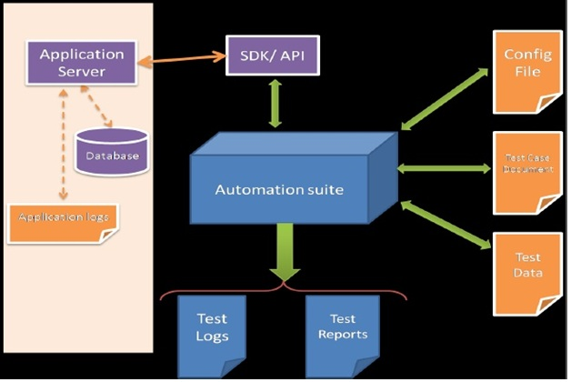
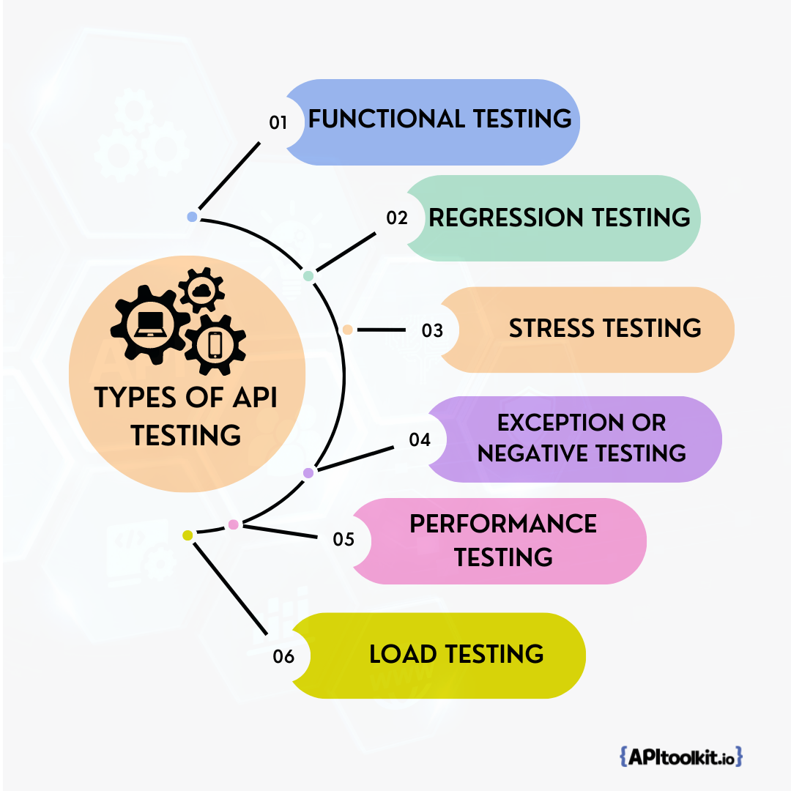
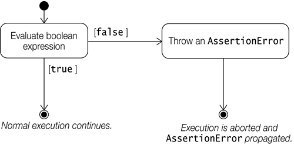

API testing automation is a crucial aspect of software development that ensures the quality, performance, and reliability of APIs. The number of [APIs](https://apitoolkit.io/blog/the-ultimate-api-management-strategy/) are expanding exponentially on a yearly basis. Therefore, directing automated tests on the APIs has turned into a pivotal step in the software development process. This is because malfunctioning or [ineffective APIs](https://apitoolkit.io/blog/anomalies-in-restful-apis/) can result in lower product acquisition and ultimately a loss in revenue.

In this comprehensive guide, you will learn everything you need about API testing automation, from its definition and importance to the tools and frameworks that can help you achieve it. You will also gain a deeper understanding of APIs and their functionality, as well as the steps and best practices for preparing for API testing automation.

## What is API Testing?

API testing is the process of verifying that an API (Application Programming Interface) works as expected and meets the requirements of its consumers. It involves sending requests to the API endpoints and validating the responses, as well as checking the functionality, performance, security, and usability of the API.


[Image source](prasadnaidum.blogspot.com)

As compared to manual testing, automated API testing can help developers and testers save time, reduce errors, increase coverage, and ensure the quality of software applications that rely on APIs for communication and data exchange.

## What are the Types of API Testing?

The different types of API testing are:

- Functional Testing
- Regression Testing
- Stress Testing
- Exception or negative Testing
- Performance Testing, and
- Load testing



### Functional testing

This type of testing checks if the API works and does exactly what it's supposed to do. It verifies the input and output parameters, the response time, the status codes, and the error handling of the API. Functional testing helps ensure that the API meets the functional requirements and specifications.

### Regression testing

Regression API testing checks if the API still works correctly after any changes or updates are made to it. It helps detect any bugs or defects that may have been introduced by the modifications. Regression testing helps ensure that the API maintains its quality and reliability.

### Stress testing

With stress testing, you can check how the [API performs](https://apitoolkit.io/blog/web-api-performance/) under extreme conditions, such as high load, high concurrency, or limited resources. It helps identify the breaking point, the maximum capacity, and the scalability of the API. Stress testing helps ensure that the API can handle peak traffic and unexpected situations.

### Exception or negative testing

This type of testing checks how the API handles invalid or unexpected inputs, such as incorrect data types, missing parameters, or malformed requests. It helps validate the error handling, the security, and the robustness of the API. Exception or negative testing helps ensure that the API can prevent malicious attacks and recover from failures.

### Performance testing

This type of testing checks how fast and efficient the API is in delivering its functionality. It measures the response time, throughput, latency, and resource consumption of the API. Performance testing helps ensure that the API meets performance expectations and standards.

### Load testing

This type of testing checks how the API performs under normal or expected conditions, such as moderate load, average concurrency, or sufficient resources. It helps evaluate the stability, consistency, and reliability of the API. Load testing helps ensure that the API can deliver its functionality without compromising its quality.

Read: [Load Testing vs Stress Testing: What's the Difference and Why It Matters](https://apitoolkit.io/blog/load-testing-vs-stress-testing-differences/)

## Why API Testing Automation is Important

Automated API testing is important because:

1. APIs are the backbone of many [software applications](https://apitoolkit.io/blog/api-as-a-product/), especially those that use microservice architecture or web services. APIs enable communication and integration between different modules, components, applications, and systems.

2. APIs are often complex and involve multiple parameters, headers, endpoints, requests, and responses. Manual testing of APIs can be tedious, time-consuming, and prone to human errors.

3. APIs are dynamic and frequently change or evolve. Manual testing of APIs can be difficult to maintain and update as the [API specifications](https://apitoolkit.io/blog/api-documentation-vs-api-specification/) change.

4. APIs need to be tested at different levels, such as unit testing, functional testing, integration testing, performance testing, security testing, and compliance testing. Manual testing of APIs can be insufficient to cover all these aspects and scenarios.

5. APIs need to be tested across different platforms, devices, browsers, and environments. Manual testing of APIs can be limited by the availability and compatibility of these factors.

## What API Testing Automation Can Do for You

API testing automation can help you:

- Verify the functionality and behavior of your APIs according to the specifications and requirements
- Validate the data format, structure, and values returned by your APIs
- Check the performance, scalability, and reliability of your APIs under different load conditions
- Detect and prevent errors, bugs, and security vulnerabilities in your APIs
- Save time and resources by reducing manual testing efforts and human errors

## Advantages of API Testing Automation

API testing automation has many advantages over manual testing, such as:

- It saves time and resources by reducing the effort and cost of manual testing.
- It increases test coverage and accuracy by eliminating human errors and biases.
- It enhances test reliability and consistency by ensuring that the same tests are run in the same way every time.
- It facilitates test maintenance and scalability by allowing easy modification and addition of test cases.
- It enables faster feedback and delivery by providing immediate results and reports.

## Writing Test Cases for API Testing Automation

Performing API testing automation requires that you write test cases that define the inputs, outputs, and expected outcomes of your API tests. You also need to use an API testing tool that can execute your test cases automatically and provide you with test results and feedback.

Writing test cases for API testing automation is a crucial step in ensuring the quality and coverage of your API tests. Test cases are the building blocks of your test suite, which is a collection of related test cases that test a specific feature or functionality of your API.

### Best Practices for Writing Effective Test Cases

To write effective test cases for API testing automation, you should follow these best practices:

- Use clear and descriptive names for your test cases that indicate the purpose and scope of the test
- Follow a consistent naming convention for your test cases that makes them easy to identify and organize
- Write test cases that are independent, atomic, and reusable, meaning that they can be executed in any order, without affecting or depending on other test cases
- Write test cases that are comprehensive, covering all the positive, negative, and edge scenarios of your API
- Write test cases that are maintainable, meaning that they can be easily updated and modified when the API changes or new requirements are added
- Use data-driven testing techniques to parameterize your test cases with different input data sets and expected outputs
- Use assertions to verify the expected outcomes of your test cases against the actual results

## How to Automate API Testing

To automate API testing, you need to follow some steps:

1. **Choose an API testing automation tool that suits the needs and preferences of the project.** There are many tools available for API testing automation, such as [APIToolkit Tester](https://usetestkit.com/), ZAPTEST1, Assertible2, Postman3, SoapUI4, and more.

Some factors to consider when choosing an API testing automation tool are:

- The type of API (RESTful, SOAP, GraphQL, etc.)

- The features and functionalities of the tool (such as data-driven testing, parameterization, assertions, reporting, etc.)

- The ease of use and learning curve of the tool

- The cost and licensing of the tool

- The support and documentation of the tool

2. **Set up the testing environment for API automation testing.** This may involve installing and configuring the tool, setting up the API endpoints, authentication methods, headers, parameters, etc. You may also need to create test data or use mock services to simulate the API responses.

3. **Develop the test scripts or scenarios for API automation testing.** This may involve defining the test objectives, test cases, test steps, expected results, etc. Also, you may need to use variables, loops, conditions, functions, etc. to make the test scripts more dynamic and reusable.

4. **Execute the test scripts or scenarios for API automation testing.** This may involve running the test scripts individually or in batches, scheduling the test runs, [monitoring](https://apitoolkit.io/blog/api-documentation-and-observability-the-truth-you-must-know/) the test progress, etc. In addition, you may need to use different modes or options to run the test scripts, such as debug mode, headless mode, parallel mode, etc.

5. **Analyze the test results or reports for API automation testing.** This may involve reviewing the test outcomes, verifying the actual results against the expected results, identifying the test failures or errors, generating the test [reports or logs](https://apitoolkit.io/blog/api-logs-and-metrics/), etc. You can likewise use different formats or tools to view or share the test results or reports, such as HTML, XML, JSON, CSV, etc.

Read: [Key Benefits of API Integration for Developers (with Statistics)](https://apitoolkit.io/blog/benefits-of-api-integration/)

Read: [10 Must-Know API Trends in 2023](https://apitoolkit.io/blog/api-trends/)

## Handling Data Validation and Assertions

Data validation and assertions are essential components of your test cases that help you verify the correctness and accuracy of your API responses. Data validation is the process of checking whether the data returned by your API matches the expected format, structure, and values.

Assertions are statements that compare the actual results of your test cases with the expected results and determine whether the test passed or failed.



To handle data validation and assertions in your test cases, you should:

- Use JSON Schema or XML Schema to define and validate the data format and structure of your API responses
- Use JSONPath or XPath expressions to extract and compare specific data elements from your API responses
- Use regular expressions to validate complex or dynamic data values in your API responses
- Use built-in or custom assertions to check various aspects of your API responses, such as status codes, headers, body content, response time, etc.
- Use logical operators (AND, OR, NOT) and conditional statements (IF, ELSE) to combine multiple assertions and handle different scenarios

## Testing HTTP Status Codes and Error Handling

HTTP status codes are numerical codes that indicate the status of an HTTP request or response. They are divided into five categories:

- 1xx: Informational - The request was received and is being processed
- 2xx: Success - The request was successfully processed and a response was returned
- 3xx: Redirection - The request needs to be redirected to another location or resource
- 4xx: Client Error - The request was invalid or could not be processed by the server
- 5xx: Server Error - The server encountered an error or could not process the request


Testing HTTP status codes is essential for verifying the functionality and behavior of your API under different situations. You should write test cases that check whether your API returns the appropriate status codes for various requests and responses.

You should also test how your API [handles errors](https://apitoolkit.io/blog/api-downtime/) and exceptions that may occur during the execution of your tests. You should write test cases that simulate different error scenarios, such as invalid input parameters, missing authentication tokens, network failures, server timeouts, etc. You should check whether your API returns meaningful and consistent error messages and codes that help you identify and troubleshoot the root cause of the problem.

## Testing API Response Time and Performance

API response time and performance are critical indicators of the quality and efficiency of your API. API response time is the time it takes for your API to process a request and return a response. API performance is the ability of your API to handle a large number of requests and responses within a given time period.

Testing API response time and performance can help you:

- Measure and monitor the speed and throughput of your API
- Identify and optimize any performance bottlenecks or issues in your API
- Ensure that your API meets the [performance expectations](https://apitoolkit.io/blog/web-api-performance/) and requirements of your users and stakeholders
- Evaluate the scalability and reliability of your API under different load conditions

To test API response time and performance, you should use an [API testing tool](https://usetestkit.com) that can generate and simulate a realistic load on your API, such as concurrent users, requests per second, etc. You should also use an API testing tool that can measure and report various performance metrics and KPIs, such as average response time, maximum response time, minimum response time, standard deviation, error rate, [throughput](https://apitoolkit.io/api-performance-monitoring-and-compliance/), etc.

## Executing API Tests with Automation

Executing API tests with automation is the process of running your test cases automatically using an API testing tool. Doing this can help you save time and resources, increase test coverage and frequency, improve test accuracy and consistency, and facilitate continuous testing and delivery.

### Running Tests Locally and in CI/CD Pipelines

You can run your API tests with automation either locally on your machine or in a continuous integration/continuous delivery (CI/CD) pipeline. Running tests locally can help you debug and verify your test cases before deploying them to a shared environment. Running tests in a CI/CD pipeline can help you integrate and deliver your code changes faster and more reliably.

To run tests locally, you need to install and configure an API testing tool on your machine, such as [Testkit](https://usetestkit.com/), Postman, SoapUI, RestAssured, etc. You also need to set up your test environment, such as the API endpoint, authentication credentials, test data, etc. You can then execute your test cases manually or using a command-line interface (CLI).

To run tests in a CI/CD pipeline, you need to integrate your API testing tool with a CI/CD tool, such as Jenkins, GitHub Actions, Azure DevOps, etc. You also need to create a test script that defines how to run your test cases automatically using the CLI of your API testing tool. You can then trigger your test script whenever a code change is pushed to a repository or branch, or on a scheduled basis.

### Parallel Test Execution for Faster Results

Parallel test execution is the process of running multiple test cases or test suites simultaneously on different machines or threads. Parallel test execution can help you reduce the overall execution time of your test suite, as well as increase the utilization of your testing resources.

To perform parallel test execution, you need to use an API testing tool that supports parallelism, such as [Testkit](https://usetestkit.com/), Postman Runner, SoapUI Pro, TestNG, etc. You also need to ensure that your test cases are independent and do not interfere with each other when executed in parallel. You can then configure the number of parallel threads or processes that you want to use for running your test cases.

### Handling Test Dependencies and Ordering

Test dependencies and ordering are the relationships between different test cases that determine the sequence or order in which they should be executed. Test dependencies are when one test case depends on the output or result of another test case. Test ordering is when one test case needs to be executed before or after another test case.

Handling test dependencies and ordering can help you ensure the correctness and completeness of your test suite, as well as avoid unnecessary or redundant executions of your test cases.

To handle test dependencies and ordering, you need to use an API testing tool that supports dependency management, such as Teskit, Postman Collection Runner, SoapUI Pro Test Case Runner, TestNG Annotations, etc. You also need to define the dependencies and ordering of your test cases using variables, assertions, annotations, etc. You can then execute your test suite according to the defined dependencies and ordering.

Read: [Best Monitoring and Observability Tools in 2023](https://apitoolkit.io/blog/best-api-monitoring-and-observability-tools/)

Read: [API Monitoring and Documentation: the Truth You Must Know](https://apitoolkit.io/blog/api-documentation-and-observability-the-truth-you-must-know/)

## API Test Reporting and Metrics

One of the key aspects of API testing automation is generating comprehensive test reports and metrics that provide valuable insights into the quality, performance, and usability of the APIs. These reports and metrics can help identify issues, track progress, evaluate results, and improve decision-making.

Some of the essential elements of API test reporting and metrics are:

### Generating Comprehensive Test Reports

Test reports are documents that summarize the outcomes and details of the test execution. They typically include information such as:

**Test summary**: A high-level overview of the test objectives, scope, duration, status, pass/fail rate, etc.

**Test details**: A low-level breakdown of the test cases, steps, inputs, outputs, assertions, validations, errors, etc.

**Test logs**: A chronological record of the test events, actions, messages, responses, etc.

**Test screenshots**: A visual representation of the test scenarios, interfaces, results, etc.

Test reports should be generated automatically by the test tools or frameworks after each test run. They should be formatted in a clear, concise, and consistent manner that is easy to read and understand. They should also be stored in a central location that is accessible to all relevant parties.

### Analyzing Test Results and Defect Management

Test results are the outcomes of the test execution that indicate whether the APIs met or failed the expected criteria. The following information should be found in the test result:

- **Test status**: A binary indicator of whether the test case passed or failed based on predefined assertions or validations.
- **Test severity**: A qualitative measure of how critical or important the test case is based on the impact or priority of the API functionality.
- **Test defect**: A description of the discrepancy or deviation between the actual and expected behavior or output of the API.

Test results should be analyzed thoroughly by the testers or developers to identify the root causes, effects, and solutions of the defects. They should also be reported promptly to a defect management system that tracks and manages the lifecycle of the defects. The defect management system should provide features such as:

- **Defect identification**: A unique identifier that distinguishes each defect from others.
- **Defect classification**: A categorization scheme that groups defects based on their attributes such as type, source, module, etc.
- **Defect status**: A state transition diagram that shows the current state and possible transitions of each defect such as new, open, assigned, resolved, closed, etc.
- **Defect resolution**: A verification process that confirms whether the defect has been fixed or not based on retesting or regression testing.

### Tracking Performance Metrics and KPIs

Performance metrics are quantitative measures that evaluate how well the APIs perform under various conditions. They typically include information such as:

- **Response time**: The time elapsed between sending a request to an API endpoint and receiving a response from it.
- **Throughput**: The rate at which an API endpoint can process requests and responses per unit of time.
- **Latency**: The delay or lag between sending a request to an [API endpoint](https://apitoolkit.io/api-anomalies-validation-and-checks/) and receiving a response from it.
- **Error rate**: The percentage or ratio of requests that result in errors or failures from an API endpoint.
- **Availability**: The percentage or ratio of time that an API endpoint is operational and accessible.
- **Scalability**: The ability of an API endpoint to handle increasing or decreasing loads without compromising [performance](https://apitoolkit.io/blog/web-api-performance/) or quality.

Performance metrics should be collected and [monitored continuously](https://apitoolkit.io/blog/best-api-monitoring-and-observability-tools/) by using performance testing tools or frameworks that simulate realistic loads and scenarios on the APIs. They should also be compared and benchmarked against predefined thresholds or standards that represent the expected or acceptable levels of performance.

Key performance indicators (KPIs) are strategic metrics that align with the business goals and user expectations of the APIs. KPIs contain the following information:

- **Customer satisfaction**: The degree to which the APIs meet or exceed the needs and preferences of the end users.
- **User adoption**: The number or percentage of users who use or interact with the APIs on a regular basis.
- **User retention**: The number or percentage of users who continue to use or interact with the APIs over a period of time.
- **User engagement**: The frequency, duration, and intensity of user interaction with the APIs.
- **User feedback**: The opinions, ratings, reviews, suggestions, or complaints that users provide about the APIs.


KPIs should be defined and measured periodically by using user feedback tools or methods that collect and [analyze user data](https://apitoolkit.io/blog/data-retrieval-and-filtering-for-web-api-performance/) and behavior on the APIs. They should also be evaluated and optimized based on the feedback and insights that users provide about the APIs.

## Example of API Testing Automation

Here is an example of how to automate API testing using [Testkit](https://www.usetestkit.com), a popular tool for API development and testing.

Download and install [Testkit](https://www.usetestkit.com).

Launch Testkit and create a new collection named “API Testing Automation”.

In the collection, create a new request named “Get Users” with the following details:

- Method: GET
- URL: https://jsonplaceholder.typicode.com/users

Click on “Send” button to send the request and see the response in JSON format.

Click on “Tests” tab to write some test scripts using JavaScript syntax. For example:

```yaml
- title: Get users
  GET: https://jsonplaceholder.typicode.com/users
  asserts:
    # Status code is 200
    ok: $.resp.status == 200
    # Check response body contains 10 users
    ok: $.resp.json.length() == 10
    # First user to be bre
    ok: $.resp.json[0].username == "Bret"
    # Id to be a number
    number: $.resp.json[*].id
    # Check response body is not empty
    ok: $.resp.json.length() != 0
```

Click on “Send” button again to run the test scripts and see the test results in the “Test Results” tab.

Click on “Save” button to save the request and the test scripts in the collection.

Repeat steps 3 to 7 to create more requests and test scripts for different API endpoints or scenarios.

Click on “Runner” button to open the Collection Runner window, where one can run the entire collection or a subset of requests in a single or multiple iterations, with different data sets or environments, and generate a summary report of the test runs.

## Overcoming Challenges and Best Practices

### Handling Flaky Tests and Test Maintenance

One of the main challenges of API testing automation is dealing with flaky tests, which are tests that produce inconsistent results (pass or fail) when run multiple times under the same conditions. Flaky tests can undermine the reliability and credibility of the test results, and cause confusion and frustration among the testers and developers.

Flaky tests can be caused by various factors, such as network issues, concurrency problems, timing issues, external dependencies, insufficient test data, or bugs in the test code or the API itself. To handle flaky tests, you need to identify the root cause of the flakiness and fix it accordingly.

Some of the common ways to identify and fix flaky tests are:

- Use a test management tool or a dashboard to monitor and analyze the test results and identify any patterns or trends of flakiness.
- Use a test isolation technique to run each test in a separate environment or process, and avoid any interference or dependency between tests.
- Use a test retry mechanism to rerun failed tests a certain number of times before marking them as failed.
- Use a test data generation tool or a mocking service to create realistic and reliable test data for each test case.
- Use a test code review process to ensure that the test code is clear, consistent, readable, and follows the coding standards and best practices.
- Use a test debugging tool or a logging service to trace and troubleshoot any errors or failures in the test execution.

Another challenge of API testing automation is maintaining the test suite as the API evolves over time. As new features are added, existing features are modified, or bugs are fixed in the API, the test suite needs to be updated accordingly to reflect the changes and ensure it covers all the relevant scenarios and cases. Test maintenance can be tedious and costly if not done properly. Some of the best practices for test maintenance are:

- Use a version control system or a repository to store and manage the test code and data, and track any changes or updates.
- Use a test documentation tool or a specification format to document the test cases and scenarios, and describe the expected behavior and output of each test.
- Use a test automation framework or a tool that supports data-driven testing, which is the technique of separating the test data from the test logic, and using external sources (such as files or databases) to provide input values for each test case.
- Use a test automation framework or a tool that supports keyword-driven testing, which is the technique of using predefined keywords or commands to define the actions and steps for each test case.
- Use a test automation framework or a tool that supports behavior-driven testing (BDD), which is the technique of using natural language (such as Gherkin) to write the test scenarios in a given-when-then format, and align them with the user stories and acceptance criteria.

Read: [API Management: How to Tackle Anomalies in RESTful API (the Right Way)](https://apitoolkit.io/blog/anomalies-in-restful-apis/)

Read: [Incident Management: How to Resolve API Downtime Before It Escalates](https://apitoolkit.io/blog/api-downtime/)

### Dealing with Rate-Limited APIs

Another challenge of API testing automation is dealing with rate-limited APIs, which are APIs that impose limits on the number or frequency of requests that can be made by a client within a certain period of time. Rate limits are usually implemented by API providers to prevent abuse, overload, or misuse of their services. However, they can also affect the performance and functionality of API testing automation tools and frameworks.

If you exceed the rate limit of an API, you may receive an error response (such as 429 Too Many Requests) or experience delays or timeouts in your requests. This can cause your tests to fail or produce inaccurate results. To deal with rate-limited APIs, you need to respect their policies and adjust your testing strategy accordingly. Some of the ways to deal with rate-limited APIs are:

- Read the API documentation carefully and understand its rate limit policy (such as quota, window size, reset time, etc.) before using it for testing.
- Use a test planning tool or a spreadsheet to estimate the number and frequency of requests that you need to make for each test case and scenario, and ensure that they are within the rate limit of the API.
- Use a test throttling technique to control the rate of requests that you send to the API, and avoid sending too many requests in a short period of time. You can use various methods to throttle your requests, such as timers, delays, pauses, or queues.
- Use a test caching technique to store and reuse the responses that you receive from the API, and avoid sending duplicate or unnecessary requests. You can use various tools to cache your responses, such as memory, files, databases, or proxy servers.
- Use a test mocking technique to simulate the behavior and output of the API, and avoid sending real requests to the API. You can use various tools to mock your API, such as frameworks, libraries, or services.

### Strategies for Testing Third-Party APIs

Another challenge of API testing automation is testing third-party APIs, which are APIs that are provided by external parties or vendors, and are not under your control or ownership. Third-party APIs can offer many benefits, such as adding functionality, enhancing performance, or reducing costs for your application. However, they can also pose some risks and challenges for your testing process, such as:

- Lack of access: You may not have full access to the third-party API, its documentation, its source code, or its environment. This can limit your ability to understand, configure, or debug the API.
- Lack of reliability: You may not be able to rely on the availability, stability, or quality of the third-party API. The API may change, break, or fail without notice or explanation.
- Lack of security: You may not be able to trust the security or privacy of the third-party API. The API may expose your data or credentials to unauthorized parties or malicious attacks.

To overcome these challenges and ensure that your application works well with third-party APIs, you need to adopt some strategies and best practices for testing them. Some of the strategies for testing third-party APIs are:

- Use a test contract technique to define and agree on the expectations and requirements of the third-party API with its provider. A test contract is a document that specifies the inputs, outputs, behaviors, and scenarios of the API that need to be tested and verified. You can use various formats to write your test contract, such as [Swagger](https://apitoolkit.io/blog/generating-golangdoc/), OpenAPI, RAML, etc.
- Use a test sandbox technique to create and use a separate environment or instance of the third-party API for testing purposes. A test sandbox is an isolated and controlled environment that mimics the production environment of the API but allows you to modify and manipulate its settings and data without affecting its real users or operations.
- Use a test [monitoring technique](https://apitoolkit.io/blog/best-api-monitoring-and-observability-tools/) to track and measure the performance, availability, and functionality of the third-party API over time. A test monitoring tool or service can help you collect and analyze various metrics and indicators of the API's health and quality, such as response time, error rate, throughput, etc.

### Continuous Improvement and Iterative Testing

One of the best practices of API testing automation is continuous improvement and iterative testing, which is the process of constantly reviewing, evaluating, and improving your testing process and results based on feedback and data. Continuous improvement and iterative testing can help you achieve higher levels of quality assurance and customer satisfaction for your application.

Continuous improvement and iterative testing involve several steps:

- Define your testing goals and objectives: You need to establish what you want to achieve with your testing process (such as coverage, accuracy, speed) and how you will measure it (such as metrics, criteria).
- Plan your testing strategy: You need to decide how you will conduct your testing process (such as tools, frameworks) and what you will test (such as scenarios, cases).
- Execute your testing process: You need to run your tests according to your plan (such as schedule) and collect your results (such as reports).
- Analyze your testing results: You need to review your results (such as errors) and identify any issues or gaps (such as [bugs](https://apitoolkit.io/api-anomalies-validation-and-checks/)) in your testing process or application.
- Improve your testing process: You need to fix any issues or gaps (such as code) in your testing process or application based on your analysis (such as root cause) and implement any changes or enhancements (such as features) that can improve your testing process or application.
- Repeat: You need to repeat these steps regularly (such as daily) and continuously (such as indefinitely) until you reach your desired level of quality assurance.

## Conclusion

API testing automation is a powerful and effective way to ensure your application's APIs work correctly and efficiently. However, it also requires careful planning, execution, analysis, and improvement in order to overcome its challenges and achieve its benefits. By adhering to the best practices discussed in this article, you can optimize your API testing automation process and deliver high-quality applications that meet the user’s demands.

Of course, testing your API ensures that your organization can save time, reduce human errors, and improve overall software quality.

**Keep Reading**

[How to Generate Automated API Documentation](https://apitoolkit.io/blog/how-to-generate-automated-api-documentation/)

[API Documentation vs Specification: What It Means for You](https://apitoolkit.io/blog/api-documentation-vs-api-specification/)

[How to Write API Documentation: 10 Essential Guidelines](https://apitoolkit.io/blog/how-to-write-api-docs/)
