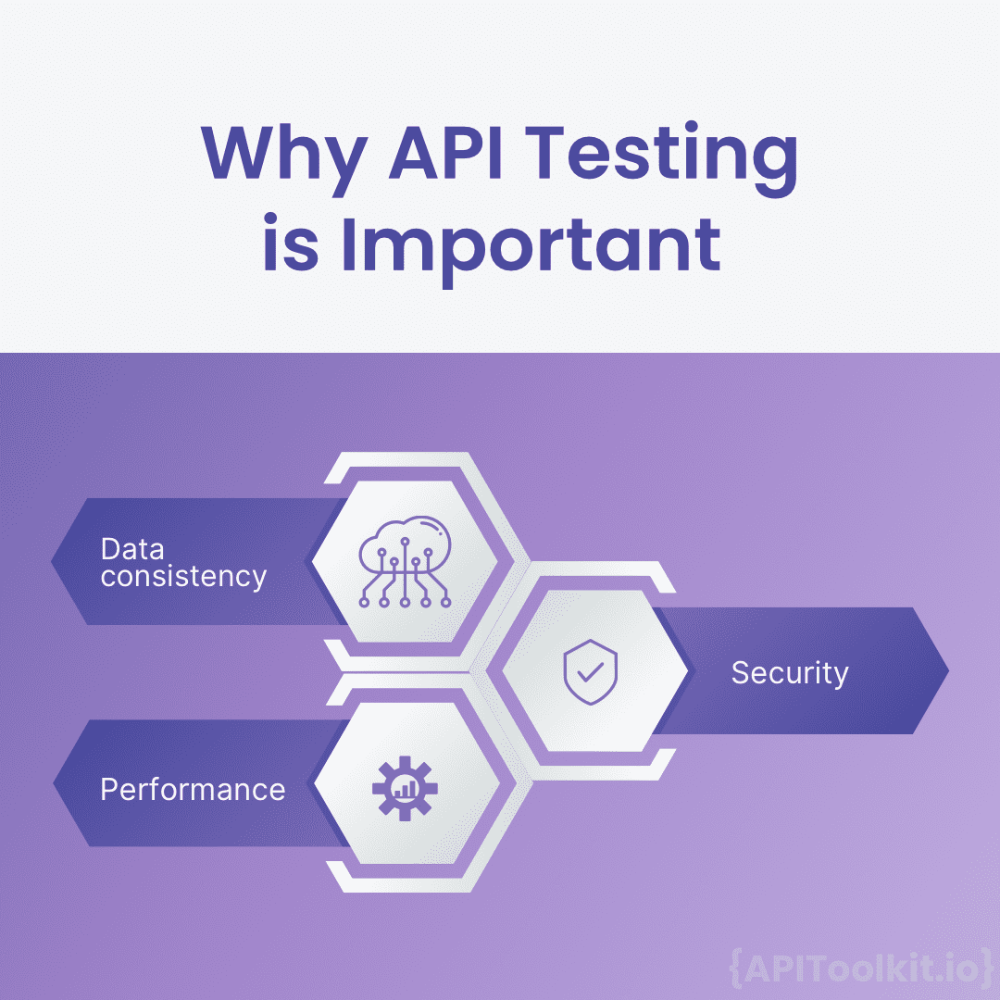
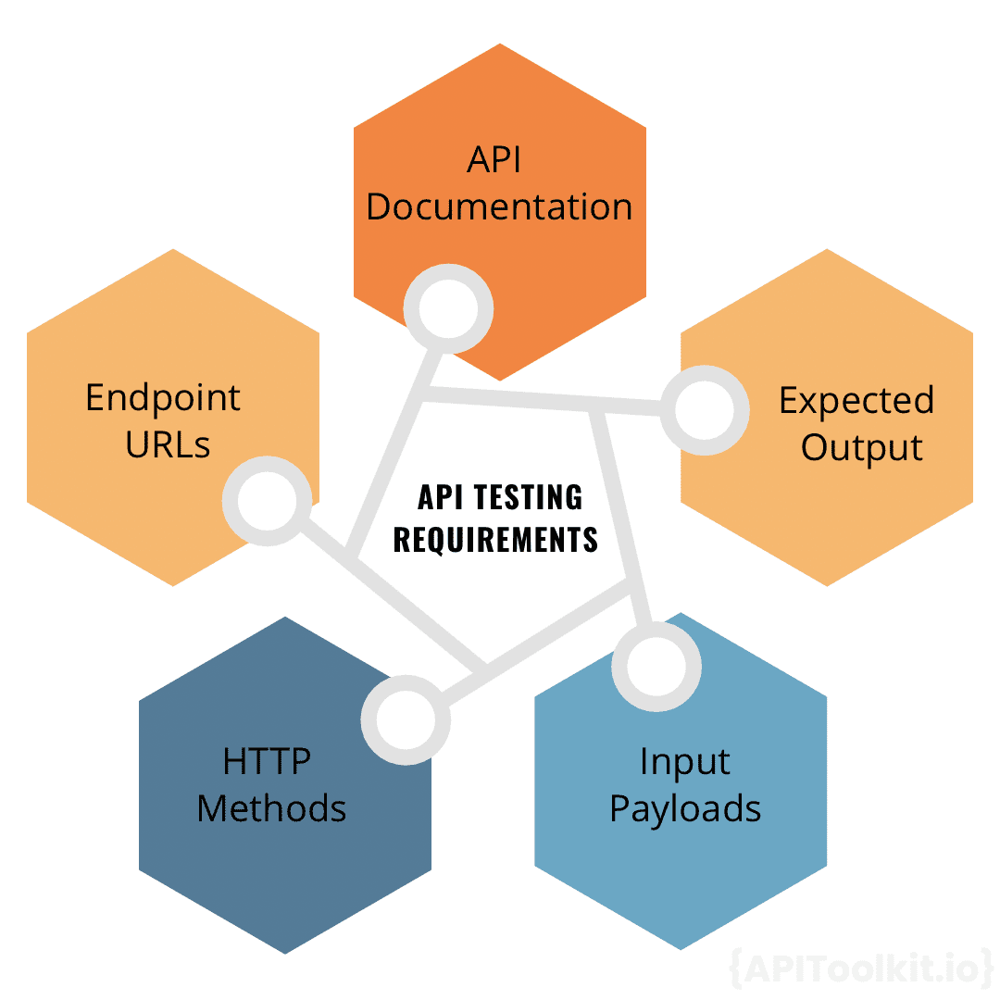

# What You Need to Know Before You Start API Testing

We live in a digital age, where Application Programming Interfaces (APIs) act as vital connectors, facilitating seamless communication between software components. Just like we rely on good communication in our daily lives, businesses depend on these APIs. So, it's super important to make sure they're working perfectly. If you're gearing up to venture into API testing this article will provide you with a comprehensive overview of all you need to know.

## Introduction to API Testing

API testing is a critical component in the digital realm, it ensures that APIs function as intended, facilitating seamless communication between different systems. This form of testing delves deeper than traditional GUI testing, directly interacting with the API to validate its functionality, reliability, performance, and security. It's essential to be familiar with the API documentation and understand the various endpoint URLs, HTTP methods, input payloads, and expected outputs to conduct effective testing.

Think of API testing like you trying out a new recipe. While you can follow the basic steps and get a decent dish, knowing some cooking techniques (or coding, in this case) can help you tweak the recipe, understand it better, and even come up with new variations. So, while you can test an API without coding knowledge, being able to code gives you more flexibility and depth in your testing.

[API testing automation](https://apitoolkit.io/blog/api-testing-automation/) is like having kitchen gadgets that do some tasks for you, like a blender or a food processor. It speeds up the process and ensures consistency. Tools like [Testing,](https://usetestkit.com) [Postman,](https://www.postman.com/) and [Swagger](https://swagger.io/) are like these kitchen gadgets, helping you test APIs faster and more efficiently.
In API testing, negative tests evaluate the API's resilience to unexpected scenarios, emphasizing the importance of thorough testing in today's software landscape.

## Why is API Testing Important?

API testing is not just a procedural step in software development; it's a crucial measure that ensures data consistency, optimal performance, and robust security, all of which are essential for delivering a reliable and efficient user experience. API testing is of paramount importance in the software development lifecycle, and here's why:

Data Consistency: At the heart of many modern applications, APIs transmit vast volumes of data between systems. Given the sheer amount of data they handle, there's a potential risk of data discrepancies or losses during these transmissions. API testing plays a pivotal role in ensuring that the data remains consistent and intact as it moves across platforms and systems. By rigorously testing APIs, developers can ensure that data integrity is maintained, meaning that the data remains accurate, consistent, and unaltered throughout its lifecycle.

Performance: In today's fast-paced digital world, users expect applications to respond instantly. The performance of an API directly impacts the user experience. API testing evaluates crucial performance metrics such as response time (how quickly the API responds to a request) and latency (the delay before the data transfer begins). Additionally, it identifies potential bottlenecks (areas where data flow might be impeded), leading to slowdowns. By addressing these performance issues, developers can ensure that the end-users experience smooth and efficient interactions with the application.

Security: Perhaps one of the most critical aspects of API testing is ensuring security. APIs act as gateways to an application's backend systems, making you potential targets for malicious attacks. If an API is not secure, it could lead to unauthorized access to sensitive data or even system breaches. Through API testing, vulnerabilities and potential security loopholes are identified. This allows developers to fortify the API against potential threats, ensuring that data remains protected and that unauthorized entities cannot exploit the API. In essence, API testing acts as a protective shield, safeguarding both the application and its users from potential security threats.

## API Testing Requirements

API testing is a meticulous process that requires a deep understanding of various components to ensure its effectiveness. Here's a comprehensive breakdown of the essential elements:

1. [API Documentation:](https://apitoolkit.io/blog/api-documentation-and-observability-the-truth-you-must-know/) This is the starting point for a developer looking to test an API. The documentation serves as a guidebook, offering a detailed overview of how the API functions. It outlines the available endpoints, describes the expected request and response formats, and lists potential error codes that might be encountered. By thoroughly reviewing the API documentation, API testers can gain a clear understanding of the API's design and intended behavior, ensuring that they approach testing with a well-informed perspective.

2. Endpoint URLs: In the realm of APIs, endpoints are akin to destinations. They are specific URLs to which API requests are directed. Each endpoint corresponds to a particular function or resource. Knowing the correct endpoints is crucial because directing a request to the wrong endpoint or an invalid URL can lead to errors or unintended outcomes. Therefore, API  testers must be well-acquainted with all the available endpoints to ensure comprehensive testing coverage.

3. HTTP Methods: These are the verbs of API language, dictating the type of action to be performed. Common HTTP methods include GET (used to retrieve data), POST (used to send or submit data), PUT (used to update existing data), and DELETE (used to remove data). Each method has a specific purpose, and understanding these methods is fundamental to ensuring that the API can perform its intended actions correctly and efficiently.

4. Input Payload: When sending a request to an API, often, specific data or parameters need to be included, known as the input payload. This data can vary in structure and format, depending on the API's design. API  Testers must be aware of the expected input payloads for different endpoints to ensure that the API can process the provided data correctly and return the desired response.

5. Expected Output: Once a request is made to an API, it responds with data, known as the output. This output can come in various formats, such as JSON or XML. Knowing the expected output format is vital for API testers as it allows you to verify that the API is returning data in the correct structure and that the data itself is accurate and relevant.

Effective API testing hinges on a deep understanding of these components. By familiarizing yourselves with the API documentation, knowing the correct endpoints, understanding HTTP methods, being aware of input payloads, and verifying the expected output, API testers can ensure a thorough and accurate assessment of the API's functionality and reliability.

Essential Skills for Proficient API Testing
API testing demands a unique blend of skills to ensure that APIs function as intended and deliver consistent, reliable results. Here's a deeper dive into the essential skills required for effective API testing:

1. Technical Proficiency: At its core, an API is a set of programming instructions and standards that allow applications to communicate with each other. Therefore, having a foundational understanding of the programming language in which the API is written becomes beneficial. This knowledge equips API testers to delve deeper into the API's code, identify potential issues at the source level, and understand the logic and flow of the API's operations. While you don’t need to be an expert coder, a basic grasp of the language can significantly enhance the testing process.

2. Understanding of [REST](https://apitoolkit.io/blog/what-are-rest-apis/) and [SOAP APIs:](https://apitoolkit.io/blog/everything-about-soap-apis/) REST (Representational State Transfer) and SOAP (Simple Object Access Protocol) are two of the most widely adopted architectures for designing networked applications, especially APIs. While they both serve the purpose of communication, they have distinct methodologies and conventions.
    a. REST is a set of architectural principles that use standard HTTP methods and status codes, URLs, and MIME types. It's known for its simplicity and scalability.
    b. SOAP, on the other hand, is a protocol that relies on XML-based messaging patterns. It's known for its robustness and is often used in enterprise settings.
Having a clear understanding of these architectures is crucial for you as an API  tester because it allows you to design tests that align with the API's architectural standards, ensuring more accurate and relevant testing outcomes.

3. Database Knowledge: APIs often serve as intermediaries, fetching, updating, or deleting data from databases based on user requests. As such, they frequently interact with databases, making it imperative for API testers to understand how databases work. Knowledge of SQL (Structured Query Language), the standard language for database operations, is particularly advantageous. It enables API testers to verify if the API is executing the correct database operations, ensure data integrity, and even simulate different data scenarios to test the API's response.

## Conclusion

In summary, while API testing might seem daunting at first, equipping yourself with these skills can make the process more streamlined and effective. A combination of technical proficiency, a deep understanding of API architectures, and database knowledge ensures that API testers can comprehensively assess an API's functionality, reliability, and performance. As APIs continue to play a pivotal role in modern software architectures, understanding the nuances of API testing becomes ever more crucial. Whether you're a seasoned API tester or just starting, a thorough grasp of API testing requirements will set you on the path to success.

**Also Read**

[Writing API Documentation - Best Practices and Mistakes to Avoid](https://apitoolkit.io/blog/writing-api-documentation/)
	
[Best API Monitoring and Observability Tools in 2023](https://apitoolkit.io/blog/best-api-monitoring-and-observability-tools/)
	
[How to Generate Automated API Documentation](https://apitoolkit.io/blog/writing-api-documentation/)
	
[API Monitoring and Documentation: The Truth You Must Know](https://apitoolkit.io/blog/api-documentation-and-observability-the-truth-you-must-know/)
