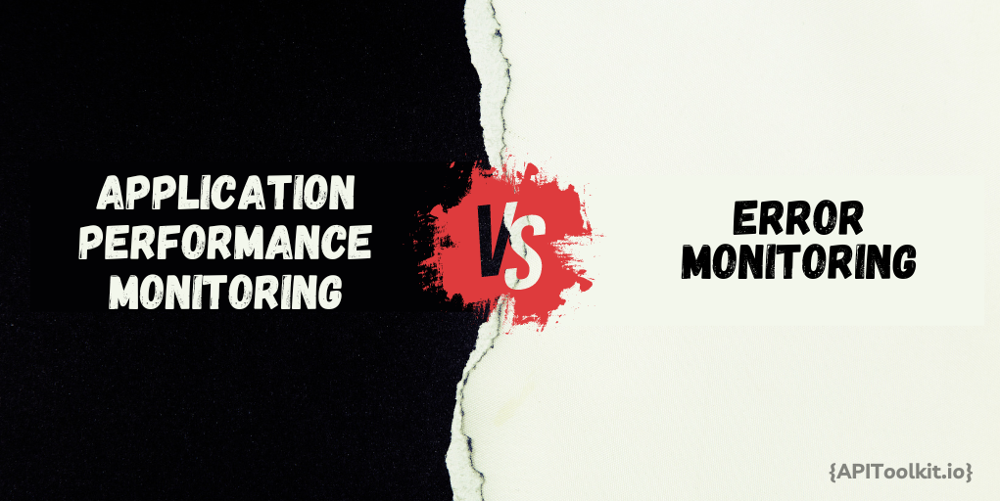
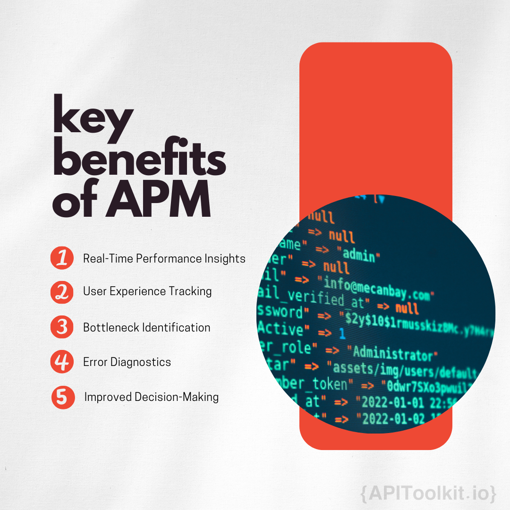
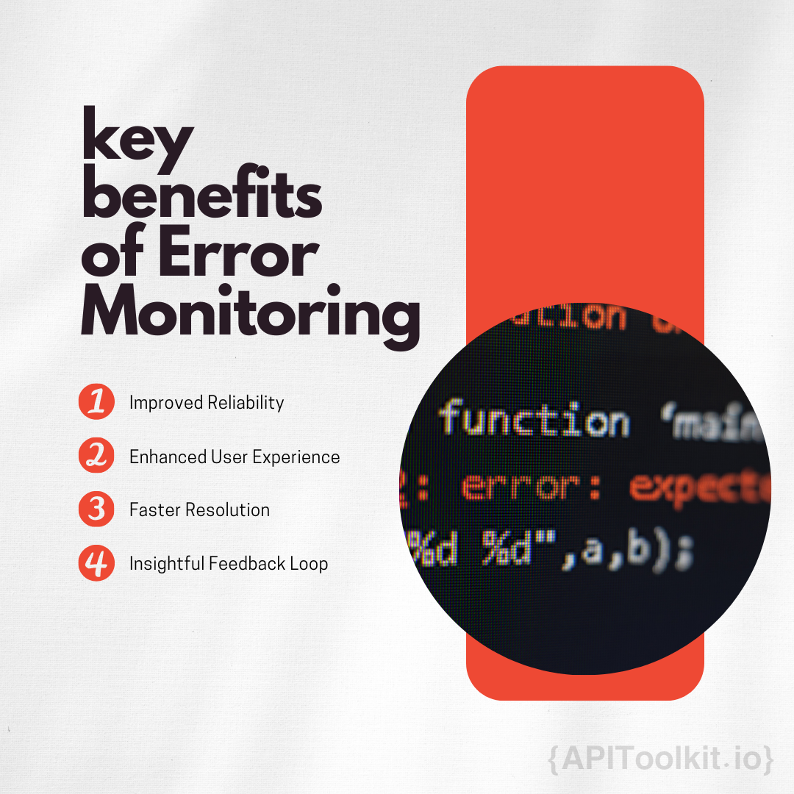

Did you know that according to a recent survey, 88% of users are less likely to return to a website after a bad experience? This just goes to show you how important monitoring is in ensuring your software performs flawlessly, keeping users satisfied and coming back for more.

Monitoring in software development means constantly checking your software to make sure it's working well. It helps you spot and fix problems quickly, ensuring a good experience for users. Monitoring in software development means constantly checking your software to make sure it's working well. It helps you spot and fix problems quickly, ensuring a good experience for users. In this blog post, we will dive into the essentials of monitoring in software development, exploring how it acts as a critical tool for ensuring your software runs smoothly and efficiently, catching any issues before they affect the user experience.

## Why Monitoring Matters

Now, you might think, "Okay, so monitoring keeps things in check. But why is it such a big deal?" The reason is simple yet powerful: in today's fast-paced digital environment, users expect flawless performance. Any delay or glitch, no matter how small, can drive users away. [Monitoring](https://apitoolkit.io/blog/stay-ahead-of-the-curve/) in software development is crucial because it constantly checks your software's performance, catching problems early. In a world where users quickly lose patience with slow or glitchy apps, monitoring acts as a safeguard. It alerts you to issues like traffic spikes or slow responses, allowing you to address them promptly. This ensures your software remains reliable and meets users' high expectations, keeping your digital services running smoothly.

Basically, [monitoring](https://apitoolkit.io/blog/stay-ahead-of-the-curve/) in software development is about ensuring your digital presence is strong, reliable, and ready to meet the high expectations of today's users. It plays a critical role by acting as an early warning system that detects issues before they escalate, ensuring your software remains up to the mark and user experiences stay positive. This proactive approach is key to maintaining a competitive edge and ensuring user satisfaction.

## What is APM?

Application Performance Monitoring (APM) is a technology that helps you ensure your software runs smoothly and efficiently. It provides a complete overview of your application's performance, allowing you to see how well it's working from a user's perspective. APM tools help identify any issues that might slow down your service, ensuring it remains fast, responsive, and reliable for users. APM lets you peek behind the curtain, and shows you how well the application is performing from the user's point of view. It's all about making sure that your digital service is not just up and running, but also quick, responsive, and as smooth as butter.

### Key Features and Benefits

APM empowers you with a suite of tools for optimal application management, characterized by several key features:

- **Real-Time Performance Insights**: APM continuously monitors your application, providing instant updates on its performance. This real-time data allows you to promptly identify and resolve any emerging issues, ensuring your application runs smoothly.

- **User Experience Tracking**: APM goes beyond mere functionality by tracking how users interact with your application. This insight reveals which features users prefer and where they encounter difficulties, enabling you to enhance the overall user experience.

- **Bottleneck Identification**: One of the standout benefits of APM is its ability to pinpoint performance bottlenecks. By identifying the exact areas where your application slows down, APM guides you in making targeted optimizations to enhance efficiency.

- **Error Diagnostics**: When errors occur, APM provides in-depth diagnostic capabilities, delving into the code to uncover the root cause of problems. This level of detail streamlines the debugging process, allowing for faster issue resolution.

- **Improved Decision-Making**: Armed with a wealth of data and insights from APM, you can make informed decisions about where to allocate resources and how to prioritize development efforts for the greatest impact on performance and user satisfaction.

### APM in Action

APM plays a critical role across various industries by ensuring applications perform at their best:

- **E-Commerce Platforms**: APM is essential for online stores, where it speeds up loading times to prevent lost sales. It ensures that customers have a smooth browsing and purchasing experience.

- **Banking Applications**: In finance, APM monitors transactions to keep them quick and secure, addressing the industry's high standards for performance and safety.

- **Streaming Services**: APM is used by streaming platforms to maintain quality, adjusting in real time to prevent issues like buffering, especially during key moments in content.

## The Role of Error Monitoring

[Error Monitoring](https://apitoolkit.io/blog/error-monitoring-for-developer/) is a process used in software development to automatically detect, log, and report errors in real-time within applications. This allows developers to quickly identify and address issues that could disrupt the user experience, ensuring the software remains functional and reliable. It focuses specifically on identifying and analyzing errors that could negatively impact the user experience, from broken links and faulty code to system crashes, ensuring they are promptly resolved.

### How Error Monitoring Works

Error Monitoring follows a systematic approach, involving several key steps to ensure thorough detection and resolution of issues within an application:

1. **Detection**: As soon as an error occurs, [Error Monitoring ](https://apitoolkit.io/blog/moesif-alternative-for-monitoring-and-observability/)identifies it. The system is designed to catch errors in real-time, ensuring no issue goes unnoticed.

2. **Logging**: Detected errors are then logged with detailed information. This includes specifics about the error, such as what happened, where it occurred within the application, and the context in which it happened.

3. **Alerting**: Following the logging of an error, alerts are sent out to notify developers of the issue. This rapid notification system ensures that the development team is aware of the problem and can begin addressing it immediately.

4. **Analysis**: Armed with detailed error logs, developers can thoroughly investigate each issue to determine its underlying cause. This analysis is crucial for understanding why the error occurred and how to prevent similar issues in the future.

### Key Benefits of Implementing Error Monitoring

Now, you might be thinking, "That's all well and good, but what's in it for me?" Here's the scoop:

- **Improved Reliability**: By catching errors early, you can fix them before they affect your users, making your app more reliable and trustworthy.
- **Enhanced User Experience**: Nothing ruins the user experience quite like unexpected errors. Error Monitoring helps keep the user journey smooth, ensuring satisfaction and loyalty.
- **Faster Resolution**: With detailed error reports at your fingertips, you can quickly get to the bottom of issues, reducing downtime and keeping your app in top shape.
- **Insightful Feedback Loop**: [Error Monitoring](https://apitoolkit.io/blog/error-monitoring-tools-for-small-businesses-under-budget/) provides invaluable insights into how and why errors occur, helping you learn from each incident and build a stronger, more resilient application.

## Focus Areas and Objectives

**APM** focuses on the overall performance of an application, tracking how quickly and smoothly it operates to ensure a top-notch user experience. Its main goal is to optimize the efficiency and fluidity of the application's operation.

**Error Monitoring**, in contrast, concentrates on identifying and resolving bugs and errors. Its primary aim is to detect and fix issues promptly to prevent any negative impact on the user experience.

### Integration and Use Cases

**APM** is integrated deeply into the application, monitoring a wide range of performance metrics such as server response times and database query efficiency. It is essential in sectors where high performance is critical, including e-commerce, financial services, and large enterprise applications.

**Error Monitoring** remains on alert to address issues as they arise. It is particularly important in applications where reliability is crucial, like in healthcare systems, payment gateways, and services where errors can cause significant problems.

### Choosing What's Right for Your Project

Deciding between APM and [Error Monitoring](https://apitoolkit.io/blog/moesif-alternative-for-monitoring-and-observability/) boils down to understanding what your application needs most. Is your primary concern ensuring that everything runs smoothly and efficiently? Then APM might be your MVP. Or are you more focused on making sure no bugs or errors ruin the user experience? In that case, Error Monitoring could be your go-to defender.

Note  that you don't necessarily have to choose one over the other. In fact, the most robust approach often involves integrating both APM and [Error Monitoring](https://apitoolkit.io/blog/error-monitoring-for-developer/). This combo gives you the best of both worlds, allowing you to optimize performance while also staying vigilant against any errors that might pop up.

## Synergies Between APM and Error Monitoring

APM and Error Monitoring work together to enhance your application's performance and reliability. APM ensures the application runs smoothly, [monitoring](https://apitoolkit.io/blog/error-monitoring-for-developer/) its overall performance to provide a seamless user experience. Error Monitoring, on the other hand, focuses on identifying and fixing bugs and glitches promptly to prevent any disruption to users.

Combining APM with [Error Monitoring](https://apitoolkit.io/blog/error-monitoring-tools-for-small-businesses-under-budget/) offers a complete overview of your application's health, allowing you to maintain both high performance and reliability. This integrated approach ensures users enjoy a smooth, uninterrupted experience.

### Strategies for Integrated Monitoring Solutions

For an effective combination of APM and Error Monitoring, consider these strategies:

1. **Unified Dashboard**: Implement a central dashboard that displays both performance metrics and error logs. This helps in quickly identifying and correlating performance issues with errors.

2. **Cross-Referencing Data**: Use APM insights to guide error resolution. If APM indicates a performance issue in a specific area, refer to Error Monitoring data for that section to identify any related errors.

3. **Proactive Alerting**: Set up combined alerts from APM and Error Monitoring to get notified instantly about significant issues, allowing for prompt investigation and resolution.

4. **Iterative Optimization**: Regularly analyze data from both APM and Error Monitoring to identify and address common errors and performance bottlenecks, continuously improving your application.

5. **User Experience Focus**: Use insights from both APM and Error Monitoring to enhance user flows, decrease load times, and provide a flawless user experience, prioritizing user satisfaction.

## Conclusion

In conclusion, APM and Error Monitoring are the dynamic duo that keeps your app in top shape. APM makes sure your app runs fast and smooth, giving users a great experience. Error Monitoring is like the lookout, catching any bugs that could mess things up. Together, they make sure your app is not just working, but working really well.

Using both APM and [Error Monitoring](https://apitoolkit.io/blog/error-monitoring-for-developer/) is a smart move. They help you find and fix problems quickly, making your app better all the time. It's about making sure your app is reliable and fun for everyone to use. So, mixing these two tools in your app's care routine is key to making an app that stands out and keeps users happy.

## Keep Reading

[8 Essential Best Practices for Writing API Documentation | Simplify Your API Guides](https://apitoolkit.io/blog/best-practices-for-writing-api-doc/)
[Error Monitoring for Startups: Why it's Essential for Early-stage Companies](https://apitoolkit.io/blog/error-monitoring-for-startups/)
[Error Monitoring for Developers: How to Write Better Code and Improve Your Debugging Skills](https://apitoolkit.io/blog/error-monitoring-for-developer/)
[Top 7 Better Stack Alternatives for Api Monitoring and Observability](https://apitoolkit.io/blog/top-7-better-stack-alternative-for-api-monitoring-and-observability./)
[50 APi tools for Every Budget and Requirement](https://apitoolkit.io/blog/50-ap-tools-for-every-budget-and-requirement/)
