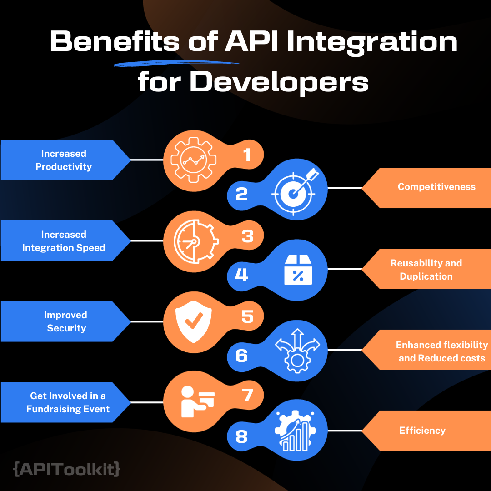

# Key Benefits of API Integration for Developers (with Statistics)

Recently, there have been numerous conversations regarding how important APIs are to improving web-based activity. But there is one thing that we must note, which is [Application programming interfaces (APIs)](https://apitoolkit.io/blog/best-api-monitoring-and-observability-tools/) are the building blocks of modern software development.

Although the developer's perspective has not received much attention, [APIs](https://apitoolkit.io/blog/api-logs-and-metrics/) are incredibly useful to every set of specialists. APIs have been around for a while and have established themselves as crucial technology in different industries. Given that big data is revealing a lot of information and [new technologies are emerging](https://apitoolkit.io/blog/fintech-api/), we can say that APIs are now more important than ever because they allow developers to collaborate with stakeholders to improve agency systems, increasing the possibilities for innovation.

## What Exactly is an API?

An API, or Application Programming Interface, is like for two different software programs to communicate with each other; a translator of some sort that allows the programs to understand each other's language. Google [calls APIs](https://cloud.google.com/blog/products/api-management/7-ideas-for-the-future-of-apis) the "the crown jewel of software development." They make it possible for developers to build more complex and powerful applications by connecting them to other services.

Currently, there are around [24,000 APIs](https://nordicapis.com/20-impressive-api-economy-statistics/) registered on ProgrammableWeb and GitHub holds over [2 million API repositories](https://github.com/search?q=api&type=repositories).

## How Does API Work?

Consider this example: A few years back, if I wanted to order a pizza, I would have to give the dispatcher my address and try to describe where I was in order to get my pizza, but now with the expertise of APIs (e.g. Google Maps API), it's a lot simpler. The Google Maps API is a location-based app installed on billions of devices worldwide to assist businesses with providing better services and establishing more efficient connections with suppliers, clients, delivery services, and other parties. It sends directions and analyzes various types of location data, making life much easier for everyone. This is a typical example of how easy life can become by merely integrating APIs.

Here's another simple example of how an API works:

- You want to use a map service to show directions on your website.
- You find a map service that provides an API.
- You sign up for an account with the map service and get an API key.
- You use the API key to make requests to the map service's servers.
- The map service's servers respond to your requests with directions.
- You display the directions on your website.

In this example, the map service is the "server" and your website is the "client." The API is the "interface" that allows the server and the client to communicate with each other.

APIs can be used to do a variety of things, such as:

- Access data
- Control functionality
- Integrate with other applications
- Automate tasks

Read: [Best API Monitoring and Observability Tools in 2023](https://apitoolkit.io/blog/best-api-monitoring-and-observability-tools/)

## Some Statistics that Support the Benefits of API Integration:

- According to the [Slashdata Developer Economics Survey 19th edition](https://www.developernation.net/resources/reports), nearly 90% of developers are using APIs in some capacity.
- According to a survey by [MuleSoft](https://www.mulesoft.com/press-center/businesses-embracing-cloud-mobile-microservices-iot), 84% of businesses use APIs
- The global API economy is expected to reach $267 billion by 2025.
- Businesses that use APIs are 24% more likely to be profitable than those that don't.
- APIs can help businesses improve customer satisfaction by 20%.
- APIs can help businesses reduce costs by 15%.

## Benefits of API Integration for Developers

Below is a list of the key benefits of API Integration for developers.

- **Increased Productivity**

The digital world moves at lightning speed, making productivity an absolute necessity. APIs, or Application Programming Interfaces, serve as valuable tools in amplifying developers' productivity. They systematically reduce the burden of repetitive tasks by offering pre-configured functions. For example, when you integrate a CRM system with an email tool using an API, you're essentially linking two different software systems to function as one cohesive unit. This minimizes manual interventions, such as data entry or code rewriting, which were previously inevitable. As a result, developers can allocate their time and energy to more complex tasks, enhancing the overall quality and capability of the application.

- **Increased Integration Speed**

Having APIS allows the integration of services and other third parties to which in turn speeds up communication between the business and its customers, promoting automation and scaleability. This is the reason why Jeff Bezos of Amazon, emphasized in a memo to his staff that all services must provide APIs and connect with one another using those APIs. APIs are faster and much more efficient to utilize because they are considerably easier for developers to integrate into their code thanks to a predetermined standard. Even though you'll have to spend a bit more time reading documentation and looking for certain functions, it's a more user-friendly system to integrate into your business and any product you're working on.

With the aid of APIs, content may be simply incorporated from any website or program. This ensures a more fluid distribution of information and a cohesive user experience. With the rise of smartphones and tablets, APIs have a significant edge when it comes to helping businesses connect their services and content into other applications and devices. This implies that your consumer won't need to download any additional apps or programs to access all of your information immediately through an app or website on their phone or tablet. This translates to maximum accessibility for your clients, who will have quick access to all the information they require.

- **Improved Security**

Data security is at the forefront of every developer's mind, especially with the increasing sophistication of cyber threats. APIs address this concern head-on. They act as gatekeepers, meticulously regulating who or what can access specific data or functionalities. Beyond mere access, APIs can also log activities, track user behavior, and flag anomalies. For instance, if a database storing sensitive user information is equipped with an API, any request for data access would first have to be authenticated and authorized by the API, adding a robust layer of protection against unauthorized breaches.

- **Transform Customer Experience**

API integration has made businesses composable by allowing teams across the organization to compose, recompose, and adapt these APIs to meet the changing needs of the business making them discoverable, and then making them available for the business to self-serve. Imagine an importing company creating an internal Customer API that includes details about registered customers, their address, email, purchase history, etc. from various System APIs in front of customer databases; in other words, it creates a single view of customers. This is an example of a customer experience transformation.

One internal API can be used for a variety of purposes and can help the entire organization's business operations run more smoothly. Additionally, businesses can make their APIs available to partners, who can improve them and offer customers a more thorough, omnichannel engagement. Every API that is built continues to add value for future business requirements with API-led connectivity.

- **Competitiveness**

Banks have embraced open banking APIs and standards, while Netflix, Stripe, AWS, and UBER have all been successful that’s why they have put APIs first because they know that having APIs allow them to be competitive. A solid API allows your application and third parties, business partners, and customers to integrate a quick review sys with other system. As a company being able to provide these functionality quickly due to incredibly fast integration of files is quite competitive to me and this can only be achieved with APIs. APIs also speedup the integration between services and they enable you deliver functionality quickly.

- **Reusability and Duplication**

In the development world when you want to duplicate a file, you can either copy and paste, create shared libraries or create API functions. Creating API functions is much easy becasue you can call from any service just by updating one service/deployables when you need to modify logic as long as you are not making a break in change. APIs have become the building blocks which you can reuse in your architecture as a developer enabling quicker innovations and ability to change quickly.

- **Enhanced flexibility and Reduced costs**

Adaptability is the hallmark of successful software. With the ever-evolving technological advancements and user preferences, applications must be malleable. APIs offer this flexibility. They allow developers to seamlessly integrate new features, tools, or platforms. On the financial front, APIs can be a game-changer. By leveraging third-party infrastructures or functionalities through APIs, businesses can avoid the heavy capital expenditure of building these functionalities in-house. This not only speeds up the deployment of new features but also results in significant cost savings.

- **Efficiency**

When access to an API is granted, the content created can be automatically published and accessible across all channels. It makes it easier to share and distribute content because it can be readily embedded into any website or application. This guarantees more fluid information delivery and an integrated user experience. Any tech engineer will know how difficult it can be to work with CMS packages, but APIs offer a much simpler solution. If you desire efficiency, then APIs are the answer.

With an API, a distribution layer for information and services to new audiences can be built, which can then be customized to produce unique user experiences enabling every individual, not just a chosen few, to have access to all of the data produced at the government level. One key benefit of the API is the improved connection and data, which enables you to do more.

Read: [API Monitoring and Documentation: the Truth You Must Know](https://apitoolkit.io/blog/api-documentation-and-observability-the-truth-you-must-know/)

## Conclusion

APIs aren't just tools; they're transformational elements in the digital ecosystem. They holds many benefits to developers and businesses. Their integration amplifies efficiency, innovation, and user satisfaction, making them indispensable for modern developers.

## Keep Reading

- [How to Analyze API Logs and Metrics for Better Performance](https://apitoolkit.io/blog/api-logs-and-metrics/)
- [Incident Management: How to Resolve API Downtime Issues Before It Escalates](https://apitoolkit.io/blog/api-downtime/)
- [How to Generate Automated API Documentation](https://apitoolkit.io/blog/how-to-generate-automated-api-documentation/)
- [Top 7 Reasons Why Your Team Should Use an API Monitoring Tool](https://apitoolkit.io/blog/why-you-need-an-api-monitoring-tool/)
- [How to Tackle Anomalies in RESTful APIs](https://apitoolkit.io/blog/anomalies-in-restful-apis/)
- [How to Write API Documentation: 10 Essential Guidelines](https://apitoolkit.io/blog/how-to-write-api-docs/)
