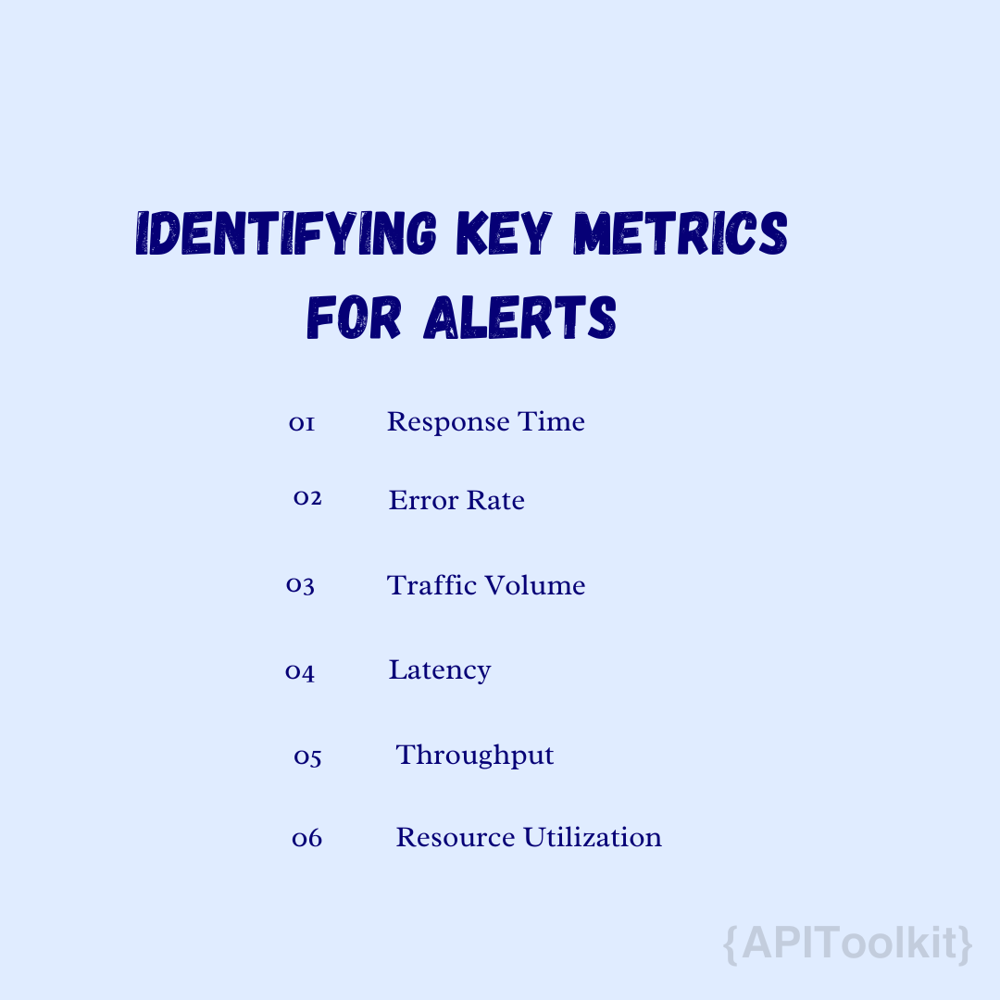
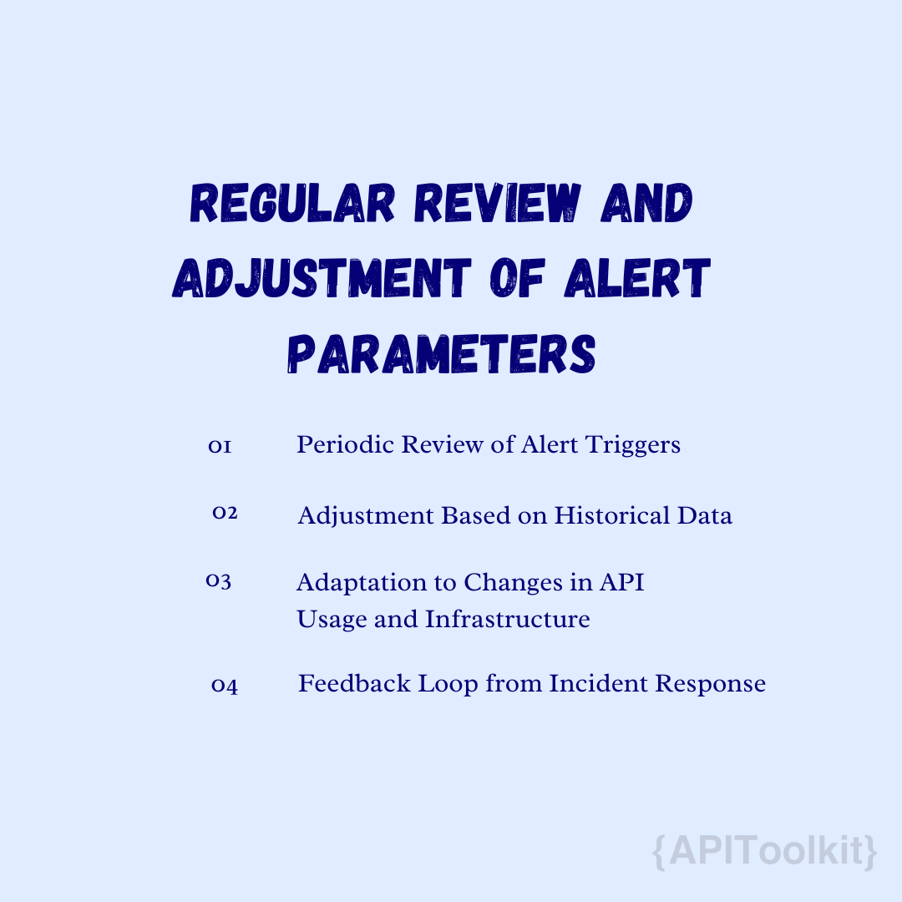

# Best Practices for Implementing Custom Alerts in API Management

[API Management](https://apitoolkit.io/blog/better-uptime-for-api-monitoring-and-incident-management./) is an essential component of contemporary software architecture, it plays an important role in enabling businesses to efficiently create, manage, and scale their APIs. It also involves a comprehensive set of processes, tools, and technologies dedicated to supervising and regulating the activities associated with APIs. The overarching goal of API Management is to ensure that APIs are secure, scalable, and operate at peak performance.

#### Importance of API Management

1. **Security**: One of the critical aspects of API Management is its emphasis on security. With robust security features such as authentication, authorization, threat protection, and encryption, [API Management](https://apitoolkit.io/blog/better-uptime-for-api-monitoring-and-incident-management./) solutions are designed to shield sensitive data and resources from unauthorized access and cyber threats. This protective measure is crucial in maintaining the integrity and confidentiality of the data exchanged through APIs.

2. **Scalability**: Scalability is another cornerstone of effective API [Management](https://apitoolkit.io/blog/better-uptime-for-api-monitoring-and-incident-management./). It enables organizations to effortlessly expand their API infrastructure to accommodate growing demands, ensuring that the performance remains consistent and reliable even as the number of API calls increases. This scalability is vital for businesses looking to grow and adapt in fast-paced markets.

3. **Lifecycle Management**: Lifecycle management is also a significant function of API Management, overseeing APIs from their inception through to their retirement. This comprehensive management ensures that APIs stay relevant, up-to-date, and in alignment with the evolving needs of the business. It facilitates seamless transitions through the various stages of an API's lifecycle, from design and development to deployment and eventual decommissioning.

4. **Analytics and Monitoring**: Analytics and monitoring play a pivotal role in API Management. By tracking API usage, performance metrics, and user behavior, businesses can gain valuable insights into their API ecosystem. This data is instrumental in making informed decisions and optimizing API performance, leading to an enhanced user experience and more effective resource utilization.

## Overview of Custom Alerts

Custom alert is a specialized tool within API Management, designed to notify administrators and developers about specific events or anomalies that occur within the API ecosystem, such as security breaches, performance issues, or quota exceedances. These alerts are highly customizable, allowing organizations to set specific thresholds, conditions, and metrics that align with their operational needs. This level of customizability ensures that the alerts are both relevant and actionable. Custom alerts are tailored to the unique needs of an organization, providing:

- **Proactive Monitoring**: This enable organizations to proactively monitor their APIs for any issues that might arise, such as performance bottlenecks, security vulnerabilities, or functional anomalies. This early detection allows for timely interventions, preventing minor issues from escalating into more significant problems.
- **Operational Efficiency**: By automating the detection and notification process, custom alerts help streamline the management of APIs. This automation reduces the need for constant manual [monitoring](https://apitoolkit.io/blog/error-monitoring-for-developer/), freeing up valuable resources and allowing teams to focus on more strategic tasks.
- **Enhanced Security**: Custom alerts can be specifically tailored to identify security threats, such as unauthorized access attempts or unusual activity patterns, ensuring that potential breaches are flagged and addressed promptly.
- **Improved Reliability**: By keeping tabs on the performance and functionality of APIs, custom alerts contribute to the overall reliability of the API ecosystem. They help ensure that APIs remain available and performant, aligning with the expectations of end-users and business requirements.

## Types of Alerts in API Management

The versatility of custom alerts in API management allows for a broad spectrum of applications, catering to various [monitoring](https://apitoolkit.io/blog/error-monitoring-for-developer/) and notification needs. Some of the key types of alerts include:

- **Performance Alerts**: These alerts are triggered by performance-related metrics, such as response times, latency, or throughput. They help identify when an API is not performing within the expected parameters, potentially impacting the user experience.

- **Security Alerts**: Security-focused alerts notify administrators of potential security issues, such as repeated failed authentication attempts, unusual spikes in traffic that could indicate a DDoS attack, or deviations from normal access patterns.

- **Quota and Usage Alerts**: These alerts monitor the usage levels of APIs, including the number of requests made within a given time-frame. They are crucial for identifying when an API is nearing or has exceeded its usage limits or quotas, which could necessitate scaling or rate-limiting measures.

- **Functional Alerts**: Triggered by errors or anomalies in the API's functionality, these alerts can indicate when an API is not behaving as expected, signaling potential issues in the API's implementation or integration with other services.

- **System Health Alerts**: Focused on the underlying infrastructure, system health alerts provide notifications related to server health, resource utilization (CPU, memory usage), and other system-level indicators that could affect API performance.

Designing effective custom alerts in API management involves a strategic approach to selecting the right metrics and setting appropriate thresholds and conditions. This process is crucial for ensuring that alerts are meaningful, actionable, and contribute to the overall health and performance of the API ecosystem.

## Identifying Key Metrics for Alerts

The first step in crafting effective custom alerts is to identify the key metrics that are most indicative of the [API's performance](https://apitoolkit.io/blog/web-api-performance/), security, and functionality. These metrics serve as the foundation for triggering alerts and should be carefully selected based on the specific needs and goals of the API management strategy. Consider the following metrics:

- **Response Time**: This [metric](https://apitoolkit.io/blog/the-most-important-metric/) measures how long it takes for an API to respond to a request. It's a critical indicator of the [API's performance](https://apitoolkit.io/blog/mastering-monitoring/) and can highlight issues with backend services or network latency.

- **Error Rate**: The frequency of failed API requests, indicated by HTTP error codes (e.g., 4xx and 5xx responses), can signal problems with the API's functionality, integration issues, or backend service failures.

- **Traffic Volume**: Monitoring the number of API calls over time can help identify trends, spikes, or drops in usage, which could indicate [performance](https://apitoolkit.io/blog/mastering-monitoring/) issues, popularity changes, or potential security threats.

- **Latency**: Similar to response time, latency measures delays in processing API requests and can affect the user experience. High latency might indicate network issues or inefficiencies in data processing.

- **Throughput**: This metric refers to the number of successful API requests processed within a given timeframe, providing insights into the API's capacity and efficiency.

- **Resource Utilization**: Monitoring CPU, memory, and bandwidth usage can help identify potential bottlenecks or capacity issues that might impact API performance.

## Setting Thresholds and Conditions

Once the [key metrics](https://apitoolkit.io/blog/the-most-important-metric/) have been identified, the next step is to establish thresholds and conditions that will trigger the alerts. This requires a nuanced understanding of the API's normal operating parameters and the potential impact of deviations. Consider the following when setting thresholds and conditions:

- **Baseline Understanding**: Establish a baseline for normal [metric](https://apitoolkit.io/blog/the-most-important-metric/) values based on historical data. This baseline will inform the thresholds for triggering alerts, ensuring they are realistic and relevant.

- **Dynamic Thresholds**: In dynamic environments, static thresholds might not be sufficient. Consider implementing dynamic thresholds that can adjust based on historical trends, time of day, or other contextual factors.

- **Severity Levels**: Differentiate alerts by severity based on the potential impact on the API and the business. For example, a slight increase in response time might warrant a low-priority alert, while a significant spike in error rates could trigger a high-priority alert.

- **Context-Specific Conditions**: Set conditions that take into account the context of the API usage, such as specific endpoints, user groups, or transaction types. This ensures that alerts are relevant and targeted.

- **Alert Fatigue Mitigation**: Be mindful of the volume and frequency of alerts to avoid overwhelming teams. Fine-tune thresholds and conditions to minimize false positives and ensure that only meaningful alerts are generated.

Integrating custom alerts into your API management strategy involves a multifaceted approach that ensures alerts are not only generated but also effectively communicated and actioned upon. This involves incorporating alerts into API management platforms and utilizing webhooks and external tools for a comprehensive monitoring and response system.

## Incorporating Alerts into API Management Platforms

API management platforms often come with built-in capabilities for [monitoring](https://apitoolkit.io/blog/api-error-monitoring/) and alerting. Leveraging these features effectively requires:

1. **Configuration of Alert Rules**: Most platforms allow you to configure custom alert rules based on specific metrics, thresholds, and conditions. This involves specifying which events or anomalies should trigger an alert and defining the criteria for these triggers.

2. **Integration with Monitoring Tools**: Many API management solutions offer integrations with popular monitoring tools. Ensure that your platform is connected with these tools to extend its monitoring capabilities and leverage advanced analytics and alerting features.

3. **Custom Scripting and Plugins**: Some platforms may support custom scripting or plugins that enable more sophisticated alerting logic. This can be useful for complex scenarios that require alerts based on combinations of metrics or non-standard thresholds.

4. **Utilization of Dashboard and Reporting Features**: Use the platform's dashboard and reporting features to visualize alert data and trends. This can help in quickly identifying issues and understanding their impact.

## Utilizing Webhooks and External Tools

For more advanced or customized alerting needs, integrating webhooks and external tools can provide additional flexibility and functionality:

1. **Webhooks for Real-Time Notifications**: Configure webhooks to send real-time alerts to external systems or applications. This can trigger automated workflows, such as scaling operations, or send notifications to communication channels like Slack or email.

2. **Integration with External Monitoring Services**: Services like [APIToolkit](https://apitoolkit.io/), Datadog, or Prometheus can offer more detailed monitoring and sophisticated alerting mechanisms. Integrate these services to gain deeper insights into your API's performance and security posture.

3. **Automated Incident Management**: Tools like [APIToolkit](https://apitoolkit.io/)can be integrated via webhooks to automate the incident management process. This ensures that alerts are promptly routed to the right team members and tracked through resolution.

4. **Custom Alert Handlers**: Develop custom applications or microservices that can consume webhook payloads and perform specific actions, such as logging alerts for analysis, executing recovery procedures, or aggregating alerts for reporting.

5. **Cloud Function Integration**: Leverage cloud functions (e.g., AWS Lambda, Azure Functions) to process alerts and execute automated tasks without the need for a dedicated infrastructure. This can include tasks like auto-remediation, alert aggregation, or dynamic resource allocation.

Effective monitoring and maintenance of custom alerts in API management are essential to ensure that your alerting system remains accurate, relevant, and effective over time. This involves regular review and adjustment of alert parameters, as well as adherence to best practices in alert management.

## Regular Review and Adjustment of Alert Parameters

To keep your alerting system aligned with the evolving API landscape and organizational needs, regular reviews and adjustments are necessary:

1. **Periodic Review of Alert Triggers**: Schedule regular audits of alert triggers to ensure they are still relevant. This involves evaluating if the [metrics](https://apitoolkit.io/blog/the-key-metrics/), thresholds, and conditions used to trigger alerts accurately reflect current operational realities and risks.

2. **Adjustment Based on Historical Data**: Use historical alert data to identify patterns, recurring issues, or thresholds that may be too sensitive or not sensitive enough. Adjusting these parameters can help reduce false positives and ensure critical issues are not missed.

3. **Adaptation to Changes in API Usage and Infrastructure**: As your API ecosystem grows and evolves, update your alerting parameters to reflect new APIs, deprecated features, or changes in usage patterns. This ensures that alerts remain meaningful and actionable.

4. **Feedback Loop from Incident Response**: Incorporate feedback from teams who respond to alerts into the review process. Their insights can provide valuable context for refining alert logic and prioritization.

## Best Practices for Alert Management

Implementing best practices in alert management can significantly enhance the effectiveness of your alerting strategy:

1. **Prioritize Alerts**: Not all alerts are created equal. Prioritize them based on their potential impact on the business and users. This helps ensure that critical issues are addressed promptly, while less urgent ones are managed accordingly.

2. **Clear and Actionable Alerts**: Ensure that alerts provide clear information on the nature of the issue and suggested actions or next steps. This reduces the time needed to understand and respond to alerts.

3. **Avoid Alert Fatigue**: Be mindful of the volume of alerts generated. Too many alerts can desensitize teams to notifications, leading to slower response times or missed critical alerts. Regularly refine alert thresholds to maintain a balance.

4. **Automate Responses Where Possible**: For known issues or routine tasks triggered by alerts, automate the response actions. This can include scaling resources, restarting services, or running diagnostic scripts.

5. **Document Alert Responses**: Maintain a knowledge base of alerts and their resolution procedures. This can help speed up response times and ensure consistency in handling recurring issues.

6. **Regular Training and Drills**: Conduct regular training sessions and simulation drills for teams responsible for responding to alerts. This ensures they are familiar with the alerting tools and response procedures.

7. **Continuous Improvement**: Treat your alerting system as a dynamic component of your API management strategy. Continuously seek to improve its accuracy, relevance, and effectiveness through regular reviews, updates, and incorporating new technologies or methodologies.

## Conclusion

In conclusion, implementing and maintaining an effective custom alert system within API management is crucial for the health and performance of your API ecosystem. By designing thoughtful alerts based on key metrics, integrating them seamlessly with your API management platforms and external tools, and committing to ongoing monitoring and maintenance, you can ensure that your APIs remain reliable, secure, and efficient.

Regular reviews and adjustments of alert parameters, guided by best practices in alert management, are essential to keep pace with the dynamic nature of API ecosystems and the evolving needs of your organization. Prioritizing alerts, ensuring they are clear and actionable, avoiding alert fatigue, automating responses, and fostering a culture of continuous improvement are all critical components of a successful alert management strategy.

Implementing custom alerts is key to a strong API management system, ensuring security and efficiency. APIToolkit's new custom alert feature offers enhanced monitoring and proactive management. Get started with [APIToolkit](https://apitoolkit.io/) to improve your API infrastructure and user experience.

## Keep Reading

[How to Generate Automated API Documentation](https://apitoolkit.io/blog/how-to-generate-automated-api-documentation/)

[APIToolkit: Top Atatus Alternative for API Monitoring](https://apitoolkit.io/blog/apitoolkit-top-atatus-alternative/)

[API Documentation vs Specification: What It Means for You](https://apitoolkit.io/blog/api-documentation-vs-api-specification/)

[How to Analyze API Logs and Metrics for Better Performance (Ultimate Guide)](https://apitoolkit.io/blog/api-logs-and-metrics/)

[How to Tackle Anomalies in RESTful APIs (the Right Way)](https://apitoolkit.io/blog/anomalies-in-restful-apis/)
