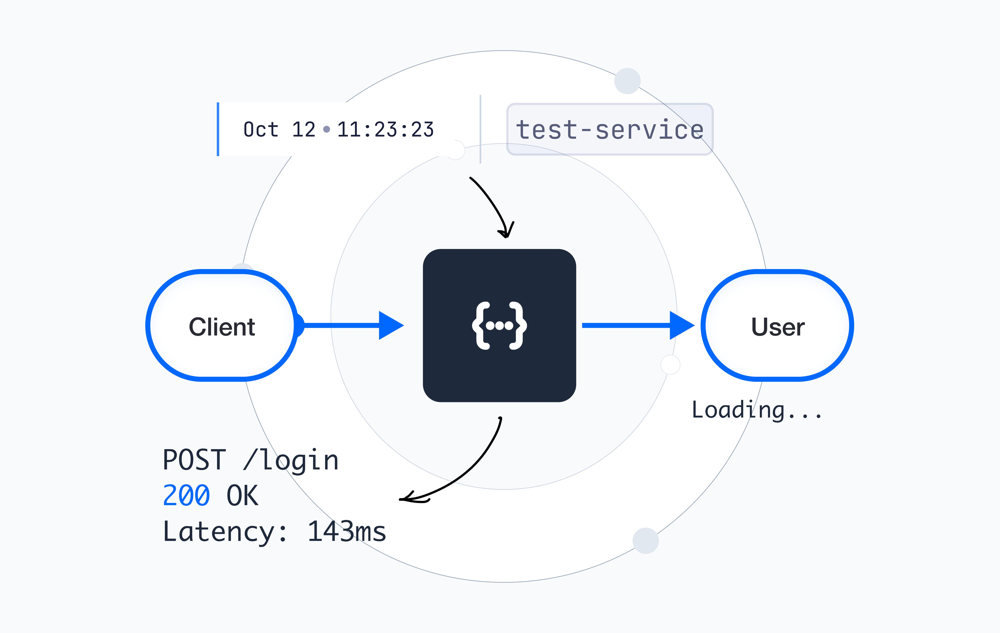
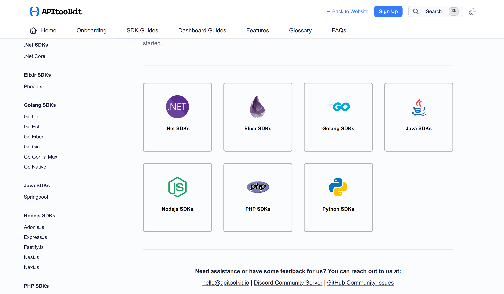
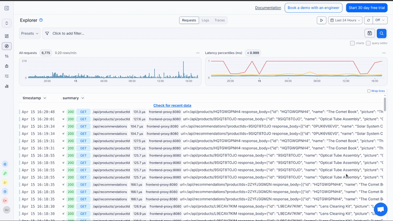
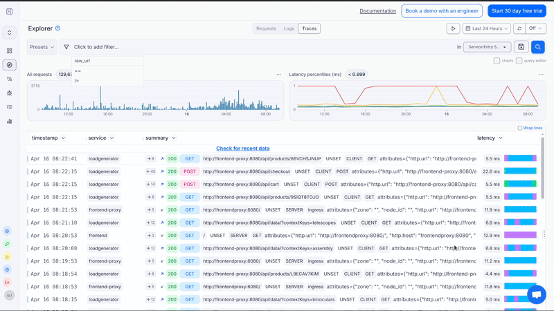

# API Traces: How APItoolkit Captures and Displays Them.

Have you ever launched an API that performed perfectly during development but experienced delays or unexpected behavior in the production environment? You're not the only one facing this challenge. Identifying and resolving issues in live APIs, particularly in a microservices setup, can be a complex task. This is where tracing becomes curcial.

Fortunately, you don't need to invest significant time setting up intricate tools. This guide will demonstrate how to track API requests using APItoolkit, allowing you to visualize your requests' actions and identify areas of concern.

## API Traces

In software engineering, tracing is the method of capturing and logging details about a system(mobile application, website or computer software e.t.c). This process involves documenting information related to how a program runs and operates. 

Some of these information include: 

- Timestamps showing when events occurred
- The sequence of components or functions that were called
- Input and output parameters at each step
- Errors
- Performance metrics like execution time

## Why Traces matter

### Debugging
Debugging benefits greatly from the use of traces, which offer a detailed overview of how a system operates. These traces record the entire journey through an application, preserving essential information about data conditions, the order of operations, and external factors that may contribute to system failures. This thorough record eliminates the need for guesswork and significantly accelerates the process of identifying root causes. As a result, engineers can quickly locate problems that might otherwise remain undetected in complex systems.

### Performance Monitoring
Traces give us a unique way to see how systems work and perform. They show exactly where time is used during operations, helping us find slow spots in our code, databases, or outside services. This complete view reveals inefficient patterns like too many API calls or problems with resource use. This helps us clearly see what needs to be improved and helps us use resources better.

### System Reliability
Traces play a key role in keeping systems running smoothly. They act as tools to find problems and help plan for the future. These traces can spot early signs of issues before users face any downtime. They also show how different parts of a system depend on each other, which helps prevent problems from spreading. By giving a full picture of the system, traces allow teams to build stronger systems, check if backup plans work, and make smart choices about how much capacity they need. Traces turn complex system behaviors into clear, useful information. This helps tech teams create systems that are more stable, work better, and are more reliable.

## OpenTelemetry And APIToolkit

To successfully implement tracing into our APIs, we need to first understand Opentelemetry and how it works with APItoolkit to enable us in visualizing traces.

OpenTelemetry comprises a set of tools, SDKs, and APIs. It is designed to enable the instrumentation, creation, gathering, and exportation of telemetry data, including metrics, logs, and traces. This data is crucial for analyzing the performance and behavior of your software applications.

Unlike traditional OpenTelemetry setups, APItoolkit eliminates the need for manual management of collectors, exporters, and visualization. Once the middleware and API key are added, APItoolkit:

- Exports traces using the OTLP protocol
- Securely transmits data to its hosted platform
- Provides visualization, analysis, and alerts for trace data

This approach streamlines the process of implementing OpenTelemetry, making it more accessible and efficient for users.

## Implementing Tracing in your APIs
- Create an [APItookit](https://apitoolkit.io/) account.

- Install APItoolkit [SDK](https://apitoolkit.io/docs/sdks/) to your project. APItoolkit has over 17 SDKs for different frameworks. Install the relevant [SDK](https://apitoolkit.io/docs/sdks/) for your project and follow the documentation to set it up.
.

- Visualize Traces on APItoolkit Dashboard

Once you have connected APItoolkit to your project and monitoring is enabled, we can now visualize all traces. Head over to your APItoolkit dashboard, navigate the explorer tab on the sidebar then click on traces.

Here, you can see every single traces in your application.

APItoolkit also shows you the entire lifecycle of every single request. Cool right? Let me show you. 

Click the plus (+) sign on the summary of any request. The dropdown shows you the request lifecycle.

You can even click on each request to see the traces' spans. This contains details like latency, request body, headers e.t.c. 

## Conclusion

Implementing tracing doesn't need to be complex. APItoolkit simplifies the process, providing more than just data collection. It offers clear, practical insights into API behavior in real-world scenarios. This visibility into every request is extremely essential when resolving elusive bugs, enhancing performance, or maintaining system stability.

Interested in testing it out? Visit apitoolkit.io to create a free account and begin monitoring with assurance.

**Keep Reading**

[Best API Monitoring and Observability Tools in 2023](https://apitoolkit.io/blog/best-api-monitoring-and-observability-tools/)

[Ultimate Guide to API Testing Automation](https://apitoolkit.io/blog/api-testing-automation/) 

[API Monitoring and Documentation: The Truth You Must Know](https://apitoolkit.io/blog/api-documentation-and-observability-the-truth-you-must-know/)

[10 Must-Know API Trends in 2023](https://apitoolkit.io/blog/api-trends/)

[Mastering API Debugging and Monitoring: Best Practices for Seamless Integration](https://apitoolkit.io/blog/mastering-api-debugging/)
