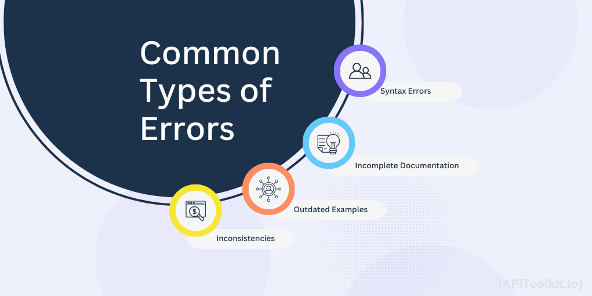
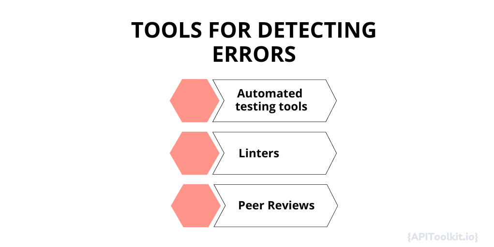

# Detecting API Documentation Errors: What You Should Know

In a collaborative project, everyone needs clear instructions to work together effectively. APIs play the role of the organizer, ensuring that different software components understand their tasks and collaborate smoothly. Just as detailed instructions guide team members in a project, comprehensive [API documentation](https://apitoolkit.io/blog/how-to-generate-automated-api-documentation/) provides developers with the information they need to understand how to interact with the API correctly. Without this guidance, developers may feel lost, like team members without clear instructions on what to do next.

API documentation is like the essential link between [developers](https://apitoolkit.io/blog/api-trends/) and the [API](https://apitoolkit.io/blog/api-trends/) itself. It should be clear, concise, and cover everything developers need to know to use the API effectively. This includes details on how to navigate its features, employ its capabilities, and understand its responses. It serves various purposes:

1. **Onboarding**: For new developers, comprehensive [API documentation](https://apitoolkit.io/blog/how-to-generate-automated-api-documentation/) can significantly reduce the learning curve, enabling them to integrate the API into their projects more quickly.
2. **Troubleshooting**: When problems occur, developers rely on API documentation for solutions. Clear error codes and troubleshooting steps can save hours of debugging.
3. **Scalability**: As projects grow, they become more complex. Good API documentation ensures developers can adapt and scale their applications without having to reverse-engineer the API.

## The Cost of Errors in API Documentation

Accurate API documentation is crucial in the tech industry, yet errors in documentation can have significant consequences. The first set of challenges primarily affects developers like you and I and, by extension, the companies they work for. When documentation is inaccurate or incomplete, developers can find themselves wasting valuable time trying to troubleshoot issues, understand unclear instructions, or fill in the gaps with educated guesses. This frustration can reach a tipping point, leading them to abandon the API in question and seek alternatives, thereby affecting customer retention rates for the [API provider](https://apitoolkit.io/blog/api-trends/). The ripple effect of poor documentation also extends to customer support departments. A higher volume of support tickets is almost a guaranteed outcome when developers struggle to find the information they need. This not only increases operational costs but also places additional burdens on already stretched support teams, potentially affecting their performance and job satisfaction.

The second set of challenges revolves around unreliable documentation which can damage a company's reputation and legal standing. [Developers](https://apitoolkit.io/blog/api-trends/) are less likely to use or recommend an API with inconsistent documentation, affecting adoption rates and market share. Inconsistent or incorrect documentation can also lead to delays in project timelines, which is particularly detrimental in industries where rapid development and deployment are crucial. These delays can result in financial penalties, lost opportunities, and can even jeopardize entire projects. In the most extreme cases, inaccurate documentation can expose companies to legal risks. For instance, if the documentation's inaccuracies lead to financial losses or data breaches for end-users, the [API provider](https://apitoolkit.io/blog/api-trends/) could face lawsuits, regulatory fines, or both, further damaging its reputation and financial standing.

## Common API Documentation Errors

API documentation demands meticulous attention to detail, as even minor errors can cause significant problems. Here are some typical errors to watch out for:

### Syntax Errors

These are straightforward to spot but can be highly damaging if overlooked. Examples include:

- Misspelled Keywords: A single typo can render a code snippet useless.
- Incorrect Function Calls: Mistakes here can confuse developers.
- Wrong Formatting: Poorly structured code examples make understanding difficult.

### Incomplete Documentation

Gaps in documentation force developers to guess or experiment, wasting time and risking errors. Issues include:

- Missing Parameters: Essential details omitted from the [documentation](https://apitoolkit.io/blog/how-to-generate-automated-api-documentation/).
- Undocumented Error Codes: Developers left in the dark when things go wrong.
- Lack of Examples: Real-world instances provide crucial context.

### Outdated Examples

As APIs evolve, outdated examples can lead to errors. Problems often include:

- Deprecated Functions: Using outdated features leads to unexpected behavior.
- Changed Data Models: Updates aren't reflected in examples, causing confusion.
- Version Mismatches: Compatibility issues arise when examples lack version specifications.

### Inconsistencies

Inconsistent documentation breeds confusion and false assumptions. Examples include:

- Terminology: Different terms for the same concept create confusion.
- Formatting: Varying styles disrupt the flow of documentation.
- Sequence of Information: Logical flow is disrupted when topics aren't connected.

Addressing these errors is vital for maintaining the usefulness of API documentation and avoiding the costs discussed earlier. Rectifying them should be a priority for anyone responsible for API documentation upkeep.

## Tools for Detecting Errors

Ensuring the accuracy and reliability of API documentation is an ongoing task. Luckily, there are several tools and methods available to help pinpoint and fix errors. Here are some of the most effective:

### Automated Testing Tools

These tools are invaluable for maintaining top-notch API documentation. They automatically verify code snippets, parameter types, and response formats against the actual API. Popular options include APIToolkit, Postman, and Swagger Inspector. Benefits include:

- Continuous Validation: Tests can run regularly to keep documentation in sync with the API.
- Time-Saving: Automated tests cover a wide range of scenarios quickly, freeing up human resources.
- Consistency: They ensure documentation remains consistent as the API evolves.

### Linters

Linters are static analysis tools that check documentation syntax and structure. While they might not catch every issue, they're great for spotting syntax errors and formatting problems. Benefits include:

- Immediate Feedback: Linters offer real-time feedback, helping catch errors early.
- Custom Rules: Many allow for custom rule sets to enforce specific guidelines.
- Ease of Use: They're generally easy to set up and use, even for non-technical users.

### Peer Reviews

Human judgment is invaluable for certain tasks. Peer reviews involve having other developers or writers check documentation for clarity, accuracy, and completeness. Advantages include:

- Contextual Understanding: Humans grasp the API's context, identifying gaps or ambiguities.
- Quality Assurance: Reviews catch subtle errors or inconsistencies that automated tools might miss.
- Collaborative Improvement: The process educates the team on best practices and enhances documentation quality.

## Best Practices for Error-Free Documentation

Maintaining an error-free API documentation is not a one-time effort but an ongoing process. Implementing [best practices](<(https://apitoolkit.io/blog/how-to-generate-automated-api-documentation/)>) can go a long way in ensuring that your documentation remains accurate, up-to-date, and user-friendly.

- Version control systems can be a game-changer when it comes to managing API documentation. For instance, they track every change made to the documentation, making it easier to pinpoint when and where errors were introduced. They also facilitate collaboration by allowing multiple contributors to work on the documentation simultaneously, with built-in features to manage and merge changes effectively. If an error does slip through, the ability to roll back to a previous version of the documentation is invaluable. Moreover, version control systems enable branching, which allows for the documentation of different API versions in separate branches. This ensures that users always have access to the documentation that matches the API version they are using.
- Regular updates are another cornerstone of high-quality [API documentation](https://apitoolkit.io/blog/how-to-generate-automated-api-documentation/). As APIs evolve, their documentation must keep pace. Timely updates should reflect new features, deprecations, and other changes to the API as soon as they are rolled out. These regular updates also provide an opportunity for periodic reviews, serving as a checkpoint to catch any errors or omissions. Furthermore, an actively updated documentation signals to users that the API is well-maintained, boosting their confidence and engagement with the platform.

- User feedback loops offer an often-overlooked yet invaluable avenue for improving API documentation. There are various ways to harness this resource. Embedding surveys and feedback forms directly into the documentation can make it incredibly easy for users to report errors or suggest improvements. Community forums can serve as a vibrant platform for users to ask questions, share experiences, and even offer solutions, providing invaluable insights into what might be missing or unclear in the documentation. Analytics tools can monitor how users interact with the documentation, offering clues about which sections might be confusing or prone to errors. Sometimes, the most immediate and actionable feedback comes from direct lines of communication, such as an email address or chat support.

## Call to Action for Developers and Technical Writers

The responsibility for maintaining accurate and reliable API documentation is a shared one, which falls on both developers and technical writers. Here's what you can do:

Developers: Invest time in learning and using automated testing tools that can validate your [API documentation](https://apitoolkit.io/blog/how-to-generate-automated-api-documentation/) like [APIToolkit](https://apitoolkit.io/). Your expertise in the API's functionality is invaluable for creating accurate examples and troubleshooting guides.

Technical Writers: Focus on clarity, completeness, and consistency. Your skills in conveying complex technical information in an accessible manner are crucial for the documentation's effectiveness.

Both: Engage in regular peer reviews and update cycles, and always be open to feedback from the user community. Remember, the goal is not just to document the API but to create a valuable resource that enhances user experience and fosters trust. By taking these steps, we can collectively contribute to a more reliable, user-friendly, and error-free API documentation landscape, benefiting not just individual projects but the broader developer ecosystem.

## Conclusion

API documentation acts as the vital link between the [API](https://apitoolkit.io/blog/how-to-generate-automated-api-documentation/) and its users, facilitating effective communication and interaction. However, errors in documentation can lead to developer frustration, increased support costs, project delays, and legal risks. By understanding common errors such as syntax mistakes, incomplete information, outdated examples, and inconsistencies, we can take proactive measures to prevent them. Using tools like automated testing, linters, and peer reviews, and adopting best practices like version control, regular updates, and user feedback loops, significantly improves the quality of API documentation.

## Keep Reading

[Web API Performance Best Practices: the Ultimate Guide](https://apitoolkit.io/blog/web-api-performance/)

[10 Must-Know API trends in 2023](https://apitoolkit.io/blog/api-trends/)

[How to Analyze API Logs and Metrics for Better Performance](https://apitoolkit.io/blog/api-logs-and-metrics/)

[Incident Management: How to Resolve API Downtime Issues Before It Escalates](https://apitoolkit.io/blog/api-downtime/)

[How to Tackle Anomalies in RESTful APIs](https://apitoolkit.io/blog/anomalies-in-restful-apis/)

[Top 7 Reasons Why Your Team Should Use an API Monitoring Tool](https://apitoolkit.io/blog/why-you-need-an-api-monitoring-tool/)

[Top 8 API Documentation Tools for Developers (2024)](https://apitoolkit.io/blog/top-8-api-documentation-tools-for-developers/)

[API Documentation Trends to Watch: What's New and Exciting](https://apitoolkit.io/blog/api-documentation-trends-to-watch/)
