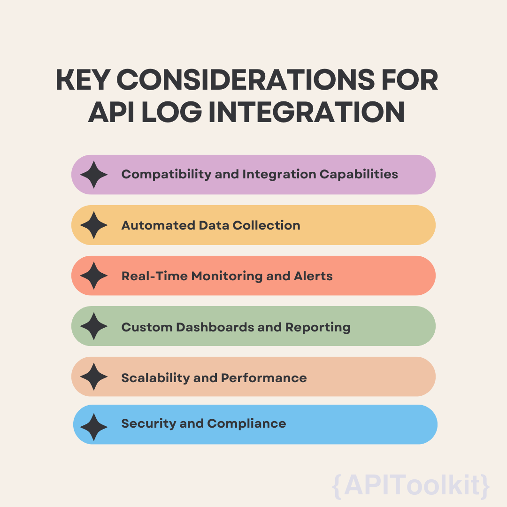

The rapid advancement of technology has transformed the way customers engage with products and services, raising their expectations for speed, convenience, and personalization. The customer journey is now deeply intertwined with digital interactions, making every online touchpoint crucial. Recognizing this shift, businesses are increasingly utilizing technology not just to meet, but to surpass customer expectations. They understand that delivering a positive customer experience is key to boosting engagement, fostering loyalty, and driving business growth. This new paradigm emphasizes the importance of crafting seamless and responsive digital experiences as a cornerstone of modern business strategy.

Application Programming Interfaces (APIs) have emerged as a key technological enabler in this context. [APIs](https://apitoolkit.io/blog/api-logs-in-cybersecurity/) serve as the building blocks of modern software development, allowing different systems and applications to communicate and share data seamlessly. This interconnectivity is crucial for creating integrated and fluid digital experiences for customers.

For instance, APIs enable real-time data synchronization across platforms, ensuring that customers receive up-to-date information regardless of the channel they use. They also allow for the personalization of customer experiences by providing access to relevant user data that can be used to tailor services and recommendations. Furthermore, [APIs](https://apitoolkit.io/blog/api-logs-in-cybersecurity/) can facilitate smoother transactions, efficient service delivery, and the introduction of innovative features that enhance the overall customer experience. By leveraging the power of APIs, businesses can create more responsive, intuitive, and user-friendly digital environments. This not only satisfies the immediate needs of customers but also builds a foundation for long-term customer relationships anchored in trust and satisfaction.

## Understanding API Logs

[API logs](https://apitoolkit.io/blog/api-log-explorer/) are detailed records of all the interactions that occur between various software components through Application Programming Interfaces (APIs). Whenever an API is used - whether it's to fetch data, execute a function, or initiate a communication between different software services - an entry is logged. These logs typically include information such as the time of the request, the nature of the request, the identity of the requester, the response sent by the API, and any errors or exceptions that occurred during the process.

The data captured in [API logs](https://apitoolkit.io/blog/api-log-explorer/) can be quite granular, offering insights into every aspect of the API's performance and usage. This includes metrics like response times, error rates, and the frequency of calls to each endpoint. By recording this information, API logs serve as a comprehensive chronicle of the API's operational history.

## Importance of API Log Analysis

API log analysis is a powerful tool for enhancing system reliability, user satisfaction, and operational efficiency. In the next sections, we'll explore key metrics to monitor in [API logs](https://apitoolkit.io/blog/api-logs-in-cybersecurity/) and how they can be leveraged to improve customer experiences. Analyzing API logs is crucial for several reasons:

1. **Performance Monitoring**: API logs allow developers and system administrators to monitor the performance of their APIs in real-time. They can identify slow or failing endpoints, understand peak usage times, and take proactive measures to address any issues.

2. **Error Detection and Resolution**: By examining [error logs](https://apitoolkit.io/blog/api-logs-and-metrics/), teams can quickly pinpoint and troubleshoot issues, minimizing downtime and ensuring a seamless experience for end-users.

3. **Security and Compliance**: API logs are vital for tracking unauthorized access attempts and potential security breaches. They can also be instrumental in maintaining compliance with data protection regulations by logging access and modifications to sensitive data.

4. **Understanding User Behavior**: Analyzing how and when users interact with APIs can provide valuable insights into customer behavior and preferences. This information can be used to optimize the user experience, develop new features, and make data-driven decisions about the product or service.

5. **Resource Optimization**: By studying API usage patterns, organizations can optimize their resources, scaling infrastructure up or down based on actual demand, thus improving efficiency and reducing costs.

## Key Metrics to Monitor in API Logs

By closely monitoring these [key metrics](https://apitoolkit.io/blog/api-logs-and-metrics/), organizations can not only maintain a high-performing and secure API environment but also use these insights to enhance the overall customer experience. Here are key metrics to to monitor API logs:

1. **Response Times**: One of the most critical metrics to monitor in API logs is the response time. It measures how long it takes for an API to respond to a request. Longer response times can lead to a poor user experience, as users are generally expecting quick interactions. Monitoring response times helps in identifying performance bottlenecks and areas that need optimization for faster data processing.

2. **Error Rates**: This metric refers to the frequency of failed API calls. High error rates can indicate underlying issues with the API such as bugs, system overload, or compatibility problems. Tracking error rates is essential for maintaining the reliability and stability of the API, which directly impacts user satisfaction.

3. **Traffic Volume**: Analyzing the volume of traffic - the number of requests an API receives over a certain period - can provide insights into user engagement and system demands. It helps in understanding peak usage times and planning for scaling the infrastructure accordingly.

4. **User Behavior**: Monitoring how users interact with the API, including which endpoints are most frequently accessed and the typical user journey, can reveal valuable insights. This information can be used to improve the API's design and functionality, tailoring it more closely to user needs.

5. **Unauthorized Access Attempts**: Keeping track of unauthorized attempts to access the API is crucial for security. This includes monitoring for unusual patterns that might indicate a breach attempt, such as a sudden spike in requests from an unknown source.

6. **Data Access and Modifications**: For compliance with data protection regulations like GDPR or HIPAA, it's important to log who accesses what data and when. This ensures that there is an audit trail that can be reviewed in case of any compliance issues.

7. **Compliance with Standards**: Ensuring that the API adheres to relevant industry standards and protocols is vital. This includes protocols for data encryption, authentication, and authorization.

## Using API Log Insights to Improve Customer Experience

API logs are instrumental in the early detection and resolution of issues, safeguarding the end-user experience. Continuously monitoring these logs helps in quickly spotting anomalies, like spikes in error rates or irregular response times. This proactive stance facilitates rapid resolution, curtailing the risk of extended service interruptions. Moreover, when an issue does occur, detailed API logs become a valuable asset for root cause analysis. They enable pinpointing the exact problem area, whether it's within the API or due to external factors like network issues or third-party services.

The analysis of [API logs](https://apitoolkit.io/blog/api-log-explorer/) offers a window into user preferences and behaviors. This insight is crucial for customizing the user experience. For instance, the frequency of access to certain endpoints can reveal which features or services are most popular, guiding enhancements or improvements in less popular areas. Furthermore, API logs serve as a basis for dynamic content delivery and personalized recommendations. By understanding how users interact with the system, it can dynamically adapt, providing content that is relevant and tailored to individual preferences.

Optimizing API performance and scalability is another critical area where API log insights prove invaluable. By examining metrics like response times and error rates, organizations can fine-tune their APIs, targeting slow or inefficient endpoints for improvement. This ensures a smoother, faster user experience. Additionally, analyzing traffic patterns aids in scalability planning. Understanding peak usage times and traffic flows is essential for effective resource allocation, ensuring APIs can manage high loads seamlessly. This extends to load balancing and distribution as well; using log data to optimally distribute workload across servers and infrastructure helps prevent bottlenecks and maintains consistent performance.

The strategic use of API log insights is key to maintaining a robust, high-performing API infrastructure while simultaneously enhancing the customer experience. By focusing on quick issue resolution, personalizing user interactions, and continually optimizing performance, businesses can significantly boost customer satisfaction and loyalty, which are fundamental to success in today's digital-driven marketplace.

## Tools and Technologies for API Log Analysiss

1. **APIToolkit*https://apitoolkit.io/*: APIToolkit excels in API log analysis with its strong capabilities in real-time monitoring and logging. This tool empowers both developers and businesses to track API performance effectively, analyze traffic patterns, and quickly detect and resolve issues. Its intuitive interface eases the complexity of log analysis, and the detailed analytics it offers deliver profound insights into API usage and performance. The adaptability of [APIToolkit](https://apitoolkit.io/) renders it appropriate for various scales of operation, ranging from small startups to major corporations, providing users with a comprehensive view of their API environment.

2. **ELK Stack (Elasticsearch, Logstash, Kibana)**: The ELK Stack is a widely used suite of tools for searching, analyzing, and visualizing log data in real time. Elasticsearch acts as a search and analytics engine, Logstash is used for [log](https://apitoolkit.io/blog/api-log-explorer/) data processing and ingestion, and Kibana provides visualization capabilities. Together, they offer a powerful solution for managing and understanding large volumes of API log data.

3. **Splunk**: Splunk specializes in processing and analyzing massive volumes of data, particularly excelling in turning machine-generated data into actionable insights. Its powerful search and reporting features allow users to delve deep into their log data, uncovering trends and patterns that can inform business decisions. Splunk's scalability and flexibility make it a favored tool in sectors that require rigorous log analysis, including finance, healthcare, and e-commerce.

4. **Datadog**: Datadog is a cloud-based monitoring and analytics platform designed for large-scale applications. It provides comprehensive real-time visibility into [API performance](https://apitoolkit.io/blog/web-api-performance/), along with detailed analytics for effective troubleshooting. Its strengths lie in its ability to aggregate data from various sources and present it in an easily digestible format, helping teams quickly understand and respond to issues. Datadog also offers extensive integration options, making it a versatile tool for diverse IT environments.

5. **Prometheus and Grafana**: They are often used together, Prometheus and Grafana offer a formidable solution for monitoring and visualizing [API performance](https://apitoolkit.io/blog/web-api-performance/). Prometheus is an open-source monitoring system with a powerful query language, Prometheus is adept at collecting and storing time-series data. It is particularly well-suited for monitoring dynamic, container-based environments like Kubernetes. Grafana provides advanced visualization features. Its dashboards and graphs help users interpret and analyze data collected by Prometheus, making it easier to monitor and understand API performance metrics.

## Key Considerations for API Log Integration

Integrating API log analysis tools with existing systems is crucial for effective monitoring and management. Carefully selecting and integrating the right tools, businesses can effectively analyze API logs, gain valuable insights, and make informed decisions to enhance customer experience and operational efficiency. Here are key considerations for integration:

1. **Compatibility and Integration Capabilities**: Ensure that the chosen log analysis tool is compatible with your existing technology stack and can seamlessly integrate with other systems, such as databases, cloud services, and application servers.

2. **Automated Data Collection**: Automating the collection of log data reduces manual effort and the potential for errors. Most advanced tools provide agents or plugins for this purpose.

3. **Real-Time Monitoring and Alerts**: Integration should allow for real-time monitoring of API logs. This enables immediate detection and alerting on issues, ensuring prompt response.

4. **Custom Dashboards and Reporting**: The ability to create custom dashboards and reports is vital. Integrated tools should allow for the customization of data visualization to meet specific needs and preferences.

5. **Scalability and Performance**: The integrated system should be scalable and performant, capable of handling large volumes of data without significant latency or downtime.

6. **Security and Compliance**: Ensure that the integration adheres to security protocols and compliance requirements, particularly when handling sensitive data.

## Addressing Challenges in API Log Analysis

Sensitive data in API logs poses significant privacy concerns, necessitating secure storage and strict access control. Compliance with data protection regulations like [GDPR](https://gdpr-info.eu/) and [HIPAA](https://www.cdc.gov/phlp/publications/topic/hipaa.html#:~:text=The%20Health%20Insurance%20Portability%20and,the%20patient's%20consent%20or%20knowledge.) requires implementing measures for data anonymization and proper handling of user data. Ensuring the security of log data against unauthorized access and breaches, with encryption in transit and at rest, is crucial.

The sheer volume of log data from APIs presents storage challenges, calling for efficient and cost-effective solutions. Establishing appropriate data retention policies is key, considering operational and compliance needs. Balancing detailed logging with system performance is vital, as large volumes of log data can impact system efficiency.

Dealing with data overload and noise requires effective filtering and prioritization to extract valuable insights. Analyzing API logs involves correlating data from various sources, demanding advanced analytical tools and techniques. A balance between real-time monitoring and historical analysis is necessary, as each serves different purposes. Specialized skills and resources are essential for effective API log analysis, highlighting the need for organizations to have the right expertise and tools.

Overall, addressing these challenges is crucial for leveraging API log analysis in enhancing customer experience, involving a strategic blend of technology, policies, and expertise to navigate the complexities of data privacy, management, and analysis.

## Future Trends in API Log Analysis and Customer Experience

1. **Advanced AI and Machine Learning**: The integration of AI and machine learning in API log analysis is on the rise. These technologies enable more sophisticated pattern recognition, anomaly detection, and predictive insights, enhancing the capacity to preemptively address issues and optimize user experiences.

2. **Automation and Orchestration**: There's a growing trend towards the automation of log analysis processes, reducing the need for manual intervention and speeding up response times. Orchestration tools are being developed to facilitate more complex, automated workflows in response to log data.

3. **Edge Computing**: As computing moves closer to the data source, edge computing is expected to play a significant role in API log analysis. This will enable faster processing and response times, especially crucial for time-sensitive applications.

4. **Predictive Issue Resolution**: Using predictive analytics, organizations can anticipate and mitigate issues before they impact the user experience. Machine learning models can analyze historical log data to predict future patterns and potential system failures.

5. **Personalized User Experiences**: Machine learning algorithms can analyze API usage patterns to personalize [user experiences](https://apitoolkit.io/blog/usercentric-api-documentation/) at an individual level, offering recommendations and content tailored to user preferences and behavior.

6. **Real-Time Customer Insights**: The future of customer experience management lies in real-time analytics. Organizations will increasingly use API log data to gain instant insights into customer behavior and preferences, allowing for dynamic adjustments in service delivery.

7. **Increased Integration and Interconnectivity**: As APIs become more integral to digital infrastructure, there will be a greater emphasis on integrating log analysis tools with other business intelligence and customer experience platforms. This integration will provide a more holistic view of the customer journey.

## Conclusion

API log analysis has become an indispensable tool in enhancing customer experience. By providing detailed insights into [API performance](https://apitoolkit.io/blog/api-security/), [user behavior](https://apitoolkit.io/blog/usercentric-api-documentation/), and system health, it enables organizations to proactively manage their digital services. The ability to quickly identify and resolve issues, personalize experiences, and optimize [performance](https://apitoolkit.io/blog/the-most-important-metric/) has a profound impact on customer satisfaction and loyalty.

Organizations should invest in advanced log analysis tools that provide real-time monitoring, predictive analytics, and AI capabilities, while also focusing on [data](https://apitoolkit.io/blog/anomalies-and-data-validation/) privacy and security, crucial as reliance on API logs increases. Embracing emerging technologies such as AI, machine learning, and edge computing is essential for effective API log analysis. The landscape of API log analysis and [customer](https://apitoolkit.io/blog/usercentric-api-documentation/) experience is continuously evolving, necessitating a mindset of continuous improvement and adaptability to new trends and technologies. By adopting these strategies, businesses can fully leverage [API log](https://apitoolkit.io/blog/the-most-important-metric/) analysis to enhance customer experience and achieve business success.

## Keep Reading

[Ultimate Guide to API Testing Automation](https://apitoolkit.io/blog/api-testing-automation/)
[Top 7 Reasons Why Your Team Should Use an API Monitoring Tool](https://apitoolkit.io/blog/why-you-need-an-api-monitoring-tool/)
[Web API Performance Best Practices - the Ultimate Guide](https://apitoolkit.io/blog/web-api-performance/)
[Incident Management: How to Resolve API Downtime Issues Before It Escalates](https://apitoolkit.io/blog/api-downtime/)
[How to Tackle Anomalies in RESTful APIs](https://apitoolkit.io/blog/anomalies-in-restful-apis/)
