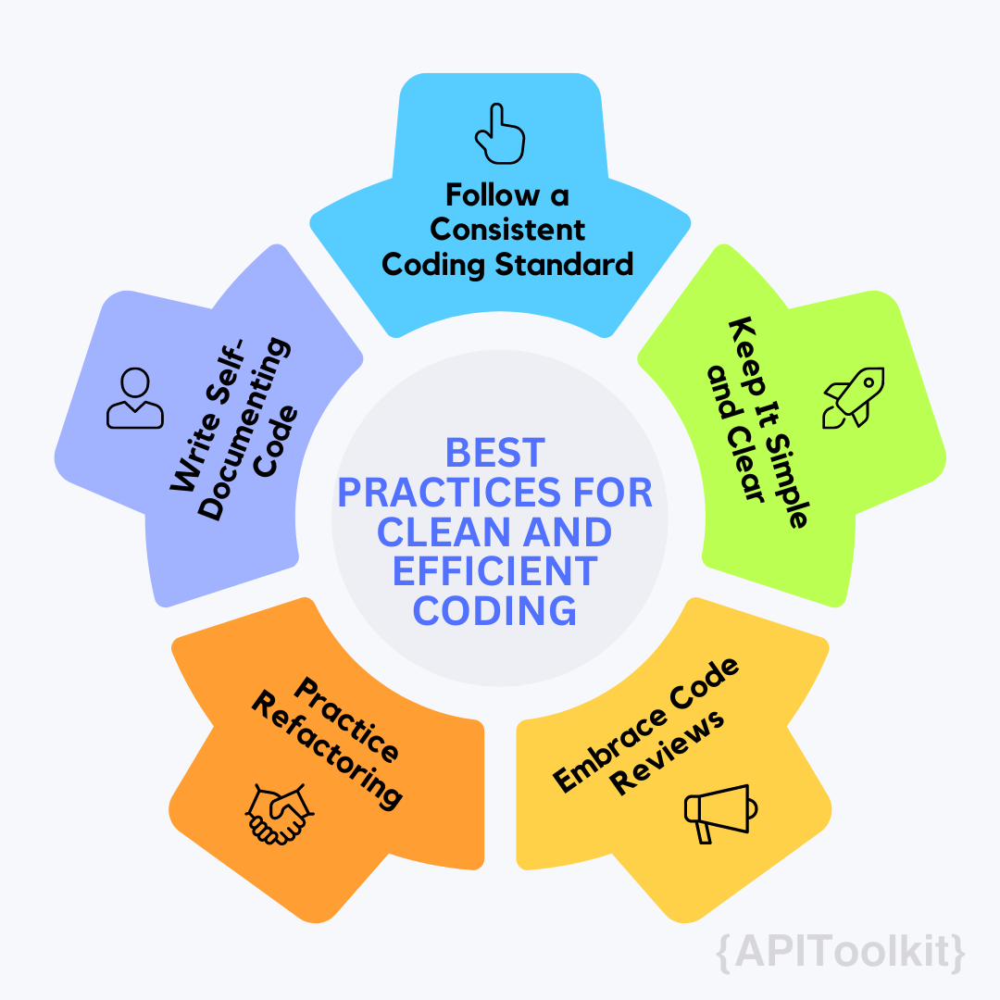

# Error Monitoring for Developers: How to Write Better Code and Improve Your Debugging Skills

Have you ever wondered what keeps software running smoothly? Error monitoring is the guardian angel that ensures the code we write not only works but serves its purpose. Think about this: [a report by the Consortium for IT Software Quality (CISQ) highlighted that in 2018, poor software quality led to a whopping $2.84 trillion in operational software failures.](https://www.it-cisq.org/wp-content/uploads/sites/6/2023/09/The-Cost-of-Poor-Quality-Software-in-the-US-2018-Report.pdf) That's a huge number, right? It clearly shouts the importance of having a strong error monitoring system in place.

But error monitoring is much more than a bug catcher. It's about being proactive, not just reactive. It's about not only finding the sneaky bugs but also understanding them, tracking their every move, and fixing them before they can do any real damage. Imagine a world where even a tiny glitch in your app can cause a ripple effect, leading to not just financial loss but also denting your reputation. That's where error [monitoring](https://apitoolkit.io/blog/best-api-monitoring-and-observability-tools/) becomes your best friend in the tech world.

IBM's System Sciences Institute dropped another truth bomb: fixing a bug after your product hits the market can cost up to 100 times more than catching it early on in the design phase. So, let's delve deep on this journey where we unpack the layers of error monitoring and understand why it's such a big deal in [software development](https://apitoolkit.io/blog/api-observability-software-development-/) today.

### The Importance of Effective Error Monitoring

The significance of effective error monitoring can't be overstated. In a fast-paced and ever-evolving tech world like ours, the cost of unmonitored errors can be high. They can lead to system downtimes, security breaches, loss of data, a damaged reputation and a whole lot more to not just individuals but businesses.

Effective error monitoring empowers developers with several advantages like:

- **Enhanced Application Quality:** Regular monitoring and fixing of errors mean fewer bugs in the released version of the application.
- **Improved User Experience:** A stable application translates to a better user experience, increasing user retention and satisfaction.
- **Increased Developer Productivity:** With systematic error tracking, [developers](https://apitoolkit.io/blog/the-key-metrics/) spend less time firefighting and more time on innovative features.
- **Informed Decision-Making:** Error monitoring tools provide valuable data that can guide future development decisions, optimizing both code and resources.

## Writing Better Code

In the journey of a [developer](https://apitoolkit.io/blog/the-key-metrics/), writing better code is a continuous pursuit. It goes beyond making the code work; it's about making it efficient, readable, and maintainable. Let's explore some best practices and tools to achieve these goals.

### Best Practices for Clean and Efficient Coding

**1. Follow a Consistent Coding Standard:** Adhering to a consistent coding style enhances readability and makes it easier for others to understand your code. Whether it's indentation, naming conventions, or file structure, consistency is key.

**2. Keep It Simple and Clear:** Avoid overcomplicating your code. Use simple solutions and clear logic. Complex code can lead to more errors and make debugging harder.

**3. Write Self-Documenting Code:** Aim to write code that is self-explanatory. Good naming conventions for variables, functions, and classes can act as documentation and reduce the need for external comments.

**4. Practice Refactoring:** Regularly review and refactor your code. This means improving the internal structure without altering its external behavior. Refactoring helps in keeping the code efficient and manageable.

**5. Embrace Code Reviews:** Peer reviews are essential. They not only help catch errors but also provide an opportunity for learning and improving coding practices.

### Tools and Techniques to Enhance Code Quality

**1. Version Control Systems (like Git):** Version control is crucial for tracking changes, collaborating with others, and maintaining the history of your project. It allows for better organization and error tracking.

**2. Integrated Development Environments (IDEs):** Modern IDEs, like Visual Studio Code or IntelliJ IDEA, come with features like syntax highlighting, code completion, and debugging tools that significantly enhance coding efficiency.

**3. Static Code Analysis Tools:** Tools like SonarQube or ESLint analyze your code for potential errors and code smells without executing it. They are excellent for maintaining code quality.

**4. Automated Testing:** Implement unit tests, integration tests, and functional tests. Tools like JUnit for Java or Jest for JavaScript help ensure that your code works as expected and makes future changes safer.

**5. Continuous Integration/Continuous Deployment (CI/CD):** CI/CD pipelines automate the testing and deployment of your code. This encourages frequent code integration and reduces the chances of integration issues.

### Practical Steps to Implement These Techniques

- **Start Small:** Incorporate one or two practices or tools at a time. Gradually build your workflow around them.
- **Learn and Adapt:** Be open to learning new practices and tools. Technology evolves, and so should your coding practices.
- **Seek Feedback:** Engage with the community or your peers for feedback on your code. Open source contributions can be a great way to learn and improve.

## Common Coding Errors and How to Avoid Them

In the coding world, errors are often seen as stepping stones to mastery. However, recognizing common pitfalls and understanding how to avoid them can significantly enhance a [developer's](https://apitoolkit.io/blog/the-key-metrics/) efficiency and the quality of their code.

### Typical Pitfalls in Programming and Prevention Strategies

**1. Off-by-One Errors:** A classic error in loop iterations or array indexing, where the loop runs one time too many or too few. **Prevention:** Always double-check loop conditions and array indices. Consider edge cases in your tests.

**2. Null Reference Errors:** Attempting to use an object reference that has not been initialized. **Prevention:** Implement checks for null or undefined values before using an object. Use defensive programming to avoid null references.

**3. Memory Leaks:** Unintentionally retaining memory that is no longer needed, leading to reduced [performance](https://apitoolkit.io/blog/api-logs-and-metrics/) and crashes. **Prevention:** Regularly review and clean up your code. In languages like JavaScript, be mindful of closures and detached DOM elements.

**4. Concurrency Issues:** Problems arise when multiple threads or processes access shared data simultaneously. **Prevention:** Use synchronization mechanisms like locks, semaphores, or concurrency-safe structures.

**5. Security Vulnerabilities:** Simple mistakes like not sanitizing user input can lead to significant security breaches. **Prevention:** Always validate and sanitize user input. Stay updated with best security practices.

## Advanced Debugging Techniques

Debugging is an art as much as a science, requiring patience, insight, and the right techniques. As code becomes more complex, advanced debugging strategies become indispensable. Let's delve into mastering debugging tools and environments, and strategies for tackling complex code.

### Mastering Debugging Tools and Environments

**1. Integrated Development Environment (IDE) Debugging Features:** Modern IDEs offer a suite of debugging tools. Learn to use breakpoints, step-through execution, watch windows, and call stacks. Each of these features offers a different lens through which to inspect and understand code behavior.

**2. Logging and Diagnostic Tools:** Proficient use of logging can transform the debugging process. Tools like Log4j for Java or Winston for Node.js allow for detailed logging at different levels of severity, which can be pivotal in diagnosing issues.

**3. Memory and Performance Profiling:** Tools like Valgrind for memory leak detection or the Chrome DevTools for web [performance](https://apitoolkit.io/blog/api-logs-and-metrics/) provide insights into the resource usage of your code, helping to pinpoint inefficiencies and leaks.

**4. Network Monitoring Tools:** For applications that communicate over a network, tools like Wireshark or Fiddler can debug network traffic, helping to identify issues in data transmission or API calls.

### Debugging Strategies for Complex Code

**1. Divide and Conquer:** Break down the problem. Isolate the section of code where the issue manifests. This approach makes it easier to focus on the root cause.

**2. Reproduce the Bug Consistently:** Ensure that you can consistently reproduce the bug. This consistency is vital for verifying that the bug has been effectively fixed.

**3. Understand the Code's History:** Utilize version control history to understand when the issue was introduced and what changes might have led to the bug.

**4. Pair Programming:** Two sets of eyes can be better than one. Sometimes explaining the problem to another developer can help clarify the issue and lead to solutions.

**5. Hypothesize and Experiment:** Develop hypotheses based on your understanding of the code and test them. Keep an open mind to all possible sources of the issue.

**6. Utilize Rubber Duck Debugging:** Explaining your code to an inanimate object (like a rubber duck) forces you to express your thoughts clearly, often leading to insights.

By mastering these tools and strategies, developers can significantly enhance their ability to debug complex code efficiently. Remember, debugging is not just about fixing bugs; it's about understanding how your code behaves and why.

## Collaborative Error Resolution

The complexity of modern [software development](https://apitoolkit.io/blog/api-observability-software-development-/) often requires a collaborative approach to error resolution. Leveraging the collective expertise of a team can lead to more efficient problem-solving and innovative solutions.

### Team Approach to Troubleshooting and Problem Solving

**1. Pair Programming:** Two developers work together at one workstation. This approach allows for immediate feedback, knowledge sharing, and faster identification of issues.

**2. Code Reviews:** Regular code reviews are not just for catching errors but also for sharing knowledge and best practices among team members.

**3. Blameless Postmortems:** After resolving an issue, conducting a blameless postmortem helps in understanding what went wrong and how similar issues can be prevented in the future.

**4. Cross-Functional Teams:** Involving members from different disciplines (like development, QA, and operations) can provide diverse perspectives and lead to more comprehensive solutions.

### Using Version Control for Error Tracking

**1. Commit History Analysis:** Delving into the commit history can help identify when a bug was introduced and the changes that caused it.

**2. Branching Strategies:** Using feature branches or bug-fix branches in version control systems like Git allows for isolated development and testing, minimizing the impact on the main codebase.

**3. Merge Requests and Pull Requests:** These are not just for code merging but also for discussing proposed changes and identifying potential issues before they make it into the main branch.

### Enhancing Skills Through Continuous Learning

**1. Staying Updated with Latest Programming Trends:**
   - **Engage with Online Communities:** Platforms like Stack Overflow, GitHub, or Reddit can be great for staying informed about the latest trends and best practices.
   - **Follow Influential Tech Blogs and Podcasts:** Tech blogs and podcasts are valuable resources for keeping up-to-date with industry news and insights.

**2. Resources for Ongoing Developer Education:**
   - **Online Courses and Webinars:** Websites like Coursera, Udemy, or Pluralsight offer courses on the latest technologies and programming techniques.
   - **Conferences and Workshops:** Attending industry conferences, either in-person or virtually, can provide valuable learning opportunities and networking.

**3. Practice and Experimentation:**
   - **Side Projects and Hackathons:** Engaging in personal projects or participating in hackathons can help apply new skills in a practical context.

## Preventative Measures in Coding

To ensure the creation of reliable and error-free software, adopting preventative measures in coding is essential. Let's explore proactive strategies to minimize error occurrence and the integration of testing and reviews in the development cycle.

### Proactive Strategies to Reduce Error Occurrence

**1. Adherence to Coding Standards:** Consistently following established coding standards and conventions reduces errors and improves code readability and maintainability.

**2. Code Linting and Formatting:** Utilizing tools like ESLint for JavaScript or Prettier for code formatting can automatically detect and fix syntax and styling issues, preventing potential errors.

**3. Use of Strongly Typed Languages:** Languages like TypeScript or Kotlin, which extend JavaScript and Java respectively, provide a type system that can catch a lot of errors at compile-time.

**4. Defensive Programming:** Anticipate possible errors or misuse of your code and write code to handle these situations gracefully.

**5. Regular Code Refactoring:** Continuously improving the structure and readability of code without changing its behavior can prevent the buildup of technical debt and associated bugs.

### Incorporating Testing and Reviews in Development Cycle

**1. Comprehensive Testing:** Implement a mix of testing methodologies:
   - **Unit Testing:** Tests individual units or components of the software.
   - **Integration Testing:** Tests the interactions between integrated units or components.
   - **System Testing:** Tests the complete and integrated software.

**2. Test-Driven Development (TDD):** Writing tests before writing the actual code can ensure each feature is working correctly as it's developed.

**3. Continuous Integration and Testing:** Automated testing in a CI/CD pipeline ensures that new code is tested as soon as it's integrated, catching issues early.

**4. Peer Code Reviews:** Regular code reviews by peers encourage knowledge sharing, identify potential issues, and ensure adherence to best practices.

**5. Documentation and Knowledge Sharing:** Maintaining clear documentation and encouraging open communication within the team help in understanding and maintaining the codebase, reducing errors due to misunderstandings or lack of knowledge.

Implementing these preventative measures and testing strategies helps in creating a robust and error-resistant codebase, ultimately leading to software that is reliable and maintainable.

## Error Monitoring in Different Coding Environments

Effective error monitoring is crucial in diverse coding environments. Adapting these techniques to various programming languages and development contexts is key to maintaining robust and reliable software.

### Adapting Error Monitoring Techniques for Various Languages

**1. Java:** Utilize tools like JUnit for unit testing, and log4j for logging. Java's strong type system and JVM monitoring tools can be leveraged for error detection and performance monitoring.

**2. JavaScript (Web Development):** Tools like Mocha for testing and ESLint for linting are essential. For frontend error tracking, Sentry and LogRocket provide valuable insights.

**3. Python:** Use Pytest for testing and Pylint for code analysis. Python's simplicity and readability make it crucial to follow best practices for error handling.

**4. C/C++:** Given their complexity and performance-oriented nature, using Valgrind for memory leak detection and GDB for debugging is essential. Static analyzers like Cppcheck can also be invaluable.

**5. Mobile Development (Swift for iOS, Kotlin for Android):**
   - **Swift:** Leverage XCTest for unit testing and SwiftLint for linting. Tools like Crashlytics provide real-time crash reporting.
   - **Kotlin:** Use JUnit for testing and Detekt for static code analysis. Crashlytics also supports Android for crash reporting.

## Advanced Error Monitoring Tools

Utilizing advanced [error monitoring](https://apitoolkit.io/blog/apitoolkit-top-atatus-alternative/) tools is crucial for maintaining the health and performance of applications. Let’s explore some of the cutting-edge tools in this domain and discuss customizing these tools for specific development needs.

### Overview of Cutting-Edge Tools in Error Monitoring

**1. APIToolkit:** This tool specializes in monitoring APIs. [APIToolkit](https://apitoolkit.io/) helps tracks API requests and responses, identifying failures or performance issues. It’s particularly useful for applications heavily reliant on API interactions.

**2. Sentry:** An open-source tool that helps detect, monitor, and fix crashes in real-time. Sentry is versatile, supporting multiple programming languages and platforms.

**3. New Relic:** Offers full-stack observability, combining error tracking with performance monitoring. It provides insights into how application performance impacts user experience.

**4. Datadog:** A monitoring service for cloud-scale applications, providing observability of servers, databases, and tools through its SaaS-based data analytics platform.

**5. Rollbar:** Ideal for real-time error monitoring and debugging. It supports multiple languages and integrates easily with existing development workflows.

### Customizing Tools for Specific Development Needs

**1. Configuration for Language and Framework:** Most tools support configuration settings tailored for specific languages and frameworks which is usually found in their documentation. For instance, setting up [APIToolkit](https://apitoolkit.io) to work with a React application involves different configurations than for a Node.js application.

**2. Integration with Development Workflow:** Tools like Jira or Slack can be integrated with these monitoring tools for better team collaboration and quicker response times.

**3. Setting Custom Alerts and Thresholds:** Customize alerting rules based on the severity of errors or [performance](https://apitoolkit.io/blog/api-logs-and-metrics/) thresholds. This ensures that teams are notified of critical issues that need immediate attention.

**4. Custom Dashboards and Reporting:** Tools like APIToolkit and New Relic allow the creation of custom dashboards to visualize data that is most relevant to your team.

**5. API Monitoring for Microservices:** For applications built using a microservices architecture, [APIToolkit](https://apitoolkit.io/) can be configured to monitor the health and performance of individual services.

## Conclusion

In conclusion, embracing a culture of continuous learning, adapting to evolving technologies, and collaborative problem-solving are key to staying ahead in the dynamic field of [software development](https://apitoolkit.io/blog/api-observability-software-development-/). As we have explored, the effective use of error monitoring and debugging tools, combined with proactive coding strategies and ongoing education, are essential for developing robust and efficient software solutions.

The journey towards writing better code and improving debugging skills is ongoing. It requires commitment, adaptability, and a deep understanding of the tools and practices that drive software excellence. By continuously refining these skills and embracing the latest advancements in technology, developers and teams can not only anticipate and address challenges but also innovate and lead in the creation of groundbreaking software solutions.

## Keep Reading

[APIToolkit: Top Atatus Alternative for API Monitoring](https://apitoolkit.io/blog/apitoolkit-top-atatus-alternative/)

[API Documentation vs Specification: What It Means for You](https://apitoolkit.io/blog/api-documentation-vs-api-specification/)

[How to Write API Documentation: 10 Essential Guidelines](https://apitoolkit.io/blog/how-to-write-api-docs/)

[Web API Performance Best Practices - the Ultimate Guide](https://apitoolkit.io/blog/web-api-performance/)

[Ultimate Guide to API Testing Automation](https://apitoolkit.io/blog/api-testing-automation/)
