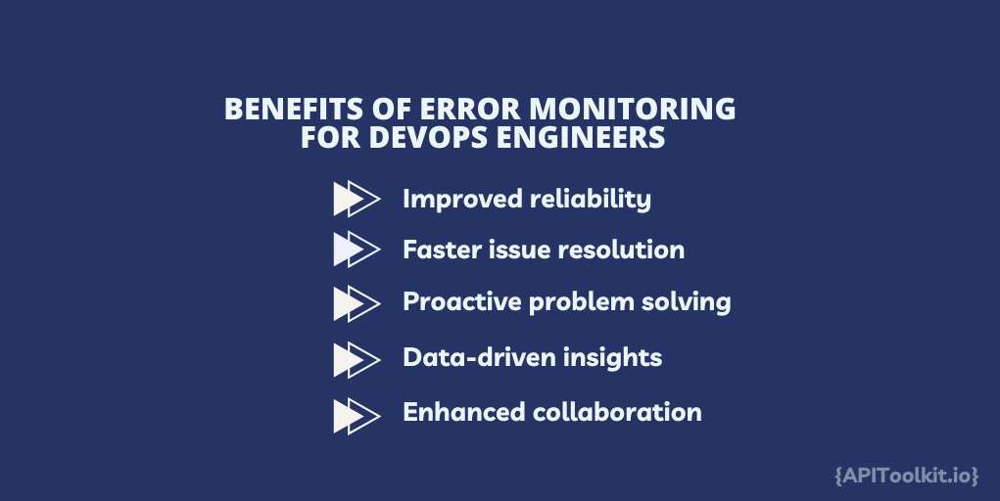

# Error Monitoring for DevOps Teams: How to Integrate Error Monitoring into Your DevOps Workflow

A recent study reveals a remarkable shift in the software development landscape: 85% of technology organizations are actively adopting DevOps practices. This transition marks a significant evolution in the collaboration between development and operations teams. DevOps transcends traditional practice boundaries, fostering a culture that seamlessly blends the efforts of developers and operations staff to heighten the speed, efficiency, and quality of software deployment.

The integration of DevOps is essential because it breaks down long-standing silos, enabling continuous development, integration, and deployment, crucial for quickly adapting to market shifts and customer demands. Yet, this fast-paced approach introduces its own set of challenges, especially in maintaining software quality. Here, the role of error monitoring becomes vital.

[Error monitoring](https://apitoolkit.io/blog/error-monitoring-tools-for-small-businesses-under-budget/) in the DevOps context involves proactively detecting, logging, and analyzing software errors. It acts as an early warning system, empowering teams to tackle issues before they escalate. Integrating error monitoring into DevOps workflows allows for swift identification and resolution of problems, often preempting any impact on the end-user. This proactive stance not only bolsters the quality of software but also resonates deeply with the ethos of continuous improvement inherent in DevOps.

As we proceed, we'll dive deep into the nitty-gritty of how DevOps teams can effectively weave error monitoring into their workflows. We'll explore the challenges they might face and the best practices to navigate these waters, ensuring that the pursuit of speed does not compromise software reliability and performance.

## Error Monitoring for DevOps Engineer

Error monitoring is an essential component in the toolkit of modern software development, particularly within DevOps practices. Error monitoring involves the continuous tracking, logging, and analysis of errors and anomalies that occur in software applications. This process is crucial for maintaining the health and performance of applications in real-time. The role of error monitoring in identifying and resolving software issues cannot be overstated. When an error occurs, the [monitoring](https://apitoolkit.io/blog/error-monitoring-best-practices/) system immediately captures it, often with detailed information such as the time of the error, the environment in which it occurred, and the stack trace. This information is invaluable for developers and operations teams in pinpointing the root cause of the issue. Without such detailed insights, diagnosing problems would be like finding a needle in a haystack, especially in complex and large-scale applications.

Error monitoring tools not only detect issues but also categorize and prioritize them based on severity and impact. This enables teams to address the most critical issues first, ensuring that resources are allocated effectively. Moreover, these tools can be integrated with other DevOps tools, such as continuous integration and deployment pipelines, to automate parts of the error resolution process. For instance, an [error monitoring](https://apitoolkit.io/blog/how-to-implement-error-monitoring-in-golang/) tool can trigger an alert or even initiate a rollback when a critical error is detected post-deployment.

For DevOps Engineers, the benefits of error monitoring are numerous. Here are a few key ones:

1. **Improved Reliability:** By continuously monitoring for and addressing errors, teams can significantly reduce application downtime and ensure a more reliable service. This reliability is crucial for maintaining user trust and satisfaction.

2. **Faster Issue Resolution:** [Error monitoring](https://apitoolkit.io/blog/how-to-implement-error-monitoring-in-golang/) tools provide detailed information about errors, which accelerates the debugging process. Rapid resolution of issues is essential in a DevOps environment, where the goal is to maintain high velocity in software releases.

3. **Proactive Problem Solving:** Rather than reacting to issues after they have caused significant impact, teams can identify and resolve problems proactively. This approach not only improves the quality of the software but also reduces the cost and effort associated with long-term bug fixes.

4. **Data-Driven Insights:** Over time, error monitoring provides valuable data that can be analyzed to identify patterns and recurring issues. This insight allows teams to make informed decisions about where to focus their development and improvement efforts.

5. **Enhanced Collaboration:** Error monitoring tools often come with features that facilitate collaboration, such as commenting and issue tracking. This encourages a more collaborative approach to problem-solving, which is at the heart of DevOps.

[Error monitoring](https://apitoolkit.io/blog/how-to-implement-error-monitoring-in-golang/) is a powerful practice that bolsters the DevOps philosophy of continuous improvement and rapid delivery. By integrating error monitoring into their workflows, DevOps teams can ensure that their applications are not only delivered quickly but also meet the highest standards of quality and reliability.

## Challenges in Error Monitoring within DevOps

While error monitoring is undeniably beneficial, its integration within DevOps practices comes with its challenges. DevOps teams often face several hurdles when implementing and maintaining effective error monitoring systems. These challenges can significantly impact software development and deployment if not addressed properly.

1. **Volume of Data**: One of the primary challenges is the sheer volume of data generated by modern applications, especially in a microservices architecture. Filtering through this massive amount of data to identify relevant errors can be like looking for a needle in a haystack. Without effective error monitoring tools and strategies, critical issues might be lost in the noise, leading to significant problems down the line.

2. **Complexity of Modern Applications**: Today's applications are more complex than ever, often spread across multiple services and environments. This complexity makes tracking and diagnosing errors more difficult. A lack of effective error monitoring can lead to prolonged downtime as teams struggle to pinpoint the source of a problem across the intricate web of services.

3. **Integration with Existing Tools and Processes**: Integrating [error monitoring](https://apitoolkit.io/blog/application-errors-a-guide-to-error-monitoring/) tools into existing DevOps pipelines and practices can be challenging. Teams need to ensure that these tools work seamlessly with their current setup, including CI/CD tools, project management software, and communication platforms. Ineffective integration can lead to gaps in monitoring and delayed responses to issues.

4. **Real-time Monitoring and Response**: The fast-paced nature of DevOps demands real-time error monitoring and rapid response. Without an effective system in place, there can be a lag in detecting and responding to issues, which contradicts the DevOps goal of quick turnaround times. This delay can lead to extended outages and a negative impact on user experience.

5. **Skillset and Training**: Implementing and maintaining an effective error monitoring system requires specific skills and knowledge. Teams may face a learning curve and need additional training, which can be a challenge, particularly for organizations just transitioning to DevOps practices.

6. **Balancing Proactive and Reactive Approaches**: Striking the right balance between proactively preventing errors and reactively addressing them when they occur is a significant challenge. Without effective error monitoring, teams may find themselves constantly in a reactive mode, dealing with one crisis after another, rather than proactively improving their systems.

7. **Cost and Resource Allocation**: Implementing robust error monitoring solutions can be resource-intensive, both in terms of time and money. Teams must justify the cost against the benefits, which can be challenging, especially for smaller organizations or teams with limited budgets.

The impact of these challenges on software development and deployment can be considerable. Without effective error monitoring, teams may face increased downtime, slower issue resolution, reduced software quality, and a detrimental effect on user satisfaction. Furthermore, these challenges can lead to inefficiencies in the workflow, increased stress on the team, and ultimately, a slowdown in the overall pace of development and deployment.

Addressing these challenges is crucial for any DevOps team seeking to leverage the full benefits of error monitoring. Integrating error monitoring solutions such as [APIToolkit](https://apitoolkit.io/) into DevOps workflows can significantly alleviate common challenges. APIToolkit excels in managing the large volumes of data typical in modern applications, making it easier for teams to identify and focus on critical errors. This is particularly valuable in complex, multi-service environments where tracking and diagnosing errors can be daunting. The tool's seamless integration with existing DevOps tools and processes, including CI/CD pipelines and project management systems, ensures that monitoring is comprehensive and responsive. Additionally, its real-time monitoring capabilities align well with the fast-paced nature of DevOps, aiding in rapid issue detection and resolution.

Moreover, APIToolkit's user-friendly design reduces the need for extensive training, making it suitable for teams at various stages of DevOps adoption. Its intuitive interface simplifies the error monitoring process, allowing teams to maintain a balance between proactive error prevention and reactive problem-solving. This approach not only enhances workflow efficiency but also contributes to reducing downtime and improving software quality. As a cost-effective solution, APIToolkit is accessible to a wide range of organizations, including smaller teams with limited resources. Overall, the integration of a tool like APIToolkit into DevOps practices offers a practical path to overcoming the challenges of error monitoring, ultimately leading to more reliable and user-centric software products.

## Integrating Error Monitoring into DevOps Workflow

Integrating [error monitoring](https://apitoolkit.io/blog/application-errors-a-guide-to-error-monitoring/) effectively into a DevOps workflow is a strategic process that requires careful planning and execution. Here's an outline of the steps involved and considerations for selecting the right tools:

1. **Assessment of Needs and Goals**: Begin by assessing the specific needs of your DevOps team and the goals you aim to achieve through error monitoring. This includes understanding the scale of your operations, the complexity of your software architecture, and the specific types of errors you expect to encounter.

2. **Tool Selection Based on Key Factors**:

   - **Compatibility**: Ensure that the [error monitoring](https://apitoolkit.io/blog/metrics-that-matter/) tool is compatible with your existing technology stack. This includes programming languages, frameworks, and other tools in your DevOps pipeline.
   - **Scalability**: Choose a tool that can scale with your application. As your system grows, the tool should be able to handle an increasing amount of data without [performance](https://apitoolkit.io/blog/metrics-that-matter/) degradation.
   - **Ease of Use and Integration**: Look for tools that are easy to integrate into your existing workflow. The tool should have a straightforward setup process and should not require extensive training to use.
   - **Real-time Monitoring and Alerting**: The tool should offer real-time monitoring capabilities with effective alerting mechanisms so your team can respond to issues promptly.
   - **Comprehensive Reporting and Analytics**: Opt for tools that provide detailed reports and analytics. This can help in understanding the root causes of errors and in making informed decisions.

3. **Integration into the DevOps Pipeline**:

   - Integrate the error monitoring tool into the Continuous Integration and Continuous Deployment (CI/CD) pipeline. This allows for the automatic tracking of errors at each stage of development and deployment.
   - Ensure that the tool is part of both the development and production environments to catch errors at all stages.

4. **Configuration and Customization**:

   - Properly configure the tool to capture relevant data. This might involve setting up rules and thresholds for error reporting, configuring notification settings, and customizing dashboards for better visibility.
   - Tailor the tool to the specific requirements of your project, such as filtering noise from actual bugs, categorizing errors by severity, and tagging them for easier tracking.

5. **Testing and Fine-Tuning**:

   - Once integrated, thoroughly test the error monitoring setup. Simulate different types of errors to ensure they are being captured and reported as expected.
   - Fine-tune the configuration based on the initial results to ensure the system is capturing the right data and that the team is alerted promptly and accurately.

6. **Training and Documentation**:

   - Provide training for the team on how to use the error monitoring tool effectively. This includes understanding the dashboard, interpreting reports, and responding to alerts.
   - Create documentation to guide the team on best practices for using the tool and for troubleshooting common issues.

7. **Continuous Review and Improvement**:

   - Regularly review the performance of the error monitoring tool. Gather feedback from the team on its effectiveness and any challenges they are facing.
   - Update and improve the setup as necessary, considering the evolving needs of the project and advancements in monitoring technologies.

8. **Integrating with Incident Management**:
   - Incorporate error monitoring into your broader incident management strategy. This ensures that when errors are detected, they are handled efficiently according to predefined protocols.
   - Link the error monitoring tool with other systems like ticketing tools or communication platforms to streamline the workflow during incident response.

By following these steps, DevOps teams can successfully integrate error monitoring into their workflow. This integration is not a one-time task but an ongoing process that evolves with the project. APITookit significantly enhances the efficiency, reliability, and quality of software development and deployment.

## Future of Error Monitoring in DevOps

DevOps is continuously evolving and its been driven by technological advancements and changing demands in software development. Looking towards the future, several trends and potential advancements in error monitoring tools and methodologies are set to further enhance DevOps workflows:

1. **Artificial Intelligence and Machine Learning Integration**: AI and machine learning are increasingly being integrated into error monitoring tools. These technologies can analyze vast amounts of data to predict and identify potential issues before they occur. They can also help in categorizing and prioritizing errors more efficiently, enabling teams to focus on the most critical issues first.

2. **Automated Error Resolution**: The next frontier in error monitoring is automated problem-solving. Tools will not only detect and report errors but also suggest solutions or even automatically resolve common issues based on historical data and predefined rules. This automation can significantly reduce the time and effort required for error resolution.

3. **Enhanced Real-Time Analytics**: As real-time data processing becomes more advanced, error monitoring tools will provide even more immediate insights. This will enable DevOps teams to respond to and rectify issues almost as soon as they arise, minimizing downtime and improving user experience.

4. **Cross-Platform and Cross-Environment Monitoring**: With the growing trend of multi-platform and multi-environment deployments, error monitoring tools will evolve to provide comprehensive coverage across different platforms (like mobile, web, IoT) and environments (like cloud, on-premises, hybrid). This holistic view is crucial for ensuring consistent application [performance](https://apitoolkit.io/blog/metrics-that-matter/) across all user touchpoints.

5. **Predictive Analytics and Proactive Error Management**: Beyond reactive error monitoring, future tools will emphasize predictive analytics, using historical data to forecast potential future errors and system failures. This proactive approach will enable teams to address issues before they impact the system, shifting the focus from firefighting to prevention.

6. **Integration with Broader DevOps Tools and Ecosystem**: Enhanced integration capabilities will allow error monitoring tools to function seamlessly with a wider array of DevOps tools, such as CI/CD pipelines, version control systems, and project management tools. This integration will streamline workflows and improve collaboration across teams.

7. **Customization and Personalization**: As DevOps teams become more diverse in their needs and processes, error monitoring tools will offer increased customization and personalization options. Teams will be able to tailor the tools to their specific workflow, technology stack, and business requirements.

8. **User Experience and Usability Focus**: As the user base of these tools expands, there will be a greater emphasis on user experience and usability. This will make these tools more accessible to non-technical team members, fostering a more inclusive and collaborative approach to error management.

These advancements are poised to make error monitoring an even more integral part of the DevOps lifecycle. By providing deeper insights, automating routine tasks, and enabling proactive issue management, these future developments will not only streamline workflows but also contribute to the delivery of higher-quality software products, faster and more efficiently.

## Best Practices for Error Monitoring in DevOps

Implementing error monitoring in DevOps workflows is about adopting best practices that ensure optimal utilization of these tools. Here are some key best practices for error monitoring in DevOps:

1. **Setting Up Effective Alerts**: Alerts are the first line of defense against errors. It's crucial to set up alerting mechanisms that are sensitive enough to catch significant issues but not so sensitive that they create noise with false positives.

2. **Defining Error Resolution Protocols**: Having a structured approach to resolving errors can greatly enhance response times and efficiency. This includes the development of standard operating procedures for commonly encountered errors, assigning specific roles and responsibilities for addressing these errors, and establishing a clear path for escalating critical issues to ensure they are managed promptly and efficiently.

3. **Continuous Monitoring and Improvement**: Error monitoring is a continuous process. It's important to regularly review and refine your monitoring strategies. This process involves continuously updating monitoring tools and configurations to adapt to new challenges and conducting frequent audits to ensure all critical errors are captured and appropriately addressed.

4. **Collaborative Problem Solving**: In DevOps, collaboration is key. Error resolution should be a collaborative effort involving developers, operations, and potentially other stakeholders. Regular meetings to discuss major errors and their learnings encourage a culture of open communication and collective problem ownership.

5. **Learning from Errors**: Every error is an opportunity to learn and improve. Implementing a 'post-mortem' culture where teams analyze and learn from errors can lead to significant improvements. Documenting these lessons and sharing them across the team is crucial for collective learning. Implementing changes based on these learnings can significantly reduce the likelihood of similar errors in the future.

6. **Integrating with the Development Lifecycle**: Error monitoring should be an integral part of the entire development lifecycle, not just an afterthought post-deployment. This integration includes aligning error monitoring tools with development and deployment tools, encouraging developers to engage with error monitoring data during the development phase, and using insights from monitoring to guide development priorities and decisions.

7. **User-Centric Approach**: Always keep the end-user in mind. The ultimate goal of error monitoring is to ensure a seamless and high-quality user experience. Prioritizing errors based on their impact on users and actively engaging with user feedback provides valuable insights into user expectations and experiences, guiding further improvements.

Adhering to these best practices, DevOps teams can ensure that their error monitoring efforts are effective, efficient, and aligned with the overall goals of delivering high-quality software quickly and reliably.

### Conclusion

Adopting error monitoring in DevOps workflows is crucial for any software development team aiming to excel. This integration is a core element that significantly improves the entire software lifecycle. It allows DevOps teams to proactively address issues, fostering a culture of continuous improvement and teamwork. This approach leads to creating software that is not only more reliable and robust but also centered around user needs. With error monitoring, teams can rapidly deliver high-quality software while maintaining a strong focus on user experience. It's a vital strategy for DevOps teams to keep ahead of challenges, minimize downtime, and consistently deliver outstanding software that meets the high expectations of today's digital age.

## Keep Reading

[From Data to Decisions: Leveraging API Logs for Strategic Insights with APIToolkit](https://apitoolkit.io/blog/leveraging-api-logs/)
[Metrics that Matter: Key Performance Indicators in API Logs](https://apitoolkit.io/blog/metrics-that-matter/)
[Identifying the Root Cause of Application Errors: A Guide to Error Monitoring](https://apitoolkit.io/blog/application-errors-a-guide-to-error-monitoring/)
[PHP Laravel Cache Setup for Apitoolkit to Avoid SDK Reinit](https://apitoolkit.io/blog/how-to-setup-php-laravel-cache-for-apitoolkit-to-avoid-sdk-reinitialization/)
[Enhancing Customer Experience Through API Log Insights](https://apitoolkit.io/blog/enhancing-customer-experience/)
