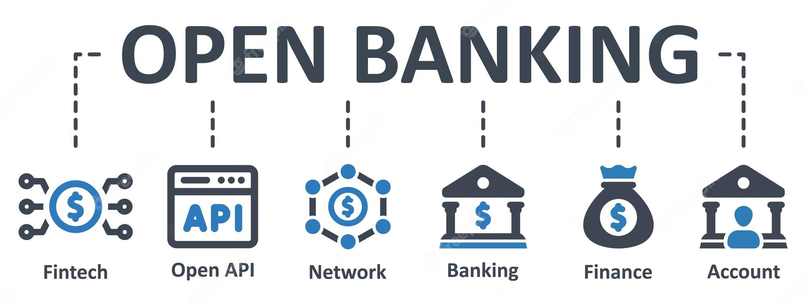

# Fintech API: Unlocking the Secrets to its Rapid Growth in the Financial Sector

**One of the most significant advancements in the financial sector has been the rise of fintech API. All thanks to digital transformation and technological advancements, Fintech APIs have become a game-changer in global finance. These APIs, or application programming interfaces, have made it easier for financial institutions to offer new services and products to their consumers by allowing various software applications to communicate and share data. It is safe to say that these days, APIs are the key to financial control.**

**In this blog post, I will take you through the journey of Fintech API, its rise, benefits, role of open banking in its development, future, advantages, use cases, BaaS, and top providers.**

Several decades ago, before the emergence of APIs, the state of banking was vastly different from what we see today. Banks operated largely through brick-and-mortar branches, and customers had to visit these branches in person to perform transactions, such as deposits, withdrawals, and account opening.

This system was largely manual and paper-based, with customers having to fill out paper forms and sign physical documents. Transactions were processed manually by bank tellers and back-office staff, which made the process slow and error-prone. This manual process also made it difficult for banks to offer personalized services to their customers, as they had limited access to customer data.

Also, financial institutions had limited collaboration with each other, making it challenging to provide customers with comprehensive financial services. But then came fintech API, which revolutionized the entire system and ushered in the era of digital open banking.

## What really is an API?

API (Application Programming Interface) is a software intermediary, a set of guidelines and standards that enables different software applications to communicate and interact with each other. An [API](https://apitoolkit.io/blog/api-trends/) defines how software components should interact and what data they can exchange, providing a standardized way for developers to create software that can be easily integrated with other systems. In simple terms, an API can be thought of as a messenger that takes a request from one software application, carries it to another application, and then returns a response.

## Introduction to Fintech API

Fintech [API](https://apitoolkit.io/blog/best-api-monitoring-and-observability-tools/) is an application programming interface that enables financial institutions to access data and functionality from third-party providers. It is a set of protocols, routines, and tools for building software applications that enable different systems to communicate with each other. It allows financial institutions to integrate new technology and services into their existing systems and applications.

Fintech API is designed to be secure, reliable, and scalable, making it a valuable tool for financial institutions.

## Understanding the Rise of Fintech API

The rise of Fintech API can be attributed to the need for financial institutions to keep up with digital transformation and provide better services to their customers. With the emergence of smartphones and other digital devices, customers expect financial services to be easily accessible and available anytime, anywhere. Fintech APIs allow financial institutions to meet these expectations by providing a platform that enables them to integrate new technology and services into their existing systems. Another factor that has contributed to the rise of Fintech API is the need for better [data management](https://www.tableau.com/learn/articles/what-is-data-management).

Fintech API provides financial institutions with access to vast amounts of data that can be used to improve decision-making processes and provide better customer experiences. Undoubtedly, this has made Fintech APIs valuable tools for financial institutions looking to gain a competitive advantage in the market.

Read: [API Monitoring and Documentation: the Truth You Must Know](https://apitoolkit.io/blog/api-documentation-and-observability-the-truth-you-must-know/)

## Statistics on the Growth of Fintech APIs

The growth of fintech APIs has been impressive, and the market is expected to continue expanding rapidly in the coming years. Here are some statistics that highlight this growth:

1. According to a [report by Grand View Research](https://www.grandviewresearch.com/industry-analysis/fintech-as-a-service-market-report), the global fintech API market was valued at USD 108.4 million in 2019 and is expected to reach USD 2.2 billion by 2027.

2. The same report estimates that the compound annual growth rate (CAGR) of the fintech API market will be 23.3% from 2020 to 2027.

3. A [report by McKinsey & Company](https://www.mckinsey.com/capabilities/mckinsey-digital/our-insights/what-it-really-takes-to-capture-the-value-of-apis) estimates that the use of APIs in banking could generate up to USD 1 trillion in value for the industry globally. 

## Benefits of Fintech API for Financial Institutions

Financial institutions stand to greatly benefit from Fintech API. Let's observe some of the instances below:

1. **Increased efficiency.** Fintech API enables financial institutions to automate processes and reduce manual intervention, resulting in faster and more accurate service delivery. This not only saves time but also reduces costs.

2. **Improved customer experience.** By integrating new technology and services, financial institutions can provide customers with more personalized and convenient services. For example, customers can access their account information and perform transactions through their mobile devices, making banking more convenient.

3. **Lower Costs.** APIs can reduce the cost of developing new products and services, enabling financial institutions to offer these products and services at a lower cost to their customers.

Read: [10 API Tools for Developers](https://apitoolkit.io/blog/top-api-tools-for-developers/)

## The Role of Open Banking in Fintech API Development

Open banking has played a significant role in the development of Fintech API. Open banking refers to the practice of sharing financial data with third-party providers through APIs. This has enabled financial institutions to provide their customers with a wider range of services and products, resulting in increased competition and innovation.

By sharing data, banks can provide customers with personalized services, such as budgeting tools, investment advice, and more.

[Image source](https://www.freepik.com/premium-vector/open-banking-infographic-template-design-with-icons-vector-illustration-business-concept_31955581.htm)

It has also enabled financial institutions to collaborate with Fintech startups and other third-party providers, resulting in the development of new and innovative products and services. This has led to increased customer satisfaction and improved customer experience.

In the words of Christian Faes, co-founder and CEO of LendInvest,

> “Open banking and [API technology](https://apitoolkit.io/blog/the-ultimate-api-management-strategy/) have the potential to completely change the financial landscape as we know it today, by enabling faster, more efficient transactions and greater innovation in financial services.”

The era of open banking and fintech API has led to the emergence of several digital financial platforms turned behemoths, like the Y-Combinator-backed [Stripe](https://stripe.com), [Paypal](https://www.paypal.com), [Revolut](https://www.revolut.com), etc., with mainstream banks open to exchanging data.

Even in Africa, the open banking and fintech API wave has swept through the continent. And this has been particularly felt in Nigeria, the world's most populous Black nation.

In a news report by [Business Day](https://businessday.ng/financial-inclusion/article/open-banking-opportunities-seen-for-financial-institutions-nigeria), the Nigerian government and financial key players have widely adopted open banking regulations, which experts say will create opportunities for players in the financial sector and the economy as a whole. Banks and fintech companies will make more money, particularly by exchanging data, which will in turn contribute to the GDP of the nation.

In Nigeria, solid API-reliant fintech companies like [Paystack](https://paystack.com/), [Flutterwave](https://flutterwave.com/us), [Kuda](https://kuda.com/), [Paga](https://www.mypaga.com/), etc., have gone mainstream and received global acceptance. In Kenya, there is [ChipperCash](https://chippercash.com/), and in Rwanda, [Payday](https://www.usepayday.com/), etc.

Read: [How to Generate Automated API Documentation](https://apitoolkit.io/blog/how-to-generate-automated-api-documentation/)

## The Future of Fintech API

The future of Fintech API looks bright. With the emergence of new technologies such as artificial intelligence, machine learning, and blockchain, Fintech API is expected to become even more valuable. Financial institutions will be able to use these technologies to provide more personalized and innovative services to their clients and customers.

Fintech API is also expected to play a significant role in the development of smart cities and the Internet of Things (IoT). With Fintech API, financial institutions will be able to integrate their services with other smart devices and services, resulting in a more connected and seamless experience for customers.

## Fintech API Use Cases

Fintech API has several use cases. Let's consider some below:

- **Payments**: All over the world, APIs are used to enable payments between different financial institutions, including mobile and online payments. For example, PayPal’s API allows businesses to accept payments on their website, while Stripe’s API enables businesses to accept payments via credit card.

- **Money Transfers**: APIs can be used to enable real-time money transfers between different accounts, both domestically and internationally. A good example is how TransferWise’s API allows businesses to send and receive money across borders with minimal fees and at a competitive exchange rate.

- **Account Aggregation**: Customers can receive a unified view of their financial accounts across several institutions via APIs. For instance, in order to get a complete view of their money, customers can link their bank, credit card, and investment accounts to the Mint app using its API.

- **Lending**: APIs can be used to automate and streamline the loan application and approval process. For example, Kabbage’s API allows small businesses to apply for and receive funding quickly and easily, based on their creditworthiness and other financial data.

- **Financial Planning**: APIs can be used to provide personalized financial planning advice to customers. A good example is how Wealthfront’s API uses customer data to provide personalized investment advice and portfolio management services.

- **Fraud Detection**: Transactions can be monitored in real-time using APIs to look for fraudulent activities. For instance, the API from Sift Science employs machine learning to spot and prevent fraudulent transactions.

- **Risk Management**: APIs can be used to manage financial risk by providing real-time data analysis and reporting. A company like Riskalyze uses its API to provide financial advisors with a risk assessment tool that uses customer data to provide personalized risk management recommendations.

Read: [How to Use Notion for Documentation](https://apitoolkit.io/blog/using-notion-for-documentation/)

## Banking-as-a-Service (BaaS) and Fintech API

Banking-as-a-Service (BaaS) is another area where Fintech API is making an impact. BaaS refers to the practice of providing banking services through APIs. This enables third-party providers to offer banking services to their customers without having to build their own infrastructure.

It can also be defined as the direct integration of digital banking services from a licensed bank with non-bank products and services. This can enable non-banks like your airline, wealth management app, etc., to provide their consumers with digital banking services, including mobile bank accounts, debit cards, loans, and payment services.

With the help of APIs and webhooks, the airline's and bank's systems communicate, allowing your customers to access banking services on your airline's website or mobile app. Now, the airline does not have access to the customer's money; rather, it acts as an intermediary, meaning it does not have the same regulatory obligations delegated to banks.

BaaS has several benefits, including increased efficiency, reduced costs, and improved customer experience. BaaS also enables financial institutions to reach new customers and expand their businesses.

## Top Fintech API Providers

There are several top Fintech API providers, including [Plaid](https://plaid.com/), Stripe, [Dwolla](https://www.dwolla.com/), etc. Plaid is a Fintech API provider that specializes in payment processing and data aggregation. Stripe is another Fintech API provider that specializes in payment processing. Dwolla is a Fintech API provider that specializes in bank transfers and payment processing.

Read: [How to Write API Documentation: 10 Essential Guidelines](https://apitoolkit.io/blog/how-to-write-api-docs/)

## Conclusion

In conclusion, Fintech API has the ability to further transform the financial industry. With its ability to integrate new technology and services, financial institutions can provide customers with more personalized and convenient services.

The development of Fintech API has been significantly influenced by open banking and BaaS, leading to increased innovation and competitiveness. Financial institutions that adopt this technology are anticipated to get a competitive edge in the market, as the future of Fintech API remains bright.

***

Our API monitoring and observability software (APIToolkit) guarantees the uninterrupted performance of your APIs. It was built by developers for developers. Our suite of features includes anomaly detection, logs and metrics explorer, automated API documentation, mission controls, etc. 

[Check it out here](https://apitoolkit.io).

Read: [Top 7 Reasons Why Your Team Should Use A Plug-and-play API Monitoring Tool](https://apitoolkit.io/blog/why-you-need-an-api-monitoring-tool/)
