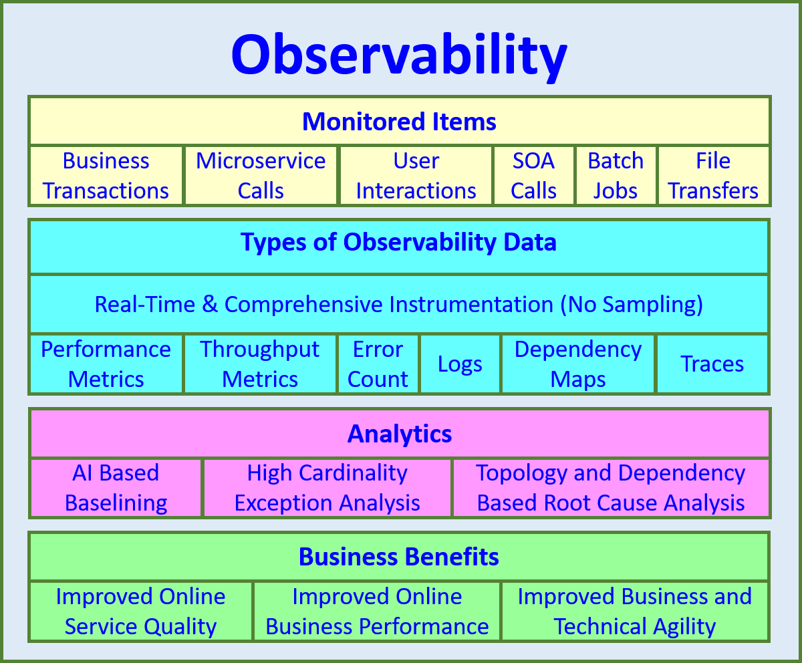

# How API Observability Can Boost Your Business Performance and Customer Satisfaction

Practically every modern business in the tech industry is using [APIs](https://apitoolkit.io/blog/api-documentation-and-observability-the-truth-you-must-know/) to connect applications, services, and data. APIs have become the building blocks of digital transformation, enabling us to create innovative products, streamline workflows, and integrate with third-party platforms. However, as APIs become more complex, distributed, and dynamic, they also become harder to monitor and manage. This can lead to performance issues, errors, security breaches, and poor user experiences that can negatively impact your business outcomes and customer satisfaction.

To overcome these challenges, you need to adopt a data-driven approach to understand the internal state and behavior of your APIs. This is where [API observability](https://apitoolkit.io/blog/api-observability-software-development-/) comes in.

## What is API Observability and Why Does It Matter?

API observability is the extent to which an API’s internal state can be understood through the signals it emits, such as metrics, events, logs, and traces. By collecting, analyzing, and visualizing these signals, you can gain valuable insights into your API’s performance, availability, reliability, usage patterns, and business impact.

Another way to define API observability is that it is the ability to monitor and understand the behavior and performance of your APIs in real-time. It helps you gain visibility into the health, functionality, and efficiency of your APIs, as well as the impact they have on your business outcomes and customer satisfaction.

Image source: An overview of observability. Source: APM Experts 2020

Observability, as a concept, was introduced by Hungrarian-American engineer [Rudolf E. Kálmán](https://en.wikipedia.org/wiki/Observability). He termed it as "a measure of how well internal states of a system can be inferred from knowledge of its external outputs." This was done in the domain of [control theory](https://en.wikipedia.org/wiki/Control_theory). Some decades later, this term has been repurposed towards microservices and distributed software systems.

In essence, observability helps you understand and explain any system state, no matter how unusual or unexpected it may be.

A study by Gartner found that 80% of customers will abandon a product or service if they experience three or more issues in a row.

This is why your API-dependent business must prioritize API observability.

A researcher and development scientist at Karlstad University, [Mohammed Usman](https://orcid.org/0000-0002-9598-0704), re-emphasizes the importance of observable APIs. He says "The core of the observability is to quickly learn what is happening within the IT infrastructure to avoid extended outages, and during an outage, quickly enable so-called root cause analysis of the problem. For example, the Mean Time to Resolution (MTTR) metric measures outages, and the observability objective is to drive MTTR value as close to zero as possible."

Let's look at some of the core reasons why API observability matters:

In the tech ecosystem, API observability can help you improve your business performance and customer satisfaction in several ways:

**Reduce downtime**: When APIs are down, customers are unable to use the services that they rely on. That's why identifying and fixing API problems quickly can help businesses [reduce downtime](https://apitoolkit.io/blog/api-downtime/) and keep customers happy.

**Improve API quality and reliability**: By observing your [API’s metrics](https://apitoolkit.io/blog/api-logs-and-metrics/), such as request latency, error rate, throughput, and availability, you can identify and troubleshoot issues before they affect your end users. You can also set up alerts and notifications to proactively detect anomalies and incidents that may require immediate attention. Additionally, you can use API traces to track the flow of requests across multiple services and pinpoint the root cause of errors or bottlenecks.

**Optimize API performance and efficiency**: API observability can help you monitor your API’s events, such as code deployments, configuration changes, feature toggles, and scaling actions. This can help you understand how they affect your [API’s performance](https://apitoolkit.io/blog/web-api-performance/) and behavior. You can also use API logs to get more granular information about the internal state and activity of your API components.

**Enhance API security and compliance**: When you monitor your API’s logs and traces, you can detect and prevent unauthorized or malicious access to your API resources. You can also use API analytics to monitor and audit the usage and behavior of your API consumers.

## Understanding API Observability

I would describe API observability as a subset of the broader concept of observability, which refers to the degree to which a system can be monitored and analyzed from the outside.

A study by Dynatrace found that businesses that have implemented API observability experience a 30% reduction in mean time to resolution (MTTR) for API incidents.

Another study by New Relic found that businesses that have implemented API observability experience a 20% increase in customer satisfaction.

This goes to show that API observability is the differentiating factor between a successful and non-successful tech company.

## Components of API Observability

API observability consists of three main components:

- Logging
- Metrics, and
- Tracing

The three pillars of observability. Source: Fernandes 2019.

Let's take a look at each of them in more detail.

**Logging**: Logging is the process of recording events that occur within your API or application. Logs provide information about what happened, when it happened, where it happened, and why it happened. Logs can help you troubleshoot errors, debug issues, audit activities, and track changes.

**Metrics**: Metrics are numerical measurements that indicate the state or performance of your API or application. Metrics provide information about how well your API is functioning, such as response time, throughput, availability, error rate, etc. Metrics can help you monitor trends, identify anomalies, set benchmarks, and optimize performance.

**Tracing**: Tracing is the process of tracking the flow of requests across your API or application. Traces provide information about how your API is behaving, such as which endpoints are called, how long they take to execute, what dependencies they have, etc. Traces can help you visualize the end-to-end journey of your requests, pinpoint bottlenecks, discover root causes, and improve efficiency.

## Difference Between API Monitoring and API Observability

[API monitoring](https://apitoolkit.io/blog/best-api-monitoring-and-observability-tools/) and API observability are two important practices for ensuring the quality and reliability of APIs. However, they have different goals and scopes. Let's take a look at the differentiating factors:

API monitoring is the process of collecting and analyzing data relating to the performance of an API. It involves measuring key metrics such as request latency, error rate, throughput, availability, and uptime. API monitoring helps businesses detect and resolve issues with their APIs in real time, as well as optimize their performance and efficiency. API monitoring is typically done by sending synthetic requests to the API endpoints and checking the responses against predefined expectations. This is also known as black-box testing, as it does not require access to the internal workings of the API.

[API observability](https://apitoolkit.io/blog/best-api-monitoring-and-observability-tools/), on the other hand, is a more comprehensive approach to understanding the behavior and health of an API. It involves collecting and analyzing a wider range of data, including logs, traces, events, metadata, and context. API observability helps businesses gain deeper insights into how their APIs function and interact with other components of the system, as well as troubleshoot complex issues and improve their design and development. API observability is typically done by instrumenting the API code or using an agent or SDK to passively log the API traffic. This is also known as white-box testing, as it requires access to the internal workings of the API.

The main difference between API monitoring and API observability is the level of detail and granularity they provide. API monitoring focuses on tracking known metrics and alerting on predefined thresholds, while API observability focuses on exploring unknown metrics and discovering unknown unknowns.

API monitoring answers questions such as “Is my API working?” and “How fast is my API?”, while API observability answers questions such as “Why is my API not working?” and “How can I make my API better?”.

In essence, API monitoring is more suitable for simpler and isolated APIs that have clear inputs and outputs, while API observability is more suitable for complex and distributed APIs that have multiple dependencies and interactions.

**API monitoring**: Provides a snapshot of the current state of an API.
**API observability**: Provides a holistic view of the entire system.

## The Role of API Observability in Business Performance

API observability is not just a technical matter. It has a direct impact on your business's performance and customer satisfaction. According to [Forbes](https://www.forbes.com/sites/googlecloud/2022/01/19/research-shows-api-management-fuels-growth-heres-why/?sh=4f258ac51713), the market capitalization of companies that have adopted APIs has grown by more than 12% compared to those that have not. And RapidAPI states that more than 90% of executives describe APIs as mission-critical.

Gartner, a technology-driven research platform, suggests that the [average cost of IT downtime](https://blogs.gartner.com/andrew-lerner/2014/07/16/the-cost-of-downtime/) is $5,600 per minute, which extrapolates to well over $300,000 p/hour. It’s hard to predict when and where APIs will fail. This is why API observability has come to stay.

## Benefits of API Observability

By incorporating API observability into your workflow and business management processes, you can achieve the following benefits:

**Real-time monitoring and error detection**: API observability enables you and your team to monitor your APIs in real time and detect any errors or issues that may arise. You can use dashboards, charts, graphs, alerts, etc., to visualize your API performance data and get notified of any problems as soon as they occur. This way, you can avoid being blindsided by unexpected failures or slowdowns that may affect your business operations or customer experience.

**Optimization of API performance**: By implementing observability, you can optimize your API performance by identifying and eliminating any inefficiencies or bottlenecks that may hamper your API functionality or speed. You can use metrics and traces to analyze your API performance data and find out which endpoints are slow or inefficient, which resources are underutilized or overutilized, which requests are causing errors or timeouts, etc. Based on this information, you can allocate resources accordingly, scale up or down as needed, and improve your API design and architecture.

**Enhancing Customer Satisfaction through API Observability**: API observability is beneficial to your customers who use your APIs directly or indirectly. You can enhance customer satisfaction by providing them with a seamless user experience. You can also meet or exceed your customers' expectations and SLAs and minimize downtime and service disruptions.

## Implementing API Observability

Now that you understand the importance and benefits of API observability, you may wonder how to implement it effectively. The easiest way to implement API observability is by choosing the [right observability tools](https://apitoolkit.io/blog/best-api-monitoring-and-observability-tools/).

The following tools can get the job done:

[APIToolkit](https://apitoolkit.io): An automated observability tool for API contract monitoring and [documentation](https://apitoolkit.io/blog/how-to-generate-automated-api-documentation/). It helps teams ensure that their APIs are compliant with their specifications and standards, and provides clear and up-to-date documentation for internal and external consumers.

Postman: A comprehensive API testing tool that allows teams to design, develop, test, document, and monitor their APIs.

Saucelabs: A cloud-based platform for continuous testing and delivery of web and mobile applications.

Moesif: A tool for API monitoring, analytics, and debugging.

There are other good ones like Datadog, BetterUptime, Treblle, etc.

However, your preferred tool should be able to provide you with the following features:

**Comprehensive coverage**: The tool should be able to collect and analyze data from all sources and perspectives of your API, such as logs, metrics, traces, events, alerts, etc. The tools should also be able to integrate with your existing API platforms, frameworks, languages, protocols, etc.

**Easy installation and configuration**: Your preferred tool should be easy to install and configure, without requiring extensive coding or manual intervention. The tool should also be scalable and adaptable to your changing API needs and environments.

**User-friendly interface and visualization**: Your go-to observability tool should provide you with a user-friendly interface and visualization that can help you easily access, understand, and act on your API performance data. The tools should also allow you to customize your dashboards, charts, graphs, alerts, etc., according to your preferences and goals.

**Actionable insights and recommendations**: The tools should not only provide you with raw data but also with actionable insights and recommendations that can help you improve your API performance and quality. It should also enable you to automate your observability [workflows](https://apitoolkit.io/blog/rest-api-workflow/) and tasks, such as alerting, reporting, troubleshooting, etc.

Now, investing in observability tools is essential, but you must understand that this technology, in itself, will not address all the problems. Your tech team, from the design phase to the deployment phase, should have the mindset to make your systems observable. An [observability tool](https://apitoolkit.io) should serve as a support system.

In conclusion, API observability is a crucial aspect of your business's performance and customer satisfaction. As you push towards achieving your set business objectives, you must prioritize customer service-level agreements. And the most effective way to achieve your SLAs is to imbibe the culture of API observability.

Here's the secret: examine observability from the perspective of the user. A happy customer keeps you on the job.

**Keep reading**

[Best API Monitoring and Observability Tools in 2023](https://apitoolkit.io/blog/best-api-monitoring-and-observability-tools/)

[Ultimate Guide to API Testing Automation](https://apitoolkit.io/blog/api-testing-automation/)

[Web API Performance Best Practices - the Ultimate Guide](https://apitoolkit.io/blog/web-api-performance/)

[Must-Know API Trends in 2023](https://apitoolkit.io/blog/api-trends/)

[API Documentation and Monitoring: the Truth You Must Know](https://apitoolkit.io/blog/api-documentation-and-observability-the-truth-you-must-know/)
