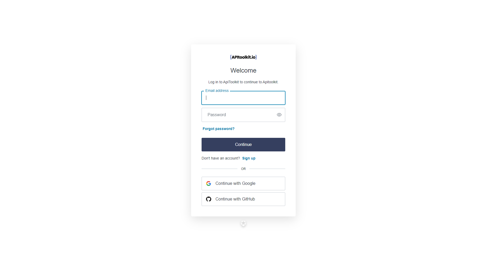
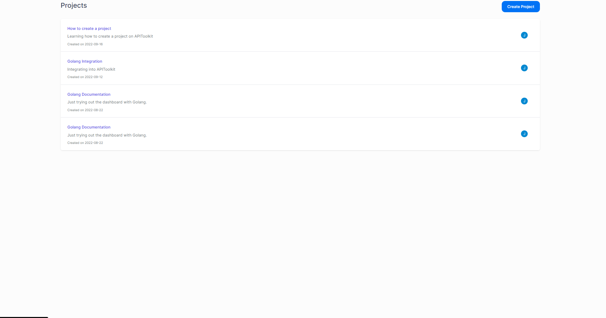
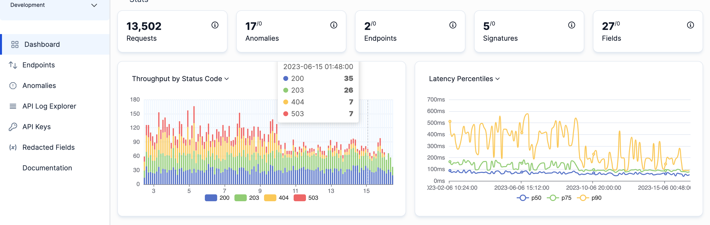

---
title: "How APIToolkit Can Help You Gain Insights Into Your API Usage and Behaviour with API Observability"
featured_image: how-to-gain-insights.png
date: 2023-08-28T08:00:00+00:00
description: Api observability isn't just about knowing whether your API is up or down; it's about gaining a 360-degree view of its operations. 
author: jessica
categories:
  - APIs Observability
--- 

# How APIToolkit Can Help You Gain Insights Into Your API Usage and Behaviour with API Observability

In today's complex tech ecosystem, [APIs](https://apitoolkit.io/blog/api-as-a-product/) work as essential intermediaries, facilitating the exchange of features and data among disparate systems. Often operating behind the scenes, they support a range of technologies, from web-based platforms to Internet of Things devices. Yet, as the world of APIs expands, keeping them functional is not so easy, hence the need for monitoring. Monitoring API usage, evaluating their effectiveness, and identifying security risks are crucial steps makes the role of API observability a necessity.

[API observability](https://apitoolkit.io/blog/api-observability-software-development-/) isn't just about knowing whether your API is up or down; it's about gaining a 360-degree view of its operations. It's about understanding the nuances of each API call, tracing data paths, and being alerted to anomalies before they become issues. In essence, API observability gives you the "eyes" to see the intricate workings of your API landscape.

Now, you might be wondering, "How do I achieve this level of insight?" The answer is specialized tools designed for API observability, and one such tool that stands out is [APIToolkit](https://apitoolkit.io/). This article aims to guide you through the capabilities of APIToolkit in enhancing your API observability, providing you with actionable insights that can be a game-changer for your business.

If you're new to this topic, we've already written articles that cover the basics of [API observability](https://apitoolkit.io/blog/api-observability-software-development-/) and the key  [APIToolkit features](https://apitoolkit.io/blog/how-to-troubleshoot-and-debug-your-apis/). These articles are a great starting point to quickly get you familiar with the subject.

## The Need for Specialized Tools in API Observability

Monitoring the health and performance of a system has traditionally relied on general-purpose tools that can flag issues like server downtime, slow databases, or high network latency. While these tools are effective for those specific tasks, they often lack the capability to fully grasp the complexities of APIs (Application Programming Interfaces). These general-purpose monitoring tools are designed to oversee a wide range of system components. They are built to alert you when something is obviously wrong, such as a server failing or a database slowing down. However, these tools operate at a surface level and do not delve deep into the intricacies that are unique to APIs.

APIs serve as the connectors that allow different software applications to interact with each other. They may facilitate data transfer, enable user authentication, or even trigger complex workflows. Unlike a server or a database, an API is not just a single entity but often a complex set of operations that have their own specific needs, behaviours, and vulnerabilities.

For instance, APIs can experience issues like:
- Rate limiting: Too many requests from a single source in a short period.
- Data inconsistency: Mismatched data formats between the sending and receiving ends.
- Authorization failures: Incorrect or expired tokens causing access issues.
These are problems that a general-purpose tool may not be programmed to identify, much less resolve.

Given the unique challenges posed by APIs, it becomes crucial to have specialized tools designed to observe and manage them effectively. These specialized API observability tools can:
- Monitor the rate, type, and source of API calls to identify unusual patterns.
- Track performance metrics specific to APIs, such as response time or data throughput.
- Provide insights into security aspects, like unauthorized access attempts.
- By having a tool that's custom-built to understand the nuances of APIs, you can ensure a more robust, secure, and efficient system.

While general-purpose monitoring tools offer broad coverage for system health, they are not sufficient for the specialized needs of APIs. APIs have unique characteristics that require dedicated observability tools for effective management. Investing in specialized API observability tools is not just an option but a necessity for those looking to optimize performance and security in an increasingly interconnected technological landscape.

## The Limitations of General Monitoring Tools

- Lack of Granular Insights: General monitoring tools can tell you that an API endpoint is slow but may not provide the granular details needed to understand why it's slow. Is it the database query? Is it the third-party service you're calling? Or is it the application logic itself?

- Inadequate Data Context: Traditional tools might alert you about an error but may not provide the context needed to debug it effectively. For instance, understanding the payload, headers, and the sequence of API calls leading to the error is often crucial for quick resolution.

- No Support for Distributed Tracing: Modern applications often involve multiple microservices communicating via APIs. General monitoring tools lack the capability for distributed tracing, which is essential for debugging complex, multi-step API interactions.

- Limited Anomaly Detection: APIs can have patterns that are considered normal or anomalous based on various factors like time of day, type of request, or originating location. General tools are not adept at identifying these nuanced patterns.

## Why Specialized Tools Like APIToolkit Are Essential

While general monitoring tools offer a bird's-eye view, specialized tools like APIToolkit give you a microscope to understand the intricate details of your API landscape. As APIs continue to become more complex and integral to business operations, the need for specialized API observability tools is essential and here is why:
- Deep-Dive Analytics: APIToolkit is designed to provide in-depth analytics specific to APIs. It can trace individual API calls, measure latencies at various stages, and offer insights that are actionable.
- Context-Rich Monitoring: Unlike general tools, APIToolkit provides rich context for each API call, making debugging a breeze. It captures headers, payloads, and even the sequence of API calls, offering a comprehensive view of any issues.
- Distributed Tracing: APIToolkit supports distributed tracing out-of-the-box, allowing you to track an API call as it traverses through multiple services, databases, and third-party integrations.
- Intelligent Anomaly Detection: With machine learning algorithms, APIToolkit can learn the normal behaviour of your APIs and alert you when something seems off, way before it becomes a critical issue.

## How APIToolkit Enhances API Observability

[API observability](https://apitoolkit.io/blog/api-observability-best-practices/) is not a one-size-fits-all concept; it's a multifaceted discipline that requires specialized tools to address its complexities. APIToolkit is designed with this in mind, offering a range of features that go beyond the capabilities of general monitoring tools. Let's explore some of these features and understand how they solve real-world problems.

### 1. Real-Time Monitoring and Analytics
Feature: [APIToolkit](https://apitoolkit.io/) provides real-time monitoring and analytics, allowing you to track API calls, response times, and error rates as they happen.

Real-World Scenario: Imagine you're running an e-commerce platform. During a flash sale, you notice that the checkout API is experiencing delays. Real-time monitoring allows you to pinpoint the issue immediately, ensuring a smooth experience for your customers and preventing potential revenue loss.

### 2.Outgoing Request Monitoring
Feature: With its distributed tracing capabilities, APIToolkit can follow an API call through multiple services and databases, providing a complete picture of its journey.

Real-World Scenario: In a microservices architecture, a single user action can trigger multiple API calls across various services. When something goes wrong, pinpointing the issue can be like finding a needle in a haystack. Distributed tracing simplifies this by providing a visual map of the API call's path, making it easier to identify bottlenecks or failures.

### 3. Context-Rich Error Tracking
Feature: APIToolkit captures detailed information about each API call, including headers, payloads, and even the sequence of API calls leading up to an error.

Real-World Scenario: Let's say you're running a travel booking service, and users are experiencing issues with flight bookings. Context-rich error reporting allows you to see the exact sequence of API calls that led to the error, helping you to resolve the issue faster and improve user satisfaction.

### 4. Anomaly Detection
Feature: APIToolkit uses machine learning algorithms to understand the normal behavior of your APIs and alerts you when anomalies occur.

Real-World Scenario: In a financial trading platform, sudden spikes in API calls could indicate fraudulent activity. Intelligent anomaly detection can alert you in real time, allowing you to take immediate action.

[APIToolkit](https://apitoolkit.io/) offers a comprehensive suite of features tailored for API observability, addressing the unique challenges that APIs present. By solving real-world problems, it not only enhances the performance and reliability of your APIs but also contributes to better business outcomes.

## Setting Up APIToolkit for API Observability

[API observability](https://apitoolkit.io/blog/api-observability-best-practices/) is crucial for understanding the behaviour and performance of your APIs. With APIToolkit, setting up observability is straightforward. Let's walk through the steps:

1. Start by signing up for an APIToolkit

2. Go ahead and create a new project

3. Once your are done creating a new project, navigate to the ‘API Keys’ and select 'Generate Key'.  

4. Once you’ve generated a key, go ahead and integrate your APIs into APIToolkit using these docs
5. Follow the prompts to connect your API to APIToolkit
6. Voila! You are as good as ready and here is what a fully integrated dashboard with data should look like

Note: On [APIToolkit](https://apitoolkit.io/) your page is automatically configured with specific endpoints, setting rate limits, and more. All incoming requests are monitored for anomalies, new endpoints, slow endpoints and more. no rate limiting.  

We also do field redaction. If a user doesn't want APIToolkit to record sensitive fields, like passwords, credit cards, etc., they can specify them so APIToolkit won't record them.

## Conclusion

[API observability](https://apitoolkit.io/blog/api-observability-best-practices/) is not just a trend; it's a necessity in today's complex digital ecosystems. As we've seen, general monitoring tools can only take you so far. Specialized tools like APIToolkit offer features that are tailor-made for the unique challenges of API observability, providing actionable insights that can significantly improve performance and security.

The future of [API observability](https://apitoolkit.io/blog/api-observability-best-practices/) is promising, with advancements in machine learning and AI expected to bring even more intelligent features. Tools like APIToolkit are at the forefront of this evolution, shaping the way businesses monitor, analyze, and optimize their APIs.

- - -

## Keep Reading

- [How to Troubleshoot and Debug Your APIs with API Observability Tools](https://apitoolkit.io/blog/how-to-troubleshoot-and-debug-your-apis/)
- [API Observability Best Practices: How to Collect, Analyze, and Visualize Your API Telemetry Data](https://apitoolkit.io/blog/api-observability-best-practices/)
- [Incident Management: How to Resolve API Downtime Issues Before It Escalates](https://apitoolkit.io/blog/api-downtime/)
- [The Rise of API-as-a-Product: How Companies are Leveraging APIs to Drive Revenue](https://apitoolkit.io/blog/api-as-a-product/)
