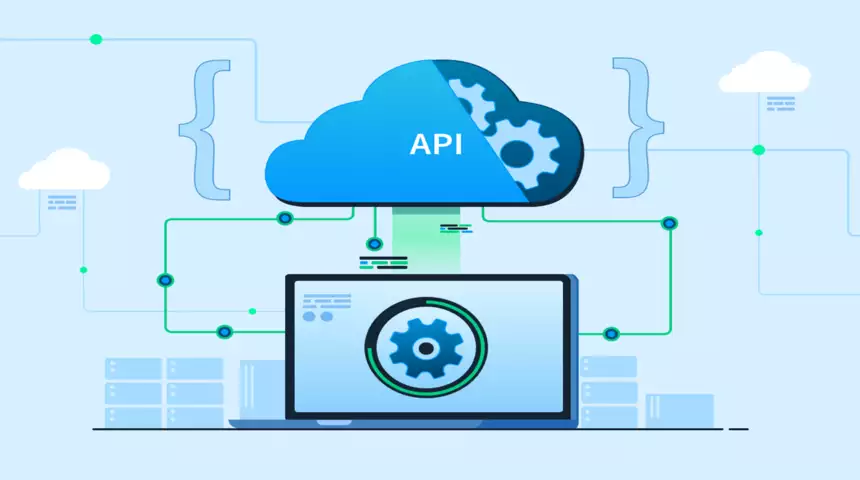

# How to Achieve an Excellent API Quality

Building high-quality APIs is essential for providing reliable, secure, and user-friendly integration points that enable digital transformation and innovation. API quality encompasses a wide range of characteristics and attributes that make an API well-designed, consistent, secure, performant, and easy to use. 

From following industry best practices in API design to implementing robust development processes, comprehensive documentation, versioning strategies, security measures, performance optimization techniques, and effective governance models, achieving excellent API quality requires a holistic approach.

## Characteristics of Quality API

### Usability

A usable API has a clear and intuitive interface, making it easy for developers to understand and integrate with their applications. It follows consistent naming conventions, resource modeling, and industry best practices.

### Reliability

A reliable API consistently delivers the expected results, handles errors gracefully, and operates within specified service level agreements (SLAs). It should be fault-tolerant and able to recover from failures without causing data loss or corruption.

### Efficiency

An efficient API minimizes resource consumption, such as network bandwidth, memory usage, and processing power. It should respond promptly to requests and scale well under high load.

### Maintainability

A maintainable API has a modular and extensible design, making it easy to add new features, fix bugs, and upgrade components without breaking existing functionality. Clear documentation and adherence to coding standards facilitate maintenance.

### Portability

 A portable API can run on different platforms, operating systems, and environments, minimizing dependencies and promoting interoperability.

### Security

A secure API implements robust authentication, authorization, and encryption mechanisms to protect data and prevent unauthorized access or malicious attacks. It follows industry security standards and best practices.

## How to Achieve an Excellent API Quality
To achieve excellent API quality, organizations must adopt a holistic approach encompassing API design principles, development practices, documentation, versioning, security, performance optimization, governance.

## API Design Principles

Designing high-quality APIs begins with following established principles and best practices. Embrace RESTful architectural constraints, such as stateless operations, uniform interfaces, and resource-based modeling.

Design APIs with the intended audience and use cases in mind. Understand the needs, technical proficiency, and workflow of the developers who will consume the API. Involve them early in the design process through collaborative planning sessions.

Establish consistent naming conventions and resource modeling approaches across all APIs within an organization. Adhere to industry standards and guidelines, such as the Microsoft REST API Guidelines or the Google Cloud API Design Guide.

## API Development Practices  

Adopt robust API development practices to ensure quality from the ground up. Implement a comprehensive testing strategy that includes unit tests, integration tests, end-to-end tests, load tests, and security tests. Automate testing as much as possible and integrate it into the continuous integration and deployment pipeline.

Continuously integrate code changes from multiple developers, automatically build and test the API, and deploy to staging or production environments. Leverage containerization and orchestration tools like Docker and Kubernetes to streamline deployments.

Implement comprehensive monitoring and logging mechanisms to track API performance, errors, and usage patterns. Collect and analyze these metrics to identify bottlenecks, optimize performance, and proactively address issues before they impact users.

## API Documentation

Develop comprehensive and up-to-date documentation that explains the API's functionality, endpoints, request/response formats, authentication mechanisms, error handling, and usage examples. Use interactive documentation tools like Swagger or Postman to provide a user-friendly browsing experience and enable developers to test the API directly.

Include code samples and tutorials that demonstrate how to integrate the API with various programming languages and frameworks. Provide clear instructions and best practices for common use cases.

## API Versioning and Deprecation

Implement a versioning strategy to manage changes and updates to your APIs over time. Common approaches include URI versioning (e.g., /v1/resources, /v2/resources) or header versioning (e.g., Accept-Version: v1).

Establish clear policies and processes for handling breaking changes that may impact existing API consumers. Provide ample notice and migration guides when deprecating or sunsetting outdated API versions.

When introducing a new version, maintain backward compatibility as much as possible to minimize disruption for existing consumers. Only break compatibility when absolutely necessary, and communicate the changes transparently.

## API Security

Implement robust authentication and authorization mechanisms to control access to your APIs. Common approaches include API keys, OAuth 2.0, JSON Web Tokens (JWT), and OpenID Connect.

Enforce data encryption in transit using HTTPS/TLS and consider additional payload encryption for sensitive data.

Implement input validation and sanitization to prevent injection attacks, cross-site scripting (XSS), and other vulnerabilities. Adhere to the OWASP API Security Top 10 and other security best practices.

Ensure compliance with relevant industry standards and regulations, such as PCI DSS, GDPR, or HIPAA, depending on your domain and the types of data handled by your APIs.

### API Performance and Scalability  

Leverage caching and load balancing techniques to improve response times and distribute traffic across multiple servers or regions.

Implement rate limiting and throttling mechanisms to prevent abuse and protect your APIs from being overwhelmed by excessive requests.

## API Governance

Establish centralized API management and governance processes to maintain control and oversight across the entire API lifecycle. Implement an API gateway or management platform to provide a centralized entry point, enforce policies, and monitor API traffic.

Maintain an API catalog or developer portal that serves as a single source of truth for all APIs within your organization. This facilitates API discovery, access management, and documentation.

Track and analyze API usage metrics, such as request volumes, response times, error rates, and consumer adoption. Use this data to optimize performance, prioritize improvements, and make informed decisions about API roadmaps.

Implement API lifecycle management processes to streamline the workflow from initial design and development through testing, deployment, retirement, and deprecation.

## Conclusion

Achieving excellent API quality is needed for building reliable, secure, and user-friendly integrations that drive digital transformation and innovation. By following best practices in API design, development, documentation, security, performance optimization, governance, and continuous improvement, organizations can deliver high-quality APIs that meet the evolving needs of their users and stakeholders. E