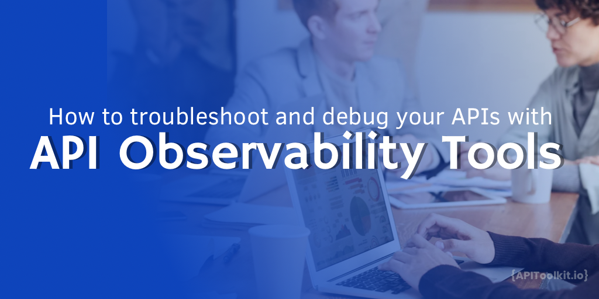
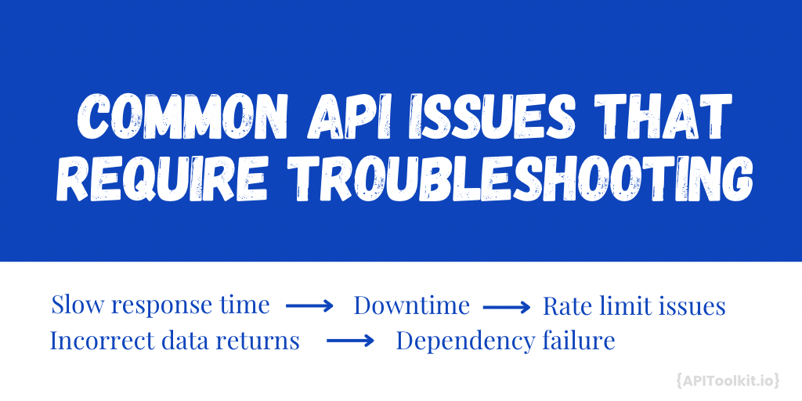
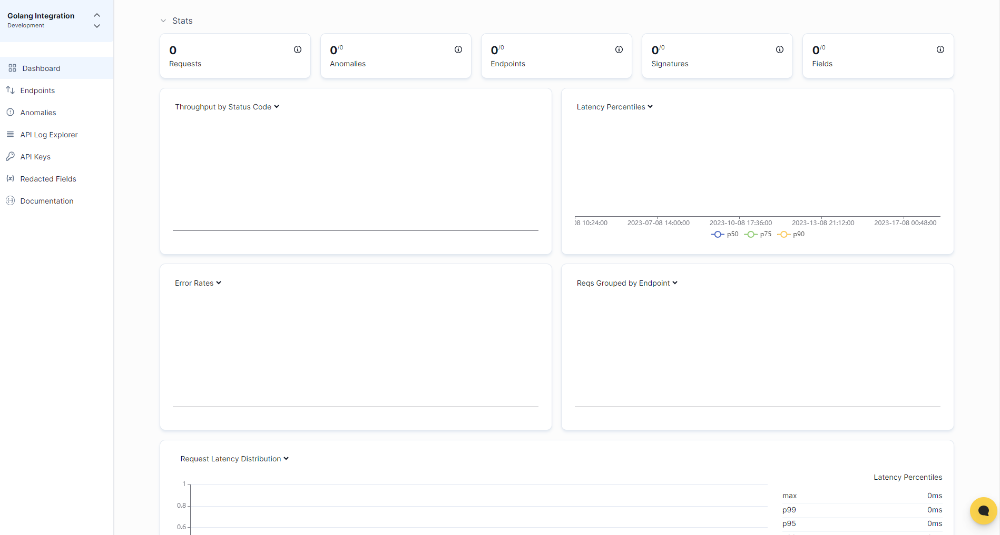

# How to Troubleshoot and Debug Your APIs with API Observability Tools

Imagine you're hosting a grand party at your home. You've invited friends, family, and colleagues. The music is great, and the food is delicious. But, suddenly, the music stops, and the lights go out. Panic sets in. You rush to the control room (or the fuse box in most homes), trying to figure out what went wrong. Is it the speakers? The playlist? Or did someone trip over a wire?

This is very much like the world of APIs. Think of the party as your software application, and the various systems – the lights, music, and food – as the different parts of your API. When everything's running smoothly, it's a blast. But when something goes wrong, it can be a real mood killer. And just like you'd wish for a magical tool to instantly tell you what's wrong at your party, developers dream of a tool that can quickly pinpoint where an issue lies within their API.

[API Observability Tools](https://apitoolkit.io/blog/api-observability-software-development-/) are the superheroes of the API world, ensuring that your 'party' goes on without a hitch. In this article, we'll dive deep into these tools, helping you understand how they can save your 'party' from turning into a dud.

## What is [API Observability?](https://apitoolkit.io/blog/api-observability-software-development-/)

In the simplest terms, observability is the ability to understand the internal state of a system from its external outputs. If you've ever tried to figure out why your car is making a weird noise by just listening to it, you're essentially using observability. When applied to APIs, observability is about understanding the behaviour of your API by examining its data outputs.

## Why API Observability is Crucial for Modern Microservices and API-driven Architectures

Complexity: Modern applications aren't monolithic beasts anymore. They're often composed of multiple microservices, each handling a specific function. This distributed nature makes it challenging to pinpoint issues using traditional monitoring tools.

Dynamic Infrastructure: With cloud computing and containerization, the infrastructure can change in real time and services are built to scale up or down based on demand. API Observability tools are built and equipped to handle this dynamic environment.

User Experience: In the digital age, users expect seamless experiences. Any downtime or glitch can lead to a loss of users or revenue. These tools ensures that issues are not just detected but also diagnosed and resolved faster than you can imagine.

Continuous Deployment & Integration: As developers push new code and features more frequently, the chances of introducing bugs or performance issues increase. Observability provides real-time feedback, ensuring that any issue introduced in the latest deployment is quickly identified.

## Common API Issues that Require Troubleshooting

Imagine a popular ice cream shop on a hot summer day. The place is bustling with customers eager for a cold treat. Just as this shop strives to serve each customer efficiently, APIs aim to process requests seamlessly. However, just like any busy establishment, issues can arise.

1. Slow Response Times
   Analogy: You're standing in line, eagerly waiting for your turn. But the server behind the counter seems to be moving in slow motion, taking an eternity to scoop ice cream for each customer.
   API Perspective: Much like waiting for your ice cream, an API that responds slowly can test a user's patience. It can make an application seem sluggish or unresponsive, diminishing the user experience.

2. Downtime
   Analogy: Just as you're about to place your order, the shop puts up a sign: "Sorry, machine breakdown. Temporarily closed." The disappointment is palpable.
   API Perspective: This is akin to an API going offline. When an application can't access the API, features break, and users can't get what they came for, leading to frustration.

3. Incorrect Data Returns
   Analogy: You ask for a scoop of vanilla but are handed chocolate instead. While both are delightful flavors, it's not what you asked for.
   API Perspective: Similarly, when an API returns unexpected data, it can lead to confusion or errors. It's like getting a flavor you didn't order.

4. Rate Limit Issues
   Analogy: The shop has a special promotion: "One free scoop per customer." You loved the first one and decide to go back for seconds, but they kindly refuse, citing the one-scoop policy.
   API Perspective: Just like the one-scoop limit, APIs often have a cap on how many requests they can entertain within a time-frame. Exceeding this limit means subsequent requests are turned away.

5. Dependency Failures
   Analogy: You decide to order a sundae. But alas, they've run out of whipped cream, a key ingredient. Your sundae can't be made without it.
   API Perspective: Many APIs rely on other services to function. If a dependent service is unavailable, it's akin to missing whipped cream for the sundae. The main service can't complete its task.

Using the ice cream shop as an analogy, we see the myriad challenges both face in ensuring smooth operations. Whether it's scooping ice cream or processing data, timely and accurate delivery is key to keeping everyone happy.

## How to Use Observability Tools for API Troubleshooting with APIToolkit

In the world of digital transformation, APIs power a significant chunk of the modern web. But with great power comes great responsibility, especially when things go haywire and observability tools like [APIToolkit](https://apitoolkit.io/) makes the difference. In this guide, we'll walk through how you can harness APIToolkit to troubleshoot and ensure your APIs run as smoothly as silk.

1. Sign in to the [APIToolkit](https://app.apitoolkit.io/) dashboard.
2. Click on 'Sign Up' and enter your details.
   
3. Once logged in, go ahead and integrate your APIs into APIToolkit using these [docs](https://apitoolkit.io/docs/get-started/quickstarts/)
4. Follow the prompts to connect your API to APIToolkit.
   
5. Now your page is automatically configured with specific endpoints, setting rate limits, and more. All incoming requests are monitored for anomalies, new endpoints, slow end points and more.
6. Your main dashboard will display key metrics, including requests, anomalies, endpoints, error rates, signatures, fields and latency percentiles.
   
7. Now navigate to the 'API Log Explorer' section from your main dashboard.
8. Here, you'll see a chronological record of all API activity.
   
9. You can use the search bar and filters to narrow down logs. For instance, you can filter by error type, date range, or specific endpoints.
10. Click on a specific log entry for detailed information. This can provide insights into what went wrong and why.

## Best Practices for API Observability

Granular Logging: The Importance of Detailed and Contextual Logs
Every interaction with your API leaves behind a trail. By ensuring detailed and contextual logging, you're essentially creating a comprehensive diary of your API's life. Think of granular logs as a detective's detailed notes. The more information available, the easier it becomes to reconstruct events and identify issues. Implement structured logging, capturing not just errors but also user actions, system behaviors, and more. This provides a richer context when troubleshooting.

Proactive Monitoring: Setting Up Alerts for Anomalies
Waiting for issues to become apparent can be costly. Proactive monitoring is about anticipating problems before they escalate. It's like having smoke detectors in your house; they warn you of potential danger before a full-blown fire breaks out. Establish baseline metrics for your API's behaviour. Any deviation from this baseline, be it increased latency or error rates, should trigger an alert.

Consistent Tracing: Ensuring Traces Cover the Entire Request Path
As requests navigate through your system, consistent tracing ensures you have a map of its journey. Imagine trying to find someone in a large city without a trace of their path. Tracing provides that path, ensuring no part of the request's journey is a black box. Adopt distributed tracing solutions, especially if your architecture involves microservices. This ensures you have a holistic view of a request's journey, no matter how complex.

Feedback Loops: Using Observability Insights to Improve the API's Design and Performance
Observability isn't just about identifying problems; it's about continuous improvement. Think of it as customer feedback in a restaurant. By listening and making changes, the restaurant continually improves its service. Regularly review the insights gained from your observability tools. Use this data to refine your API's design, optimize performance, and enhance the overall user experience.

API observability isn't a luxury, it's a necessity. It provides the flashlight in the dark alleyways of system breakdowns, guiding us towards swift resolutions and ensuring the digital experiences we offer remain seamless. As we've explored, it's not just about having tools but using them wisely. So, as you venture into the world of APIs, arm yourself with the right observability practices and tools, like [APIToolkit](https://apitoolkit.io/), to ensure your APIs not only run smoothly but also mature and improve over time.

Conclusion
APIs are the lifeblood of many digital platforms. Ensuring their smooth operation is crucial. With [APIToolkit](https://apitoolkit.io/), you're equipped with a robust toolset to monitor, trace, and analyze your APIs, ensuring optimal performance and swift troubleshooting. Keep this guide handy, and may your APIs always be in top form!

---

Keep Reading
[Web API Performance Best Practices: the Ultimate Guide](https://apitoolkit.io/blog/web-api-performance/)
[API Testing Requirements: What You Need to Know Before You Start](https://apitoolkit.io/blog/api-testing-requirements/)
[The Importance of API Observability in Software Development](https://apitoolkit.io/blog/api-observability-software-development-/)
[Ultimate Guide to API Testing Automation](https://apitoolkit.io/blog/api-testing-automation/)
