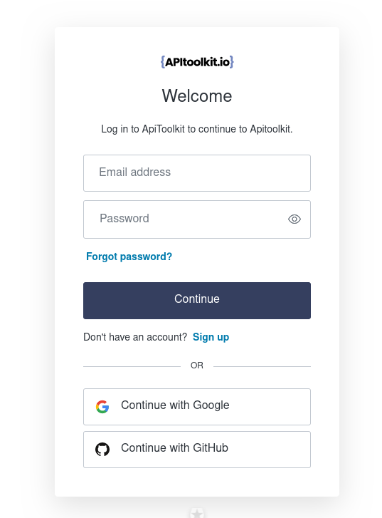
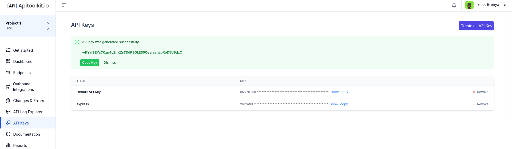

---
title: "Improve Your Workflow with APItoolkit"
date: 2024-03-01T11:10:00+00:00
featured_image: improve%20workflow%20apitoolkit.gif
description: "Bugs are an inevitable part of the software development lifecycle, no matter how rigorous your testing processes are. When a new exception rears its ugly head and starts impacting your users, it's crucial that you have systems in place that are able to quickly identify and resolve the issue."
author: elliot
categories:
  - API
--- 

# Improve Your Workflow with APItoolkit


Building software involves many steps, like designing, coding, testing, deploying, and maintenance. As engineers, we know how complex these processes are and how they interact with each other. The typical way of developing software can make it difficult to quickly fix any issues that come up during the implementation phase.

In my experience, finding the source of a problem in a live system and then fixing it can be really difficult and take a long time. Figuring out the root cause is like being in a maze, with new complications popping up. Judging how serious the issue is and how quickly it needs to be addressed is a tricky balance between technical details and business needs.

Even though there are tools that help with building and maintaining software, the process of finding issues, investigating them, and resolving them is still difficult,

Take a minute to answer these questions

- How do you get notified when you've caused a bug in the staging environment? 
- How do you judge how serious the problem is and how quickly you need to address it?
- How can you quickly identify what's actually causing the issue?
- And once you've submitted a fix, how do you confirm that it actually solved the underlying problem?

Bugs are an inevitable part of the software development lifecycle, no matter how rigorous your testing processes are. When a new exception rears its ugly head and starts impacting your users, it's crucial that you have systems in place that are able to quickly identify and resolve the issue.

Take this `IndexOutOfBoundsException` for example. A fairly common culprit, but one that can have wide-ranging effects depending on where it occurs in the codebase. With APItoolkit's error monitoring capabilities into your workflow. As soon as that exception started firing, the alert feature automatically notified through your configured channels - be it Slack, Email, or others.

The notification from APItoolkit takes you to a centralized dashboard that provides all the context you need to quickly resolve and prioritize the issue.

APItoolkit provides detailed metrics on frequency, user impact, and the specific area of the codebase involved.

But the real value lies in the debugging details it provides.

Having this level of diagnostic information readily available is a huge time-saver compared to having to manually instrument logging or orchestrate legacy debuggers.

Integrating APItoolkit into your existing workflow can be as easy as you can imagine.

With a couple of clicks, you can automatically generate your API key and then integrate it into your application.

Once you have identified the root cause, you can commit your fix directly to the code repository. From that point, you don't need to constantly monitor for deployment. APItoolkit keeps watching and will automatically alert you if there's a need to resolve the issue once it detects it. If the same exception unexpectedly reappears later, it resurfaces the issue as a regression so we're promptly made aware.

APItoolkit accounts for the user experience. We are more than just a developer tool; we provide a clean and intuitive interface for end users to submit any additional diagnostic data about the issue they encountered. No more vague "something is broken" messages - they can easily furnish any extra context that might help us resolve things even faster.

Of course, every organization is a bit different in its processes and tech stack. But APItoolkit is built with that flexibility in mind. You can customize and tweak virtually every aspect of the tooling to mesh seamlessly with your unique environment and workflow requirements.

## How to Get Started with APItoolkit

### Step 1 - Create an account or Sign into your already account

To do this use this link to create or sign into your account. Follow the subsequent procedures to get your first project created easily 



### Step 2 - Generating your API KEY

After creating your account, the next thing is to generate your API KEY. This key creates the connection between your application and APItoolkit’s servers. 



### Step 3 - SDK Integrations

APIToolkit is a client-server model. Integrating the APIToolkit SDK into your application is quite easy. Immediately after integration, your application starts communicating with APIToolkit servers.

But note, make sure your chosen language matches your existing tech stack. For example, if your existing tech stack is in JavaScript, you can go for JavaScript SDKs.

To integrate, let's use this Express.js project as an example.

Run this to install the needed packages

```js
  npm install express apitoolkit-express
```
Run this to initialize APItoolkit into your existing application

```js
import { APIToolkit } from 'apitoolkit-express';
const apitoolkitClient = APIToolkit.NewClient({ apiKey: '<API-KEY>' });
```
Once everything works you should get a complete code like this if you use common js

```js
const { APIToolkit } = require('apitoolkit-express');
const express = require('express');
const app = express();
const port = 3000;
const apitoolkit = APIToolkit.NewClient({
  apiKey: '<API-KEY>', // Required: API Key generated from apitoolkit dashboard
});
app.use(express.json());
app.use(express.urlencoded({ extended: true }));
app.use(apitoolkit.expressMiddleware);

app.get('/', (req, res) => {
  res.send('Hello World!');
});
app.listen(port, () => {
 console.log(`Example app listening on port ${port}`);
});
```
At this point, APItoolkit has already started to capture the necessary changes in your applications.


Notice how each change is recorded and grouped. If APIToolkit detects any change, you have to explicitly acknowledge the change or the error. Since APIToolkit allows teams to work on one project, if a change is not acknowledged, it may be seen as non-acknowledged error by other team members.

After a successful integration you should see this.


### Step 4 - Redacting Sensitive Fields 

We believe in security and protection of sensitive data. To redact sensitive information like credit card numbers and other data, use the following code to perform the task.

This example is for our initial Express.js project

```js
const express = require('express');
import APIToolkit from 'apitoolkit-express';

const app = express();
const port = 3000;

app.use(express.json());
app.use(express.urlencoded({ extended: true }));

const apitoolkitClient = APIToolkit.NewClient({
  apiKey: '<API-KEY>',
  redactHeaders: ['Content-Type', 'Authorization', 'Cookies'], // Specified headers will be redacted
  redactRequestBody: ['$.credit-card.cvv', '$.credit-card.name'], // Specified request bodies fields will be redacted
  redactResponseBody: ['$.message.error'], // Specified response body fields will be redacted
});
app.use(apitoolkitClient.expressMiddleware);
app.get('/', (req, res) => {
  res.send('Hello World!');
});
app.listen(port, () => {
  console.log(`Example app listening on port ${port}`);
});
```

While the redactHeaders configuration field accepts a list of headers to be redacted (case-insensitive), the redactRequestBody and redactResponseBody options leverage the flexibility of JSONPath strings. 

This approach empowers us to precisely define which fields within our responses contain sensitive information, ensuring a granular level of control over the redaction process.

It's worth noting that the list of items designated for redaction will be consistently applied across all endpoint requests and responses within our server, promoting a uniform and comprehensive approach to data privacy.

We will go deep into this in our subsequent post. Having any questions? Contact our [support engineers.](hello@apitoolkit.io)

