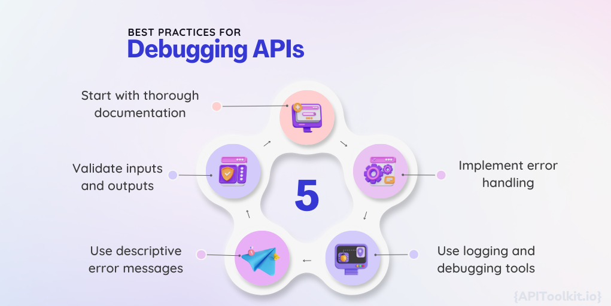

# Mastering API Debugging and Monitoring: Best Practices for Seamless Integration

Today the integration of Application Programming Interfaces (APIs) has become essential for seamless communication between software systems. As [API](https://apitoolkit.io/blog/how-to-generate-automated-api-documentation/) play a crucial role in modern-day application development, efficient debugging and [monitoring](https://apitoolkit.io/blog/best-api-monitoring-and-observability-tools/) are vital for ensuring their smooth operation. This article will explore the best practices for mastering API debugging and monitoring, equipping developers with the tools and techniques needed to streamline their workflow and deliver reliable solutions.

## Streamlining Navigation with Skip Links

Navigation is a fundamental aspect of any website, and providing an accessible experience for all users is crucial. Skip links offer a simple yet effective solution to enhance accessibility by allowing users to bypass repetitive navigation and jump directly to the main content.

When it comes to web design, accessibility should always be a top priority. It's not just about creating visually appealing websites, but also ensuring that individuals with disabilities or impairments can navigate through them effectively. Skip links play a vital role in this aspect.

By including skip links, users can easily bypass repetitive navigation menus and access the main content with just a few clicks or keystrokes. This is particularly useful for individuals who rely on screen readers or keyboard navigation. It allows them to skip over the repetitive elements and jump straight to the heart of the website.

Moreover, implementing skip links is not only beneficial for users but also for businesses. In many countries, there are accessibility standards and regulations that websites must comply with. By making your website accessible to everyone, you not only promote inclusivity but also avoid potential legal issues.

### Enhancing Accessibility with Skip Links

Now that we understand the importance of skip links, let's dive deeper into how they enhance accessibility. Skip links provide a clear and concise way for users to navigate through a website without getting lost in a sea of repetitive navigation menus.

Imagine a user who relies on a screen reader to browse the web. Without skip links, they would have to listen to the entire navigation menu every time they visit a new page. This can be time-consuming and frustrating. However, with skip links, they can simply jump to the main content and start consuming the information they need.

Similarly, individuals who navigate websites using only their keyboards can benefit greatly from skip links. Instead of tabbing through every single navigation link, they can quickly jump to the content that interests them. This saves time and makes the browsing experience much more efficient.

### How to Implement Skip Links in Your Website

Implementing skip links in your website is a relatively straightforward process. By using HTML and CSS, you can provide users with a convenient way to navigate through your site:

1. Create a skip navigation link that is hidden by default using CSS. This link should anchor to the main content section.
2. Assign keyboard focus to the skip link when the page loads, allowing users to easily access it using the tab key.
3. When the skip link is focused, show it to users by changing its CSS properties.
4. Ensure that the skip link is easily visible and distinguishable from other page elements. You can achieve this by using contrasting colors or adding a visually appealing design.
5. Test the skip link functionality on various devices and assistive technologies to ensure compatibility and accessibility. It's important to make sure that the skip links work seamlessly across different platforms and assistive technologies.

Remember, implementing skip links is just one step towards creating an accessible website. It's crucial to follow other accessibility best practices, such as providing alternative text for images, using semantic HTML, and ensuring proper color contrast. By combining these efforts, you can create a truly inclusive web experience for all users.

## Simplifying API Debugging for Developers

API debugging is a critical aspect of software development that can often be challenging and time-consuming. However, with the right set of best practices and tools, developers can streamline the debugging process and efficiently identify and resolve issues.

### Best Practices for Debugging APIs

When it comes to debugging APIs, following these best practices can significantly improve the efficiency and effectiveness of the process:

- **Start with thorough documentation:** Familiarize yourself with the [API's documentation](https://apitoolkit.io/blog/how-to-generate-automated-api-documentation/) to understand its behavior, expected inputs, and responses.
- **Validate inputs and outputs:** Ensure that the data being sent to and received from the [API](https://apitoolkit.io/blog/how-to-generate-automated-api-documentation/) is valid and meets the required specifications.
- **Use descriptive error messages:** Provide clear and informative error messages to facilitate debugging and troubleshooting.
- **Implement error handling:** Prepare your code to handle potential errors gracefully, minimizing disruptions to the application's functionality.
- **Use logging and debugging tools:** Leverage logging and debugging tools to gain insights into the API's behavior, track code execution, and identify potential issues.

### Tools and Techniques for Effective API Debugging

Developers have access to a wide range of tools and techniques to aid the debugging process. Here are a few essential tools and techniques that can simplify API debugging:

- **API testing tools:** Use tools such as [APIToolkit](https://apitoolkit.io/) to send requests, analyze responses, and troubleshoot issues.
- **Logging libraries:** Incorporate logging libraries, such as log4j or Winston, to generate detailed logs and track the flow of your API code.
- **Debugging proxies:** Debugging proxies like Charles or Fiddler allow you to intercept [API](https://apitoolkit.io/blog/how-to-generate-automated-api-documentation/) requests and responses, analyze them, and pinpoint potential problems.
- **API documentation tools:** Utilize tools like APIToolkit to generate and visualize [automated API documentation](https://apitoolkit.io/blog/how-to-generate-automated-api-documentation/), making it easier to understand and debug.

## Avoiding Common Debugging Mistakes

Even experienced developers can make mistakes during the debugging process, potentially prolonging the resolution time. By being aware of common pitfalls and applying troubleshooting tips, developers can minimize debugging errors and navigate the process more efficiently.

### Troubleshooting Tips for Debugging Code

When faced with a challenging debugging scenario, keep these troubleshooting tips in mind to effectively identify and solve issues:

- **Reproduce the issue:** Understand the steps needed to replicate the problem consistently, enabling easier troubleshooting and verification of the solution.
- **Check the environment:** Verify that the environment in which the code is running matches the expected configuration, including dependencies and versions.
- **Use breakpoints:** Set breakpoints strategically to pause code execution and inspect variables, allowing you to identify incorrect values or unexpected behavior.
- **Isolate the problem:** Temporarily remove sections of code or third-party integrations to identify the specific component causing the issue.
- **Seek external help:** If you reach a roadblock, don't hesitate to seek help from peers, online communities, or support resources to gain fresh perspectives and insights.

### Common Pitfalls to Watch Out for During Debugging

Debugging can be a complex and intricate process, with several common pitfalls that developers should be mindful of:

- **Assuming the cause:** Avoid jumping to conclusions without thorough investigation and verification. Assumptions can lead to wasted time and effort.
- **Overlooking simple mistakes:** Pay attention to small details and double-check simple things like typos, incorrect variable names, or missing parentheses.
- **Ignoring error messages:** Error messages often provide valuable clues about the problem. Read them carefully and use them as a starting point for debugging.
- **Not documenting changes:** Keep track of modifications made during debugging to facilitate future reference and avoid introducing new issues.
- **Skipping testing:** Comprehensive testing is essential after making code changes. Skipping testing can lead to unanticipated side effects or incomplete solutions.

## Essential Tools for Debugging Success

Having the right set of tools is crucial for successful and efficient debugging. Here are some must-have debugging tools that every developer should consider:

### Must-Have Debugging Tools for Developers

These tools provide powerful features that simplify the debugging process and enable developers to identify and solve issues efficiently:

- **Integrated Development Environments (IDEs):** IDEs like Visual Studio Code, IntelliJ IDEA, or Eclipse offer powerful debugging capabilities, including breakpoints, variable inspection, and step-by-step execution.
- **Remote debugging tools:** Tools like Chrome DevTools enable developers to debug code running on remote devices or browsers, allowing for efficient troubleshooting across different environments.
- **Error tracking solutions:** Platforms such as Sentry or Rollbar help track and analyze errors in real-time, providing valuable insights and reducing debugging time.
- **Memory profilers:** Profiling tools like Java VisualVM or Chrome DevTools Memory panel help identify memory leaks, excessive memory usage, and optimize application performance.

### Exploring Advanced Debugging Tools and Techniques

Advanced debugging tools and techniques offer additional capabilities for tackling complex issues and optimizing code performance. Consider expanding your debugging arsenal with these tools and techniques:

- **Performance profilers:** Profiling tools such as VisualVM or Google Chrome Performance Tab analyze application performance, identifying bottlenecks and areas for optimization.
- **Remote debugging with breakpoints:** Debug code running on remote servers or devices by setting breakpoints using tools like PyCharm Debugger or Chrome DevTools.
- **Dynamic code analysis:** Tools like SonarQube perform static code analysis to detect potential issues, security vulnerabilities, and code smells during the development process.
- **Real-time log monitoring:** Tools [APIToolkit](https://apitoolkit.io/) provide real-time log analysis and [monitoring](https://apitoolkit.io/blog/best-api-monitoring-and-observability-tools/) , enabling swift detection of anomalies or errors.

## Conclusion

Mastering [API](https://apitoolkit.io/blog/how-to-generate-automated-api-documentation/) debugging and [monitoring](https://apitoolkit.io/blog/best-api-monitoring-and-observability-tools/) is essential for developers striving to deliver seamless integration between software systems. By following best practices, leveraging effective tools, and avoiding common pitfalls, developers can streamline the debugging process and ensure their APIs operate reliably. With the right techniques and tools at their disposal, developers can overcome challenges, enhance productivity, and create robust and successful software solutions.

**Keep Reading**

- [Web API Performance Best Practices: the Ultimate Guide](https://apitoolkit.io/blog/web-api-performance/)
- [10 Must-Know API trends in 2023](https://apitoolkit.io/blog/api-trends/)
- [How to Analyze API Logs and Metrics for Better Performance](https://apitoolkit.io/blog/api-logs-and-metrics/)
- [Incident Management: How to Resolve API Downtime Issues Before It Escalates](https://apitoolkit.io/blog/api-downtime/)
- [How to Tackle Anomalies in RESTful APIs](https://apitoolkit.io/blog/anomalies-in-restful-apis/)
- [Top 7 Reasons Why Your Team Should Use an API Monitoring Tool](https://apitoolkit.io/blog/why-you-need-an-api-monitoring-tool/)
