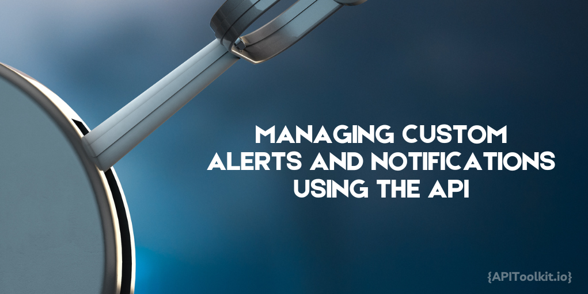
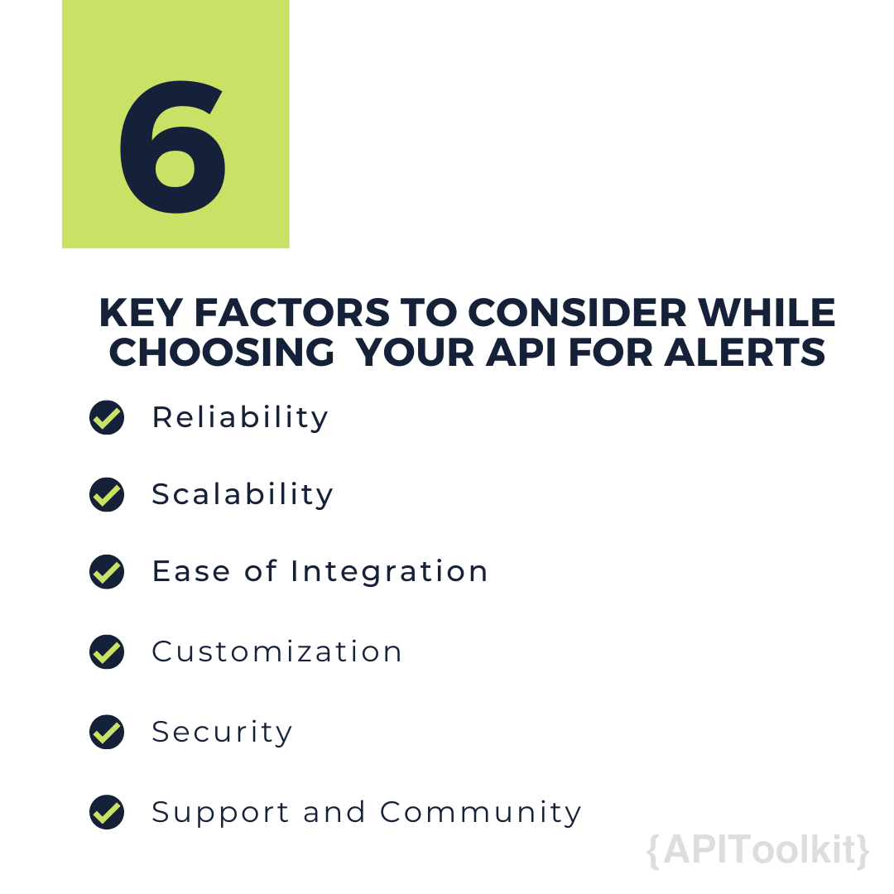

For any app to be really useful, it needs to be able to send you little nudges like reminders or updates, right when you need them. That's where the API comes in, kind of like a behind-the-scenes messenger that helps different parts of the app chat with each other and get those messages out to you.

APIs act as the app's way of writing little notes. These notes need to get from one part of the app to another, or even to other apps and services, without getting mixed up. It's like having an expert note passer in a classroom who never gets caught and always knows who's supposed to get which note. When it comes to those little nudges (or [alerts](https://apitoolkit.io/blog/best-practices-for-implementing-custom-alerts/)) the app sends you, the API makes sure they're timely, relevant, and don't end up in the wrong hands. So, it's all about making sure the right info gets to you at the right time, in the simplest way possible.

## The Role of APIs in Alert Management

APIs are important in customizing and managing alerts. They offer developers the flexibility to define what triggers an alert, how it's formatted, and the way it's delivered to users. This level of customization is crucial for creating a user experience that is not only engaging but also relevant to the individual needs of each user. With APIs, you can [custom alerts](https://apitoolkit.io/blog/best-practices-for-implementing-custom-alerts/) to the specific preferences and behaviors of your users. Whether it's a push alert, an email alert, or an SMS, APIs enable you to personalize the message content, timing, and delivery channels, ensuring that the right message reaches the right user at the right time.

In our world today real-time interaction is key, APIs provide the infrastructure to send instant alerts in response to specific events or actions. This immediate feedback loop enhances user engagement and keeps your audience informed and up-to-date. APIs are designed to handle a vast number of requests, making them ideal for applications that require the delivery of alerts to a large audience. Moreover, their integration capabilities mean that you can connect your application with various messaging platforms and services, expanding your reach and ensuring a consistent experience across different channels.

 

## Choosing and Setting Up Your API for alerts

Selecting an appropriate API for managing alerts  is crucial. Here are some key factors to consider:

1. **Reliability**: Your chosen API should guarantee high availability and consistent performance to ensure that your [alerts](https://apitoolkit.io/blog/best-practices-for-implementing-custom-alerts/) are delivered without delays or disruptions. Look for APIs with a proven track record of uptime and robust failover mechanisms.

2. **Scalability**: As your application grows, so does the volume of alerts . The API must be scalable, capable of handling an increasing number of requests without degrading performance. Scalability ensures that your alert system can grow with your user base.

3. **Ease of Integration**: The API should integrate smoothly with your existing infrastructure. A well-documented API with comprehensive support for various programming languages and frameworks will make the integration process more straightforward.

4. **Customization**: The ability to tailor [alerts](https://apitoolkit.io/blog/best-practices-for-implementing-custom-alerts/) to specific user needs and preferences is vital. Choose an API that offers flexibility in the content, timing, and format of alerts.

5. **Security**: With the increasing importance of data protection, the API must have robust security measures to safeguard sensitive information and ensure user privacy.

6. **Support and Community**: Check for the availability of support from the API provider and resources like community forums, which can be invaluable for troubleshooting and best practices.

Once you are able to understand the role of APIs in enhancing communication through alerts, the next step is setting up your API. This involves choosing the right API that aligns with your needs and configuring it to fit your application's requirements.

## Configuration Basics

After selecting the right API, the next step is to configure it for your application. Setting up your API for alerts is a critical step in creating an effective communication channel with your users. By carefully selecting and configuring your API, you ensure that your application can send timely, relevant, and personalized alerts, enhancing user engagement and satisfaction. Here's a basic walkthrough:

### Step 1: API Authentication
The first step is to authenticate your application with the API. This usually involves registering your application with the [API](https://apitoolkit.io/blog/leveraging-api-logs/) provider to receive an API key or token, which will be used in your API requests to authenticate your application.

### Step 2: Setting Permissions
Determine the level of access your application needs. Most APIs allow you to set permissions to restrict what your application can do, enhancing security. Ensure you request only the necessary permissions to perform the required tasks.

### Step 3: Initial API Settings
Configure the initial settings for your API integration. This may include setting up endpoints, defining default alert templates, and specifying retry policies for failed [alerts](https://apitoolkit.io/blog/stay-ahead-of-the-curve/). Tailor these settings to match your application's needs and alert strategy.

### Step 4: Test Your Setup
Before going live, test your API integration thoroughly. Use the API's sandbox environment, if available, to simulate alerts and ensure everything works as expected. Testing helps identify and rectify any issues before they affect your users.

## Making Alerts Smarter with APIs

This is about sending the perfect note at the perfect moment in a way that clicks with your users. APIs are like your toolkit for crafting these [smart alerts](https://apitoolkit.io/blog/stay-ahead-of-the-curve/), turning each notification into a chance to make the user experience even better.

### Setting Up Smart Triggers for Alerts

Smart triggers are the secret sauce that decides when an alert should pop up. They make sure your app talks to [users](https://apitoolkit.io/blog/api-logs-and-user-behaviour-tracking/) at just the right times, based on what they're doing or what's happening in the app. Here's a breakdown of how you can set these triggers up:

**When Users Do Something Special**: Think about the moments in your app that deserve a high-five, like when a user finishes a big task or hits a new level. You can set up the API to watch for these moments and send a celebratory alert their way.

**When It's About Time**: There are times when you need to nudge users gently, maybe to remind them of something or give them a regular update. With APIs, you can set your alerts to be like clockwork, popping up at just the right time, whether it's every day, week, or month.

**Watching How Users Move**: By keeping an eye on how [users](https://apitoolkit.io/blog/api-logs-and-user-behaviour-tracking/) interact with your app, you can catch when they might need a little prompt. Maybe they haven't checked in for a while, or they've been stuck on a page for too long. Setting up alerts for these scenarios can give them the nudge they need, just when they need it.

### Making Alerts Feel Personal

Getting an alert that feels like it's just for you can make a big difference. That's where personalizing alerts comes in, and APIs are here to help. Let's look at some ways you can make each alert feel like it's tailor-made:

**Let Users Have Their Say**: Imagine letting users pick exactly what kind of alerts they want and how often they want them. With APIs, you can do just that. Users can set their preferences, and the API will remember to send alerts just the way they like, making every notification feel right on point.

**Speak Their Language**: An alert that says "Good Morning!" feels warmer when it arrives in the morning, doesn't it? And it's even nicer when it's in your own language. APIs can tweak alerts based on where [users](https://apitoolkit.io/blog/api-logs-and-user-behaviour-tracking/) are, what language they speak, and even local customs, making each message hit home.

**It's All in the Details**: What if an alert knew your name or remembered what you did last in the app? APIs can add those personal touches, like greeting you by name or giving tips based on how you use the app. It's like having a friend in the app who knows just what you need.

## Managing alerts Effectively

Managing alerts well is key to keeping users happy and making sure your alert system works smoothly. It's all about giving users control over what they want to hear from you and keeping an eye on how well your alerts are doing.

First up, let's talk about user management. It's super important for users to feel in charge of the alerts they get. They should be able to say "yes" to the alerts they like and "no" to the ones they don't want, right from the start or anytime they change their mind. This means having a clear way for them to sign up for alerts and letting them customize what they get and how often. It's like giving them the remote control to their alerts, so they only get the ones that matter to them.

But it's not just about letting users choose; it's also about making sure their choices stick. Your system needs to remember who said no to what and make sure they don't get those alerts. It's like keeping a promise to your users that you'll only talk to them when they want to hear from you.

By getting user management right and always checking on how your alerts are doing, you make sure your app sends the right message at the right time, keeping users engaged without overwhelming them. It's a win-win: your users stay happy, and your alert system stays smart and efficient.

## Performance Monitoring

Personalizing alerts through APIs transforms standard notifications into engaging, tailor-made messages that resonate with each user. By tapping into user preferences, you allow individuals to dictate the types of alerts they receive and their frequency. This customization ensures that every alert feels relevant, whether it's a gentle reminder for an upcoming event or a congratulatory note for achieving a milestone. APIs serve as the backbone for these personalized experiences, storing and applying user settings to deliver alerts that align perfectly with individual expectations and needs.

However, the power of APIs extends to adapting alerts to fit the cultural and linguistic context of each user. By considering factors like location, language, and even local customs, APIs enable alerts to greet users in their own language and at the right time, adding a warm, personal touch to each message. This level of localization not only enhances the relevance of alerts but also boosts user engagement by making each interaction feel more thoughtful and considerate.

Beyond mere preferences and localization, APIs allow for deep content customization, making alerts feel incredibly personal. Whether it's incorporating the user's name, referencing their recent activities within the app, or suggesting next steps based on their usage patterns, these details make each alert feel like a one-on-one conversation. This approach turns alerts from mere interruptions into meaningful engagements, fostering a closer connection between the app and its users. Through the strategic use of APIs, alerts become an integral part of enhancing the user experience, making every notification a moment of delight.

## Conclusion

In this article, we talked about how important it is to communicate well with users through custom alerts, and how APIs make this possible. APIs help make alerts that are just right for each user, sending them at the best time and in a way that makes sense to them. We learned how to pick the right API, set it up, and make sure every alert is something the user will find useful and interesting. We also talked about keeping users in control by letting them choose what alerts they get and making sure all their information is safe and private.

Using APIs for alerts is a great way to make your app better at talking to users in a way they like. It makes your app smarter and more in tune with what users need. If you start using these tools in your app, you'll not only make your users happier but also make your app stand out in a busy digital world. So, it's worth giving it a try and seeing how it can change the way your app connects with people.

## Keep Reading

[How to Write API Documentation: 14 Essential Guidelines](https://apitoolkit.io/blog/how-to-write-api-docs/)

[Web API Performance Best Practices - the Ultimate Guide](https://apitoolkit.io/blog/web-api-performance/)

[How to Analyze API Logs and Metrics for Better Performance](https://apitoolkit.io/blog/api-logs-and-metrics/)

[API Documentation and Monitoring: the Truth You Must Know](https://apitoolkit.io/blog/api-documentation-and-observability-the-truth-you-must-know/)

[Mastering API Debugging and Monitoring: Best Practices for Seamless Integration](https://apitoolkit.io/blog/mastering-api-debugging/)
