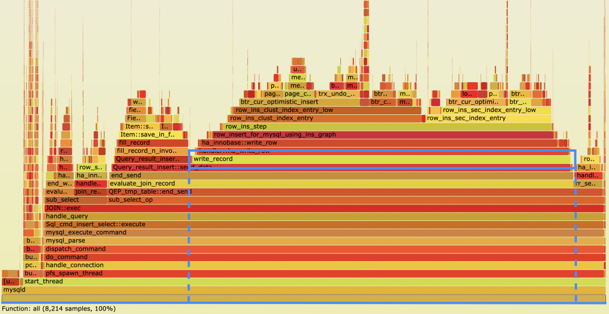

# Maximizing Your API Performance with Effective Monitoring Strategies

APIs have become an essential component of modern software development, enabling seamless communication between different applications and systems. However, ensuring that your API performs at its best can be a challenging task, especially when dealing with complex integrations and high traffic volumes. The key to maximizing your API performance lies in implementing effective monitoring strategies that provide real-time insights into its behavior and usage. By leveraging the right tools and techniques, you can identify potential performance bottlenecks, track usage patterns, and proactively address issues before they impact your users. In this article, we'll explore some of the best practices for monitoring and optimizing your API's performance, including the use of performance metrics, logs, and alerts. Whether you're a seasoned developer or just starting with APIs, you'll find valuable insights and practical tips to help you improve your API's performance and deliver a seamless user experience. So, let's dive in and discover how to get the most out of your API with effective monitoring strategies.

## Importance of API performance monitoring

API performance monitoring is critical for ensuring that your API is performing at its best. It provides insights into the usage patterns, traffic volumes, and potential performance bottlenecks. Monitoring your API's performance allows you to proactively identify and address issues before they impact your users, ensuring a seamless user experience. Additionally, monitoring can help you optimize your API's performance, leading to faster response times, reduced downtime, and increased scalability.

## Common API performance issues and their impact

Several factors can impact your API's performance, including network latency, server load, and code inefficiencies. Some of the common performance issues include slow response times, high error rates, and poor scalability. Slow response times can lead to user frustration and abandonment, while high error rates can result in lost revenue and a damaged reputation. Poor scalability can limit your API's ability to handle high traffic volumes, leading to downtime and lost business opportunities.

## Choosing the right API monitoring tools

Choosing the right API monitoring tools is critical for effective performance monitoring. There are several tools available, ranging from free to paid options. Some popular tools include Google Cloud Monitoring, Datadog, and New Relic. When selecting monitoring tools, consider factors such as ease of use, scalability, and integration with your existing systems. 

## Key metrics to track for API performance monitoring

Tracking the right metrics is essential for effective API performance monitoring. Some of the key metrics to track include response time, error rate, and throughput. Response time measures the time it takes for your API to respond to a request, while error rate tracks the percentage of requests that result in errors. Throughput measures the number of requests your API can handle in a given time frame. Additionally, tracking metrics such as CPU usage, memory usage, and network latency can provide insights into potential performance bottlenecks.

## Real-time monitoring vs. periodic monitoring

Real-time monitoring provides continuous insights into your API's behavior and usage, allowing you to proactively address issues as they arise. Periodic monitoring, on the other hand, provides insights at set intervals, such as every hour or day. While periodic monitoring is useful for tracking long-term trends, real-time monitoring is essential for identifying and addressing issues as they occur.

## Best practices for API performance monitoring

To ensure effective API performance monitoring, it's essential to follow some best practices. First, establish a baseline performance metric to measure against. This enables you to track any deviations from the norm and identify potential issues. Second, set up alerts to notify you when key metrics fall outside of acceptable ranges. This allows you to proactively address issues before they impact your users. Finally, conduct regular performance testing to identify potential bottlenecks and optimize your API's performance.

## Strategies for troubleshooting API performance issues

When issues arise with your API's performance, troubleshooting strategies can help you identify and address them quickly. First, isolate the issue by identifying the specific component or code that's causing the problem. Then, use tools such as logs and performance metrics to pinpoint the root cause of the issue. Finally, implement a fix and monitor the performance to ensure that the issue has been resolved.

## Tips for optimizing API performance

Optimizing your API's performance can lead to faster response times, reduced downtime, and increased scalability. Some tips for optimizing your API's performance include reducing network latency, optimizing code efficiency, and leveraging caching. Additionally, consider implementing load balancing and scaling techniques to handle high traffic volumes.

## Conclusion and future of API performance monitoring

Effective API performance monitoring is critical for ensuring a seamless user experience and optimizing your API's performance. By tracking key metrics, implementing monitoring tools, and following best practices, you can identify and address potential issues before they impact your users. As APIs continue to play a vital role in modern software development, the importance of effective performance monitoring will only continue to grow. By staying up-to-date with the latest tools and techniques, you can ensure that your API performs at its best, enabling seamless communication between different systems and applications. 
In conclusion, maximizing your API performance with effective monitoring strategies is essential for ensuring a seamless user experience and optimizing your API's performance. By implementing the right tools and techniques, you can identify potential bottlenecks, track usage patterns, and proactively address issues before they impact your users. By following best practices, troubleshooting issues, and optimizing your API's performance, you can ensure that your API performs at its best, leading to faster response times, reduced downtime, and increased scalability.
