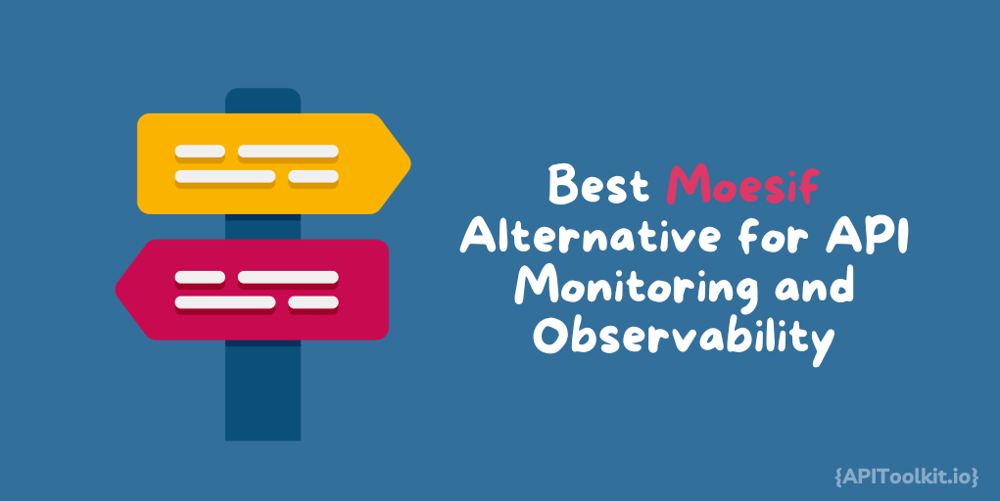
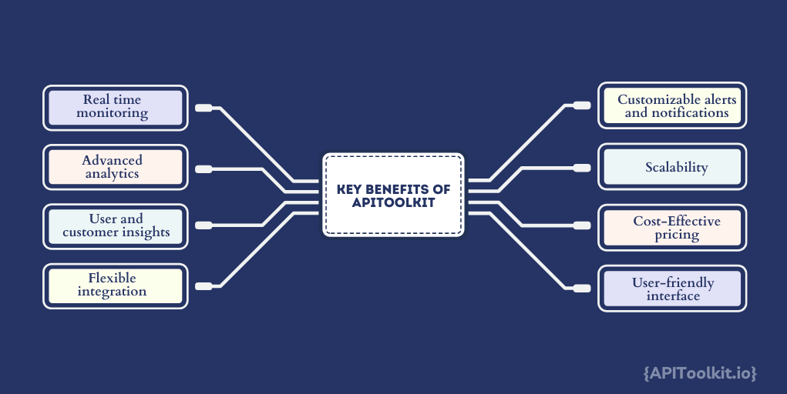

# APIToolkit: Best Moesif Alternative for API Monitoring and Observability

APIs are complex systems, and their proper functioning is crucial for delivering a seamless user experience and maintaining business operations. Any glitches, slowdowns, or errors in your [APIs](https://apitoolkit.io/blog/top-7-better-stack-alternative-for-api-monitoring-and-observability./) can result in frustrated users, lost revenue, and damage to your brand's reputation. This is where API monitoring and observability come into play. API monitoring involves the real-time tracking of your API endpoints, ensuring that they are available, responsive, and operating within predefined performance parameters. It helps you identify issues promptly and respond proactively to prevent service disruptions.

Observability, on the other hand, delves deeper into API behavior, providing insights into the inner workings of your applications. It enables you to understand how different components interact and diagnose the root causes of problems. With observability, you can gain valuable data to optimize performance, troubleshoot issues, and make informed decisions.

Moesif, a popular API analytics and [monitoring](https://apitoolkit.io/blog/error-monitoring-best-practices/) platform, has been a reliable choice for many businesses seeking to ensure the reliability and performance of their APIs. However, as the API landscape continues to evolve, it's essential to explore alternative solutions that may better align with your specific requirements and challenges.

In this article, we'll  discuss APIToolkit as an alternative to Moesif for API monitoring and observability. We'll delve into its features, benefits, and how it addresses the limitations of Moesif. By the end of this article, you'll have a clear understanding of why APIToolkit could be the right choice for your [API monitoring](https://apitoolkit.io/blog/error-monitoring-best-practices/) needs. Let's embark on this journey to discover the next-generation solution for API observability and performance optimization.

## Understanding Moesif

**Overview of Moesif API Analytics**

Moesif API Analytics is a widely recognized platform that offers comprehensive solutions for monitoring and analyzing APIs. It provides valuable insights into your API traffic, enabling you to track the performance, usage, and behavior of your APIs effectively. Here's a brief overview of Moesif's key features:

- **Real-time Monitoring**: Moesif offers real-time monitoring of your API endpoints, allowing you to detect issues promptly and minimize downtime.

- **Traffic Analysis**: It provides detailed insights into your API traffic, including request and response data, status codes, and error rates.

- **User and Customer Insights**: Moesif helps you understand how different users and customers interact with your APIs, allowing you to tailor your services to their needs.

- **Error Tracking**: The platform identifies and tracks errors and anomalies in your API traffic, helping you troubleshoot issues and improve reliability.

- **Integrations**: Moesif offers integrations with popular API gateways, libraries, and platforms, making it easy to incorporate into your existing development stack.

**Pros and Cons of Moesif**

As with any technology solution, Moesif comes with its own set of advantages and limitations. Here's a look at some of the pros and cons associated with Moesif:

*Pros:*

1. **Comprehensive Analytics**: Moesif offers detailed insights into API traffic, helping you make data-driven decisions and optimize API performance.

2. **User-Centric Approach**: It provides valuable user and customer insights, allowing you to understand how your APIs impact individual users and businesses.

3. **Real-time Monitoring**: Moesif's real-time monitoring capabilities ensure that you can respond quickly to issues, minimizing service disruptions.

4. **Ease of Integration**: The platform offers integrations with various API gateways and platforms, making it versatile and adaptable to different environments.

*Cons:*

1. **Cost**: Moesif can be relatively expensive, especially for businesses with high API traffic volumes, which may not fit all budgets.

2. **Learning Curve**: The complexity of Moesif's feature set may require some time for users to become proficient in utilizing all its capabilities effectively.

3. **Limited Customization**: While it provides a robust set of features, some users may find that it lacks certain customization options to tailor the platform to their specific needs.

4. **Resource Intensive**: For very high-traffic APIs, the resource requirements to run Moesif effectively may be significant.

## APIToolkit as an Ideal Monitoring and Observability Tool

APIToolkit is a robust and innovative API monitoring and observability platform designed to empower businesses with the tools and insights they need to ensure the reliability, performance, and security of their APIs. Whether you're managing a single API or a complex ecosystem of interconnected services, APIToolkit offers a comprehensive solution to meet your monitoring and observability needs.

### Key Features and Benefits

APIToolkit distinguishes itself with a range of powerful features and benefits that make it a compelling alternative to Moesif and other [API monitoring](https://apitoolkit.io/blog/rum-vs-synthetic-monitoring/) solutions. Here's a closer look at some of its key features and the advantages it brings:

1. **Real-time API Monitoring**: APIToolkit provides real-time monitoring of your API endpoints, offering immediate visibility into their health and performance. This enables you to detect and address issues promptly, reducing downtime and enhancing user experience.

2. **Advanced Analytics**: The platform offers advanced analytics capabilities, including in-depth traffic analysis, error tracking, and performance metrics. With detailed insights into API usage, you can make informed decisions to optimize your services.

3. **User and Customer Insights**: APIToolkit goes beyond technical metrics to provide user and customer insights. You can understand how individual users and businesses interact with your APIs, tailoring your offerings to their needs.

4. **Flexible Integrations**: APIToolkit is designed for easy integration with various API gateways, cloud platforms, and developer tools. It seamlessly fits into your existing development stack, ensuring a smooth transition.

5. **Customizable Alerts and Notifications**: You can set up customizable alerts and notifications based on predefined thresholds or specific API events. This proactive approach allows you to respond swiftly to potential issues.

6. **Scalability**: APIToolkit is scalable to accommodate APIs of all sizes, from startups to large enterprises. It can handle high-traffic APIs efficiently without compromising on performance.

7. **Cost-Effective Pricing**: APIToolkit offers competitive and flexible pricing plans, making it accessible to businesses of all sizes. You can choose a plan that aligns with your budget and usage requirements.

8. **User-Friendly Interface**: The platform features an intuitive and user-friendly interface, reducing the learning curve and enabling your team to get up to speed quickly.

## Why Consider an Alternative to Moesif?

### Limitations and Drawbacks of Moesif

While Moesif is a respected [API monitoring](https://apitoolkit.io/blog/rum-vs-synthetic-monitoring/) solution, it's essential to be aware of its limitations and drawbacks that may prompt businesses to seek alternatives:

1. **Cost Constraints**: Moesif can be relatively expensive, particularly for companies with high API traffic volumes. This pricing model may not align with the budgetary constraints of some businesses, especially startups and small enterprises.

2. **Complexity**: The breadth and depth of Moesif's features can lead to a learning curve for new users. For teams looking for a simpler and more straightforward solution, this complexity may be a hurdle.

3. **Limited Customization**: Moesif offers a range of features, but some users may find that it lacks the flexibility to customize the platform to their specific needs. This limitation can be problematic when dealing with unique API monitoring requirements.

4. **Resource Intensive**: Running Moesif effectively for very high-traffic APIs may require substantial hardware resources. Smaller companies with limited infrastructure may face challenges in implementing it at scale.

### How APIToolkit Addresses These Issues

APIToolkit addresses these limitations of Moesif and offers innovative solutions to provide a more accessible and user-friendly alternative:

1. **Cost-Effective Pricing**: APIToolkit's pricing plans are designed to cater to businesses of all sizes. It offers cost-effective options that ensure you're only paying for what you use, making it a budget-friendly choice.

2. **Intuitive User Interface**: APIToolkit's user-friendly interface reduces the learning curve, making it easy for both novice and experienced users to harness the power of API monitoring and observability.

3. **Customization Options**: APIToolkit offers flexibility and customization to adapt the platform to your unique requirements. You can tailor alerts, notifications, and metrics to suit your specific use cases.

4. **Efficient Resource Management**: APIToolkit is built to be efficient, even for high-traffic APIs. It optimizes resource utilization, ensuring that you can monitor your APIs effectively without overburdening your infrastructure.

By addressing these issues, APIToolkit not only provides a compelling alternative to Moesif but also offers a user-centric approach that prioritizes affordability, ease of use, and customization. In the following sections, we'll dive deeper into the feature-by-feature comparison between Moesif and APIToolkit to help you make an informed decision for your API monitoring needs.

## Comparison: Moesif vs. APIToolkit

| **Feature Comparison: Moesif vs. APIToolkit**   | **Moesif**                                    | **APIToolkit**                                      |
| ----------------------------------------------- | --------------------------------------------- | ---------------------------------------------------- |
| **Real-time Monitoring**                        | Provides [real-time monitoring](https://apitoolkit.io/blog/error-monitoring-best-practices/) for APIs       | Offers real-time monitoring with customizable alerts and notifications |
| **Traffic Analysis**                            | Offers detailed insights into API traffic, request and response data, and error tracking | Provides advanced traffic analysis, error tracking, and performance metrics with user-friendly visualizations |
| **User and Customer Insights**                 | Provides insights into API users and customers | Offers user and customer insights with customizable metrics and reports |
| **Integration Options**                         | Integrates with various API gateways and libraries | Offers versatile integrations with API gateways, cloud platforms, and developer tools |
| **Customization**                               | Provides limited customization options        | Offers extensive customization capabilities, allowing you to tailor alerts, notifications, and metrics to your specific needs |
| **Scalability**                                | Scales well but may require significant resources for very high-traffic APIs | Designed for scalability, efficiently handling high-traffic APIs without compromising on performance |

### Performance and Scalability:

- **Moesif**: It is known for good performance but may require significant resources for very high-traffic APIs.

- **APIToolkit**: It is designed for scalability, efficiently handling high-traffic APIs while optimizing resource consumption for cost-effectiveness.

## Making the Right Choice for Your API Monitoring Needs

The choice between Moesif and APIToolkit ultimately depends on your specific [API monitoring](https://apitoolkit.io/blog/rum-vs-synthetic-monitoring/) needs and priorities. When evaluating these solutions, consider factors such as budget, ease of use, customization requirements, and scalability.

APIToolkit distinguishes itself by offering cost-effective pricing, an intuitive user interface, extensive customization options, and efficient resource management. It is designed to accommodate APIs of all sizes, making it accessible to startups, small businesses, and large enterprises alike.

Before making a decision, assess your organization's API monitoring requirements, evaluate your budget constraints, and consider the scalability needed for your APIs. By carefully weighing these factors and reviewing the feature comparisons, you can confidently choose the solution that best suits your API monitoring and observability needs.

As the API landscape continues to evolve, having a reliable and adaptable monitoring solution is essential to ensure the seamless operation of your APIs and the satisfaction of your users. Whether you opt for Moesif, APIToolkit, or another alternative, investing in robust [API monitoring](https://apitoolkit.io/blog/the-most-important-metric/) and observability is a crucial step toward achieving operational excellence in the digital age.

## Conclusion

In this article, we've explored the world of API monitoring and observability, emphasizing their critical importance in today's technology-driven landscape. We began by highlighting the significance of API monitoring and the growing need for Moesif alternatives to meet the evolving demands of businesses.

We introduced you to APIToolkit, a robust alternative to Moesif, and provided an in-depth look at its features and benefits. APIToolkit's real-time [monitoring](https://apitoolkit.io/blog/the-most-important-metric/), advanced analytics, user insights, and customization options make it a powerful contender in the API monitoring space.

We also discussed the limitations and drawbacks of Moesif, such as cost constraints, complexity, limited customization, and resource-intensive requirements. These considerations have led many businesses to explore alternatives that can better align with their unique requirements.

## Keep Reading

[Best RapidAPI Alternatives for Api Monitoring and Observability](https://apitoolkit.io/blog/best-rapidapi-alternatives-for-api-monitoring-and-observability/)

[Top 7 Reasons Why Your Team Should Use an API Monitoring Tool](https://apitoolkit.io/blog/why-you-need-an-api-monitoring-tool/)

[Ultimate Guide to API Testing Automation](https://apitoolkit.io/blog/api-testing-automation)

[How to Analyze API Logs and Metrics for Better Performance](https://apitoolkit.io/blog/api-logs-and-metrics/)

[Incident Management: How to Resolve API Downtime Issues Before It Escalates](https://apitoolkit.io/blog/api-downtime/)

[How to Tackle Anomalies in RESTful APIs](https://apitoolkit.io/blog/anomalies-in-restful-apis/)
