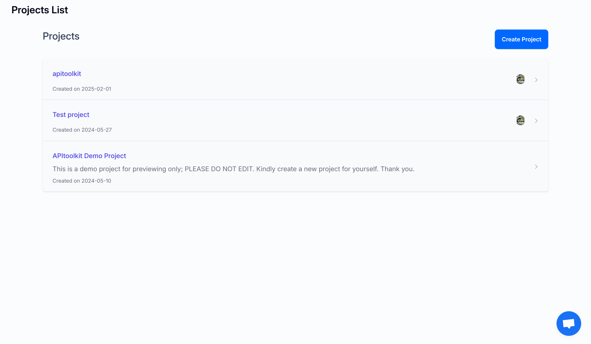
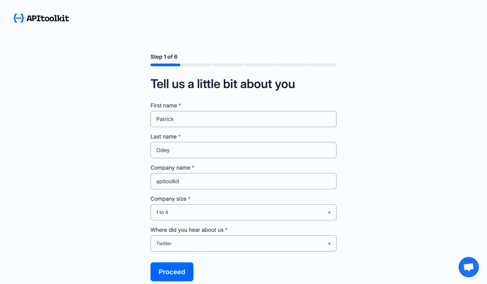
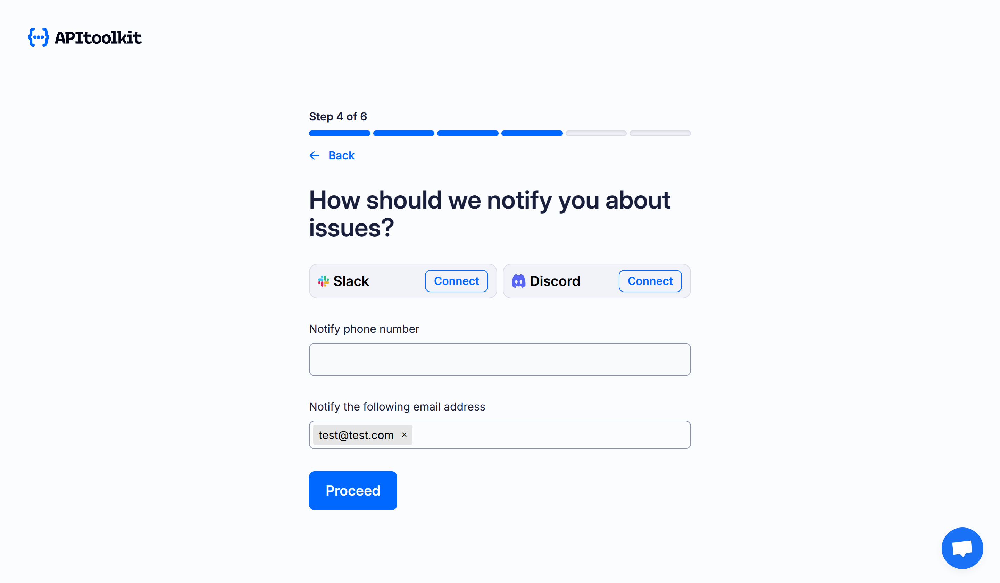
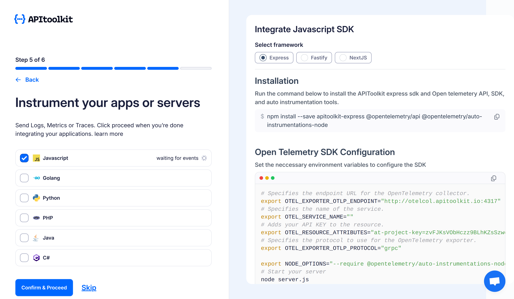
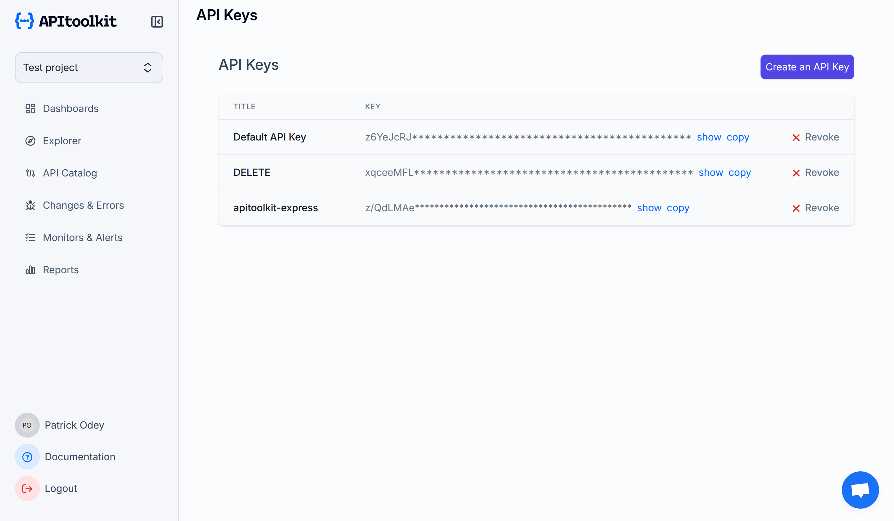
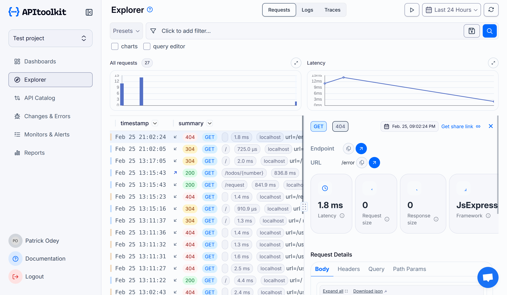
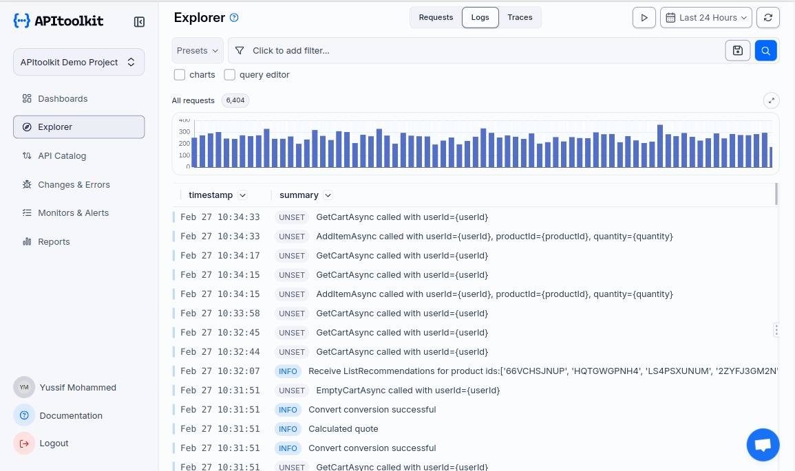
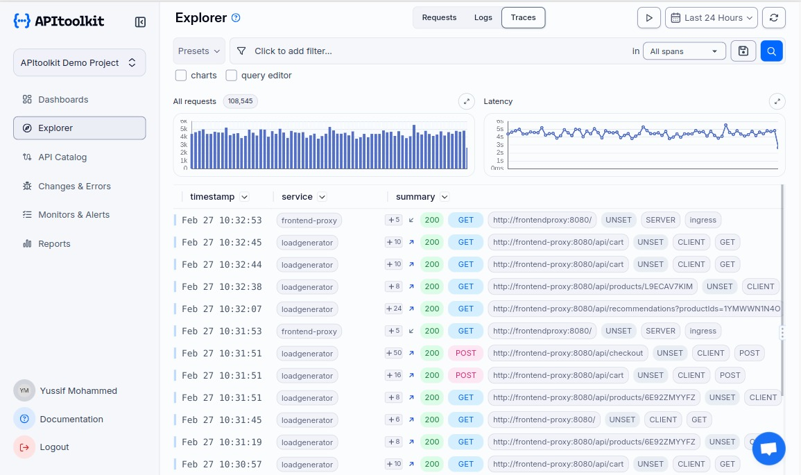

# Monitoring your Express.js application using OpenTelemetry with APIToolkit


The complexity of modern microservices requires a thorough understanding of your application's production behaviour. [OpenTelemetry](https://opentelemetry.io/) provides a universal framework that enables code instrumentation to gather telemetry data through collection, processing, and exporting metrics, logs, and traces. In this article, we'll explore how to implement [OpenTelemetry](https://opentelemetry.io/) in an Express.js application to gain valuable insights into its performance and behaviour.

## What is OpenTelemetry

[OpenTelemetry](https://opentelemetry.io/) is an open-source toolset that assists software monitoring. It delivers straightforward APIs and SDKs alongside tools for developers to implement code that gathers telemetry data, including metrics, logs, and traces. This data enables application performance analysis and subsequent improvements.

## Understanding the Monitoring Stack
Before we dive into the implementation, let’s first understand our monitoring stack:

- Express.js: [Express](https://expressjs.com/) is a Node.js web application framework that provides a wide range of features for mobile and web applications.

- APIToolkit: [APIToolkit](https://apitoolkit.io/) is the observability platform that will store and visualizes our telemetry data.

- OpenTelemetry: We will use [OpenTelemetry](https://opentelemetry.io/) to collect telemetry data.

## Getting Started

### Creating an APIToolKit Account

- Sign up for free [here](http://app.apitoolkit.io/).



- Start a new project 



- Configure the project


- Choose noticication method



- Integrate Express.js app with APIToolkit’s Express SDK (This step is optional. We will cover the integration in the next steps below).



## Building Our Sample Express.js Application

- Make a new directory and install express.js

```javascript
  npm init -y
  npm i express
```

- Create a server.js file and run the following code:

```javascript
  const express = require('express');
  const app = express();
  const port = 3000;

  app.get('/', (req, res) => {
    res.send('Hello World!');
  });

  app.listen(port, () => {
    console.log(`Example app listening at http://localhost:${port}`);
  });
```

- Run your application

```javascript
  node server.js
```

Navigate to http://localhost:3000, and you should see the “Hello World” message on your browser.

## Setting Up OpenTelemetry to work with our Express App

### Installation

Run the following code to install the APIToolkit express SDK and OpenTelemetry API, SDK, and auto instrumentation tools.

```javascript
  npm install --save apitoolkit-express @opentelemetry/api @opentelemetry/auto-instrumentations-node
```

### OpenTelemetry Configuration

We must now export the necessary environment variables to configure OpenTelemetry for our express application. End the current running server {=(Ctrl + C)=} and type in the following code in your terminal:

```javascript
  //Specifies the endpoint URL for the OpenTelemetry collector.
  export OTEL_EXPORTER_OTLP_ENDPOINT="http://otelcol.apitoolkit.io:4317"

  //Specifies the name of the service.
  export OTEL_SERVICE_NAME="{YOUR_SERVICE_NAME}"

  //Adds your API KEY to the resource.
  export OTEL_RESOURCE_ATTRIBUTES="at-project-key={YOUR_API_KEY}"

  //Specifies the protocol to use for the OpenTelemetry exporter.
  export OTEL_EXPORTER_OTLP_PROTOCOL="grpc"
  
  export NODE_OPTIONS="--require @opentelemetry/auto-instrumentations-node/register"

  node server.js
```

{=NOTE:=} You can grab your API key from your APIToolkit dashboard as shown in the image below:



## Setting up APIToolkit Express Middleware For HTTP Request Monitoring

APIToolkit Express Middleware is a tool for monitoring HTTP requests in Express.js. It wraps the Express middleware and adds extra features using OpenTelemetry, creating a custom span for each request to capture details like request and response bodies. Update server.js with the following code:

```javascript
  import * as express from "express";
  import { APIToolkit } from "apitoolkit-express";
  import axios from "axios";

  const port = 3000;

  const app = express();
  const apitoolkitClient = APIToolkit.NewClient({
    monitorAxios: axios, // Optional: Use this to monitor Axios requests
  });

  // Add middleware for request monitoring
  app.use(apitoolkitClient.middleware);

  app.get("/", async (req, res) => {
    // This axios request get's monitored and appears in the  APIToolkit explorer
    const response = await axios.get(
      "https://jsonplaceholder.typicode.com/todos/1"
    );
    res.json(response.data);
  });

  // automatically report unhandled errors along with the request data
  app.use(apitoolkitClient.errorMiddleware);

  app.listen(3000, () => {
    console.log(`Example app listening at http://localhost:${port}`);
  });
```

Refresh your browser a couple of times (you can hit some other routes too) so we can gather telemetry data and visualize it on our APIToolkit Dashboard:



- **Logs**: We can access the logs using the logs tabs



- **Traces**: We can as well visualize traces using the traces tab



As you can see, we are monitoring our express application in real-time. There’s a lot of data to visualize and work with. Refer to this documention for indepth guide on using [APIToolkit Express SDK](https://apitoolkit.io/docs/sdks/nodejs/expressjs/). 

In conclusion, using APIToolkit with OpenTelemetry for your Express.js application lets you easily monitor performance, detect issues, and track errors with detailed backend insights. This approach simplifies debugging and helps maintain a stable, efficient web service.

**Keep Reading**

[Best API Monitoring and Observability Tools in 2023](https://apitoolkit.io/blog/best-api-monitoring-and-observability-tools/)

[10 Must-Know API Trends in 2023](https://apitoolkit.io/blog/api-trends/)

[Ultimate Guide to API Testing Automation](https://apitoolkit.io/blog/api-testing-automation/) 

[Web API Performance Best Practices - the Ultimate Guide](https://apitoolkit.io/blog/web-api-performance/)

[How to Analyze API Logs and Metrics for Better Performance](https://apitoolkit.io/blog/api-logs-and-metrics/)

[API Documentation and Monitoring: the Truth You Must Know](https://apitoolkit.io/blog/api-documentation-and-observability-the-truth-you-must-know/)
