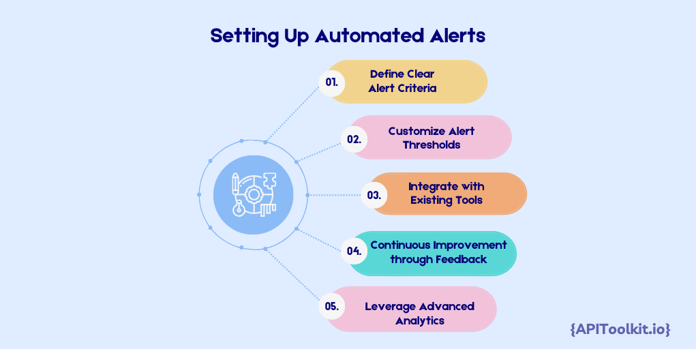

In today's tech-driven ecosystem, mastering API log monitoring is crucial for staying competitive. As the backbone of digital operations, API logs offer deep insights into system health, user behavior, and security vulnerabilities. This introduction to [API log monitoring](https://apitoolkit.io/blog/api-log-explorer/) emphasizes its critical role in modern tech infrastructure and the transformative impact of automated alerts.

The surge in API integration across industries has made log management more complex, necessitating sophisticated monitoring solutions. Automated alerts, a key component in this ecosystem, enable real-time anomaly detection, efficient troubleshooting, and enhanced [performance](https://apitoolkit.io/blog/frontend-api-performance/) optimization. This blog post serves as an advanced guide, tailored for IT professionals, developers, and tech managers, providing actionable insights into effective [API log monitoring](https://apitoolkit.io/blog/api-log-explorer/) strategies. We will cover everything from setting up alerts to leveraging them for predictive analysis, ensuring you're equipped to handle the dynamic challenges of [API management](https://apitoolkit.io/blog/unlocking-the-full-potential-of-api-gateways/).

## The Importance of Automated Alerts in Tech Management

The significance of automated alerts cannot be overstated. These alerts are the linchpins in maintaining the robustness and reliability of IT systems, particularly in an era where API-driven applications are ubiquitous. This section explores how automated alerts in API log monitoring are revolutionizing [tech management](https://apitoolkit.io/blog/unlocking-the-full-potential-of-api-gateways/), a topic of paramount interest to IT professionals and system administrators.

Automated alerts serve as a first line of defense against system malfunctions, security breaches, and [performance](https://apitoolkit.io/blog/metrics-that-matter/) bottlenecks. By providing real-time notifications and detailed insights, they enable tech teams to respond swiftly to issues before they escalate. This proactive approach is essential in minimizing downtime and ensuring continuous system availability, key priorities in any tech-driven organization.

Furthermore, automated alerts are instrumental in predictive maintenance and [performance optimization](https://apitoolkit.io/blog/metrics-that-matter/). They help in identifying patterns that could indicate potential future issues, allowing for preemptive action. This aspect of tech management is particularly relevant in the context of big data and machine learning, where data-driven decision-making is paramount.

## Setting Up Automated Alerts

Implementing automated alerts in API log monitoring is a game-changer for [management](https://apitoolkit.io/blog/unlocking-the-full-potential-of-api-gateways/), but it requires a strategic approach. This section provides best practices for setting up automated alerts, ensuring your systems are not only responsive but also predictive in identifying potential issues. Key for IT professionals and system administrators, these practices are essential in the effective deployment and management of automated alert systems.

**1. Define Clear Alert Criteria:** Establishing precise criteria for alerts is crucial. This involves determining which events warrant immediate attention, based on factors like error frequency, system performance metrics, and user activity patterns. Clear criteria help in avoiding alert fatigue and ensure that only critical issues trigger notifications.

**2. Customize Alert Thresholds:** Tailor alert thresholds to match the specific needs and dynamics of your environment. This customization is vital in balancing sensitivity and practicality, reducing false positives, and maintaining system efficiency.

**3. Integrate with Existing Tools:** Seamless integration of automated alerts with your existing [monitoring and management](https://apitoolkit.io/blog/api-log-explorer/) tools is essential. This integration enhances the overall functionality and effectiveness of your tech ecosystem, allowing for more comprehensive monitoring and faster response times.

**4. Continuous Improvement through Feedback:** Automated alerts should evolve with your system. Regularly review and adjust alert parameters based on feedback and system changes to ensure they remain effective and relevant.

**5. Leverage Advanced Analytics:** Utilize advanced analytics and machine learning algorithms to refine your alert system. These technologies can help predict potential issues before they arise, transforming your approach from reactive to proactive.

## Advanced Techniques in API Log Analysis

Mastering [API log analysis](https://apitoolkit.io/blog/api-log-explorer/) is increasingly crucial in the technology sector, playing a key role in maintaining a competitive edge. This section delves into advanced techniques that are reshaping the approach to handling the complex data generated by APIs, transforming how we interpret and utilize this information.

At the forefront of this transformation are machine learning algorithms. These sophisticated tools are revolutionizing [API log analysis](https://apitoolkit.io/blog/api-log-explorer/) by their ability to sift through extensive data sets. They excel in identifying intricate patterns and anomalies that might escape detection through traditional analytical methods. This capability is particularly valuable in identifying subtle issues, such as gradual performance degradation or the emergence of [security](https://apitoolkit.io/blog/api-logs-in-cybersecurity/) threats. By harnessing the power of machine learning, technology teams can delve deeper into system behaviors, anticipate potential problems, and develop more targeted and effective solutions.

Another significant advancement is the use of predictive analytics in the analysis of historical [API log](https://apitoolkit.io/blog/leveraging-api-logs/) data. These techniques allow teams to anticipate and proactively address potential future issues. For example, predictive models are adept at identifying trends that might suggest upcoming system overloads or security vulnerabilities. This foresight enables teams to take preventative measures before these issues can adversely impact operations.

The real-time analysis of API logs has become a game-changer, particularly in dynamic and demanding tech environments. This approach facilitates the immediate detection and resolution of issues as they arise, drastically reducing system downtime and significantly enhancing the overall [user experience](https://apitoolkit.io/blog/api-logs-and-user-behaviour-tracking/). Real-time analysis proves particularly invaluable in scenarios characterized by high traffic, where rapid response is critical to maintaining service quality and operational stability.

Integrating big data tools like Hadoop, Elasticsearch, and Kafka plays a vital role in managing the volume and complexity of [API log data](https://apitoolkit.io/blog/api-log-explorer/). These platforms offer robust frameworks for efficiently processing and analyzing vast quantities of data. They enable the aggregation, storage, and comprehensive analysis of data from various sources, providing a holistic view of API interactions and performance metrics.

Advanced [API log analysis](https://apitoolkit.io/blog/api-log-explorer/) also extends to automated response systems. These systems are designed to react to specific log events with predetermined actions, greatly enhancing operational efficiency. For instance, they can dynamically adjust system resources in response to sudden spikes in traffic or activate necessary security protocols upon detecting potential threats. This level of automation not only streamlines the [management](https://apitoolkit.io/blog/api-downtime/) process but also ensures rapid and consistent responses to common issues, bolstering the overall system reliability and performance.

## Addressing Challenges in Automated Alert Systems

Implementing automated alert systems in API log monitoring presents various challenges like:

1. **Alert Fatigue:** Overwhelming alerts can cause critical issues to be overlooked. Fine-tuning alert thresholds and prioritizing alerts based on urgency and impact is key to managing this.

2. **False Positives and Negatives:** Reducing false alarms and missed issues is crucial. This requires sophisticated detection algorithms and continuous refinement of alert criteria.

3. **Integration with Existing Systems:** Automated alerts must integrate seamlessly with current monitoring tools. Ensuring compatibility and efficient data flow is essential to avoid disruptions and data silos.

4. **Adapting to System Changes:** Alert systems must evolve with IT environments. Regular updates to alert logic reflecting system changes ensure ongoing effectiveness.

5. **Balancing Sensitivity and Practicality:** It's important to set thresholds that are sensitive enough to detect critical issues but practical enough to avoid excessive alerts.

Overcoming these challenges is essential for the effective functionality and reliability of automated alert systems. This not only offers solutions but also insights into proactive system management, a crucial skill in the rapidly evolving tech landscape.

## Future Trends: What’s Next in API Monitoring Trends?

As we look towards the horizon of technology, API monitoring is poised for significant evolution. This section explores the emerging trends and future developments in [API monitoring](https://apitoolkit.io/blog/api-log-explorer/), providing insights for tech professionals keen on staying ahead in a rapidly changing digital landscape.

**1. Artificial Intelligence and Machine Learning Integration:** The integration of AI and machine learning in [API monitoring](https://apitoolkit.io/blog/api-log-explorer/) is set to bring about a paradigm shift. These technologies enable the creation of smarter, self-adjusting monitoring systems that can not only analyze vast amounts of data for predictive insights but also automate complex problem-solving processes. Enhanced anomaly detection, powered by AI, will allow for the early identification of irregular patterns and potential system vulnerabilities, facilitating preemptive action to mitigate risks.

**2. Increased Focus on Security Monitoring:** In an era where cybersecurity is paramount, [API monitoring](https://apitoolkit.io/blog/api-documentation-and-observability-the-truth-you-must-know/) will increasingly prioritize security aspects. Advanced techniques for real-time threat analysis, such as dynamic behavioral analysis and automated security incident responses, will become standard. These advancements will significantly enhance the ability to detect and neutralize threats quickly, thereby bolstering overall system security.

**3. Cloud-native and Serverless Monitoring Solutions:** The trend towards cloud-native and serverless architectures necessitates a rethinking of traditional [API monitoring](https://apitoolkit.io/blog/api-log-explorer/) tools. Monitoring solutions in 2024 will likely be more adaptable, capable of scaling dynamically with the fluctuating demands of cloud-based and serverless environments. This shift ensures that monitoring capabilities are as agile and flexible as the architectures they support, providing real-time insights regardless of the underlying infrastructure.

**4. Enhanced User Experience Monitoring (UXM):** UXM will take a front seat in [API monitoring](https://apitoolkit.io/blog/best-api-monitoring-and-observability-tools/), focusing on understanding and improving how users interact with APIs. This approach will go beyond traditional performance metrics to include user behavior analytics, providing a holistic view of the user journey. Insights derived from UXM will be instrumental in refining API design and functionality to better align with user needs and preferences, thereby enhancing overall user satisfaction.

**5. Integration of IoT and API Monitoring:** With the expansion of the Internet of Things, the integration of IoT device management into API monitoring will become increasingly crucial. This will involve developing new strategies and tools to address the challenges posed by the vast and heterogeneous nature of IoT networks. Effective [monitoring](https://apitoolkit.io/blog/best-api-monitoring-and-observability-tools/) of IoT APIs will be key to ensuring seamless connectivity, data integrity, and system security across diverse IoT ecosystems.

## Maximizing Efficiency with Automated Alerts

Throughout this blog post, we have explored how automated alerts in API log monitoring serve as more than a technical necessity; they are a strategic asset in the tech industry. These alerts play a pivotal role in enhancing operational efficiency, ensuring system reliability, and driving proactive tech management. By harnessing the power of automation, these systems streamline the monitoring and management of [API logs](https://apitoolkit.io/blog/api-log-explorer/), allowing tech teams to focus on more strategic tasks, significantly reducing manual effort, and minimizing the risk of human error.

The ability of automated alerts to provide real-time insights is one of their greatest advantages, enabling teams to proactively solve problems and maintain uninterrupted service and high system performance. As technology continues to evolve, so do the capabilities of automated alert systems. Keeping up-to-date with the latest trends and best practices in [API log monitoring](https://apitoolkit.io/blog/rum-vs-synthetic-monitoring/), as we have discussed, is essential for any tech professional aiming to effectively leverage these tools. Implementing and optimizing automated alert systems in API monitoring is not only about addressing current challenges but also a step towards future-proofing tech infrastructures, ensuring they can adapt and embrace future technological shifts.

## Conclusion

In conclusion, the efficient implementation and ongoing refinement of automated alerts in [API log monitoring](https://apitoolkit.io/blog/api-log-explorer/) are crucial for any organization striving to remain competitive and agile in our tech-driven world. Embracing these advanced techniques and best practices enables tech professionals to maximize efficiency, enhance security, and ensure the seamless operation of their digital ecosystems.

## Keep Reading

[10 Must-Know API trends in 2023](https://apitoolkit.io/blog/api-trends/)
[Key Benefits of API Integration for Developers](https://apitoolkit.io/blog/benefits-of-api-integration/)
[How to Analyze API Logs and Metrics for Better Performance](https://apitoolkit.io/blog/api-logs-and-metrics/)
[Incident Management: How to Resolve API Downtime Issues Before It Escalates](https://apitoolkit.io/blog/api-downtime/)
[Top 7 Reasons Why Your Team Should Use an API Monitoring Tool](https://apitoolkit.io/blog/why-you-need-an-api-monitoring-tool/)
