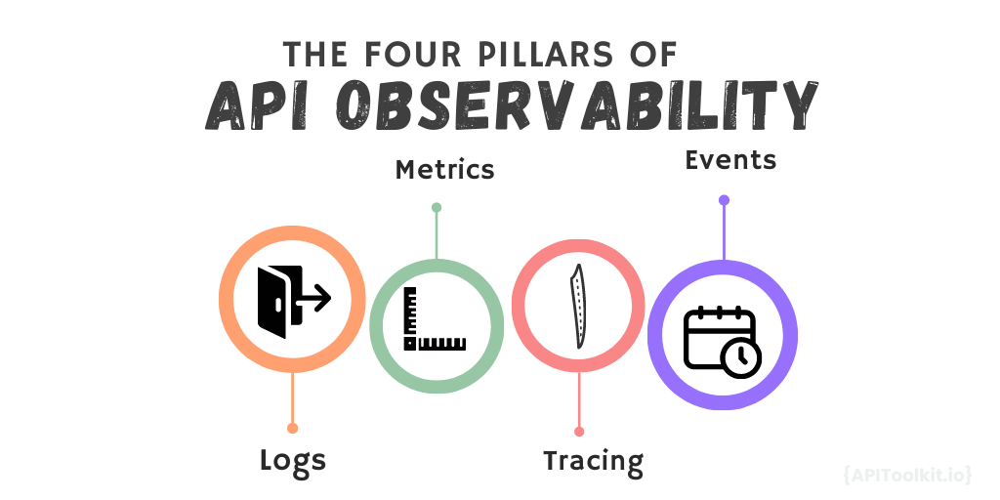

> "In a world that's becoming more connected, APIs are the unsung heroes. Observing them closely is like understanding the pulse of your digital entity."
> - Jane Doe, Senior API Strategist

Have you ever felt that understanding Application Programming Interfaces (APIs) goes beyond just technical knowledge and becomes an art? Indeed, the intricacies of APIs go far beyond mere lines of code and technical specifications. More like a painter discerning the right shade or a musician hitting the perfect note, mastering APIs requires an understanding of the health and performance of the APIs to transform good software into great software. This artistic dimension is often overlooked, but it's what sets apart truly exceptional developers and tech teams. API observability allows teams to craft better experiences, design efficient systems, and ensure reliability. 

[API observability](https://apitoolkit.io/blog/api-observability-software-development-/) is the practice of collecting and analyzing data about an API in order to understand its health, performance, and usage. This data can be used to identify and troubleshoot problems, optimize performance, and improve security. [API observability](https://apitoolkit.io/blog/best-api-monitoring-and-observability-tools/) is important because it allows you to gain a deeper understanding of how your APIs are being used and how they are performing. When considering API observability, there are four fundamental pillars that should guide your approach:

1. Logs
2. Metrics
3. Tracing
4. Events

Let's delve into each of these pillars, providing you with a comprehensive understanding.

## 1. Logs

Logs are like a historian's records, carefully documenting every action and transaction of an API. They provide a granular account of operations, capturing everything from user interactions to system anomalies. They are the detailed diary entries of an API that provide a comprehensive overview of its operations, health, and interactions. When properly managed, they become an invaluable resource in ensuring the reliability, security, and efficiency of an API in the digital ecosystem.

Gone are the days when logs were just mundane system records. Today, they are the go-to source for diagnosing issues, ensuring security, and understanding user behavior. Logs can be used to track the requests that are being made to your API. This can help you identify unusual requests that could be malicious. You can also use logs to track the responses that are being returned by your API.

### The Essence of Logs

1. Chronological Record: Just as a diary captures daily events in sequential order, logs maintain a chronological record of actions and events within an application. This timeline-based approach aids in understanding the sequence of operations, which can be crucial when diagnosing issues.

2. Granularity: Logs are comprehensive. They capture everything, from routine operations and user actions to system errors and external interactions. This granularity offers a deep dive into system behavior.

### The Role of Logs in API Observability

Logs act as a fundamental instrument in guaranteeing the seamless functioning of systems and applications. Logs play an indispensable role in maintaining stability and understanding the intricacies of system operations ensuring smooth API operations through:

1. Diagnosing Errors: Logs capture errors or anomalies that occur during the operation of an API. By analyzing logs, developers can pinpoint the root cause of issues, making troubleshooting more efficient.

2. Audit Trails: In environments where security and compliance are critical, logs serve as an indisputable record of actions. Who accessed the API? What changes were made? When did a particular action occur? Logs provide answers to these questions, ensuring accountability.

3. Debugging: When developing new features or troubleshooting existing ones, logs act as your eyes within the system. They offer insights into how the API is processing requests, interacting with other services, or where it might be failing.

4. Compliance and Accountability: For industries where data handling and processing are subject to regulations, logs serve as an audit trail, ensuring all API transactions are transparent and traceable.

5. Understanding User Behavior: By analyzing logs, businesses can gain insights into how users are interacting with their API, which endpoints are most frequently accessed, and what kind of data is most often requested.

## 2. Metrics

Metrics can be compared to a physician checking a patient's vital stats. They offer a brief glimpse into the health, efficiency, and overall state of the system. Just as vital signs give insights into a person's health in the medical world, metrics serve as tangible markers showcasing an application's health and operational prowess, shedding light on its effectiveness and functionality. Today, businesses realize the power of metrics. A survey conducted by TechObserver highlighted that 78% of businesses leverage API metrics to foresee potential performance bottlenecks.

Unlike logs that capture individual events in detail, metrics aggregate data to provide summarized measurements. For instance, instead of noting every single API request, a metric might tell you the total number of requests at the last minute. Metrics are designed to give you a quick overview of specific aspects of your system. They strip away the noise and provide clear, actionable insights.

The Role of Metrics in API Observability
APIs are the bridges connecting different software components. As these bridges facilitate data flow, it's essential to monitor their health, performance, and reliability. Metrics serve this purpose perfectly:

1. Gauging Performance: How is your API performing under different loads? Metrics like response times give you an immediate answer. If an API typically responds in 50ms and suddenly starts taking 500ms, you know there's a performance issue.

2. Capacity Planning: Metrics offer foresight. By analyzing trends, such as steadily increasing request rates, you can anticipate when you might need to scale up resources or optimize your infrastructure to handle the growing traffic.

3. Alerting: Metrics serve as sentinels. By setting thresholds on specific metrics, you can receive instant notifications if something goes amiss. For instance, if the error rate for an API suddenly spikes, an alert can notify you to investigate immediately.

Given the importance of metrics, a tool like [APIToolkit](https://apitoolkit.io/) has been developed to capture, store, and visualize them efficiently.

## 3. Tracing

In the vast network of microservices, tracing is your GPS. It visualizes the journey of a request as it dances through various components. Tracing illuminates the intricate ballet of requests, helping identify bottlenecks and performance lags.

Logs provide a timeline of events, and metrics offer an overview, but tracing maps out how a request travels through various services. Tracing is a method to visualize the journey of a request as it traverses through different components or services of an application. Imagine a parcel being shipped from one location to another, and along its route, it passes through multiple checkpoints. If each checkpoint registers the time and details of the parcel, you could then reconstruct its entire journey. Tracing works similarly for requests in a digital system.

### Importance of Tracing

1. Mapping the Request's Journey: In a microservices setup, a single API request might be processed by multiple services. Tracing allows you to see the path the request took, the services it interacted with, and the duration it spent in each service.

2. Spotting Bottlenecks: If one service is slower than others, it can create a ripple effect, slowing down the entire request. By visualizing the journey of the request, tracing lets you identify which service is causing delays.

3. Debugging Complex Issues: In interconnected systems, a failure in one service can impact others, leading to cascading failures. Tracing allows you to pinpoint the origin of such issues and understand the domino effect it might have caused.

Given the importance of tracing, numerous tools have been developed to assist in this domain. These tools provide visualization capabilities, making it easier for you to understand the data and diagnose issues.

## 4. Events

Events are the proactive signals in the reactive world of APIs, alerting developers and businesses to moments that matter." - API expert Dr. John Evans
Just as newspapers use headlines to emphasize major events, events in the API world spotlights critical moments. They mark milestones, indicating shifts that demand prompt attention or recognition. While the system may have numerous activities and operations, events highlight the most critical and significant moments, drawing attention to pivotal developments or changes.

APIs allow different software applications to communicate, undergo numerous changes and face various challenges. Here are some event examples:
1. Endpoint Deprecation: If an API endpoint is deprecated, it signifies that this particular service or functionality is no longer supported. Clients or systems using this endpoint need to be informed and updated to prevent potential failures.

2. Traffic Surge: A sudden increase in traffic can strain the system, potentially leading to performance issues or even outages. Recognizing such surges as events allows for quick scaling or intervention.

3. Deployment of a New API Version:  Introducing a new version might come with changes that clients need to adapt to. Recognizing this as an event ensures stakeholders are informed, and potential issues are mitigated.

The Proactive Power of Event Monitoring
By closely monitoring events, you adopt a forward-thinking stance. This proactive approach allows you to anticipate and address potential issues, rather than merely responding to them after the fact. With this you are equipped to handle major shifts, foresee upcoming challenges, and act quickly to maintain system stability.

Monitoring events is like having a radar system—it detects significant occurrences on the horizon, giving you ample time to prepare, react, or adapt. It's an essential strategy for maintaining the health, stability, and efficiency of your API ecosystem.

In summary, the four pillars of API observability - logs, metrics, tracing, and events - arm you with a holistic view of your API's health and performance. Each pillar offers a distinct lens, and when combined, they ensure your APIs remain robust and efficient. As technology evolves, so will observability tools and practices. But remember, these four pillars are the cornerstones of understanding and managing any API ecosystem.

---

Keep reading
[The Importance of API Observability in Software Development](https://apitoolkit.io/blog/api-observability-software-development-/)
[How to Optimize Security for Web API Performance in 2023](https://apitoolkit.io/blog/api-security/)
[The Rise of API-as-a-Product: How Companies are Leveraging APIs to Drive Revenue](https://apitoolkit.io/blog/api-as-a-product/)
[API Observability and Monitoring: What’s the Difference?](https://apitoolkit.io/blog/api-observability-and-api-monitoring/)
[Ultimate Guide to API Testing Automation](https://apitoolkit.io/blog/api-testing-automation/)
