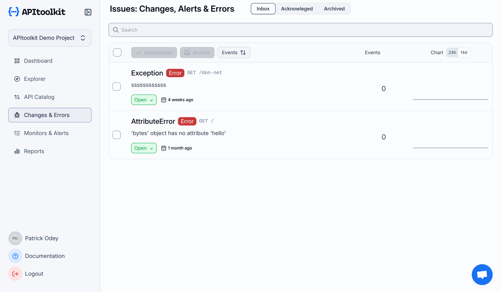
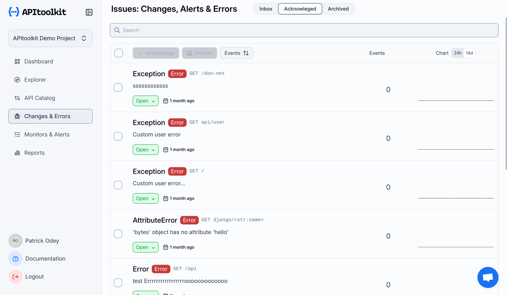
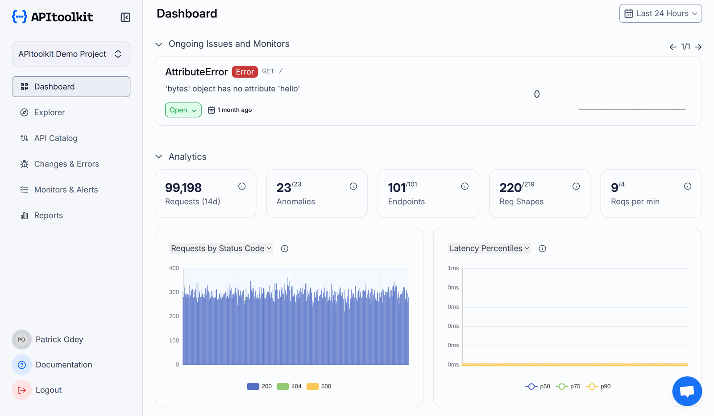
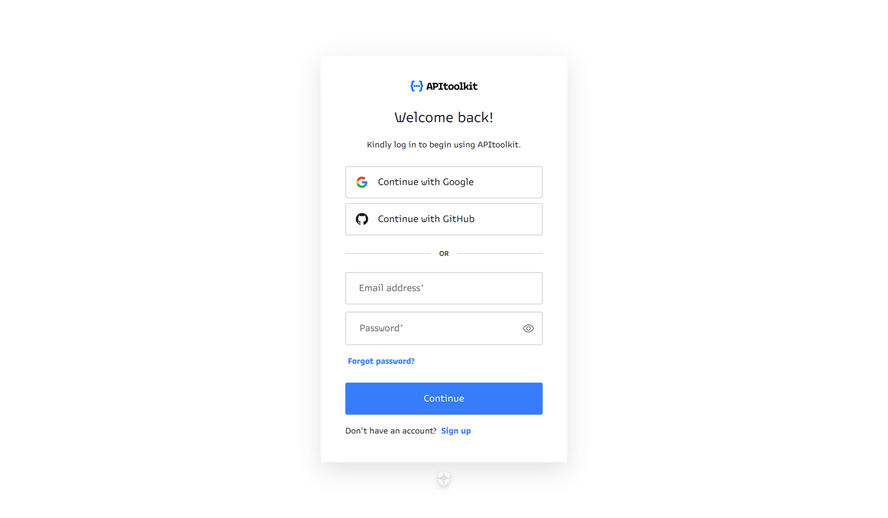
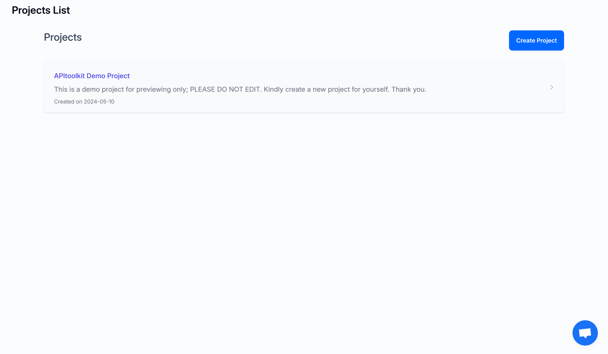
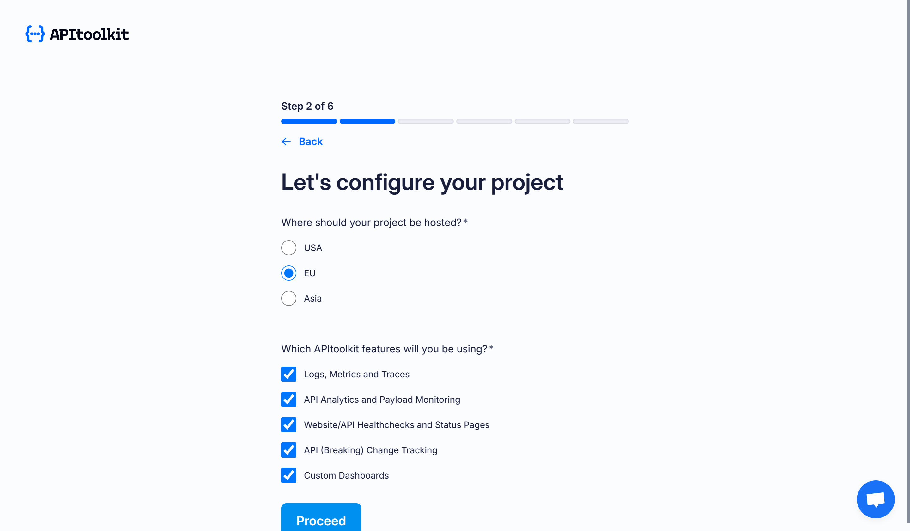
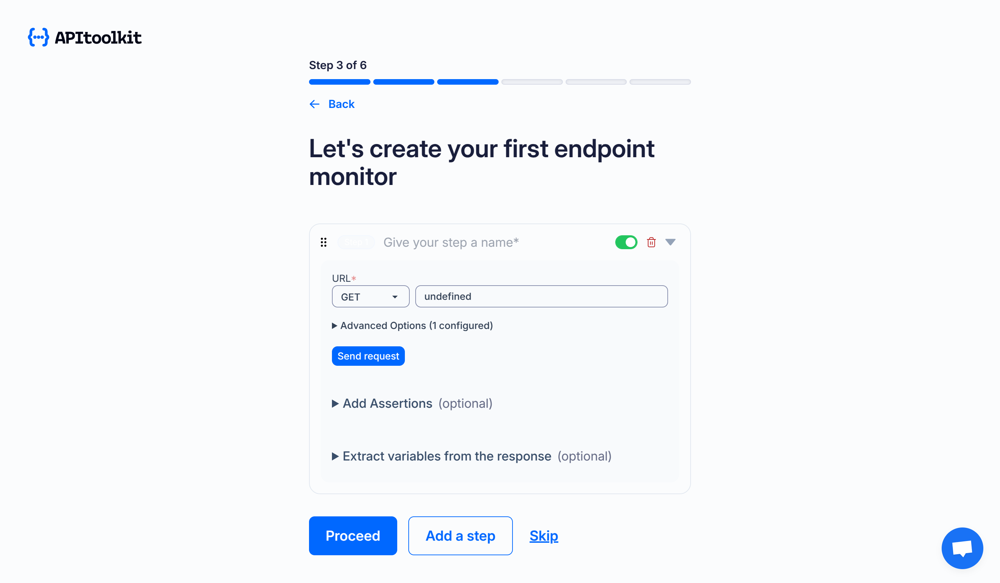
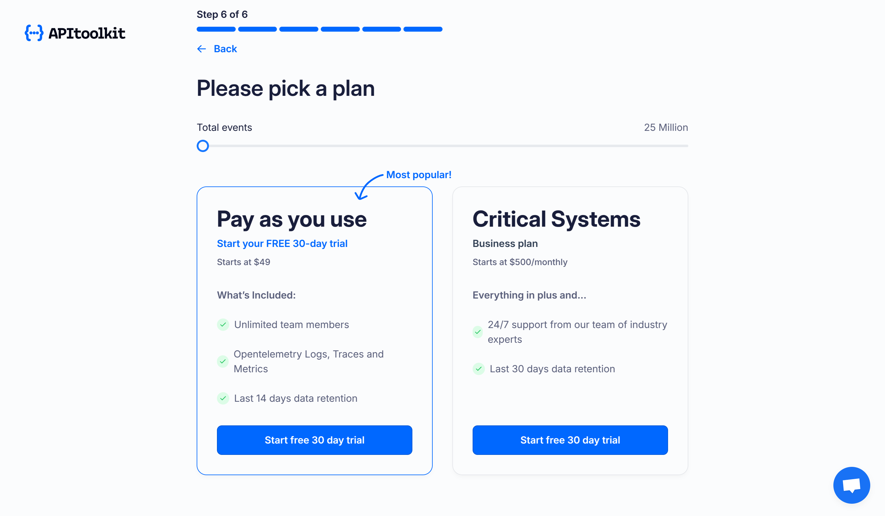

# The Top 3 API ToolKit Features That Solve Developer's Pain Points

Although APIs are essential to contemporary applications, effectively managing them can be daunting. Debugging API requests, maintaining security compliance, and performance monitoring are among the problems that developers frequently face. API ToolKit, which gives developers strong tools to improve their workflow, is intended to mitigate these difficulties. In this post, we will explore three [API ToolKit](https://apitoolkit.io/) features that address common developer pain points.

## 1. Real-time API Monitoring and Alerts

Troubleshooting API failures without the right insights is one of the most annoying things for developers. Using API Toolkit's [real-time monitoring feature](https://apitoolkit.io/features/api-observability/), developers can monitor API performance, watch errors and any numbers that matter over time.

### How it helps:

- **Instant Alerts**: Receive alerts when things go wrong via Slack or email.

- **Detailed Logs**: Gain visibility into requests and response payloads for easier debugging.

- **Performance Insights**: Identify slow endpoints and optimize them accordingly.

With these features, developers can proactively address problems and ensure API reliability.

## 2. Error Tracking and Breaking Change Detection

Developers struggle with unexpected errors and silent-breaking changes that can disrupt integrations and make debugging a long and frustrating process. However, using API Toolkit's [error tracking](https://apitoolkit.io/features/error-tracking/) feature, developers can catch breaking changes in their APIs and third-party integrations with enough context to reproduce the issues and narrow down the root cause.

### How it helps:

- **Error Logs**: See all changes and issues from a unified ‘changes and errors’ tab. 

- **Advance Filters**: Easily filter results by various attributes, including columns and custom fields. This allows you to return only the data that fits your criteria and helps avoid overfetching data.

- **Debugging Workflow**:  Errors and breaking changes can be acknowledged and archived. This feature helps maintain a seamless workflow for developers when debugging issues (see image below).

## 3. API Management

Being the most feature-rich solution available, [API ToolKit](https://apitoolkit.io/) offers everything you need to manage your APIs effectively. It's a centralized command centre for all API-related operations, from design and deployment to monitoring and troubleshooting.

### Key Capabilities:

- **Unified Dashboard**: Manage your entire API ecosystem from a single, intuitive interface. The dashboard aggregates key metrics, error logs, and performance trends, making it easy to see the health of your APIs at a glance.

- **Seamless Integration**: Whether you are managing cloud-based resources or deploying via CI/CD pipelines, API Toolkit integrates with your tools to automate common tasks and maintain consistency across environments. API ToolKit is technology agnostic, hence its wide range of SDKs in different technologies.

## Getting Started with API ToolKit

Here, I’ll show you a step-by-step guide on getting started with APIToolKit

- Navigate to [app.apitoolkit.io](https://app.apitoolkit.io/) and sign up with email or GitHub. 

- Once you are successfully logged in, you will be greeted with a page that contains your projects. 
  
{=Note=}: If you are a first time user, you should only see a Demo Project.

- Create New Project: Click the 'Create Project' button and fill in the prompt.

 
- Configure your project: Select the options that fit your project, then click 'Proceed.'

 
- Create an endpoint to monitor

- Setup a means for notifications and alerts:

- Integrate API ToolKit into your project:

{=Note=}: We have indepth [documentation](https://apitoolkit.io/docs/sdks/) for integrating all your favourite frameworks. If you can’t find a specific SDK, you can request for one from the [APIToolKit team](https://discord.gg/BHQh5JzjPX).

- Select your desired plan:

As you can see, following the above steps will get you up and running with API ToolKit in no time, giving you advanced tools to help build, manage and monitor your APIs to ensure a smooth user/developer experience.

**Keep Reading**

[Best API Monitoring and Observability Tools in 2023](https://apitoolkit.io/blog/best-api-monitoring-and-observability-tools/)

[How to Write API Documentation: 14 Essential Guidelines](https://apitoolkit.io/blog/how-to-write-api-docs/)

[Ultimate Guide to API Testing Automation](https://apitoolkit.io/blog/api-testing-automation/)

[Web API Performance Best Practices - the Ultimate Guide](https://apitoolkit.io/blog/web-api-performance/)

[How to Analyze API Logs and Metrics for Better Performance](https://apitoolkit.io/blog/api-logs-and-metrics/)

[API Documentation and Monitoring: the Truth You Must Know](https://apitoolkit.io/blog/api-documentation-and-observability-the-truth-you-must-know/)

[Mastering API Debugging and Monitoring: Best Practices for Seamless Integration](https://apitoolkit.io/blog/mastering-api-debugging/)
