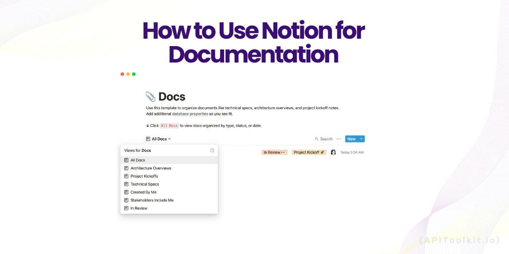
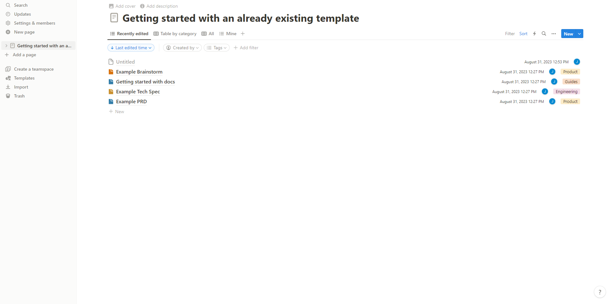
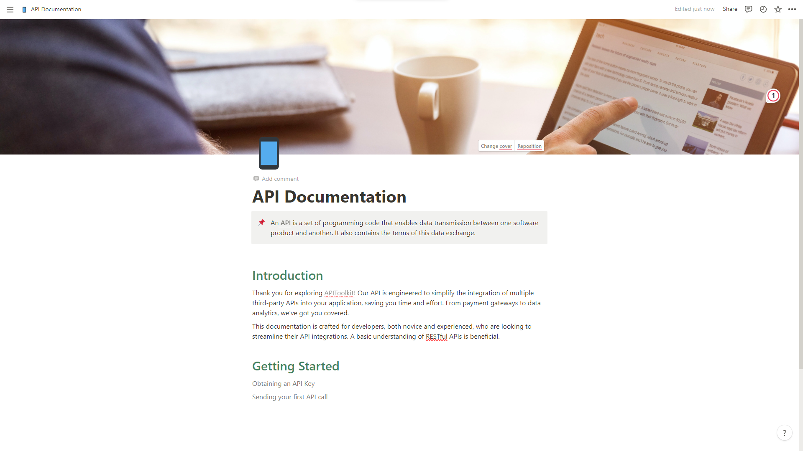

# How to Use Notion for Documentation

**(Updated)**

---

In an age where information is abundant and projects are increasingly complex, effective [documentation ](https://apitoolkit.io/blog/how-to-write-api-docs/)has become a cornerstone of successful ventures. Whether you're a software developer jotting down lines of code, a project manager outlining workflows, or a content creator organizing your thoughts, having a reliable and efficient system for documentation is essential. This is where Notion comes in.

Notion is more than just a note-taking app; it's a powerful all-in-one workspace designed to improve productivity and collaboration. With its versatile features, you can create anything from simple to-do lists to comprehensive project boards. But one of its most compelling uses is for documentation.

In this article, we'll delve into the world of Notion to explore how you can leverage its features for your documentation needs. Specifically, we'll focus on two primary methods: creating your own custom template and utilizing pre-existing templates. By the end of this guide, you'll have a solid understanding of how to make Notion work for you, ensuring that your documentation is not just thorough, but also organized and easily accessible.

Documentation is a vital part of any product because it aids in making clear directives, specifics, staff conversations, and other information that can be unclear to not just workers but users too. A permanent record of successes is provided by good documentation, which may be useful in future talks with clients or with the company's directors and legal counsel. The ability to rapidly and effectively provide support, such as figuring out what a particular piece of software is (or was) supposed to perform, is a crucial benefit of thorough documentation.

An essential component of good documentation is an efficient tool, and [Notion](https://www.notion.so/) is that all in one workspace that has it all. I mean most developers and creatives will agree to the fact that notion is a really great tool. It does everything, from being a storage app for documents to a product map, and then documentation. It is a flexible tool with millions of ways it can be utilized.

Giving appropriate documentation on how to use a product, in my opinion, is a big bonus because it makes everything easier and less stressful for everyone especially developers and one benefit Notion has over other tools of similar nature is the typographic hierarchy and readability with a super clean and minimal interface. Majority of Notion documents appear and read great, despite having a small selection of aesthetic options. By allowing you to stack data of any type, Notion also makes it possible for you to create your taxonomy for your documents.

## Why Notion?

When it comes to [documentation](https://apitoolkit.io/blog/how-to-write-api-docs/), there are numerous tools available, each with its own set of features and limitations. So, why choose Notion? The answer lies in its unique blend of versatility, ease of use, and collaborative capabilities. Here are some key reasons why Notion stands out as an excellent choice for documentation:

### Flexibility and Versatility

Notion's block-based architecture offers unparalleled flexibility. You can effortlessly add text, code snippets, images, videos, and even databases to your documentation. This allows you to create a multi-dimensional document that caters to various types of content, making it a one-stop solution for all your documentation needs.

### Real-Time Collaboration

In a team setting, collaboration is key. Notion excels in this area by allowing multiple users to work on a document simultaneously. You can share your documentation with team members, assign tasks, and even leave comments, all in real-time. This ensures that everyone is on the same page, quite literally.

### Rich Template Library

If you're not sure where to start, Notion's rich library of templates can serve as a great jumping-off point. From project management boards to content calendars, there's a template for almost every need. And the best part? These templates are fully customizable, allowing you to tweak them to fit your specific requirements.

### User-Friendly Interface

Despite its robust features, Notion maintains a clean and intuitive interface. This makes it accessible for users of all skill levels. You don't have to be a tech wizard to navigate through Notion; its user-friendly design ensures that you can focus on the content rather than wrestling with the tool itself.

### Cost-Effectiveness

Notion offers a free plan that is surprisingly feature-rich, making it an excellent choice for individuals or small teams on a budget. For larger enterprises or those requiring advanced functionalities, paid plans are available that offer even more capabilities at a reasonable price point. So, whether you're a solo freelancer or part of a sprawling organization, Notion offers a scalable and efficient solution for your documentation needs.

## Quick Guide on How to Build Technical Documentation Using Notion

Building technical documentation in Notion is a straightforward process, thanks to its intuitive design and feature-rich environment. Here's how you can get started:

The first step is to create a [Notion](https://www.notion.so/personal) account that’s if you don’t have one.

With notion, you have the choice of either creating a template from scratch or using an already-existing template that is suitable for the type of information you want to publish.

### Using an Existing Template

If creating a custom template from scratch seems like a daunting task, or if you're short on time, Notion's extensive library of pre-designed templates is a fantastic alternative. Templates are essential in Notion since they streamline your approach and allow you to establish a unique platform for each team member. These templates are not only professionally designed but also cover a wide range of use-cases. Here's how you can use an existing template for your documentation:

1. **Access Template Gallery**: On the getting stated page, you'll find an option that says `Templates`. Click on it to open Notion's Template Gallery.
   
2. **Search and Filter**: Use the search bar or filter options to narrow down templates that are most relevant to your documentation needs. You can sort by categories like `Doc`, `Engineering`, `Personal`, and more. I'll choose a doc because I'm writing a documentation, and docs have different styles to pick from, such as technical specs, architecture overviews, product specs, and so on. All of these may appear similar, but there is a variation in layout, and this is the primary focus.
3. **Preview Templates**: Click on the template template to see a detailed view. This will give you an idea of the template's layout and features.
4. **Select a Template**: Once you've found a template that suits your needs, click on `Get Template` to select it.
   
5. **Rename and Save**: Give your new documentation page a specific name and save it in the appropriate location within your workspace.
   

Choosing a template provides you with a decent documentation format to work with, and with it you're ready to move forward with your high-quality, helpful documentation. These layouts decide how your material will appear and how each text will align with one another. A technical specification document will start with a summary, then move on to background, goals, potential solutions, and follow-up tasks, whereas a project specification will start with an overview, then progress to success criteria, user stories, and scope. The headings change  at some time, but the main thing is their subject emphasis, which means a lot to us depending on the type of layout we want to deploy.

### Creating Your Template

While Notion's pre-existing templates are incredibly useful, there may be instances where you need something more tailored to your specific needs. In such cases, creating your own custom template is the way to go. Here's how you can do it:

1. **Open Notion**: Launch the Notion app on your device and sign in to your account.
   
2. **Create a New Page**: Navigate to the workspace where you'd like your documentation to reside. Click on the `+ New Page` button, usually found at the bottom of your sidebar.
   
3. **Name Your Page**: Give your new page a descriptive name to indicate that it's a template for documentation. This will make it easier to locate later.
4. 
5. **Insert Blocks**: Click on the body of the page to bring up the block menu. You can also use the `+` button that appears as you hover over the page.
6. **Choose Block Types**: Add the blocks that are essential for your documentation. These could include:
   - **Text Blocks**: For headings, subheadings, and paragraphs.
   - **Code Blocks**: To include code snippets or technical commands.
   - **To-Do Lists**: For actionable items or steps.
   - **Tables or Databases**: To organize data or resources.
7. **Arrange Blocks**: Drag and drop the blocks to arrange them in the order that makes the most sense for your documentation.
8. **Add Custom Elements**: You can insert links, images, or even embed files to make your template more comprehensive.
9. **Styling**: Once you're satisfied with how your custom template looks, go to the `...` menu at the top-right corner to use Notion's styling options to change fonts, colors, or add highlights to make your template visually appealing.
   

## Conclusion

Whether you're new to Notion or a seasoned user, its array of features caters to all. With customizable templates and a flexible interface, Notion adapts to your workflow seamlessly. Its block-based system, collaborative tools, and intuitive design make it ideal for individuals and teams alike. Plus, as your projects expand, Notion grows effortlessly alongside them. For those seeking a versatile, user-friendly, and collaborative documentation tool, Notion stands out. With easy template imports or custom creations, it sets the stage for efficient and organized documentation.

## Keep Reading

[How to Generate Automated API Documentation](https://apitoolkit.io/blog/how-to-generate-automated-api-documentation/)

[How to Tackle Anomalies in RESTful APIs (the Right Way)](https://apitoolkit.io/blog/anomalies-in-restful-apis/)

[How to Write API Documentation: 10 Essential Guidelines](https://apitoolkit.io/blog/how-to-write-api-docs/)

[A Comprehensive API Management Strategy for Businesses](https://apitoolkit.io/blog/the-ultimate-api-management-strategy/)
