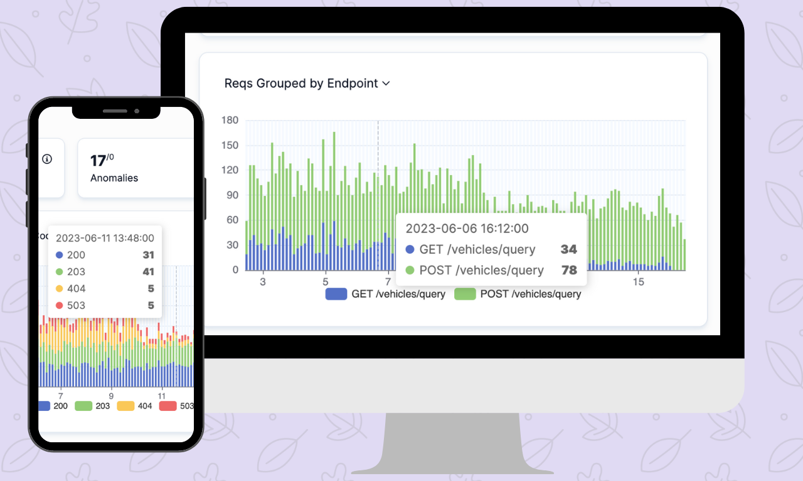
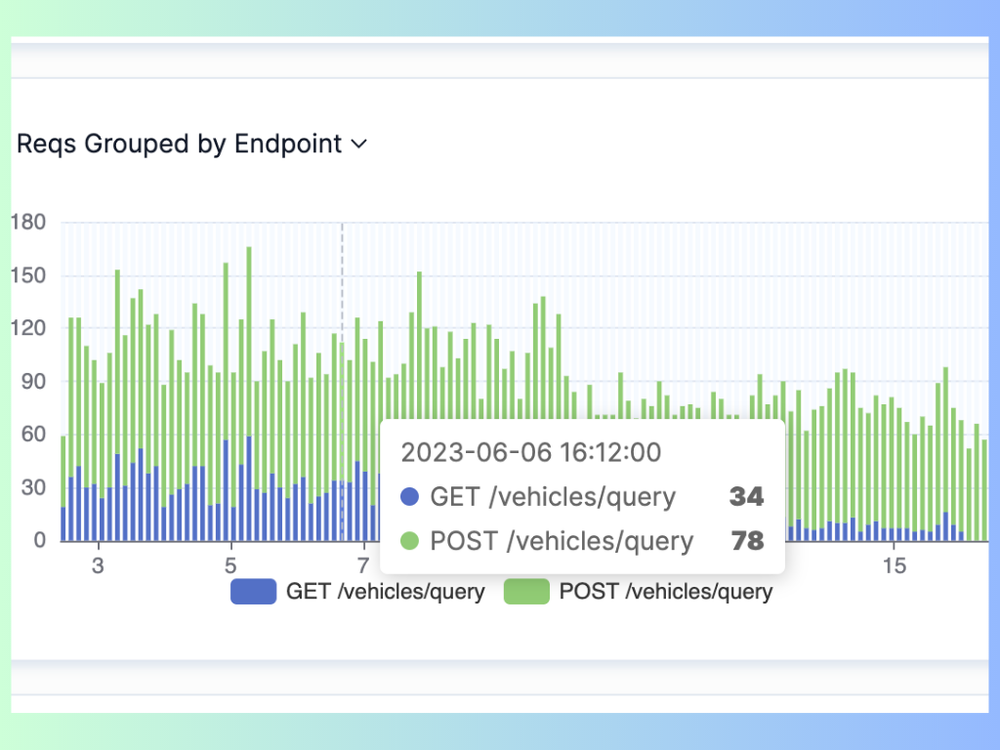

# Web API Performance Best Practices: the Ultimate Guide

Web [APIs](https://apitoolkit.io/blog/best-api-monitoring-and-observability-tools/) are the linchpin in the seamless operation of [modern web applications](https://apitoolkit.io/blog/fintech-api/), bridging the communication gap between diverse services and platforms. They allow developers to serve data and functionalities efficiently, catering to an array of clients from web browsers to mobile applications and other servers. The efficacy of these APIs is not solely in their functionality but in their performance as well.

However, developing a web API is not enough. It also needs to perform well and deliver a fast and reliable user experience. Poor web API performance can have a negative impact on both the user experience and the business outcomes of the web application. Users may abandon the [application](https://apitoolkit.io/blog/api-as-a-product/) if it takes too long to load or respond, resulting in lower engagement, conversion, and retention rates. Moreover, poor web API performance can also affect the scalability and availability of the web application, leading to higher operational costs and lower customer satisfaction.

Therefore, it is crucial for [web developers](https://apitoolkit.io/blog/top-8-api-documentation-tools-for-developers/) to optimize their web APIs for performance and follow the best practices that can help them achieve high-performance web APIs. In this blog post, we will provide an overview of some of the most important web API performance best practices that can help you improve the speed and efficiency of your web APIs.

## Web API Performance Best Practices

## 1. Optimize API Design for Performance

The first step to optimize your web API performance is to [design your API](https://apitoolkit.io/api-documentation-and-developer-portals/) with performance in mind. A well-designed API can reduce the amount of data transferred, the number of requests made, and the complexity of processing required by the API.

Below are some of the key aspects of API design that can affect its performance:

### A. Use Proper Endpoint Structure

One of the most important aspects of API design is how you structure your endpoint URLs. A good endpoint structure should be intuitive, consistent, and follow the [RESTful principles](https://apitoolkit.io/blog/anomalies-in-restful-apis/). This can help you avoid confusion and errors among API consumers and developers, as well as improve the readability and maintainability of your code.

#### Best practices for designing intuitive and consistent endpoint URLs:

- Use nouns to signify both singular and collective resources, like /users for a group of individuals, /products for a range of items, or /orders for a series of purchases.

- Distinguish collections with plural nouns and individual items with singular nouns, for instance, /users for all users and /users/123 for a specific user.

- Utilize standard HTTP methods (GET, POST, PUT, PATCH, DELETE) to denote operations on resources, for example, using GET /users to fetch users or POST /users to add a new one.

- Apply query strings to sort, filter, paginate, or search within your resource collections, such as /users?name=John&age=25&sort=asc&page=2 for a refined user list.

- Implement path variables to pinpoint particular resources or their nested counterparts, like /users/123/orders/456 for a specific user’s order.

- Maintain a uniform naming protocol and syntax across all endpoints, adopting lowercase, hyphens, or camelCase as appropriate for clarity and consistency.

### B. Employ Efficient Request and Response Formats

Another important aspect of API design is how you format your request and response data. The choice of data format can have a significant impact on the performance of your web API, as it affects the size and complexity of the data transferred between the client and the server.

Some of the most common data formats used for web APIs are JSON (JavaScript Object Notation), XML (Extensible Markup Language), Protobuf (Protocol Buffers), etc. Each of these formats has its own advantages and disadvantages in terms of readability, compatibility, flexibility, and efficiency. Therefore, you should choose the data format that best suits your use case and requirements.

Read: [Best API Monitoring and Observability Tools in 2023](https://apitoolkit.io/blog/best-api-monitoring-and-observability-tools/)

#### Best practices for choosing appropriate data formats:

- Use JSON as the default data format for your web API, as it is widely supported by most clients and servers, easy to read and write by humans and machines, and compact and lightweight compared to XML.

- Use XML only if you need to support legacy systems or applications that require XML-based standards or protocols, such as SOAP or RSS.

- Use Protobuf or other binary formats if you need to optimize your data transfer speed and efficiency even further, as they are more compact and faster to serialize and deserialize than JSON or XML. However, keep in mind that binary formats are less readable by humans and may require additional libraries or tools to process them.

- Minimize your payload size by sending only the necessary data fields in your request and response bodies. You can use techniques such as filtering (allowing clients to specify which fields they want to receive), projection (sending only a subset of fields by default), or partial updates (sending only the changed fields instead of the whole resource) to reduce your [payload](https://apitoolkit.io/blog/anomalies-in-restful-apis/) size.

- Enable compression on your server and client sides to reduce the bandwidth consumption and improve the data transfer speed. You can use standard compression algorithms such as gzip or deflate to compress your request and response bodies before sending them over the network.

### C. Implement Caching Mechanisms

One of the most effective ways to improve your web [API performance](https://apitoolkit.io/blog/api-downtime/) is to implement caching mechanisms on both the server and client sides. Caching can help you reduce the load on your server, the [latency of your requests](https://apitoolkit.io/api-performance-monitoring-and-compliance/), and the bandwidth consumption of your data transfer. Caching can also improve the [availability and reliability of your web API](https://apitoolkit.io/api-anomalies-validation-and-checks/ ), as it can serve cached data even if the server is down or slow.

#### Best practices for implementing caching mechanisms are:

- Utilize caching headers to indicate the cacheability and freshness of your response data. You can use headers such as ETag, Last-Modified, Cache-Control, Expires, etc. to provide information about the validity and expiration of your response data. This can help clients to determine whether they need to make a new request to the server or use the cached data from their local storage or intermediate proxies.

- Leverage content delivery networks (CDNs) for caching your static or dynamic content. CDNs are distributed networks of servers that can store and deliver your content from locations closer to your clients. This can help you reduce the latency and bandwidth of your requests, as well as improve the scalability and availability of your web API.

Read: [API Monitoring and Documentation: the Truth You Must Know](https://apitoolkit.io/blog/api-documentation-and-observability-the-truth-you-must-know/)

## 2. Optimize API Request Handling

The second step to optimizing your web API performance is to optimize how you handle your API requests on the server side. A well-optimized request handling system can improve the throughput and efficiency of your server, as well as reduce the response time and resource consumption of your web API.

Here are some of the key aspects of API request handling that can affect its performance:

### A. Minimize Round Trips

One of the main factors that influence the performance of your web API is the number of round trips required to complete a request. A round trip is the time it takes for a request to travel from the client to the server and back. The more round trips required, the longer it takes for a request to be completed, and the more network resources consumed.

Therefore, you should aim to minimize the number of round trips required by your web API by reducing the number of [API calls](https://www.cloudflare.com/learning/security/api/what-is-api-call/) required or utilizing batch requests for multiple operations.

The following strategies can help you minimize round trips:

- Reducing the number of API calls required by designing your API endpoints to provide all the necessary data and functionality in a single call. For example, instead of making multiple calls to retrieve different attributes or sub-resources of a resource, you can provide a single call that returns all the relevant data in one response.

- Utilizing batch requests for multiple operations by allowing clients to send multiple requests in a single HTTP request. For example, instead of making multiple POST requests to create multiple resources, you can provide a single POST request that accepts an array of resources in its body and creates them all at once. This can help you reduce the overhead and latency of making multiple HTTP requests.

Read: [Key Benefits of API Integration for Developers (with Statistics)](https://apitoolkit.io/blog/benefits-of-api-integration/)

### B. Implement Asynchronous Processing

Another important factor that influences the performance of your web API is how you process your API requests on the server side. A synchronous processing model means that each request is processed sequentially and blocks other requests until it is completed. This can limit the scalability and efficiency of your server, as it can only handle a limited number of concurrent requests and may waste resources waiting for long-running tasks.

Therefore, you should aim to implement an asynchronous processing model for your web API by leveraging non-blocking I/O and using background jobs and message queues for long-running tasks.

#### Best practices for implementing asynchronous processing:

- Leveraging non-blocking I/O to improve scalability by using asynchronous or event-driven frameworks or libraries that can handle multiple concurrent requests without blocking or waiting for I/O operations, such as database queries, network calls, file reads or writes, etc. This can help you increase the throughput and efficiency of your server, as it can utilize its resources more effectively and handle more requests per unit time.

- Using background jobs and message queues for long-running tasks by offloading them from the main request thread to separate workers or services that can process them asynchronously. For example, instead of processing a complex or time-consuming operation within a request, you can send it to a message queue (such as [RabbitMQ](https://www.rabbitmq.com/), [Kafka](https://kafka.apache.org/), etc.) that can deliver it to a background job (such as Celery, Sidekiq, etc.) that can process it later. This can help you reduce the response time and resource consumption of your web API, as well as improve its reliability and fault tolerance.

### C. Enable Request Throttling and Rate Limiting

The last but not least factor that influences the performance of your web API is how you manage the [load on your server](https://apitoolkit.io/blog/api-downtime/). A high load on your server can degrade its performance and affect its availability and reliability. Therefore, you should implement mechanisms to prevent overloading your server by implementing request throttling and rate limiting.

Request throttling is a technique that limits the number of concurrent requests that can be handled by your server at any given time. This can help you avoid overloading your server resources and ensure a consistent level of service quality for all requests.

Rate limiting is a technique that limits the number of requests that can be made by a client or an IP address within a certain period of time.

Read: [10 Must-Know API Trends in 2023](https://apitoolkit.io/blog/api-trends/)

## 3. Monitor and Analyze API Performance

Image source: APIToolkit's throughputput tab

One of the key aspects of web API performance is [monitoring and analyzing](https://apitoolkit.io/blog/best-api-monitoring-and-observability-tools/) how the API behaves in different scenarios and environments. This can help you identify and resolve any issues that may affect the API performance, such as errors, bugs, slow responses, or high resource consumption.

There are three main steps to monitoring and analyzing web API performance:

- Set up logging and error tracking
- Implement performance metrics and monitoring
- Conduct regular performance testing

Let's look at each of these steps in more detail.

### 1. Set Up Logging and Error Tracking

Image source: APITookit dashboard

Logging and error tracking are essential for debugging and troubleshooting web [API issues](https://apitoolkit.io/blog/api-downtime/). They can help you capture detailed information about the [API requests and responses](https://apitoolkit.io/api-performance-monitoring-and-compliance/), such as the parameters, headers, body, status code, and execution time. They can also help you detect and report any errors or exceptions that occur during the API execution, such as validation errors, authentication failures, or internal server errors.

### Best practices for setting up logging and error tracking for web APIs:

i. Capturing Detailed Logs for Debugging and Performance Analysis

  - Use a consistent and structured format for logging, such as JSON or XML, to make it easier to parse and [analyze the logs](https://apitoolkit.io/api-logs-and-metrics/).
  
  - Include relevant information in the logs, such as the request ID, timestamp, method, URL, IP address, user agent, response code, response size, and response time.

  - Log both successful and failed requests, as well as any warnings or errors that occur during the API execution.
  
  - Use different log levels to indicate the severity and importance of the log messages, such as debug, info, warn, error, or fatal.
  
  - Store the logs in a centralized and accessible location, such as a database or a cloud service, to enable easy retrieval and analysis.
  
  - Use log rotation and retention policies to manage the log size and avoid filling up the disk space.

ii. Implementing Error Tracking Systems to Identify and Resolve Issues

  - Use an [error tracking system or a service](https://apitoolkit.io/api-logs-and-metrics/) that can automatically capture, report, and notify you of any errors or exceptions that occur in your web API.
  
  - Configure the error tracking system to send alerts via email, SMS, or other channels when a critical or recurring error occurs.
  
  - Use the error tracking system to analyze the root cause of the errors, such as the stack trace, request details, user information, or environment variables.
  
  - Use the error tracking system to track the status and resolution of the errors, such as assigning them to developers, adding comments, or marking them as resolved.

Read: [How to Write API Documentation: 10 Essential Guidelines](https://apitoolkit.io/blog/how-to-write-api-docs/)

### 2. Implement Performance Metrics and Monitoring

Image source: APIToolkit dashboard

Performance metrics and monitoring are crucial for measuring and evaluating web API performance. They can help you quantify how fast and reliable your web API is in terms of response times, latency, throughput, availability, and scalability.

You should implement the following performance metrics and monitoring techniques for your web APIs:

- **Measuring Response Times, Latency, and Throughput**

  **Response time** is the total time it takes for the web API to process a request and send back a response. It includes both [network latency](https://apitoolkit.io/api-anomalies-validation-and-checks/) (the time it takes for the request and response to travel between the client and the server) and server latency (the time it takes for the server to execute the API logic).

  **Latency** is the delay or lag between when a request is sent and when a response is received. It can be affected by various factors, such as network congestion, distance between client and server, server load, or bandwidth limitations.

  **Throughput** is the number of requests that can be processed by the web API per unit of time. It can be measured in terms of requests per second (RPS), transactions per second (TPS), or queries per second (QPS).

- **Use performance metrics tools**

Performance metrics tools or services that can measure and report these metrics for your web API. For example, you should use [APIToolkit](https://apitoolkit.io) to monitor real user traffic and generate load test. APIToolkit is an API management toolbox with all the tools you need to design, test, and monitor the most reliable APIs. 

  - Set performance goals or benchmarks for your web API based on your business requirements, user expectations, or industry standards. For example, you can set a goal to have an average response time of less than 500 milliseconds, a latency of less than 100 milliseconds, or a throughput of more than 1000 RPS.

  - Compare your actual [performance metrics](https://apitoolkit.io/api-logs-and-metrics/) with your performance goals and [identify any gaps or bottlenecks](https://apitoolkit.io/blog/api-logs-and-metrics/) that may affect your web API performance.

  - Utilizing Performance Monitoring Tools and Dashboards
  
  
  Image source: APIToolkit dashboard.

  - Use performance [monitoring tools](https://apitoolkit.io/api-performance-monitoring-and-compliance/) or services that can continuously collect, aggregate, and visualize your web API performance metrics. For example, [APIToolkit](https://apitoolkit.io) can display your web API performance metrics in real-time, and provide comprehensive and integrated performance monitoring solutions.
  
  - Use performance monitoring tools or services that can alert you of any performance issues or [anomalies](https://apitoolkit.io/api-anomalies-validation-and-checks/) that may occur in your web API. For example, APIToolkit can detect and help you troubleshoot bugs or anomalies before they affect your customers. Also, APIToolkit integrates with PagerDuty, OpsGenie, Slack, and email to create powerful alerting systems and notify you of any incidents or emergencies in real-time.

Read: [API Observability and Monitoring: What’s the Difference?](https://apitoolkit.io/blog/api-observability-and-api-monitoring/)

### C. Conduct Regular Performance Testing

Once proper monitoring has been achieved and a bug is fixed, you can now you utiilize the API workflows and a tester tool to write test cases for this scenario, so it never happens again. Use the [APItoolkit test workflow UI builder](https://apitoolkit.io/blog/api-testing-automation) to easily run these tests. Your tests can be scheduled to run against production at any interval you prefer.

Read: [Ultimate Guide to API Testing Automation](https://apitoolkit.io/blog/api-testing-automation)

## Conclusion

Optimizing web API performance is crucial for ensuring a seamless user experience and driving the success of your application or service. By following best practices in three key areas - API design, request handling, and performance monitoring - you can greatly enhance the efficiency and responsiveness of your APIs.

Get started on APIToolkit for free. Click [here](https://apitoolkit.io).

**Keep Reading**

[How to Generate Automated API Documentation](https://apitoolkit.io/blog/how-to-generate-automated-api-documentation/)

[How to Analyze API Logs and Metrics for Better Performance (Ultimate Guide)](https://apitoolkit.io/blog/api-logs-and-metrics/)

[How to Tackle Anomalies in RESTful APIs (the Right Way)](https://apitoolkit.io/blog/anomalies-in-restful-apis/)
