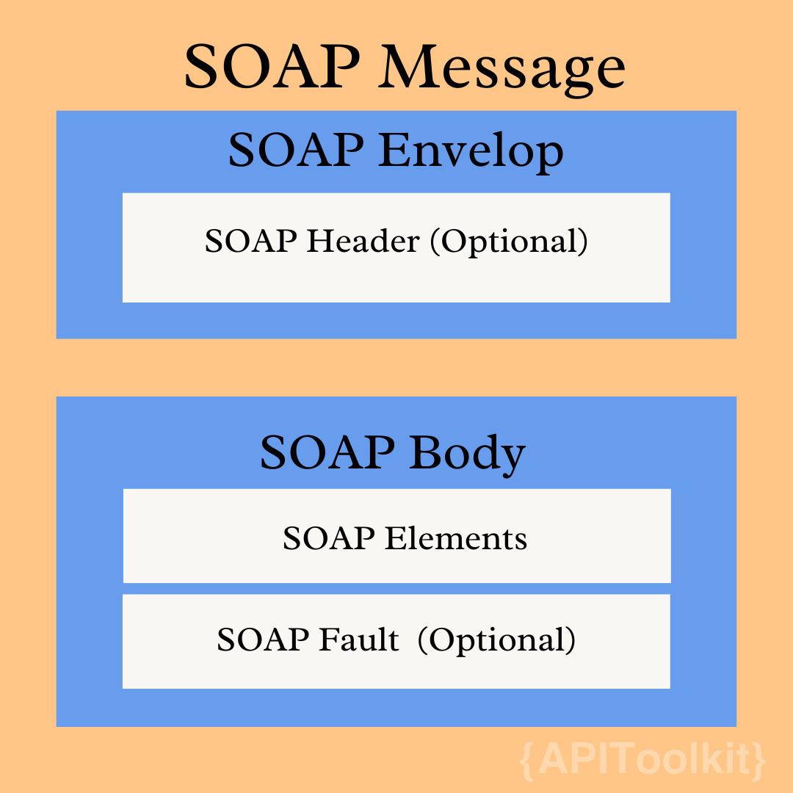

Each login to a favorite website using a Google account is an interaction made possible by a [web API](https://apitoolkit.io/blog/web-api-performance/). But beyond this surface-level interaction lies the intricate world of web service APIs, crucial for developers and tech enthusiasts to understand. Before delving into what web service APIs are, perhaps I should define what an [API](https://apitoolkit.io/blog/unlocking-the-full-potential-of-api-gateways/) is. An API is a component that enables communication between two systems or applications. 

Web service APIs are subsets of APIs that depend on a networks, predominantly the internet, to enable this cross-communication. The [World Wide Web Consortium](http://www.w3.org/2005/Talks/01-ws-plh/?n=1) (W3C) defined web services thus: “A web service is a software system designed to support interoperable machine-to-machine interaction over a network. It has an interface described in a machine-processable format (specifically WSDL). Other systems interact with the web service in a manner prescribed by its description using SOAP-messages, typically conveyed using HTTP with an XML serialization in conjunction with other web-related standards”.

Developers interact with web services on a daily basis. This is why an in-depth understanding of these important components is necessary. I cover the differences and similarities between APIs and web services in [another article](http://apitoolkit.io/blog/apis-and-web-services).

## What Are the Types of Web Services?

There are 4 main types of web service APIs, namely:

**XML-RPC (Extensible Markup Language-Remote Procedure Call)**: This is the most basic XML protocol. This protocol allows data exchange between a variety of devices on a given network. It facilitates the transfer of data and other information between clients and servers using HTTP. 

**REST**: [REST](https://apitoolkit.io/blog/rest-api-is-the-future/) is an acronym for Representational State Transfer. REST services use HTTP and support a range of HTTP methods such as GET, POST, PUT, and DELETE. It allows for communication and connectivity between API-based devices and the internet. 

**SOAP**: SOAP stands for Simple Object Access Protocol. A Web service protocol that uses XML to facilitate transferring data and documents over HTTP or SMTP (Simple Mail Transfer Protocol). It uses XML to enable communication between independent processes running on different platforms.

**UDDI**: UDDI is an abbreviation for Universal Description, Discovery, and Integration, is an XML-based standard for detailing, publishing, and discovering web services.

Other web services that use markup language
- JSON-RPC.
- JSON-WSP
- Representational state transfer (REST) versus remote procedure call (RPC)
- Web Services Conversation Language (WSCL)
- Web Services Description Language (WSDL), developed by the W3C
- Web Services Flow Language (WSFL), superseded by BPEL
- Web template
- WS-MetadataExchange
- XML Interface for Network Services (XINS), provides a POX-style web service specification format

## Key Features of Web Services

**Interoperability**: One of the major benefits of web service is interoperability. Web services provide a standardized way of integrating web-based applications using the XML, SOAP, WSDL, and UDDI open standards over an Internet Protocol backbone applications to communicate, exchange data, and share services among themselves.

The common standards-based communications methods have been developed and these make it possible for web services to be platform-independent.  

**Usability**: Web services are designed to be used for a web page request and to receive data. Web services are the same. The capability of web services varies from simple information lookup to complex algorithmic computations. 

XML is the data format used to contain the data and provide metadata around it, SOAP is used to transfer the data, WSDL is used for describing the services available, and UDDI lists what services are available.

**Reusability**: Web Services are designed to be combined to deliver more value-added services. As building blocks for other services, web services make it easy to reuse web service components. Additionally, legacy applications can be wrapped into web services so that they can be used by others.

A web service is deployed over the internet using standard Apache, Axis2 to generate HTTP and WSDL documents. Deployment is easy due to this.

**Cost**: The cost of operating web services is reduced because new systems are assembled from packaged web services. The saved cost can be a benefit to both the solution provider and the customer. Furthermore, efficiency is achieved at the same time.

## How Does SOAP Work?

Data transmitted over the internet has to be structured in some way. The two most popular data formats are XML and JSON.

XML (or Extensible Markup Language) is the text format that [SOAP](https://apitoolkit.io/blog/everything-about-soap-apis/) uses. It establishes a set of rules to structure messages as both human and machine-readable records. Albeit, XML is quite verbose as it aims to create a web document with all its formality.

### The Message Structure of SOAP
Standard [SOAP](https://apitoolkit.io/blog/everything-about-soap-apis/) requests appear as an enveloped messages consisiting of four elemetns, each with their unique funveloped message consisting of four unique parts, each with its own function.

**Envelope**: the core and essential component of every message. It starts and concludes messages with its tags, enveloping them, hence the name.

**Header**: an optional element that determines the specifics, and extra requirements for the message, e.g. authentication.

**Body**: includes the request or response.

**Fault**: another optional element that shows all data about any errors that could emerge throughout the API request and response.

## How REST Works: Understanding Through a Facebook Graph API Example

Let's dive straight into an example to understand how [REST](https://apitoolkit.io/blog/rest-api-is-the-future/) operates. Consider how you typically access a Facebook page, like the YouTube page. You would enter www.facebook.com/youtube in your browser, which sends a request to Facebook's servers. In response, you receive the HTML-rendered page of YouTube’s Facebook profile.

However, if you're a developer and you want to access specific data from this page using the [REST](https://apitoolkit.io/blog/rest-api-is-the-future/) architectural style, the approach changes. Instead of the regular URL, you would use the Graph API endpoint: graph.facebook.com/youtube. This is still a request made over HTTP, but here's where things get interesting.

When you make this request, instead of receiving a fully rendered webpage, you get a structured JSON response. This response contains key-value pairs detailing specific information about the YouTube page. For instance, you might see data on the number of likes, the amount of followers, recent activity, and other metadata. This data is structured, precise, and easily parsable, making it ideal for programmatic access.

This example showcases the essence of REST: a stateless, client-server communication where the server replies with structured, predictable responses to HTTP requests. By using [REST](https://apitoolkit.io/blog/rest-api-is-the-future/), developers can efficiently extract and manipulate data, integrate it with other applications, or use it to inform user interfaces, making it a powerful tool in modern web development.

## Structure of a REST Request
**The Endpoint**: This is a unique URL that represents an object or group of objects of data. Each API request has its own endpoint, which is what the HTTP client is directed at in order to interact with data resources.

**The Method**: HTTP methods (which will be explained in further detail below) are an integral part of a RESTful API request. These methods – GET, POST, PUSH, PATCH, and DELETE – correspond to create, read, update, and delete resources.

**The Headers**: REST headers contain information that represents metadata associated with every single [REST API](https://apitoolkit.io/blog/rest-api-scalability/) request. A REST header indicates the format of the request and response. This provides information about the status of the request.

**The Data**: A [REST API](https://apitoolkit.io/blog/rest-api-scalability/) request also consists of data (also referred to as a “body”) that usually works with the POST, PUT, and PATCH HTTP commands and contains the information and representation of the resource that will be created.

## Major Differences Between SOAP and REST
| | |
| ----------- | ------------- |
| SOAP is a strict protocol. | REST is an architectural pattern | 
| SOAP can’t use REST because it is a protocol | REST can use SOAP web services because it is a concept and can use any protocol like HTTP, SOAP. |
| SOAP only permits XML | REST permits many different data formats including plain text, HTML, XML, and JSON |
| SOAP requires more bandwidth and more resources | REST requires less bandwidth and fewer resources. |
| SOAP supports both SMTP and HTTP protocols | REST requires the use of HTTP only |
| SOAP is more reliable than REST | REST is less secure than SOAP. | 
| SOAP is faster than REST | Great for building a service with multiple, non-CRUD methods |

## Conclusion
There are many use cases for web services and the use case is largely defined by the team working with them. Other factors like speed, team size, and project specifications help inform what web services to use.

Ultimately, the information I’ve provided here should help you make a good choice of web service for your project.

## Keep Reading

[Web API Performance Best Practices: the Ultimate Guide](https://apitoolkit.io/blog/web-api-performance/)

[10 Must-Know API trends in 2023](https://apitoolkit.io/blog/api-trends/)

[How to Analyze API Logs and Metrics for Better Performance](https://apitoolkit.io/blog/api-logs-and-metrics/)

[Incident Management: How to Resolve API Downtime Issues Before It Escalates](https://apitoolkit.io/blog/api-downtime/)

[How to Tackle Anomalies in RESTful APIs](https://apitoolkit.io/blog/anomalies-in-restful-apis/)

[Top 7 Reasons Why Your Team Should Use an API Monitoring Tool](https://apitoolkit.io/blog/why-you-need-an-api-monitoring-tool/)
