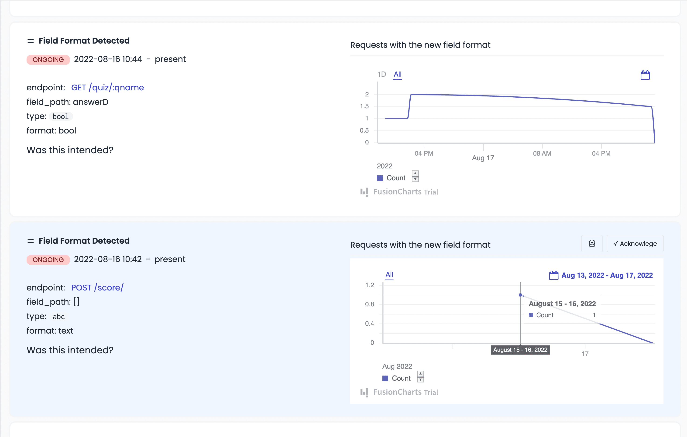
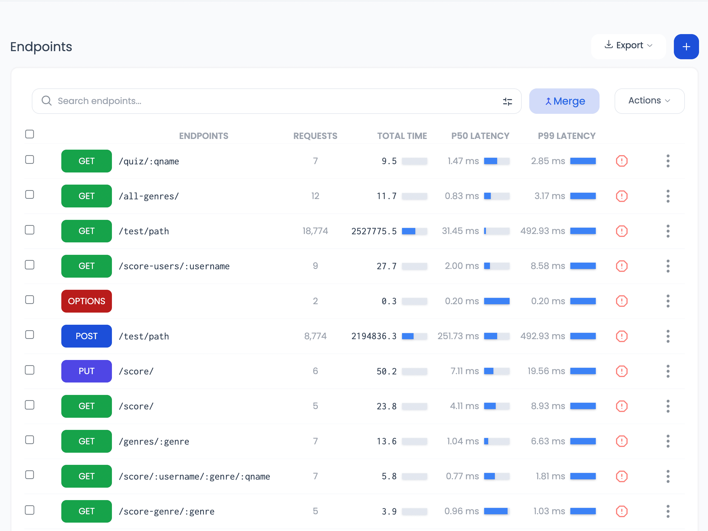
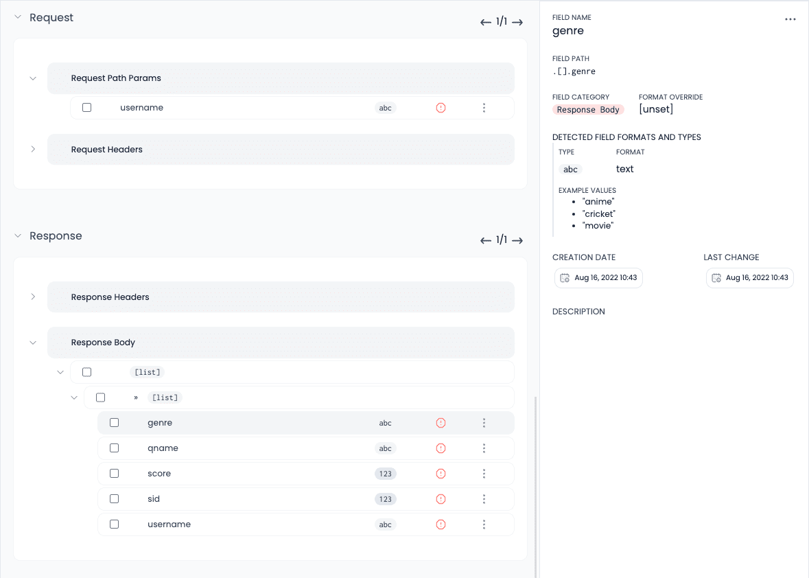



<!-- Blurred bg image generated from: https://fffuel.co/bbblurry/ -->
<section  style="background: url('/assets/img/blob-landing-center5.svg') no-repeat left bottom local" class=" bg-contain">

<section>
  

    

        
      <a class="inline-block bg-blue-900/90 text-white px-5 py-1 text-xs rounded-2xl" href="/blog/updates-october-2022/">
        ✨ Read the latest updates  🚀
      </a>
      <h1 class="pt-2 text-blue-title leading-tight tracking-tight text-[1.83rem] sm:text-5xl drop-shadow-lg" style="font-variation-settings: 'wght' 900;">The API Developer's Toolbox!</h1>
      

        
Every <strong>Tool</strong> you need to <strong>Design</strong>, <strong>Test</strong>, <strong>Monitor</strong> & <strong>Maintain</strong> the most reliable APIs.

        <!-- 
 -->
        <!--   
        <!--     src="/assets/img/ill_man_measuring.svg" -->
        <!--     alt="Man measuring a graph" -->
        <!--     class="w-24 inline-block" -->
        <!--   /> -->
        <!-- 
 -->
        

          <a
            href="https://app.apitoolkit.io"
            class=" drop-shadow hover:drop-shadow-lg transition-all rounded-md hover:bg-yellow-300 bg-amber-300 text-black border border-amber-400 font-semibold inline-block px-4 py-2 mt-2 sm:mt-0"
          >
            Get Started for Free
          </a>
           OR 
          <a href="https://calendly.com/tonyalaribe/30min"
            target="_blank"
            class="drop-shadow rounded-md border border-gray-200 bg-gray-100 hover:bg-gray-200  text-xs text-gray-900 inline-block px-4 py-2 sm:ml-1 mt-2 sm:mt-0"
          >
            Get a demo &nbsp;
          </a>
          

            <small class="inline-block">✓ Always free plan</small>
            <small class="inline-block">✓ GDPR compliant</small>
            <small class="inline-block">✓ Data processed in EU</small>
          

        

      

    

    
  

</section>



<section class="flex items-center justify-center pt-24">
  

    
<iframe class="rounded-lg border-4 border-gray-200 " src="https://www.loom.com/embed/24ea3ae9600544d68f1001af3f4feac2?hide_title=true&hide_owner=true&hideEmbedTopBar=true" frameborder="0" webkitallowfullscreen mozallowfullscreen allowfullscreen style="position: absolute; top: 0; left: 0; width: 100%; height: 100%;"></iframe>

    
<a href="https://www.loom.com/share/24ea3ae9600544d68f1001af3f4feac2" target="_blank" class="inline-block bg-blue-900 text-white px-3 py-1 text-xs rounded-lg" >Learn how APIToolkit works (Video)</a>

  

</section>
</section>

<section class="mt-20 text-center">
  <section class="md:max-w-5xl inline-block text-left">
    

    
###### WHY APITOOLKIT?
## Empower your <strong class="drop-shadow-md">Developers</strong> to create  <strong class="drop-shadow-md">Happier Customer</strong> **experiences**.

 
 

All the <strong>Tools</strong> you need to <strong>design</strong> your APIs, <strong>interpret</strong> what's going on in your APIs, <strong>Investigate incidents</strong> and <strong>generate insights</strong>. In one package.
  
With <strong>daily & weekly reports</strong> on everything going on in your services.
    

  

    <a class="transition-all border-l-4 border-l-amber-400  rounded-md p-2 sm:p-5 border border-gray-200 drop-shadow-md shadow-amber-500 hover:shadow-md" href="/api-anomalies-validation-and-checks">
      API Designer and Mocker 
    </a>
    <a class="transition-all border-l-4 border-l-amber-400 rounded-md p-2 sm:p-5 border border-gray-200 drop-shadow-md shadow-amber-500 hover:shadow-md" href="/api-anomalies-validation-and-checks">
      Live API tester 
    </a>
    <a class="transition-all border-l-4 border-l-amber-400  rounded-md p-2 sm:p-5 border border-gray-200 drop-shadow-md shadow-amber-500 hover:shadow-md" href="/api-logs-and-metrics">
      API Log Explorer
    </a>
    <a class="transition-all border-l-4 border-l-amber-400 rounded-md p-2 sm:p-5 border border-gray-200 drop-shadow-md shadow-amber-500 hover:shadow-md" href="/api-performance-monitoring-and-compliance">
      Metrics & Performance Monitor
    </a>
    <a class="transition-all border-l-4 border-l-amber-400 rounded-md p-2 sm:p-5 border border-gray-200 drop-shadow-md shadow-amber-500 hover:shadow-md" href="/api-documentation-and-developer-portals">
      Swagger Generator & Editor
    </a>
    <a class="transition-all border-l-4 border-l-amber-400 rounded-md p-2 sm:p-5 border border-gray-200 drop-shadow-md shadow-amber-500 hover:shadow-md" href="/api-anomalies-validation-and-checks">
      Payload Validation & Anomaly Detector  
    </a>
  

{}

  

##### Anomalies and Data validation
## DETECT CRITICAL INCIDENTS
 

  - Validate all live traffic against OpenAPI spec
  - Define custom API Test workflows to be run and their schedule
  - Get notified about API changes or test failures before your customers
  
<a class="text-blue-900" href="/api-anomalies-validation-and-checks">More about the Anomaly detector →</a>

{}

{}

##### API Logs and Metrics
## QUERY, ANALYZE & VISUALIZE API DATA
 

  - During API incidents Query and analyze failing API requests and responses 
  - Analyze or Chart against fields within your API requests and responses 
  - Calculate aggregates from fields in your API Data without going to your database

<a class="text-blue-900" href="/api-logs-and-metrics">More about the Log explorer →</a>

  

{}

{}

  

##### Performance monitoring
## DETECT AND TRACK SLOW ENDPOINTS 
 

  - View Endpoint response times over periods of time
  - View latency distributions over your entire backend or specific endpoints
  - Get optimization advice. Eg about data that should be cached

<a class="text-blue-900" href="/api-performance-monitoring-and-compliance">More about the performance metrics →</a>

{}

{}

##### Mission Control for your APIs 
## BIRDS EYE VIEW OF YOUR ENTIRE API
 

  - View all your endpoints, fields, and the shapes of data passing through your endpoints.
  - Watch anomalies as they happen, and their distribution between endpoints 
  - Track throughput, Latency and Errors across your service and endpoints

<a class="text-blue-900" href="/api-mission-control">More about Mission Control for your APIs→</a>

  

{}

{}

  

##### Documentation and Overview
## ALWAYS UP TO DATE API DOCUMENTATION
 

  - Always up to date API Docs based on your live traffic 
  - Upload swagger or open API specs from CI and collaborate on the swagger Documentation with your team 
  - Generate swagger or open API spec based on your live production traffic

<a class="text-blue-900" href="/api-documentation-and-developer-portals">More about our Automatic Documenter →</a>

{}

##### Alerting and incident management 
## ALERT THE RIGHT PERSON AT THE RIGHT TIME 

When something goes wrong, notify the right person at the right time over slack, pagerduty, opsgenie or any other platform via our zapier integrations. 

<a class="text-blue-900" href="">Learn about our incident management integrations.</a>

  </section>
</section>

<section class="my-24">

#### Wall of **LOVE**
## Loved by Developers and Engineering teams

 
 

<iframe height="800px" id="testimonialto-apitoolkit-light-animated" src="https://embed-v2.testimonial.to/w/apitoolkit?animated=off&theme=light&shadowColor=f78da740" frameborder="0" scrolling="no" width="100%"></iframe>
</section>

{}
  <section class="pt-20 sm:pt-36">
    <!-- integrations -->
    

      Plug & Play integrations
      
      
      
      
      
      & more
    

  </section>
  <section class="mt-48 mb-28">
    <!-- Founders note -->

   
  

    

## Founders Note
#### ( Why we are solving API reliability )

Picture this: I joined a food delivery company, all excited and ready to tackle challenges. 
One day, we migrated a service from PHP to Golang, following the swagger docs diligently. 
We made sure the responses matched, tested everything, and launched with confidence.

But oh boy, did things go haywire! Our order monitoring charts went berserk within minutes. 
A whopping 20k orders vanished into thin air. Panic ensued. What on earth happened?

Turns out, in a few countries we operated in, a crucial field required by the apps mysteriously disappeared. 
No one saw it coming because it wasn't mentioned in the inherited documentation. It only affected specific countries that weren't part of our manual tests.

We swiftly fixed the issue and reverted to the old system. But here's the kicker: I wished we had a magical tool that could have caught this problem way sooner.

Fast forward to today, and guess what? We've created that tool! We want to hear your own epic tales of API chaos and help you bid them farewell. 
Let's make sure those stories become relics of the past together.

Join us on this exciting journey!

  

    Anthony (<a
      href="https://twitter.com/tonialaribe"
      class="text-blue-800"
      >@tonialaribe</a
    >) and Smile(<a
      href="https://twitter.com/SmileEgbai"
      class="text-blue-800"
      >@smilecs</a
    >)
  

  

  </section>
{}

  <section class="bg-gradient-yellow  mt-32 text-white gradient-yellow">
    {}

  ## APIToolkit is built by Developers for Developers. To solve pain points we've all faced.

  We’re engineers at our core, who are very close to the problems we are
  solving. So, we encourage you to be a part of this community
  evolving solutions to solve API documentation, management and observability.

  

    
    Or
    <a
      class="inline-block rounded bg-amber-300 hover:bg-yellow-300 text-black font-bold px-8 py-2 drop-shadow-xl hover:drop-shadow hover:shadow-md"
      href="https://calendly.com/tonyalaribe/30min"
      target="_blank"
      >Let's have a Chat</a
    >
  

    {}
  </section>


<section class="flex flex-row justify-center">
  

    

      <h1 class="text-3xl text-blue-title">
        APIToolkit is fixing API Workflows & Reliability 
      </h1>
      

        

          APIToolkit is creating a world where you don’t lose customers
          due to broken API contracts or reliability. Signup 
          to be a part of our journey. 
        

        

          <small class="text-blue-title font-semibold px-1"
            >Subscribe to keep up with our journey below</small
          >

    

        

            <form id="ap3w-embeddable-form-6430710fa90d72f544ac4d87" class="ap3w-embeddable-form-content flex flex-col sm:flex-row mt-4">
                

                    <input type="email" id="ap3w-form-input-email-6430710fa90d72f544ac4d87" step="1" name="email" required="" 
                        class="border border-blue-500 rounded-md px-4 py-2 text-xs w-full" name="email_address"
                        placeholder="Email address. eg abc@example.com"
                    />
                

                

                    <button id="ap3w-form-button-6430710fa90d72f544ac4d87" type="submit" data-select="true" data-button-on-click="thank-you"
                        class="rounded-md bg-blue-900 hover:bg-blue-800 border-blue-900 text-xs text-white inline-block px-4 py-2 sm:ml-1 mt-2 sm:mt-0"
                    >Subscribe</button>
                

            </form>
        

    

    

        

            <form id="ap3w-embeddable-form-6430710fa90d72f544ac4d87" class="ap3w-embeddable-form-content">
                

                    

                        
Success! Now check your email to confirm your subscription.

                    

                

            </form>
        

    

        

      

    

    
  

</section>


