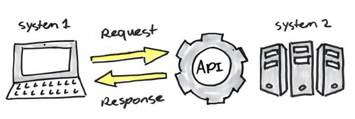

 

Recently, there have been numerous conversations regarding how important APIs are to improving web-based activity. 

Although the developer's perspective has not received much attention, APIs are incredibly useful to every set of specialists. APIs, also known as Application Programming Interfaces, have been around for a while and have established themselves as crucial technology in different industries.Given that big data is revealing a lot of information and new technologies are emerging, we can say that APIs are now more important than ever because they allow developers to collaborate with stakeholders to improve agency systems, increasing the possibilities for innovation.

## Benefits of API Integration for developer 
A few years back, if I wanted to order a pizza, I would have to give the dispatcher my address and try to describe where I was in order to get my pizza, but now with the expertise of APIs (e.g. Google Maps API), it's a lot simpler. The Google Maps API is a location-based app installed on billions of devices worldwide to assist businesses with providing better services and establishing more efficient connections with suppliers, clients, delivery services, and other parties. It sends directions and analyzes various types of location data, making life much easier for everyone. This is a typical example of how easy life can become by merely integrating APIs. Below is a list of the key benefits of API Integration for developers. 

- Increase Integration Speed  
Having APIS allows the integration of services and other third parties to which in turn speeds up communication between the business and its customers, promoting automation and scaleability. This is the reason why Jeff Bezos of Amazon, emphasized in a memo to his staff that all services must provide APIs and connect with one another using those APIs. APIs are faster and much more efficient to utilize because they are considerably easier for developers to integrate into their code thanks to a predetermined standard. Even though you'll have to spend a bit more time reading documentation and looking for certain functions, it's a more user-friendly system to integrate into your business and any product you're working on. With the aid of APIs, content may be simply incorporated from any website or program. This ensures a more fluid distribution of information and a cohesive user experience. With the rise of smartphones and tablets, APIs have a significant edge when it comes to helping businesses connect their services and content into other applications and devices. This implies that your consumer won't need to download any additional apps or programs to access all of your information immediately through an app or website on their phone or tablet. This translates to maximum accessibility for your clients, who will have quick access to all the information they require. 

- Transform Customer Experience  
API integration has made businesses composable by allowing teams across the organization to compose, recompose, and adapt these APIs to meet the changing needs of the business making them discoverable, and then making them available for the business to self-serve. Imagine an importing company creating an internal Customer API  that includes details about registered customers, their address, email, purchase history, etc. from various System APIs in front of customer databases; in other words, it creates a single view of customers. This is an example of a customer experience transformation. One internal API can be used for a variety of purposes and can help the entire organization's business operations run more smoothly. Additionally, businesses can make their APIs available to partners, who can improve them and offer customers a more thorough, omnichannel engagement. Every API that is built continues to add value for future business requirements with API-led connectivity.  

- Competitive  
Banks have embraced open banking APIs and standards, while Netflix, Stripe, AWS, and UBER  have all been successful that’s why they have put APIs first because they know that having APIs allow them to be competitive. A good API allows your application and third parties, business partners, and customers to integrate a quick review sys with other system. As a company being able to provide these functionality quickly due to incredibly fast integration of files  is quite competitive to me and this can only be achieved with APIs. APIs also speedup the integration between services and they enable you deliver functionality quickly. 

 

- Reusability and Duplication  
In the development world when you want to duplicate a file, you can either copy and paste, create shared libraries or create API functions. Creating API functions is much easy becasue you can call from any service just by updating one service/deployables when you need to modify logic as long as you are not making a break in change. APIs have become the building blocks which you can reuse in your architecture as a developer enabling quicker innovations and ability to change quickly.  

- Efficiency 
When access to an API is granted, the content created can be automatically published and accessible across all channels. It makes it easier to share and distribute content because it can be readily embedded into any website or application. This guarantees more fluid information delivery and an integrated user experience. Any tech engineer will know how difficult it can be to work with CMS packages, but APIs offer a much simpler solution. If you desire efficiency, then APIs are the answer. With an API, a distribution layer for information and services to new audiences can be built, which can then be customized to produce unique user experiences enabling every individual, not just a chosen few, to have access to all of the data produced at the government level. One key benefit of the API is the improved connection and data, which enables you to do more. 