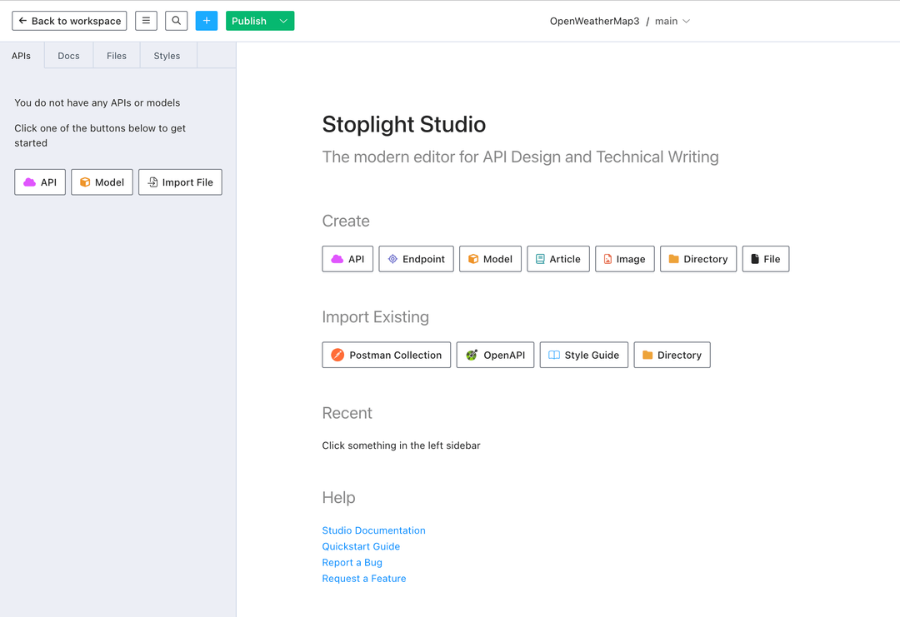

Monitoring your APIs is crucial to ensure the smooth operation of any application that relies upon them. However, managing this can be a complex task due to the sheer number of APIs available out there. Therefore, it's important to have tools in place that help you monitor your APIs effectively.

To address this issue, we present here top 7 alternatives to RapidAPI which are known for their monitoring and observability capabilities. These options include APItoolkit, New Relic, Datadog, Postman, splunk, assertible and stoplight. Each tool has its strengths and weaknesses, so it’ important to evaluate each one individually before deciding on the best fit for your needs.

### What is API Monitoring and API Observability

### API Monitoring
API monitoring refers to tracking and analyzing the performance and behavior of an API in real time. This includes metrics like response times, error rates, request volumes, and more. The goal of API monitoring is to identify issues early (before they become critical) by providing valuable insights into how your API behaves under different conditions.

### API Observability
API observability refers to tracking not just errors but also performance metrics such as response times, request volumes, and server health in real time. This allows developers to gain insights into how their application interacts with external services, which can be particularly useful when dealing with third party integrations or application interacts with external services, which can be essential for debugging issues or optimizing performance.

## Limitations of RapidAPI 

RapidAPI is a platform that provides access to over 80,000 APIs but doesn't offer native observability features like others do. This makes it difficult to get detailed insights into how your applications are interacting with these APIs. 

Additionally, While RapidAPI provides some great features such as documentation, testing, and mocking, they do lack in terms of observability. They don't offer dedicated dashboards where you can track the behavior of your APIs in real time. Additionally, their support for custom metrics is limited, and they do not provide detailed error messages which could be very useful for troubleshooting.

## Key Features of a Modern API Monitoring and Observability  Solution

* **Real-time monitoring**: This feature allows you to track how your API performs in real time. It provides insights into request rates, response times, error rates, etc., so you can identify bottlenecks or performance issues early on.

* **Alerting**: A good monitoring solution should provide alerts when certain thresholds are exceeded (e.g., too many failed requests within a short period). These alerts should be delivered via various channels such as email, SMS, or webhooks.

* **Traceability**: In complex systems with multiple microservices, it's important to have a way to trace requests from start to finish. The ability to see how different parts of an API interact with each other will help you understand where problems are coming from.

* **Security**: Security features like rate limiting, IP whitelisting/blacklisting can be added to prevent unauthorized access to your API.

* **Cost efficiency**: As your API grows in complexity and scale, the cost of running a monitoring solution should decrease while still providing valuable insights.

## Best RapidAPI alternatives

### APItoolkit
[API Toolkit](https://www.apitoolkit.io/) provides monitoring,observability, and analytics capabilities similar to those offered by RapidAPI. It offers real-time logs, request/response details, error tracking, and customizable alerts. 

Additionally, it offers an HTTP proxy service which can be used as a reverse proxy or as part of a load balancing setup. The free tier includes up to countless projects with limited features but enough for small projects. For larger applications, you may need to pay as you grow. [Check our pricing page](https://apitoolkit.io/pricing/)

### Features
- [x] **Real-Time Log Viewer:** Allows users to view live log data from their servers in real time. This feature is particularly useful when debugging issues related to network requests.

- [x] **Request & Response Tracer:** Provides detailed information about each request made by the user' application including headers, parameters, response codes, etc. This feature helps users understand how their code interacts with external services.

- [x] **Error Tracking:** Tracks errors generated by both the client and server side of an application. This feature allows developers to identify patterns and fix recurring bugs more efficiently.

- [x] **Custom Alerts:** Users can set up custom alerts based on specific criteria such as response times or error rates. These alerts will notify users via email if certain conditions are met.

- [x] **Detailed Metrics**: Get insights into how your API performs in real time, including metrics like response times, error rates, and traffic volumes. This allows you to identify bottlnecks and understand how your API behaves under different loads.

- [x] **Alerts & Notifications**: Set up alerts for specific conditions such as high error rates or slow response times so that you can stay on top of any issues affecting your API.
- [x] **Traffic Analysis**: Analyze the traffic to your APIs in real time, including details about requests, responses, errors, latency, and more. This data will help you understand how your API is performing under different loads and identify potential bottlenecks.

- [x] **Traceability**: Analyze the flow of requests through your system by following traces from requests to responses. This helps you understand where problems are occurring and what dependencies your API has.

## Comparison with RapidAPI
While [API Toolkit](https://www.apitoolkit.io/) shares many features with RapidAPI, there are some key differences that make it a better choice depending on your needs.

1. **Cost**: API Toolkit offers a free tier with limited functionality, while RapidAPI charges per month. If your project is relatively small, API Toolkit might be sufficient for your needs. However, if you anticipate growing beyond the limitations of the free tier, consider investing in a paid subscription to API Toolkit.

2. **Integration**: RapidAPI integrates seamlessly into existing systems whereas APIToolkit requires additional configuration and integration efforts. Depending on your team's familiarity with APIs and Toolkit requires additional configuration and integration efforts. Depending on how deeply your system is integrated with other tools, this could be a deciding factor for you.

3. **Customizability**: Both platforms offer customization options allowing users to tailor their solutions according to their specific requirements. However, the level of customization differs between the two platforms - RapidAPI has a more extensive range of customization options compared to APIToolkit.

4. **User Interface**: The dashboards in API Toolkit are generally considered easier to use and navigate than those in RapidAPI. While this does not necessarily mean one platform is better than the other, it may provide a smoother experience for new users.

5. **Support**: As of now (2024), APIToolkit seems to have better customer support compared to RapidAPI. You can reach out to APItoolkit through our official chat support or submit a ticket on our website. On the other hand,you can contact RapidAPI support through their website or social media channels.

### Datadog
[Datadog's API monitoring tool](https://www.datadoghq.com/) provides deep visibility into the performance, health, and usage of your APIs at any scale. Offers real-time alerting on API errors, latency issues, or traffic spikes Allows you to correlate logs, traces, and metrics across different services in order to troubleshot Has an intuitive dashboard that allows developers to understand how their code impacts the overall system. [More details about Datadog's API monitoring capabilities here](https://docs.datadoghq.com/)

### Features
- [x] **Real Time Traffic**: Datadog provides real time traffic metrics which allows you to monitor the performance of your APIs in near real time. This can be very useful for detecting issues that may only become apparent after some time has passed, such as high latency or frequent errors.

- [ ] **Error Rate & Performance Metrics**: While Datadog does provide error rate metrics, it doesn’t specifically offer separate performance metrics like CPU usage or memory usage. This might not be a big deal for many applications but if your application is resource heavy then this could be important information to have available.

- [x] **APM Integration**: Datadog offers native integration with their APIMonitoring product (APM), which allows you to trace requests as they travel through your system and see detailed information on how long each part of your request took, where bottlenecks are occurring, etc. This can be incredibly helpful for identifying slow parts of your code that need optimizing.

### New Relic
New Relic provides application performance management (APM) for web applications, mobile apps, and server side applications. It offers detailed insights into request processing times, error rates, CPU/Memory usage, etc. For APIs specifically, it has "Synthetics" which lets you monitor your endpoints from multiple locations using our robust infrastructure. 

This can be used as a form of load testing Additionally, there is a feature called "Insights" where you can analyze data from APM and other sources to get more insight into what’s happening within your app. [Learn more about New Relic's API features here](https://docs.newrelic.com/docs/apm/new-relic-apm/getting-started/introduction-new-relic-apm).

### Features
- [x] Real-time APM (Application Performance Management). You get detailed insights into how your application is performing in real time, including metrics like CPU usage, memory usage, request throughput, error rates, and more.

- [ ] Analytics: While New Relic does provide some analytics capabilities, it doesn’ doesn’t offer the same level of detail as Datadog or AppDynamics.

- [x] Distributed tracing: If you have a distributed system, New Relic allows you to trace requests as they propagate through your various services, showing how long each part takes and any issues that might be causing performance problems.

- [ ] Code coverage/test coverage: New Relic only provides APM data; it doesn doesn’t offer any information on what percentage of your code is covered by tests. This can be important if you want to ensure that all parts of your application are properly tested.

### Splunk
Splunk provides a free trial and has an open-source version called Light. It is widely used in the industry to monitor applications, servers, networks, databases, and more. It supports distributed tracing which allows you to see how requests flow through your system. 

You can use it to search logs, events, metrics, and traces all together. You can also build dashboards using these data sources. For example, you could create a dashboard showing the number of errors per minute over the last hour grouped by error type. Another one showing a heatmap of request latency over the past 24 hours.

### Feature
- [x] **Real-time alerting**: If a specific condition is met (e.g.,the number of requests per minute exceeds 10), an email or text message will be sent to the specified recipients.

- [x] **Real Time Monitoring**: Splunk provides real time data ingestion and indexing allowing you to monitor the performance of your APIs as they are being used in production. This is a feature that is not available on other platforms.

- [x] **Scalability**: The tool is designed to scale as you grow and add more APIs or services to monitor. It supports distributed tracing across multiple nodes in a cluster.

- [x] **Ease of use**: The UI is clean and easy to navigate. It allows you  to monitor multiple APIs from a single dashboard, which makes it easier to keep track of what you’re working on. You can also set up alerts so that if an API call fails or takes longer than expected, you get notified immediately.

- [x] **Tracing**: The ability to trace requests through multiple services in a distributed system to understand how different components interact with each other.

 - [x] **Multiple Data Sources**: Collect data from multiple sources at once (e.g
HTTP requests to an API endpoint and database queries).

### Postman
Postman is a popular choice for building APIs, but it may not be the best option if you are looking for something more lightweight or specifically designed as rapidAPI alternative. It is a popular option for testing APIs, but it lacks the ability to monitor APIs in real time or generate alerts when certain conditions are met.

Free tier includes up to 50 calls per month, with a limit of 12 concurrent requests. It also allows you to save collections for easy access to your APIs. The paid plan starts at $9/month with unlimited concurrent requests and custom domains.

### Features
- [x] **Easy Testing**: Use the built-in testing tools in Postman to send HTTP requests, view responses, and debug your APIs quickly.

- [ ] **Integration with Code Editors**: While you can open files directly in the editor from within Postman, it doesn't offer as robust integration as some alternatives like VSCode or Atom do.

- [x] **Automated Tests**: Write automated tests using a JavaScript-based language called Postman Interceptor. This allows you to script complex test cases and assertions on request/response pairs.

- [x] **Mock Servers**: Mock server functionality is included with Postman, but it's not as comprehensive as some other options. You can use services like Mountebank or MockServer for more advanced mocking capabilities.

- [x] **CI/CD Integration**: Postman integrates well with popular CI systems such as Jenkins, Bamboo, TeamCity, CircleCI, GitLab CI (GitHub Enterprise), Azure DevOps Server, AWS CodePipeline, Google Cloud Build, Bitbucket Pipelines, Travis CI, AppVeyor, Codeship (Bitbucket / GitHub / Gitorious / Github Enterprise / Github Enterprise over SSH), Docker Hub, Wercker, Shippable, Buddy Build, Drone.io,dsari, Gitlab CI, Semaphore.

- [x] **API Documentation**: Postman offers a built-in API documentation tool that allows you to create and share documentation for your APIs.

- [ ] **Testing Webhooks**: Test webhook endpoints directly within the application, without needing a third party service like ngrok or localtunnel.

- [x] **Request History**: Keep track of all your sent/received requests in Postman's history pane for easy access later on. This is useful if you want to refer back to previous requests when making new ones.

- [x] **Workspaces**: Organize collections into workspaces to keep related requests together. You can also share workspaces with others by adding them as collaborators.

### Assertible
Assertible is a service that allows you to monitor your APIs in real time and get notified when certain conditions are met. It is designed to be easy to use and integrate with your existing tools and workflows. 

Free tier is limited, but they offer a paid plan with more features. They also provide SDK libraries for various programming languages which can be used instead of making HTTP requests directly.

### Features
- [x] **Real Time Monitoring**: Get instant notifications when your APIs are being used, with real time analytics on how users interact with them. This helps you identify issues before they become problems real time analytics on how your API is performing in production.
- [x] **Easy Integration**: Use the same codebase for all your projects, no matter the language or framework you're using. This allows you to leverage your existing skills and expert knowledge without having to learn a new platform or programming language.
- [x] **Fast Prototyping**: Build and test APIs quickly by leveraging our pre-built templates that include everything needed to get started with rapid development. These templates provide a solid premium plan with unlimited requests per month. You can prototype your entire API in just a few hours, then scale it as needed when you’re ready to launch.
- [x] **Test Cases**: Write test cases for your endpoints using a simple YAML format that can be easily shared with others. This allows you to ensure your API behaves as expected under different scenarios.
- [x] **Mock Responses**: Generate mock responses for your endpoints so you cantest them without relying  n external services or waiting for real responses. This makes it easier to develop and maintain your codebase.
- [x] **Rate Limiting**: Protect your API by setting custom rate limit rules based on IP addresses, user agents, or even specific paths within your API. This helps prevent abuse of your API and ensures fair usage policies are enforced. [Assertible](https://assertible.com/) offers these features alongside the ones listed above.

### Stoplight
Stoplight is another alternative to RapidAPI that provides similar functionality. It focuses more on design first rather than implementation first like Assertible does. They offer a visual interface where you can create Open first rather than implementation first like Mockoon does. However, both tools allow you to create mock servers first rather than implementation first like RapidAPI does.

The main difference between the two seems to be that RapidAPI encourages developers to start coding right away while Stoplight requires designing an API before implementing any code. Both platforms offer full OpenAPI/Swagger support which means they can handle anything from RESTful APIs to GraphQL servers.

### Features
- [x] **Assertions**: Write assertions in a simple, human-readable language that can be easily understood by anyone familiar with programming or testing concepts. The assertion syntax should be as close to natural English as possible. For example, "the response status code should be 200".

- [x] **Flexibility**: Allow users to write custom functions for more complex assertions. This could include things like calculating response times, checking against regular expressions, etc.

- [x] **Extensibility**: Make it easy for developers to add new assertion types and languages. Developers should be able to create their own assertion modules and plug them into the framework.

- [x] **Documentation:** Stoplight have extensive documentation available online. This includes detailed guides on how to use each tool as well as reference materials for specificfeatures. Having good documentation is crucial when using any API testing tool, as it allows you to understand how to leverage the tool's capabilities effectively.

- [x] **Community Support:** Stoplight have active communities of users who can provide support and answer questions. You can participate in discussions or ask questions directly through their respective platforms. This can be a valuable resource when encountering issues or having difficulty understanding how to use a particular feature of an API testing tool.

### Comparison Chart of Best RapidAPI alternatives

| Feature                           | APItoolkit | Datadog | New Relic | Postman | Splunk | Assertible | Stoplight |
|-----------------------------------|------------|---------|------------|---------|-----------|-------------|----------|
| Real-time monitoring              | ✔️         | ✔️      | ✔️         | ✔️      | ✔️        | ✔️          | ✔️       |
| Alerting                          | ✔️         | ✔️      | ❌         | ❌      | ✔️        | ✔️          | ❌       |
| Traceability                      | ✔️         | ✔️      | ✔️         | ❌      | ✔️        | ✔️          | ❌       |
| Security                          | ✔️         | ✔️      | ❌         | ❌      | ✔️        | ✔️          | ✔️       |
| Easy Integration                  | ✔️         | ✔️      | ✔️         | ✔️      | ✔️        | ❌          | ✔️       |
| Flexible Pricing                  | ✔️         | ❌      | ✔️         | ✔️      | ❌        | ❌          | ✔️       |

### Frequently Questioned Answers 

**Q: Why choose APItoolkit over RapidAPI?**
**A:** APItoolkit offers robust monitoring and observability features, including real-time logs, request/response tracing, error tracking, and customizable alerts, which RapidAPI lacks.

**Q: What sets APItoolkit apart from other alternatives like Datadog or New Relic?**

**A:** APItoolkit provides a free tier with sufficient features for small projects, making it a cost-effective choice. As your project grows, you can upgrade to a paid plan, offering flexibility in terms of scalability.

**Q: How does APItoolkit compare to Postman in terms of monitoring capabilities?**

**A:** Unlike Postman, APItoolkit excels in real-time monitoring, offering live log data, request/response details, and error tracking. This ensures developers can identify and resolve issues as they happen.

**Q: What makes APItoolkit suitable for various project sizes?**

**A:** APItoolkit is designed to accommodate different project sizes. While the free tier suits smaller applications, its paid plans offer scalability, making it a versatile solution that can adapt to the evolving needs of your projects.

**Q: Is APItoolkit user-friendly compared to other platforms like Splunk?**

**A:** Users often find APItoolkit's dashboards more user-friendly and easier to navigate compared to platforms like Splunk. A clean interface and straightforward navigation contribute to a smoother user experience.
    
**Q: How does APItoolkit address the need for customization?**

**A:** APItoolkit allows users to set up custom alerts based on specific criteria, providing a high degree of customization. Additionally, its tracing capabilities enable developers to trace requests through multiple services, ensuring flexibility in monitoring complex systems.

### Conclusion
In conclusion, if you're looking for a tool that offers comprehensive APIs and is specifically tailored towards developers, then APItoolkit stands out as one of the best options. It boasts an extensive library of APIs, excellent documentation, and robust features such as searching and filtering. However, it may not be the ideal choice if you handle a very large business since it now focuse on small and medium business. For these reasons, Datadog and New Relic are also recommended alternatives.

**Keep Reading**
[ A Guide to Embedded API Logs and Metrics ](https://apitoolkit.io/blog/embedded-apis-and-metrics/)
[ Generate Swagger Docs Easily with Apitoolkit's Live Traffic ](https://apitoolkit.io/blog/how-to-generate-swagger-docs-from-your-live-traffic-with-apitoolkit/)
[ Bridging the Gap Between API Logs and User Behavior Tracking ](https://apitoolkit.io/blog/api-logs-and-user-behaviour-tracking/)
[ How to Resolve API Downtime Issues Before It Escalates ](https://apitoolkit.io/blog/api-downtime/)

