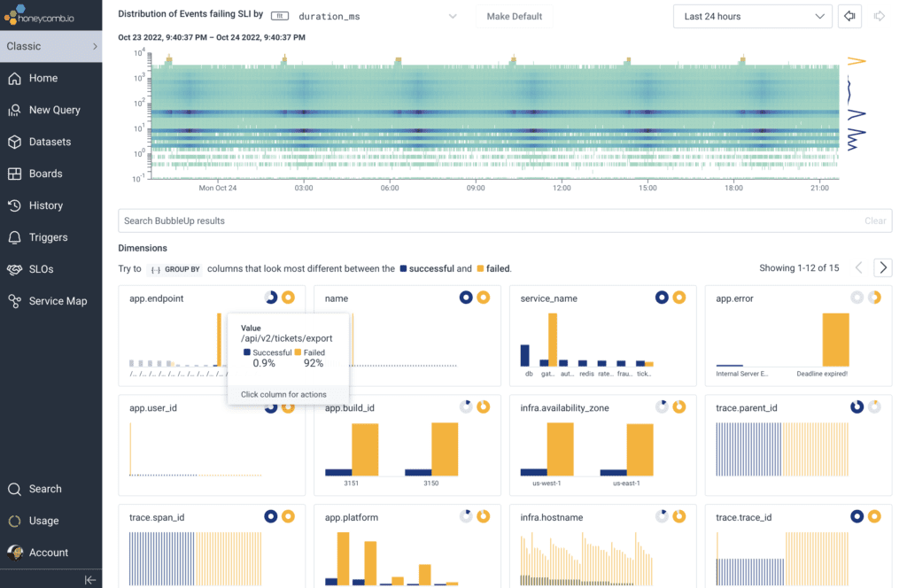

Remember the Twitter outage? Millions left hanging, businesses stalled, and a hefty dose of FOMO swirling the internet. While a bird-sized now called "X" social media giant might have the resources to weather such glitches, for small businesses, even minor errors can turn into existential tremors.

That's where error monitoring comes in, your key observer. Think of it as a look out for your website, app, or system constantly on the look for suspicious activity before they unleash chaos on your customers. 

By proactively identifying and tackling these errors, you keep your system moving smoothly, reputation intact, and customers happy.

Luckily, these tools are now  available to help small businesses proactively monitor errors across their tech stack. From website monitoring services to log analyzers, these solutions provide actionable insights without breaking the bank. 

For example, apitoolkit uses ai to monitor your system which starts at just $20 per month. This allows even the smallest companies to keep tabs on their servers, and computers.
## What is Error Monitoring Software?

Error monitoring software is a tool that allows developers and businesses to keep a close eye on the health and performance of their applications, websites, and technical infrastructure. It works by continuously monitoring your systems to automatically detect errors, crashes, slowdowns, and other issues in real-time.

These monitoring tools install lightweight crawlers across your stack to track everything from customer-facing software services to internal servers and databases. The tool observes all activity and transactions, logging any errors, exceptions, or performance problems they encounter.

The error data is then aggregated in a central dashboard or management console. Advanced error monitoring provides powerful analytics capabilities to help you visualize trends, filter issues by severity or frequency, and pinpoint the root cause of problems.

By giving you end-to-end visibility and actionable insights, error monitoring enables you to identify and resolve incidents quickly before they disrupt users or customers. The data can also be used to improve system reliability over the long-term by addressing recurring errors and exceptions.

## Difference Between Error Monitoring Software and Monitoring Tools

Error monitoring software prioritizes identifying and diagnosing unexpected errors in applications, often in real-time, alerting teams to issues that directly impact user experience. 

Monitoring tools, on the other hand, provide a broader perspective, capturing general system performance metrics like resource utilization, uptime, and resource usage. They offer comprehensive insights but may not drill down to specific errors like error monitoring software. 

## Benefits of Error Monitoring Software for Small Businesses

**Improved user experience** 

By quickely identifying and resolving errors, you can prevent frustrating downtime and ensure a smooth, seamless experience for your customers. This helps you provide reliable services and strengthen customer satisfaction.

**Reduced development costs** 

Error monitoring gives you immediate visibility into bugs and exceptions in production. This allows you to quickly pinpoint the root cause of problems without excessive debugging efforts. Shorter resolution times save your developers hours of unproductive work.

**Enhanced software quality** 

Monitoring your apps and websites for errors on an ongoing basis helps you rapidly detect and address issues before they escalate into major outages. You can fix small problems before they affect users and improve overall stability.

**Increased productivity**

 The automated error detection and real-time alerting capabilities eliminate the need for manual checking. Your team is freed up to focus on innovation rather than reactive firefighting.

**Improved communication and collaboration** 

Robust error monitoring provides shared visibility for your entire team. The data and notifications establish a common context for coordinating and resolving issues across departments.

**Risk reduction** 

By tightening your error monitoring practices, you significantly decrease downtime risks that can impact revenue and reputation. This is especially important for customer-facing web apps and services.

##Things to Consider When Choosing Error Monitoring Software

**1. Identifying your Use Cases**

Start by defining your use case. Do you want a real-time error and uptime monitoring tool? Or do you need deep-dive performance intel for your backend (API and backend service monitoring)? Be clear on your objectives:

**2. Framework Familiarity**

Ensure your chosen tool  that speaks the languages your development team understands. Look for seamless integration with your core stack.

**3. Data volume**

Choose a tool capable of handling your error, session, transaction, log, and monitoring data volume. The more users signing up,the more data flying around. Also, number of services contributes to the data stream is impoortant.

**4. Custom Metrics and Events**

Matrics are very important if you really want to know what is going on i your systems or business. With proper aggregated matics you will be able to make substential decison to aid you business grow

**5. Data Privacy**

If you're handling sensitive data like healthcare records or financial information, data security is paramount. Ensure your chosen tool adheres to relevant privacy and compliance regulations, offering features like:
* Strong Data Encryption: 
* Access Controls: 
* Data Reduction

**6. Light and Fast**

Go for an option with lightweight, non-intrusive instrumentation code that integrates seamlessly with minimal coding changes. This minimizes development friction and gets you up and running quickly.

**7. Alerts and Easy Integrations**

Choose a tool that lets you set up intelligent alerting rules to notify your team in real-time when things go south. Integration with collaboration platforms like Slack ensures rapid issue resolution and keeps everyone in the loop.

**8. Budget**

Error monitoring tools come in all shapes and sizes, from free open-source options to enterprise-level platforms with hefty price tags. Find the one that balances your current needs with the potential for future growth.

## Best Error Monitoring Software for Small Businesses Under Budget

Choosing the right error monitoring software for your small business can be daunting, especially with limited resources. However, neglecting error tracking can cost you dearly in lost revenue, frustrated customers, and wasted developer time. To help you navigate this crucial decision, let's expand on the recommended tools you mentioned and explore other options catering to different needs and budgets:

### Apitoolkit

 APItoolkit is ideal for businesses heavily reliant on APIs, APItoolkit monitors for API issues like latency, timeouts, and response errors. Its free plan covers numerous API calls per month, making it perfect for startups and small teams.

 **Features**
* Real-Time Monitoring and Analytics
* Distributed Tracing
* Context-Rich Error Tracking
* Anomaly Detection
* Powered Insights
* Uptime Monitoring
* Performance Monitoring
* Error Monitoring
* Advanced Tests
* Live Payload Validation
* Query Customer Activities,
* API History requests

### Sentry

A highly-rated solution offering error capture, code performance monitoring, and real-time alerting. While its free plan has limitations, it's a great starting point for small businesses to track critical errors and prioritize fixes.

**Features**
* API key management
* Rate limiting and throttling
* Audit logs and event history
* Developer tools and SDKs
* Real-time error monitoring
* User feedback integrations
* Event ingestion
* Issue grouping and analysis
* Release deployment tracking
* Data filtering and search
* Data export

### BugSnag

This user-friendly tool boasts a generous free plan for small businesses, including error tracking, detailed error reports, and team collaboration features. Upgrading unlocks advanced features like performance monitoring and custom error grouping.

**Features**
* Timeline view for error trend analysis.
* Error grouping and filtering.
* User and session context analysis.
* Performance monitoring and alerting.
* Integrations with various third-party tools.

### Rollbar

Developer-centric and known for its intuitive interface, Rollbar offers tiered plans starting at a reasonable price point. You get error tracking, detailed stack traces, and deployment monitoring to identify and fix bugs quickly.

**Features** 
* RQL for querying Rollbar data
* Metrics API for building custom dashboards
* Data retention customization
* SCIM provisioning
* Priority support and SLAs

### Airbrake

Focused on error aggregation and reporting, Airbrake provides insightful dashboards, user impact analysis, and custom error grouping. Its basic plan is affordable for small businesses and scales seamlessly as your needs grow.

**Features**
* API Notifications
* Custom Workflows
* Mobile Error Tracking
* Source Code Mapping
* Root Cause Analysis
* Scheduled Reporting
* Custom Dashboards
* Error Trends and Forecasting
* Blameless Error Logging

### Raygun

A powerful and cost-effective option for web and mobile app monitoring, Raygun offers flexible usage-based pricing. Its real-time error notifications and performance tracing capabilities make it ideal for data-driven businesses.

**Feature**
* Advanced error grouping and filtering
* Custom data and tags for detailed error context
* User tracking and identification
* Breadcrumb tracing for error context
* Source maps for deobfuscated stack traces
* Spike protection for noise reduction
* Error grouping merging and splitting
* Inbound integrations for external tools
* Webhook notifications for real-time alerts
* Custom dashboards and reports
* Public API access for programmatic data manipulation
### Honeycomb

This modern error monitoring tool emphasizes distributed tracing and root cause analysis, particularly for microservices architectures. Its free tier can be helpful for small teams starting out, while paid plans cater to complex systems.

**Features**
* Querying and Analysis
* Collaboration and Alerting
* Performance Optimization
* User-defined events and attributes
* Event correlation and tracing
* Data retention and archiving
* Integration with CI/CD pipelines
* Outlier detection and anomaly alerting
* Root cause analysis capabilities

## Frequently Questioned Answers

**Q: Are there affordable error monitoring solutions suitable for small businesses?**

**A:** Yes, there are several cost-effective error monitoring tools tailored for small businesses that offer essential features without straining the budget.

**Q: What features should I look for in budget-friendly error monitoring tools?**

**A:** Look for tools with real-time monitoring, customizable alerts, user-friendly interfaces, integration capabilities, and scalability to meet the evolving needs of your small business.

**Q: How easy is it to integrate error monitoring tools into existing systems used by small businesses?**

**A:** Most error monitoring tools are designed to be easily integrated into various development frameworks and platforms, ensuring a smooth and straightforward integration process for small businesses.

**Q: Can error monitoring tools be used for both web and mobile applications?**

**A:** Yes, many error monitoring tools are versatile and can be applied to both web and mobile applications, providing comprehensive coverage for small businesses with diverse digital offerings.

## Conclusion

As small business grows, having visibility into application errors and crashes becomes crucial for maintaining reliability and user experience. However, many robust error monitoring solutions carry a high price tag that puts them out of reach for bootstrapped startups and small teams. The good news is there are plenty of affordable options like APItoolkit to consider that provide basic error aggregation, alerting, and diagnostics capabilities.

