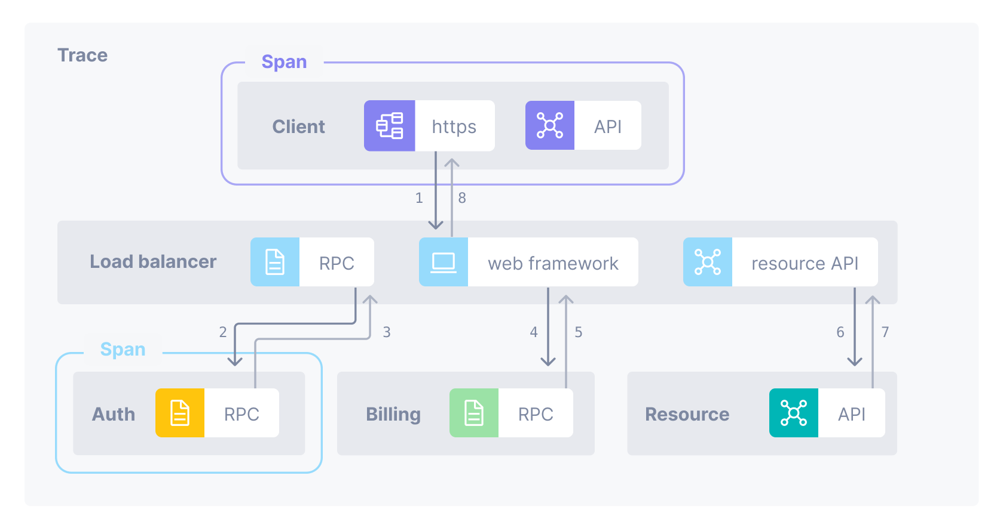

API observability offers a powerful solution to most of the growing challenges startup face. It goes beyond basic monitoring by providing a holistic view into the internal workings of an API. Through the collection and analysis of telemetry data encompassing metrics, events, logs, and traces.

API observability tools empower developers and operations teams to gain a deep understanding of API health, API performance, and user interactions. This comprehensive data allows for proactive identification of potential issues, faster root cause analysis during incidents, and ultimately, the ability to maintain peak API performance.

## What is API Observability? 
API observability is the practice of gaining deep insights into API health, performance, and user behavior through comprehensive data collection and analysis.

## Differences between API Observability and API Monitoring 
API monitoring focuses on pre-defined metrics like response times and errors, while API observability gathers a broader spectrum of data (metrics, events, logs, traces) for deeper analysis and troubleshooting unknown issues.

## Why you Need API Observability Tools
These tools empower you and your term with in-depth analysis.  By examining data trails and logs, you can swiftly locate performance issues and pinpoint the exact root causes of any bug that arise.  Aside from this, API observability tools aid in swifter resolution of incidents.  They achieve this by combining metrics, events, and logs, providing a comprehensive view of the problem.  Armed with this complete picture, your term can diagnose and fix the issue much quicker, minimizing downtime and ensuring a better user experience.

## Top 7 API Observability Tools

A well-functioning API is crucial for modern applications. However, maintaining optimal performance and identifying issues require proper observability tools. Here's a breakdown of our top 7 options:

### 1. APItoolkit

APItoolkit is a comprehensive API management platform offering testing, monitoring, and documentation tools.	

#### Key Features
* Tracks errors, performance, and relevant metrics over time.

* Provides detailed error information for efficient debugging.

* Automatically generates API documentation based on real-time traffic.

* Enables querying API data for analysis using a visual builder or a query language.

* Allows setting up custom monitors and alerts for proactive issue identification.

* Generates reports on errors and application performance.
#### How APItoolkit can help your developer team 	
* Collaborative testing environment for efficient API development.	
* Mock servers for simulating backend responses during development.	
#### How APItoolkit can help your Business   	
* Improved API quality and reduced release time.  	
* Proactive identification and resolution of API issues.	
### Pricing

Free plan with sufficient features, paid plans with additional functionalities.

[Try APItoolkit now for free.](https://app.apitoolkit.io/)

### 2. Datadog

A cloud-based monitoring platform offering comprehensive observability for various aspects, including APIs.

#### Key Feature
    	
* Real-time API monitoring with request/response tracing and error tracking.
    	
* Customizable dashboards and alerts for proactive issue identification.
    	
* Integration with other monitoring tools for a unified view of application health.
#### How Datadog can help your developer team
* Distributed tracing for pinpointing the root cause of performance issues.
* Integration with development tools for streamlined debugging.	
#### How Datadog can help your Business  	
* Improved API uptime and faster troubleshooting.   	
* Data-driven insights for optimizing API performance.	
#### Pricing
Freemium model with limited features, paid plans based on usage.
### 3. Dynatrace
An intelligent application performance management (APM) solution with built-in API monitoring capabilities.	
#### Key Features
* AI-powered anomaly detection for proactive identification of API issues.
* Automated root cause analysis for faster resolution of problems.
* Real-user monitoring for understanding API performance from the end-user perspective.
#### How Dynatrace can help your Developer Team
    	
Code-level insights for efficient debugging and performance optimization.
    	
Built-in tools for API testing and validation.	
#### How Dynatrace can help your Business 
* Proactive issue detection and faster mean time to resolution (MTTR).
* Improved user experience through optimized API performance.	
#### Pricing
Quote-based pricing.
## 4. New Relic
A full-stack observability platform offering application performance monitoring (APM) with built-in API monitoring features.	
#### Key Features
* End-to-end transaction tracing for visualizing API request flows.
* Distributed tracing for identifying performance bottlenecks across microservices.
* Customizable dashboards and alerts for real-time API monitoring.	
#### How New Relic can help your Developer team
* Built-in tools for API testing and debugging.
* Code-level profiling for identifying performance issues within API code.	
#### How New Relic can help your Business 
* Improved API performance and reduced downtime.
* Data-driven insights for optimizing API development and resource allocation.
#### Pricing
Freemium model with limited features, paid plans based on usage.

[Try APItoolkit now for free.](https://app.apitoolkit.io/)

### 5. Prometheus (Open-source)
A popular open-source monitoring tool primarily focused on collecting and analyzing metrics.	
#### Key Features
    	
* Flexible data collection through various protocols and integrations.
    	
* Powerful query language (PromQL) for analyzing collected metrics.
    	
* Wide range of community-developed integrations and visualizations.	
#### How Prometheus can help your Developer team 	
* Requires manual configuration and integration with additional tools for comprehensive API observability.
    	
* Open-source nature allows for customization and extension.

#### How Prometheus can help your Business     	
* Cost-effective solution for basic API monitoring needs.
* Scalable infrastructure for monitoring large deployments.
	
#### Pricing
Open-source, free to use and deploy.
### 6. Grafana (Open-source)
An open-source platform for data visualization and building dashboards.	
### Key Features
* Wide variety of built-in visualizations (graphs, charts, etc.).
* Ability to create custom dashboards for visualizing API metrics.
* Integration with various data sources, including Prometheus.
#### How Grafana can help your Developer team    	
Primarily a visualization tool, requires additional tools for collecting and analyzing API data.
#### How Grafana can help your Business     	
* Improved communication and collaboration through clear data visualization.
* Customizable dashboards for monitoring key API health indicators.

#### Pricing
Open-source, free to use and deploy.

[Try APItoolkit now for free.](https://app.apitoolkit.io/)

### 7. Jaeger (Open-source)
An open-source distributed tracing platform specifically designed for microservice architectures.	
#### Key Features
* Distributed tracing for visualizing request flows across multiple services.
* Detailed visualization of performance bottlenecks within API calls.
#### How Jaeger can help your Developer team
Focuses on tracing aspects of API calls, aiding in debugging complex microservice interactions.
#### How Jaeger can help your Business     
* Improved understanding of API performance within distributed systems.
* Faster identification and resolution of performance issues in microservices.

#### Pricing
Open-source, free to use and deploy.

## What is the Right API Observability Tool  for you?
Selecting the most effective API observability tool requires careful consideration of your specific needs. Here's a framework to guide your decision:

**1. Team Size and Technical Expertise**

Small teams with limited technical expertise: Prioritize user-friendly, pre-configured options with minimal setup. Consider tools like Datadog or New Relic with their intuitive interfaces and guided functionalities.

Larger teams with in-house development resources: Open-source solutions like Prometheus and Jaeger offer greater flexibility and customization. However, they require a steeper learning curve and technical knowledge for implementation and maintenance.

**2. Specific Functionalities Required**

Basic monitoring: Tools like Prometheus and Grafana provide core functionalities like metric collection, visualization, and alerting.

Advanced needs: Tools like Datadog and Dynatrace offer features like distributed tracing, anomaly detection, and real-user monitoring for in-depth analysis and troubleshooting.

**3. Scalability Needs**

Small-scale deployments: Open-source options like Prometheus can be sufficient for initial needs.

Large, distributed systems: Consider scalable solutions like Datadog or Dynatrace that can handle massive data volumes and complex microservice architectures.

**4. Budgetary Constraints**

Limited budget: Open-source tools like Prometheus and Grafana offer a cost-effective solution.
Larger budgets: Commercial options like Datadog and New Relic provide a wider range of features and support, but require paid subscriptions.

#### Our take

For small teams with basic monitoring needs and limited budget, explore user-friendly options like APItoolkit (freemium) or open-source solutions like Prometheus.

For larger teams with complex API architectures and advanced requirements, consider feature-rich commercial tools like Dynatrace or Datadog (paid plans).

Open-source options offer greater control and customization but require technical expertise for setup and maintenance.

**Remember, Many organizations utilize a combination of tools.**

By evaluating your team's capabilities, specific needs, scalability demands, and budget constraints, you can choose the most suitable API observability solution to ensure optimal performance, efficient debugging, and a healthy API ecosystem.

[Try APItoolkit now for free.](https://app.apitoolkit.io/)
