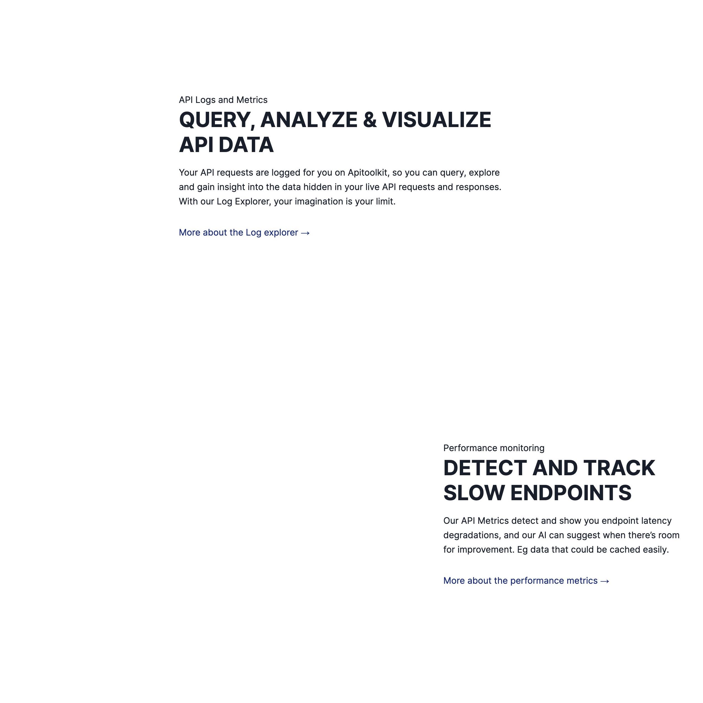
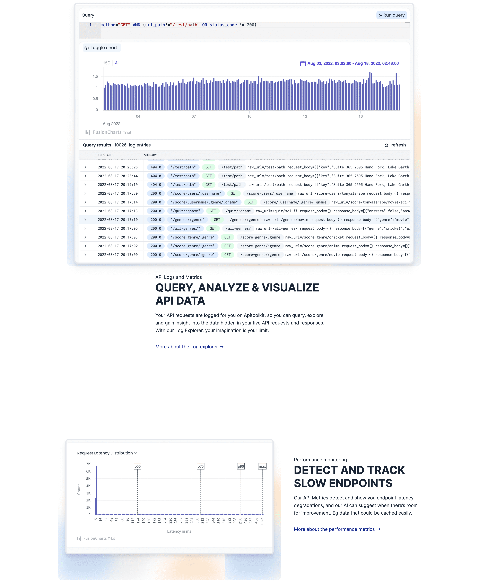

API market is booming. Every day you can see more and more APIs you can build your services upon. And many APIs have good open-source alternatives. You can host the alternative and have all control over it. But is it practical for you? Does it save time, money and energy? The most scarce resources we have. 

Let's take a website screenshot taking automation as an example and evaluate what might fit better in which case and what not. 

As a maker of [the screenshot API as a service](https://screenshotone.com), I want to answer the following question: "Is it better to build and host a solution to take screenshots or go with the ready API?"

## Use cases for screenshotting automation

Before diving into a comparison what could be a better alternative to Puppeteer and other open-source screenshotting libraries, I would like to elaborate a bit on why and when it is usable:

- You want to build a gallery or a catalog of websites like [ProductHunt](https://www.producthunt.com/), [ToolsForCreators](https://toolsforcreators.co/), or similar.
- To render HTML for social cards (the Open Graph protocol).
- To generate PDF from HTML for invoicing.
- To render dynamic marketing images from HTML.

And many more.

## Screenshot (API) as a service versus Puppeteer

Puppeteer is a modern library that allows automating actions in headless versions of browsers like Chrome, Chromium and Firefox that support the Chrome DevTools Protocol.

You can render JavaScript applications, navigate through pages, export sites as PDF files and take screenshots of the websites. 

There is also a more modern analog of Puppeteer—Playwright.
It is a modern library and many problems have already been addressed and covered, but not all of them.

Alternatively, you can choose from [many good screenshot APIs](https://screenshotone.com/the-best-screenshot-api/) to render HTML or take screenshots of the websites. Many of them are easy to use and set up in minutes.

So, what price do you pay for choosing Puppeteer and other alternatives because of not using ready APIs?

## Using Puppeteer to take screenshots

Let's take a quick look at what it takes to render sites with Puppeteer. 

You need to install the library:

```bash
npm i puppeteer
```

Then it is straightforward to take a simple screenshot of the [APItoolkit.io site for monitoring APIs](https://apitoolkit.io/): 

```javascript
'use strict';

const puppeteer = require('puppeteer');
(async () => {
       const browser = await puppeteer.launch();
       try {
           const page = await browser.newPage();
           await page.goto('https://apitoolkit.io/');
           await page.screenshot({ path: 'api_toolkit_rendered_by_puppeteer.jpg', format: 'jpeg' });
       } catch (e) {
           console.log(e)
       } finally {
           await browser.close();
       }
})();
```

The result is good: 


Isn't it? No, it isn't The video is not rendered. Look at the original site: 


Why does it happen? It will take you time and energy to fix. Long story short, it is because Chromium, which is used by default with Puppeteer, doesn't support MP4 videos. You need to use Google Chrome along with Pupeetter to make it work.

OK, no problem. Let's render the full page of the site: 

```javascript
'use strict';

const puppeteer = require('puppeteer');

(async () => {
       const browser = await puppeteer.launch();

       try {
           const page = await browser.newPage();
           await page.goto('https://apitoolkit.io');
           await page.screenshot({ path: 'full_page_by_puppeteer.jpg', fullPage: true, format: 'jpeg' });
       } catch (e) {
           console.log(e)
       } finally {
           await browser.close();
       }
})();
```

And the result is: 

<!--  -->
<a href="full_page_by_puppeteer.jpg" class="block rounded-md border border-black"></a>


Why are animations not loaded? Because taking [full-page screenshots with Puppeteer is not easy](https://screenshotone.com/blog/take-a-full-page-screenshot-with-puppeteer/).

I can continue and show you 1001 more examples and corner cases of the problems that are not easily fixable and need to be considered when taking screenshots. I fixed many of these issues for my customers, and I know what I am talking about.

It will take to fix all the issues you encounter. But! Besides that, think about infrastructure. Running headless browsers requires allocating resources and these browsers are CPU and memory-heavy.

What might be an excellent alternative to save time, energy and money?

## Using a screenshot API

Let's take [the screenshot as a service](https://screenshotone.com/) I built, for example. I invested a lot of time in many issues and stabilized architecture to handle as many screenshots as you need.

You need to sign up to get your API key. And then taking screenshots couldn't be easier: 

```
https://api.screenshotone.com?url=https://apitoolkit.io&access_key=<you access key>
```

The result is: 

<!--  -->
<a href="full_page_by_api_short.png" class="block rounded-md border border-black"></a>


And for the full page screenshot:  

```
https://api.screenshotone.com?url=https://apitoolkit.io&full_page=true&access_key=<you access key>
```

What is the result? 

<!--  -->
<a href="full_page_by_api.png" class="rounded-md block border border-2 border-black"></a>

You can [start for free](https://app.screenshotone.com/sign-up). 

## Summary

If you need to take a few screenshots here and there, I will choose Puppeteer, or you can even go with a free plan of my [screenshot API](https://screenshotone.com/). But if you need to take a lot of screenshots and ensure that everything is handled correctly, I would go with API unless you have time and money to invest in building infrastructure around Puppeetter or a similar library.

Have a nice day, and I hope I elaborated a bit on the programmatic screenshots topic for you.
