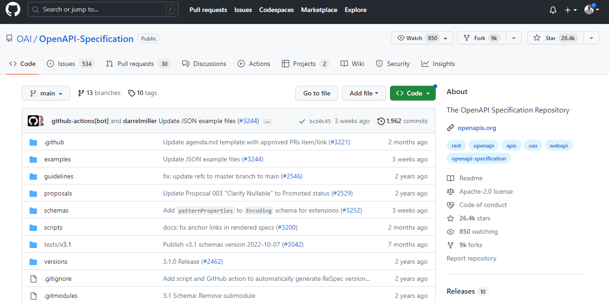

**When it comes to APIs, there are two terms that are often used interchangeably: API documentation and API specification. However, they are not the same thing. Understanding the difference between these two terms is important for developers and businesses alike. In this post, we'll explore the definitions of API documentation and API specification, and why they are both important for successful API development.**

## What is API Documentation?

API documentation is a set of instructions and guidelines that explain how to use an API. It typically includes information on the API's endpoints, parameters, response formats, and authentication requirements. API documentation is intended for developers who want to integrate an API into their application. It helps them understand how the API works and how to use it correctly. Good API documentation is clear, concise, and easy to understand. It should also be up-to-date and accurate, reflecting any changes or updates to the API.

Developers are the primary audience for [API documentation](https://apitoolkit.io/blog/api-documentation-and-observability-the-truth-you-must-know/) but this doesn't mean that non-techies can't have access to this. When it comes to making sure developers have a pleasant experience with the API, providing documentation that is well-written, well-detailed, and simple to follow is essential. An excellent developer experience (DX) also increases the likelihood that an API will be successful. If your API documentation isn't clear enough for developers to understand, they'll probably go for another API that is.

Decreased onboarding times for new API consumers is another benefit of good documentation. Developers won't need to contact your business by email, phone, or forum posts if they have access to all the information they require to use your API.[See more about API documentation](/blog/api-documentation-top-tools-and-using-them-right/)

When done right, API documentation serves as a reliable source of knowledge about how an API operates. It should include information on quickstarts, functions, arguments, classes, and more in a well-organized format that is simple to grasp for both developers and non-technical users. It frequently contains tutorials and examples that will aid the user in understanding how various components of the API interact.

Read: [How to Write API Documentation: 10 Essential Guidelines](https://apitoolkit.io/blog/how-to-write-api-docs/)

API documentation ought to include examples of each call, each parameter, and each call's answers. Code examples for popular programming languages including GoLang, JavaScript, PHP, and Python should be provided just like what we have [here](https://apitoolkit.io/docs/). Each API request should be explained in the documentation, along with illustrative samples of error messages. It's also crucial that API documentation is regularly updated and actively maintained.

Read: [How to Generate Automated API Documentation](https://apitoolkit.io/blog/how-to-generate-automated-api-documentation/)

## What is an API Specification?

API specification, on the other hand, is a detailed description of an API's functionality, including its endpoints, parameters, and responses. It is often used as a blueprint for building an API, and can be used by developers to create client libraries, mock servers, and other tools that interact with the API. API specification is typically written in a machine-readable format, such as YAML or JSON, and can be used to generate API documentation automatically. Unlike API documentation, which is intended for developers who want to use an API, API specification is intended for developers who want to build an API.

In a nutshell, you can describe API specification as a detailed understanding of an API's behavior and how it interacts and relates  with other APIs. [The OpenAPI Specification](https://github.com/OAI/OpenAPI-Specification) is a perfect illustration of what an API specification is all about.

While an API specification describes how the API acts and what to anticipate from the API, the OpenAPI 3.0.1 paper also acts as an  API documentation in some ways. And the GitHub repository's OpenAPI Specification paper does just that. Numerous API objects, values, and parameters are listed in the paper, along with information on how to call each object and what it can accomplish. We can also observe how things are related and how each object can be used.

## Why is it Important to have both?

Although API documentation and API specification serve different purposes, they are both important for the [development and maintenance of an API](https://apitoolkit.io/blog/anomalies-in-restful-apis/). API documentation helps developers understand how to use an API, while API specification helps developers build an API that meets the needs of its users. By having both, developers can ensure that their API is well-documented and easy to use, while also being robust and reliable. Additionally, having both API documentation and API specification can help reduce the time and resources needed for API development and maintenance, as developers can refer to these resources as needed.

## Both Related, But Quite Different 
API Documentation and API Specification differ from one another in terms of human and machine readability as well as purpose and objective. The significant distinction between the both is that while Specification is primarily intended for human reading, it provides a broad understanding of the functionality of the API and the expected results, Documentation is intended for more precise, direct information. The API documentation tells developers and other API consumers how to use the API. After all, how can your API be successful if developers don’t know how to use it? At the end of the day API, documentation, and API specifications are all keys to the success of an API.

## Examples of Popular API Documentation and Specification Tools.

There are many [tools](https://apitoolkit.io/blog/top-8-api-documentation-tools-for-developers/) available for creating API documentation and specification. Some popular options for API documentation include [APIToolkit](https://apitoolkit.io) [Swagger](https://swagger.io/), [Postman](https://www.postman.com/), and [Apiary](https://apiary.io/). These tools allow developers to easily create and share documentation for their APIs. For API specification, popular tools include OpenAPI (formerly known as Swagger), RAML, and API Blueprint. These tools allow developers to define the structure and behavior of their APIs in a standardized way, making it easier for other developers to understand and use the API.

**Also Read**

[Incident Management: How to Resolve API Downtime Issues Before It Escalates](https://apitoolkit.io/blog/api-downtime/)
[How to Write API Documentation: 10 Essential Guidelines](https://apitoolkit.io/blog/how-to-write-api-docs/)
[Top 7 Reasons Why Your Team Should Use an API Monitoring Tool](https://apitoolkit.io/blog/why-you-need-an-api-monitoring-tool/)
[How to Tackle Anomalies in RESTful APIs (the Right Way)](https://apitoolkit.io/blog/anomalies-in-restful-apis/)