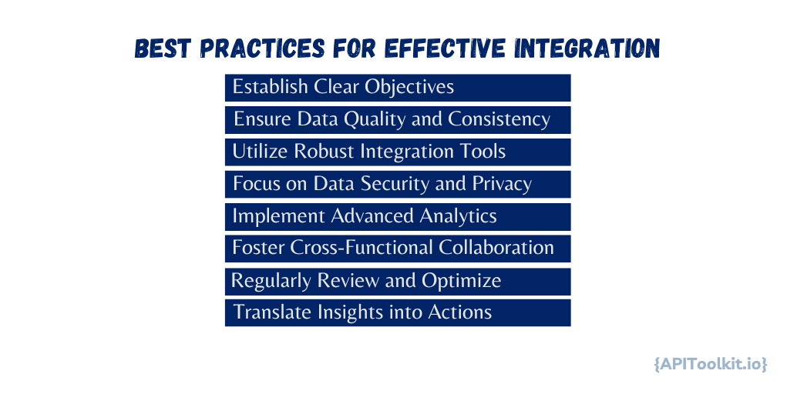

The integration of [API logs](https://apitoolkit.io/blog/api-logs-in-cybersecurity/) with user behavior tracking has emerged as a critical component for businesses and developers. This convergence provides a multifaceted view of user interactions with software applications, offering invaluable insights that can significantly enhance functionality, user experience, and overall system performance. [API logs](https://apitoolkit.io/blog/api-logs-in-cybersecurity/), which are pivotal in understanding the technical interactions within an application, chronicle the intricate details of requests and responses that traverse the API. This rich source of data is instrumental in identifying issues, deciphering usage patterns, and optimizing the performance of the system. However, to fully comprehend the ramifications of these technical interactions on the end-users, it's essential to also delve into the realm of user behavior data.

User behavior tracking offers a deep dive into how individuals engage with an application, capturing the essence of user actions, the features they frequent, and their overall navigation journey within the software. This data illuminates user preferences, highlights pain points, and gauges engagement levels, providing a window into the user's experience. The integration of [API logs](https://apitoolkit.io/blog/api-logs-in-cybersecurity/) and user behavior tracking equips organizations with a comprehensive understanding of their software systems. This amalgamation of data fosters a more extensive analysis, empowering developers and business leaders to accurately assess how backend processes and user experiences influence each other. Such profound insights pave the way for informed decision-making, heightened user satisfaction, and the creation of more successful products. The subsequent sections will delve deeper into the individual roles of [API logs](https://apitoolkit.io/blog/api-logs-in-cybersecurity/) and user behavior tracking and explore how their integration can sculpt a more robust and user-centric approach to software development and analysis.

## Definition and Role of API Logs in the Modern Software

API logs are a fundamental component of modern software ecosystems. They are the records produced by Application Programming Interfaces (APIs), which facilitate interactions between different software applications or layers. Each time an API is used — for data retrieval, sending commands, or any other interaction — details of that event are logged. These details typically include the time of the request, the specific action performed, the involved data, response times, and any errors encountered.

In the context of modern software architecture, especially with the rise of microservices and cloud-based applications, APIs serve as crucial conduits for this interaction. As a result, API logs become vital for understanding and managing the complex web of inter-service communications. They are not just records but tools for insight into the operational heartbeat of a system.

## Impact on System Performance and Issue Resolution

The significance of API logs in modern software development and maintenance can be summarized in a few key areas:

1. **Diagnostic Tool**: [API logs](https://apitoolkit.io/blog/api-logs-in-cybersecurity/) are invaluable for diagnosing problems. When a system issue arises, these logs offer immediate, granular insights into what went wrong and where. This level of detail is crucial for efficient troubleshooting, enabling developers to quickly isolate and address faults.

2. **Performance Analysis**: Beyond troubleshooting, API logs are essential for ongoing performance analysis. By routinely examining these logs, developers can identify trends and patterns, such as frequently used functions, slow response times, or recurring errors. This information is critical for proactive system optimization, ensuring that the software not only functions correctly but also performs efficiently under varying loads and conditions.

3. **Security Monitoring**: In an age where cybersecurity is paramount, API logs can be a first line of defense. They allow for the monitoring of unusual or unauthorized API calls, which could indicate a security breach or an attempt at one. Timely analysis of these logs helps in quickly identifying and mitigating potential security threats.

4. **User Experience Enhancement**: While [API logs](https://apitoolkit.io/blog/api-logs-in-cybersecurity/) primarily deal with the technical side of software operations, they indirectly impact user experience. By ensuring that APIs function smoothly and efficiently, they contribute to a seamless user interaction with the application. For example, faster API responses can lead to quicker page loads and more responsive apps, directly enhancing the user experience.

## The Role of User Behavior Tracking

[User behavior](https://apitoolkit.io/blog/creating-user-friendly-static-rest-api-documentation/) tracking plays a crucial role in understanding how individuals interact with software applications, involving the collection and analysis of data on user engagement with various features, interfaces, and functionalities. This process provides essential insights into user preferences, behaviors, and overall experience. By gathering data on the most used features, navigation paths, time spent on specific sections, and points of user difficulties or drop-offs, developers and designers can identify patterns and trends in user behavior. This understanding is pivotal in optimizing [user interfaces](https://apitoolkit.io/blog/creating-user-friendly-static-rest-api-documentation/) and experiences. For instance, if users frequently struggle to find a certain feature, adjustments can be made to the UI to enhance accessibility and visibility.

Moreover, user behavior data is instrumental in personalizing user experiences. Understanding individual preferences and behaviors allows applications to tailor content and functionalities to better meet user needs. These insights also play a significant role in informing product development strategies, helping to prioritize new features, enhance existing ones, and decide which to phase out. Additionally, this understanding of user interactions guides marketing efforts, enabling more targeted and effective campaigns.

Crucially, by continuously [monitoring](https://apitoolkit.io/blog/monitoring-api-failures-with-apitoolkit/) and responding to user behavior data, companies can ensure their applications not only meet but exceed user expectations, leading to higher satisfaction rates. This, in turn, fosters user loyalty and promotes application growth, as satisfied users are more likely to recommend the application to others. Thus, user behavior tracking is not just about collecting data; it's a strategic tool for enhancing user experience, driving business decisions, and ultimately improving customer satisfaction and retention.

## The Intersection of API Logs and User Behavior

The integration of [API](https://apitoolkit.io/blog/api-downtime/) logs with user behavior tracking creates a powerful synergy, providing a comprehensive view of both the technical and human aspects of software application usage. This intersection is vital for a holistic understanding of how backend processes and frontend user interactions influence each other, leading to more informed decision-making and enhanced [user experiences](https://apitoolkit.io/blog/creating-user-friendly-static-rest-api-documentation/).

API logs offer insights into the technical performance of an application, including response times, error rates, and system usage patterns. When these logs are integrated with user behavior data, which illuminates how users interact with the application, their preferences, and [pain points](https://apitoolkit.io/blog/monitoring-api-failures-with-apitoolkit/), it forms a complete picture of the application's functioning and user experience. This integrated data helps in identifying correlations, making it possible to understand how backend processes affect user experience. For example, slow API responses, as indicated by the logs, can be directly linked to user frustration or high drop-off rates, as shown by the user behavior data.

This integrated approach allows for targeted improvements in system performance and user experience. Developers can use these insights to prioritize optimization of specific [APIs](https://apitoolkit.io/blog/api-downtime/) that are causing slow responses and negatively impacting user experience. Additionally, patterns identified through combined analysis can lead to predictive insights, enabling teams to foresee and address potential issues before they impact users.

Furthermore, having both API logs and user behavior data readily available streamlines the troubleshooting process when issues arise. Teams can quickly discern whether a problem is due to a backend issue, a frontend issue, or a combination of both. This rich dataset facilitates data-driven decisions in feature development, system upgrades, and resource allocation, ensuring that both technical performance and user needs are taken into account. This integration not only enhances the effectiveness of development and operations but also ensures that the applications are finely tuned to user requirements and technical efficiency.

## Challenges in Integrating API Logs with User Behavior Data

Integrating [API logs](https://apitoolkit.io/blog/api-downtime/) with user behavior data, while offering substantial benefits, presents several challenges that need careful navigation for successful integration. The volume and complexity of both [API logs](https://apitoolkit.io/blog/api-log-explorer/) and user behavior data can be overwhelming, requiring robust data [management](https://apitoolkit.io/blog/api-downtime/) tools and analytics platforms for effective handling. These tools are vital for processing large datasets and extracting relevant insights, with machine learning algorithms playing a key role in identifying significant patterns.

Another challenge lies in the different formats and structures of API logs and user behavior data, which complicates integration. Establishing a standardized data format or employing middleware solutions and data transformation tools is essential to align these datasets coherently.

Ensuring the accuracy and reliability of both data sets is crucial, as inaccuracies can lead to misguided conclusions. This necessitates regular audits and validation checks to [maintain](https://apitoolkit.io/blog/api-downtime/) data integrity, sourcing data from reliable APIs and user tracking tools.

Providing real-time insights is technically challenging due to the need for powerful analytics tools that offer real-time data processing capabilities. Investing in high-performance computing resources is crucial to support real-time analysis needs. 

User behavior data often includes sensitive personal information, raising significant privacy and security concerns. Adherence to data privacy regulations like GDPR and CCPA, anonymizing user data, implementing robust security measures, and obtaining user consent for data collection are fundamental. Clear privacy policies are essential in this regard.

Furthermore, interpreting the integrated data to make it actionable requires a deep understanding of both the technical and [user-centric](https://apitoolkit.io/blog/creating-user-friendly-static-rest-api-documentation/) aspects of the application. Building a cross-functional team with skills in data analysis, user experience, and software development enhances the interpretation of data. Training and workshops on data literacy for team members also prove beneficial in addressing this challenge.

## Best Practices for Effective Integration

Effectively integrating [API logs](https://apitoolkit.io/blog/api-log-explorer/) with user behavior tracking is a strategic process that requires careful planning and execution. Following best practices ensures that the integration yields meaningful insights while maintaining data integrity.

#### 1. Establish Clear Objectives

- **Define Goals**: Determine what you want to achieve by integrating API logs with user behavior data. Clear objectives could include improving user experience, enhancing system performance, or identifying user patterns.
- **Align with Business Objectives**: Ensure that the integration goals are aligned with the broader business objectives for consistency and relevance.

#### 2. Ensure Data Quality and Consistency

- **Data Validation**: Regularly validate both [API logs](https://apitoolkit.io/blog/api-log-explorer/) and user behavior data for accuracy and completeness.
- **Standardize Data Formats**: Use standardized formats for both data types to simplify integration and analysis.

#### 3. Utilize Robust Integration Tools

- **Select Appropriate Tools**: Choose data integration tools that can handle the volume and complexity of the data, and are compatible with your existing systems.
- **Automate Data Integration**: Where possible, automate the integration process to reduce manual errors and improve efficiency.

#### 4. Focus on Data Security and Privacy

- **Adhere to Privacy Laws**: Comply with data privacy regulations like GDPR and CCPA when handling user data.
- **Implement Security Measures**: Use encryption, access controls, and other security measures to protect data integrity and confidentiality.

#### 5. Implement Advanced Analytics

- **Leverage AI and Machine Learning**: Use advanced analytics, AI, and machine learning tools to derive deeper insights from the integrated data.
- **Customize Analytics Models**: Tailor your analytics models to reflect the specific nuances of your data and business context.

#### 6. Foster Cross-Functional Collaboration

- **Encourage Team Collaboration**: Integration projects benefit from the expertise of various teams — including development, data science, marketing, and customer service. Promote collaborative efforts for a more comprehensive analysis.
- **Continuous Learning and Adaptation**: Encourage teams to stay updated with the latest trends and technologies in data analysis and integration.

#### 7. Regularly Review and Optimize

- **Monitor Integration Performance**: Regularly assess the performance of your integration solution to ensure it meets your objectives.
- **Iterative Improvement**: Continuously refine and optimize your integration processes based on feedback and new insights.

#### 8. Translate Insights into Actions

- **Actionable Insights**: Ensure that the insights derived are actionable. They should directly inform decision-making processes in product development, user experience enhancement, or operational improvements.
- **Measure Impact**: After implementing changes based on insights, measure the impact to validate the effectiveness of the integration.

## Conclusion
The integration of [API](https://apitoolkit.io/blog/api-downtime/) logs with user behavior data represents a significant leap in how we understand and improve software applications. By combining these two data sources, organizations gain a comprehensive view of both the technical workings and user interactions within their applications. This holistic perspective is crucial for informed decision-making, enabling targeted enhancements in application design, functionality, and user engagement. The ability to generate predictive insights and adopt a proactive approach to application [management](https://apitoolkit.io/blog/api-downtime/) and optimization is particularly valuable. This not only improves the overall user experience but also ensures that applications are technically robust and aligned with user needs.

Looking ahead, the future of integrated data analysis is bright and full of potential. Advances in AI and machine learning are set to automate and refine this integration, leading to more personalized user experiences and real-time adaptive systems. As technology evolves, this integration approach will continue to play a pivotal role in shaping digital experiences, emphasizing the importance of data-driven decision-making and user-centric application development. The integration of API logs and user behavior data is not just a present necessity but a cornerstone for future innovations in the digital landscape.

## Keep Reading

[How to Generate Automated API Documentation](https://apitoolkit.io/blog/how-to-generate-automated-api-documentation/)

[How to Tackle Anomalies in RESTful APIs (the Right Way)](https://apitoolkit.io/blog/anomalies-in-restful-apis/)

[How to Write API Documentation: 10 Essential Guidelines](https://apitoolkit.io/blog/how-to-write-api-docs/)

[What You Need to Know About REST APIs](https://apitoolkit.io/blog/everything-about-rest-apis/)

[API Documentation vs API Specification - What it means for you](https://apitoolkit.io/blog/api-documentation-vs-api-specification/)
