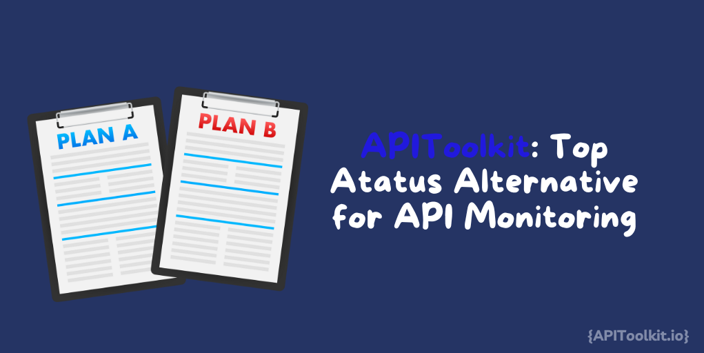

The health and performance of APIs directly influence the user experience, operational efficiency, and ultimately, the success of digital products. Without effective [monitoring](https://apitoolkit.io/blog/best-sematext-alternatives-for-api-monitoring/), APIs can become the weak link in an otherwise robust ecosystem. API monitoring goes beyond mere uptime checks: it involves a comprehensive analysis of various aspects like response time, data integrity, and the seamless integration of services. In essence, it's the guardian of digital interactions, ensuring that applications communicate effectively, data is exchanged accurately, and services remain consistently available.

## APIToolkit’s Role in Enhancing API Performance

Entering the scene as a game-changer, [APIToolkit](https://apitoolkit.io/) redefines the standards in API monitoring. It's not just another tool; it’s a solution that addresses the evolving challenges in API management. What sets APIToolkit apart is its ability to provide real-time insights into API performance, coupled with a deep analysis of API health.

APIToolkit shines in its capability to monitor APIs from multiple dimensions. This includes the traditional uptime and response metrics, and extends to more intricate aspects like endpoint stability, error rate analysis, and the detection of anomalies in [API](https://apitoolkit.io/blog/exploring-soap-apis/) patterns. Such comprehensive monitoring allows businesses to preemptively identify and rectify issues before they impact end users.

Also, APIToolkit stands out in its user-centric approach. It’s designed not only for the technical experts but also for those who might not be deeply versed in the technicalities of API management. This inclusivity ensures that a broader team - from developers to product managers - can collaborate and contribute to the API’s health and performance.  APIToolkit positions itself not just as a monitoring tool, but as a strategic partner in digital excellence. It empowers organizations to maintain high-performing, reliable APIs, which are essential for delivering superior digital experiences. Through its innovative features and user-friendly interface, APIToolkit plays a pivotal role in elevating the performance and reliability of APIs, setting a new benchmark in the industry.

## Core Features of APIToolkit: An In-Depth Analysis Against Atatus

When it comes to API monitoring, APIToolkit sets a high bar with its range of unique features, especially when compared to alternatives like Atatus. Let's dive into what makes APIToolkit not just different, but in many ways superior.

### Real-Time Monitoring and Alerts
APIToolkit excels in providing real-time insights into API performance, setting a new standard in the industry. Unlike Atatus, which also offers performance tracking, APIToolkit takes it a notch higher with instant alert systems. These alerts are meticulously designed to notify you the moment an anomaly or issue arises, allowing for immediate response and minimal downtime. This capability is particularly vital in fast-paced environments where quick reaction times can mean the difference between a minor hiccup and a major outage. APIToolkit's proactive monitoring approach ensures that businesses stay ahead of potential issues, maintaining high uptime and reliability.

### Comprehensive Endpoint Analysis
While both [APIToolkit](https://apitoolkit.io) and Atatus monitor API endpoints, APIToolkit's analysis delves deeper. It provides detailed insights into the health of each endpoint, including response times, error rates, and throughput. This depth of analysis is critical for diagnosing and resolving complex issues. It goes beyond the basic functionality of simply notifying whether an endpoint is up or down, offering a nuanced view that is crucial for maintaining optimal API health. By pinpointing specific areas of concern, APIToolkit enables targeted interventions, enhancing overall API efficiency and performance.

### User Experience Tracking
APIToolkit stands out with its focus on the end-user experience. It tracks how API performance affects the real users, something that is not as pronounced in Atatus. This feature enables developers to understand the impact of API issues on the user experience, leading to more user-centric solutions.

### Detailed Analytics and Reporting
Both tools offer analytics, but APIToolkit's reporting capabilities are more robust. Its dashboards are not only comprehensive but also customizable, offering insights that are both broad and deep. This level of detail aids in making informed decisions and strategic improvements to API infrastructures.

### Ease of Integration
Integration capabilities are a strong suit for APIToolkit. It seamlessly integrates with a wide range of other tools and platforms, a feature that is more limited in Atatus. This versatility makes APIToolkit an ideal choice for businesses using a diverse set of tools and platforms.

### Security and Compliance
Security is paramount in API monitoring, and here, APIToolkit again shines. It offers advanced security features, including detailed audit trails and compliance reports, ensuring that your APIs are not only performing well but are also secure and compliant with industry standards. It offers advanced security features, including detailed audit trails and compliance reports. These features ensure that APIs are not only performing well but are also secure and compliant with industry standards. For businesses that operate in regulated industries or handle sensitive data, this aspect of APIToolkit is particularly important, as it helps maintain trust and adhere to legal and regulatory requirements.

### Cost-Effectiveness
When it comes to pricing, APIToolkit proves to be more cost-effective, especially for small to medium-sized businesses. Its pricing structure is designed to provide maximum value, offering a range of features at a competitive price point compared to Atatus.

## Comparative Analysis

| Feature Category                     | APIToolkit                                       | Atatus                                             |
|--------------------------------------|--------------------------------------------------|----------------------------------------------------|
| **Real-Time Monitoring and Alerts**  | Advanced alert system for immediate notifications on performance, uptime, and schema changes in APIs. | Real-time monitoring with a focus on full-stack visibility and application performance issues. |
| **Depth of Endpoint Analysis**       | Monitors errors, performance, and crucial metrics over time, providing detailed endpoint analysis. | Offers application performance monitoring (APM) for a comprehensive view of application health under a single dashboard. |
| **User Experience Focus**            | Emphasizes catching anomalies in API performance and uptime, directly impacting user experience. | Real User Monitoring for insights into how real users interact with the application, enhancing user experience. |
| **Analytics and Reporting**          | Customizable dashboards for observing errors, performance, and other critical metrics. | Provides Log Management & Analytics for in-depth analysis and reporting on application logs. |
| **Integration and Compatibility**    | Focuses on integration errors and traces, correlating customer requests to backend errors and downstream API calls. | Offers Kubernetes Monitoring and Infrastructure Monitoring for seamless integration with modern infrastructure. |
| **Security Features**                | Monitors and alerts for any security-related issues in APIs, ensuring optimal performance and compliance. | Synthetic Monitoring and API Analytics to proactively detect and analyze performance-related issues. |
| **Pricing Structure**                | Cost-effective with a focus on monitoring API changes and performance for businesses of all sizes. | Comprehensive APM solution, potentially more suitable for larger organizations or those requiring extensive infrastructure monitoring. |

In this comparative analysis, APIToolkit focuses heavily on API-specific monitoring, offering detailed insights into API performance, anomalies, and security issues. In contrast, Atatus provides a broader range of application monitoring tools, including Real User Monitoring and Infrastructure Monitoring, making it suitable for a full-stack view of application performance. APIToolkit's strength lies in its API-centric approach and customizable alert systems, while Atatus offers a more holistic view of application health, including Kubernetes and infrastructure monitoring. Both tools have their unique advantages depending on the specific monitoring needs and the scale of the business.

## User Experience and Interface of APIToolkit

When it comes to tools for monitoring and managing APIs, the user experience (UX) and interface design are as crucial as the technical capabilities. APIToolkit stands out in this regard with its intuitive design and positive user feedback. Let's explore why APIToolkit's user experience and interface are highly regarded by its users.

### Intuitive and Accessible Interface: Firstly, APIToolkit boasts an interface that prioritizes intuitiveness and accessibility. Users often highlight how easy it is to navigate through the platform. This ease of use is not just about having a clean layout; it's about how efficiently users can access the features they need. Whether it's setting up new monitoring parameters or viewing detailed analytics, the process is straightforward, reducing the learning curve and enhancing productivity.

### Responsive Customer Support: The user experience with APIToolkit is further enhanced by responsive and helpful customer support. Users frequently mention the quick and effective support they receive, which is crucial for a tool that plays a central role in their operations. Whether it’s a technical query or a request for a new feature, the APIToolkit team’s responsiveness adds to the overall positive experience.

### Consistent Updates Based on Feedback: APIToolkit is known for its continuous improvement, with regular updates that often incorporate user feedback. This commitment to evolving based on user needs and suggestions demonstrates a deep understanding of the importance of user feedback in product development. Users feel heard and valued, which is a key aspect of a positive user experience.

### Real-World Testimonials: The true testament to [APIToolkit's](https://apitoolkit.io/) success in UX comes from real-world testimonials. Users across various industries have shared stories of how APIToolkit has simplified their API monitoring and management tasks. From reducing downtime to improving API performance, the feedback consistently points to the effectiveness and user-friendliness of the tool.

### Advanced Technical Architecture: APIToolkit is built on a modern, scalable architecture designed to handle the complexities and demands of contemporary API ecosystems. Its infrastructure is capable of processing large volumes of data while maintaining high performance. This scalability is crucial for businesses that experience fluctuating API traffic, ensuring consistent monitoring regardless of the load.

### Real-Time Data Processing: One of the technical highlights of APIToolkit is its ability to process data in real-time. This feature is essential for timely detection and resolution of API issues, ensuring that businesses can react quickly to maintain uninterrupted services.

### Security at the Forefront: Security is a paramount concern in API monitoring, and APIToolkit addresses this with several advanced features. It employs robust encryption protocols to secure data in transit and at rest. Additionally, regular security updates and compliance with industry standards further reinforce its position as a secure API monitoring tool.

## Conclusion

In summary, APIToolkit offers a more comprehensive package with its advanced real-time monitoring, in-depth analytics, user-centric approach, robust security, seamless integration capabilities, and cost-effective pricing. These attributes make it a superior choice for businesses seeking to enhance their API monitoring and management, compared to Atatus. APIToolkit emerges as a highly capable and versatile API monitoring tool, offering advanced features, robust security, and excellent user experience, all wrapped in a cost-effective package. Its strengths in real-time monitoring, detailed analytics, and user-centric approach make it an ideal choice for businesses aiming to enhance their API performance and digital service reliability.

## Keep Reading

[Incident Management: How to Resolve API Downtime Issues Before It Escalates](https://apitoolkit.io/blog/api-downtime/)

[How to Tackle Anomalies in RESTful APIs (the Right Way)](https://apitoolkit.io/blog/anomalies-in-restful-apis/)

[How to Generate Automated API Documentation](https://apitoolkit.io/blog/how-to-generate-automated-api-documentation/)

[How to Write API Documentation: 10 Essential Guidelines](https://apitoolkit.io/blog/how-to-write-api-docs/)

***
Try APIToolkit [here](https://apitoolkit.io).
