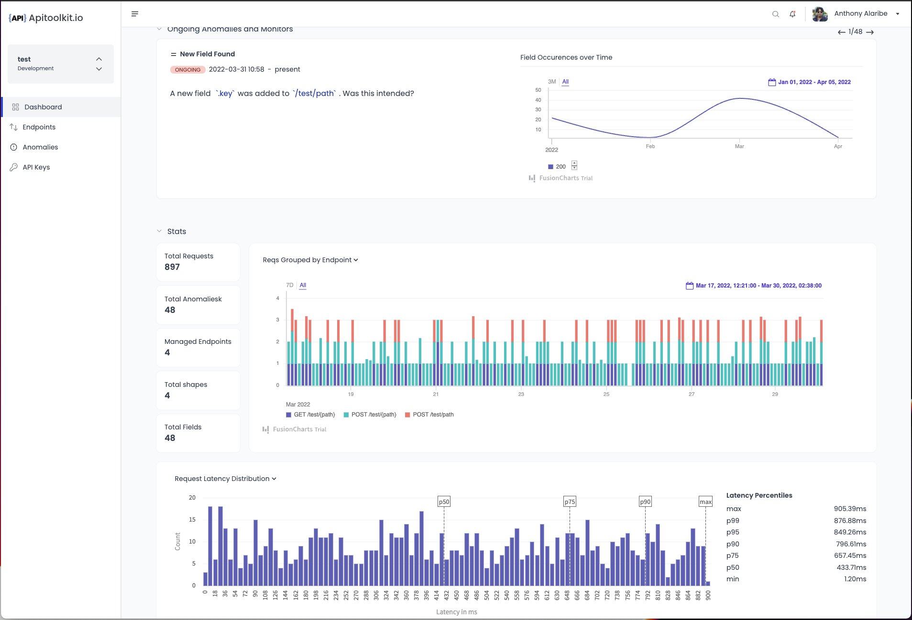
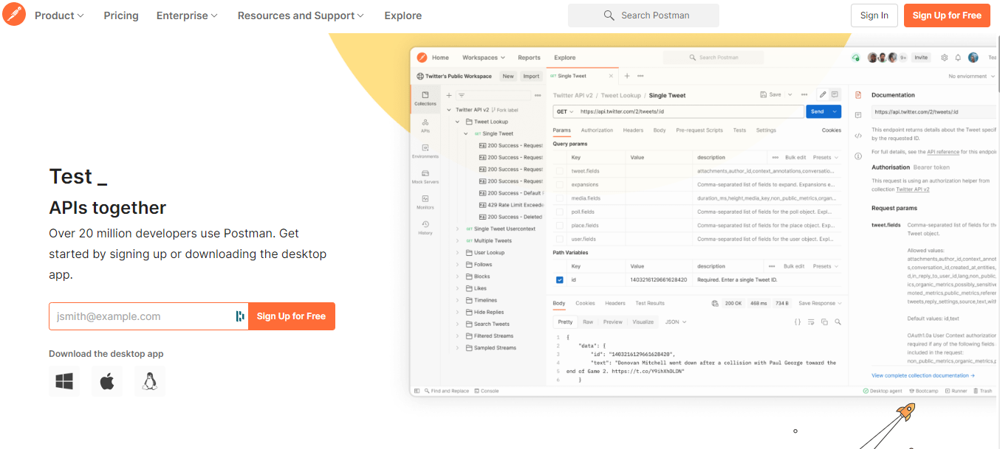

---
title: "Best API Monitoring and Observability Tools in 2022"
date: 2022-05-02T18:36:58+02:00
draft: false 
description: Find out what the best API observability tools are to keep your APIs functioning optimally
--- 

With [API observability](https://apitoolkit.io/blog/what-is-api-testing/), out of sight shouldn’t mean out of mind. APIs work in the background using simple commands to move requests back and forth. Perhaps because they do a lot of background work, QA teams tend to neglect them.

API observability is an underrated yet hugely important aspect of quality assurance testing. One shouldn’t wait until a downtime occurs before jumping to fix broken or missing APIs. 

We’ve curated a list of the best API observability and monitoring tools to help make your QA processes seamless and improve your [API documentation](http://apitoolkit.io/blog/how-to-write-api-docs).

## 1. [APIToolkit](http://www.apitoolkit.io)

Built by software engineers to solve problems that have cost their employers lots of money in the past, APIToolkit is an automated tool for API contract monitoring and documentation. 

Using best-in-class technology, APIToolkit leverages a highly specialized and powerful platform to provide a secure environment for developers to build and maintain APIs with enhanced analytics.

APIToolkit spots broken apis, changed fields, etc., before your customers.

Features:
- **Real time updates to API docs:** View your live API shapes, fields, etc and Generate swagger Docs at anytime via your live taffic.
- **Live API Contract monitoring & alerts:** Keep up with any changes to your API. New fields, new endpoints, empty fields, change in field types, etc
- **Refactor and Migrate Safely:** Catch any bug and changes due to refactorings or migrations, faster than your customers.
- **View your API analytics in one place:** Response times, latency, etc. Run queries on your live api requests and responses.

## 2. [Postman](http://www.postman.com)

Postman is a comprehensive API testing tool that needs no introduction. The platform offers API monitoring for a broad range of APIs including SOAP, REST, GraphQL, JSON, OpenAPI, Swagger, etc.

Postman uses Newman—a command-line Collection Runner—that enables users to run and test a Postman Collection directly from the command line.

Features:
- **Postman free plan:** Provides a maximum of 1000 calls to Postman API, Mock server calls, and monitoring API calls. Pricing starts at $12/month for the paid plan.
- **Offers custom domain.**
- **Offers training and onboarding.**

## 3. [Saucelabs](https://saucelabs.com/platform)

Saucelabs is a continuous testing cloud-based platform that provides live, automated testing for web and mobile apps.

Features: 
- **Comprehensive coverage:** Up-to-date browser/OS combinations, mobile emulators & simulators, plus real device support
- **Scalable for CI/CD:** Teams of all sizes can check-in multiple pull requests throughout the day without queuing or bottlenecks, ensuring rapid feedback.
- **360 degrees UX testing:** Use your existing test scripts to gain a full view of functionality, front-end performance, and visual regressions, all on one platform.

## 4. [Better Uptime](http://www.betteruptime.com)

Better Uptime offers an API monitoring solution as a part of its complex Uptime Monitoring and Incident management solution. It isn’t specialized to API monitoring and so may not be the best for every user or team size.

#### Features:
- Unlimited phone call alerts: SMS, e-mail, Slack, Teams, and push notifications with its all-you-can-alert pricing.
- 30s multi-location checks: Each HTTP and ping-based incident is verified from at least 3 locations before alerting users.
- Incident management built-in: This alerts the right person on your team with Better Uptime’s on-call scheduling & plug in the services.

## 5. [Moesif](https://www.moesif.com/) 

Moesif describes itself as “The API Experience Platform for Product-Led Growth”. It provides API analytics and tools to help users manage ther APIs.

#### Features:
- **Quickly activate customers:** Track funnel metrics like activation rate. 
- **Understand API usage:** Deeply understand who is using your APIs, how they are used, and payloads customers send.
- **Monetize APIs:** Implement usage-based pricing in a few clicks with billing meters.
- **Guide customers at scale:** Automatically inform customers at scale like exceeding quota limits and integration errors. 

## 6. [RapidAPI](https://rapidapi.com/)

RapidAPI is a platform that helps users find, connect to, and manage their APIs. It allows users to centralize and monitor worldwide operations under one roof and improve efficiency by CI/CD integration.

#### Features:
- **RapidAPI for free:** With 2 tests per API, 2000 API calls/month, and e-mail only notifications.
- **Integration into GitHub, PagerDuty, Slack, and Twilio.**
- **Solutions for an Integrated Developer Experience:** Improves developers’ experience with integrated tools for design, testing, monitoring, and more.
- **RapidAPI Enterprise Hub:** Your development teams, partners and customers can discover and connect to your APIs — all from a single, next-generation API Platform.

## 7. [Datadog](https://www.datadoghq.com/)

Datadog’s API monitoring lets you automate site availability monitoring and reduce average time it takes to get to the cause. It also allows you to validate all the layers of your systems (from HTTP to DNS) from multiple geolocations, letting you focus on areas that are vital to your business by creating custom locations.

#### Features:
- **Datadog's API testing starts at $5/10k tests a month.**
- **Infrastructure Monitoring**
- **Log Management, Database, Network, and Serverless monitoring**
