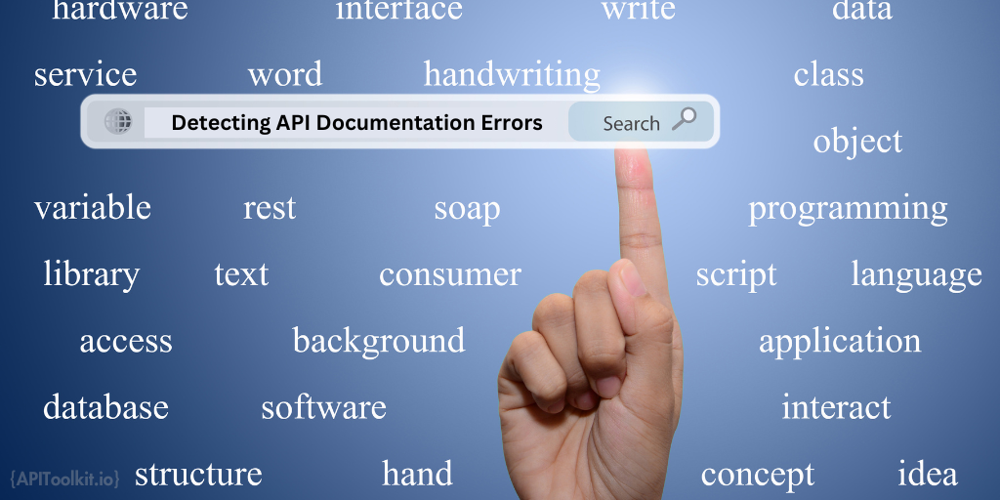

In a grand orchestra, each instrument—from the delicate flute to the robust cello—plays a pivotal role, contributing to a harmonious symphony that captivates the audience. But without a conductor to guide them, these instruments would struggle to create a cohesive melody. In the digital world, APIs serve as these essential conductors. They synchronize different software applications, each with its unique capabilities, to perform in unison. Like a conductor who knows when the violins should take the lead or when the drums should come in, APIs dictate how diverse software components interact, collaborate, and contribute to the overall user experience. Yet, the quality of this digital symphony relies heavily on one overlooked aspect: the [API documentation](https://apitoolkit.io/blog/how-to-generate-automated-api-documentation/). Without it, developers are like musicians without sheet music, left to guess the tune they're supposed to play.

API documentation goes beyond being a simple user guide; it acts as the vital connective tissue between the developer and the [API](https://apitoolkit.io/blog/api-trends/). A well-crafted [documentation](https://apitoolkit.io/blog/how-to-generate-automated-api-documentation/) should be unambiguous, to-the-point, and all-encompassing, supplying [developers](https://apitoolkit.io/blog/api-trends/) with the full scope of information needed to navigate the API's capabilities, employ its features, and anticipate its responses. It serves diverse functions:

Onboarding: For new developers, comprehensive [API documentation](https://apitoolkit.io/blog/how-to-generate-automated-api-documentation/) can significantly reduce the learning curve, enabling them to integrate the API into their projects more quickly.
Troubleshooting: When issues arise, developers often turn to the API documentation for solutions. Well-documented error codes and troubleshooting steps can save hours of debugging.
Scalability: As a project grows, so does its complexity. Good API documentation ensures that developers can quickly adapt and scale their applications without reverse-engineering the API.

## The Cost of Errors in API Documentation

The significance of having accurate [API documentation](https://apitoolkit.io/blog/how-to-generate-automated-api-documentation/) is a universally acknowledged truth in the tech industry, yet the repercussions of errors in such documentation are often underestimated. The first set of challenges primarily affects developers and, by extension, the companies they work for. When documentation is inaccurate or incomplete, developers can find themselves wasting valuable time trying to troubleshoot issues, decipher unclear instructions, or fill in the gaps with educated guesses. This frustration can reach a tipping point, leading them to abandon the API in question and seek alternatives, thereby affecting customer retention rates for the [API provider](https://apitoolkit.io/blog/api-trends/). The ripple effect of poor documentation also extends to customer support departments. A higher volume of support tickets is almost a guaranteed outcome when developers struggle to find the information they need. This not only increases operational costs but also places additional burdens on already stretched support teams, potentially affecting their performance and job satisfaction.

The second set of challenges revolves around the long-term impact of poor documentation on a company's reputation and legal standing. Trust, once a cornerstone of customer loyalty, can be severely undermined by unreliable documentation. [Developers](https://apitoolkit.io/blog/api-trends/) are not only less likely to continue using the API but are also less likely to recommend it to peers, affecting long-term adoption rates and market share. Inconsistent or incorrect documentation can also lead to delays in project timelines, which is particularly detrimental in industries where rapid development and deployment are crucial. These delays can result in financial penalties, lost opportunities, and can even jeopardize entire projects. In the most extreme cases, inaccurate documentation can expose companies to legal risks. For instance, if the documentation's inaccuracies lead to financial losses or data breaches for end-users, the [API provider](https://apitoolkit.io/blog/api-trends/) could face lawsuits, regulatory fines, or both, further damaging its reputation and financial standing.

## The Common Types of API Errors

API documentation is a complex entity that requires meticulous attention to detail. Even minor errors can lead to significant problems. Here are some common types of errors that can occur in API documentation:

### Syntax Errors
Syntax errors are among the most straightforward errors to identify but can be the most damaging if overlooked. These errors often occur in code examples and can include issues like:

Misspelled Keywords: A single misspelled keyword can render a code snippet useless and lead to confusion.
Incorrect Function Calls: Incorrectly documented function calls can send developers on a wild goose chase, trying to figure out why the API isn't behaving as expected.
Wrong Formatting: Incorrect indentation or bracket placement can make code examples hard to read or even unusable.

### Incomplete Documentation
Incomplete documentation leaves gaps in understanding, forcing developers to guess or experiment, which is both time-consuming and risky. Common issues include:

Missing Parameters: Omitting required or optional parameters can lead to incorrect API calls.
Undocumented Error Codes: Without a list of possible error codes and their meanings, developers are left in the dark when something goes wrong.
Lack of Examples: Real-world examples can provide invaluable context. Their absence can make even well-written documentation less useful.

### Outdated Examples
APIs evolve, but sometimes the [documentation](https://apitoolkit.io/blog/how-to-generate-automated-api-documentation/) lags. Outdated examples can be misleading and result in the implementation of deprecated features. Issues often include:

Deprecated Functions: Using functions that are no longer supported can lead to unexpected behavior or errors.
Changed Data Models: If the structure of the data has changed but the examples haven't, this can lead to confusion and incorrect implementations.
Version Mismatches: Examples that don't specify which version of the API they are compatible with can cause compatibility issues.

### Inconsistencies
Inconsistent documentation can be confusing and lead to incorrect assumptions. Typical inconsistencies include:

Terminology: Using different terms to describe the same concept can be confusing. Consistency in language is crucial.
Formatting: Inconsistent formatting, such as different styles for headers or code snippets, can make the documentation hard to follow.
Sequence of Information: Information should flow logically. Jumping between unrelated topics can disrupt the reader's understanding and make the documentation less effective.

These common errors can compromise the utility of [API documentation](https://apitoolkit.io/blog/how-to-generate-automated-api-documentation/), leading to the various costs discussed in the introduction. Identifying and rectifying these errors should be a priority for anyone responsible for maintaining API documentation.

## Tools for Detecting Errors

Ensuring the accuracy and reliability of [API documentation](https://apitoolkit.io/blog/how-to-generate-automated-api-documentation/) is a continuous process. Fortunately, there are various tools and methodologies available to help identify and correct errors.  Here are some of the most effective:

### Automated Testing Tools
Automated testing tools can be invaluable for maintaining high-quality API documentation. These tools can automatically verify code snippets, parameter types, and even response formats against the actual API. Popular tools in this category include [APIToolkit](https://apitoolkit.io), Postman, and Swagger Inspector. Here are some of the benefits of Automated Testing Tools:

Continuous Validation: Automated tests can be run as part of a continuous integration pipeline, ensuring that the documentation is always in sync with the API.
Time-Saving: Automated testing can quickly cover a broad range of scenarios, freeing up human resources for more complex tasks.
Consistency: Automated tests ensure that the [documentation](https://apitoolkit.io/blog/how-to-generate-automated-api-documentation/) remains consistent, even as the API evolves.

### Linters
Linters are static analysis tools that can check the syntax and structure of your [documentation](https://apitoolkit.io/blog/how-to-generate-automated-api-documentation/). While they may not catch every logical error, they are excellent for identifying syntax errors, formatting issues, and other straightforward mistakes. The benefits of Linters include:

Immediate Feedback: Linters can be integrated into text editors to provide real-time feedback, helping to catch errors early in the writing process.
Custom Rules: Many linters allow for custom rule sets, enabling you to enforce specific guidelines or best practices.
Ease of Use: Linters are generally easy to set up and use, making them accessible even for those who may not be as technically inclined.

### Peer Reviews
While automated tools are powerful, human judgment is irreplaceable for certain tasks. Peer reviews involve having other developers or technical writers review the documentation for clarity, accuracy, and completeness. The advantages include:

Contextual Understanding: Humans can understand the context and intended use of the API, allowing them to identify gaps or ambiguities that automated tools might miss.
Quality Assurance: Peer reviews often catch subtle errors or inconsistencies that may be overlooked by automated tools.
Collaborative Improvement: The review process can be a collaborative effort that not only improves the documentation but also educates the team on best practices.

By leveraging a combination of these tools and approaches, you can significantly reduce the likelihood of errors in your API documentation, thereby enhancing its reliability and user experience.

## Best Practices for Error-Free Documentation

Maintaining an error-free API documentation is not a one-time effort but an ongoing process. Implementing [best practices]((https://apitoolkit.io/blog/how-to-generate-automated-api-documentation/)) can go a long way in ensuring that your documentation remains accurate, up-to-date, and user-friendly.

Version control systems can be a game-changer when it comes to managing API documentation. For instance, they track every change made to the documentation, making it easier to pinpoint when and where errors were introduced. They also facilitate collaboration by allowing multiple contributors to work on the documentation simultaneously, with built-in features to manage and merge changes effectively. If an error does slip through, the ability to roll back to a previous version of the documentation is invaluable. Moreover, version control systems enable branching, which allows for the documentation of different API versions in separate branches. This ensures that users always have access to the documentation that matches the API version they are using.

Regular updates are another cornerstone of high-quality [API documentation](https://apitoolkit.io/blog/how-to-generate-automated-api-documentation/). As APIs evolve, their documentation must keep pace. Timely updates should reflect new features, deprecations, and other changes to the API as soon as they are rolled out. These regular updates also provide an opportunity for periodic reviews, serving as a checkpoint to catch any errors or omissions. Furthermore, an actively updated documentation signals to users that the API is well-maintained, boosting their confidence and engagement with the platform.

User feedback loops offer an often-overlooked yet invaluable avenue for improving API documentation. There are various ways to harness this resource. Embedding surveys and feedback forms directly into the documentation can make it incredibly easy for users to report errors or suggest improvements. Community forums can serve as a vibrant platform for users to ask questions, share experiences, and even offer solutions, providing invaluable insights into what might be missing or unclear in the documentation. Analytics tools can monitor how users interact with the documentation, offering clues about which sections might be confusing or prone to errors. Sometimes, the most immediate and actionable feedback comes from direct lines of communication, such as an email address or chat support.

By diligently implementing these best practices, the risk of errors creeping into your API documentation can be significantly reduced, ensuring a smoother and more reliable experience for both developers and end-users.

## Call to Action for Developers and Technical Writers

The responsibility for maintaining accurate and reliable API documentation is a shared one, which falls on both developers and technical writers. Here's what you can do:

Developers: Invest time in learning and using automated testing tools that can validate your [API documentation](https://apitoolkit.io/blog/how-to-generate-automated-api-documentation/). Your expertise in the API's functionality is invaluable for creating accurate examples and troubleshooting guides.

Technical Writers: Focus on clarity, completeness, and consistency. Your skills in conveying complex technical information in an accessible manner are crucial for the documentation's effectiveness.

Both: Engage in regular peer reviews and update cycles, and always be open to feedback from the user community. Remember, the goal is not just to document the API but to create a valuable resource that enhances user experience and fosters trust. By taking these steps, we can collectively contribute to a more reliable, user-friendly, and error-free API documentation landscape, benefiting not just individual projects but the broader developer ecosystem.

## Conclusion

API documentation serves as the critical bridge between the [API](https://apitoolkit.io/blog/how-to-generate-automated-api-documentation/) and its users, enabling effective communication and interaction. However, errors in documentation can have far-reaching consequences, from developer frustration and increased support costs to project delays and even legal risks. By being aware of common types of errors such as syntax mistakes, incomplete information, outdated examples, and inconsistencies, we can take proactive steps to avoid them. Utilizing tools like automated testing, linters, and peer reviews, along with implementing best practices like version control, regular updates, and user feedback loops, can significantly enhance the quality of API documentation.

## Keep Reading

[Web API Performance Best Practices: the Ultimate Guide](https://apitoolkit.io/blog/web-api-performance/)
[10 Must-Know API trends in 2023](https://apitoolkit.io/blog/api-trends/)
[How to Analyze API Logs and Metrics for Better Performance](https://apitoolkit.io/blog/api-logs-and-metrics/)
[Incident Management: How to Resolve API Downtime Issues Before It Escalates](https://apitoolkit.io/blog/api-downtime/)
[How to Tackle Anomalies in RESTful APIs](https://apitoolkit.io/blog/anomalies-in-restful-apis/)
[Top 7 Reasons Why Your Team Should Use an API Monitoring Tool](https://apitoolkit.io/blog/why-you-need-an-api-monitoring-tool/)
