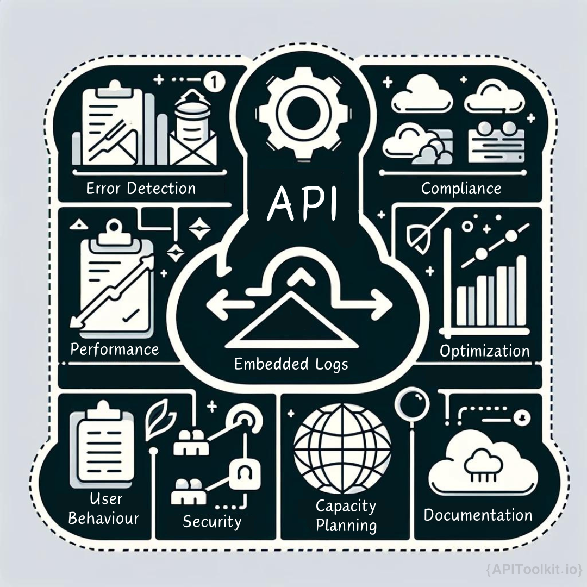
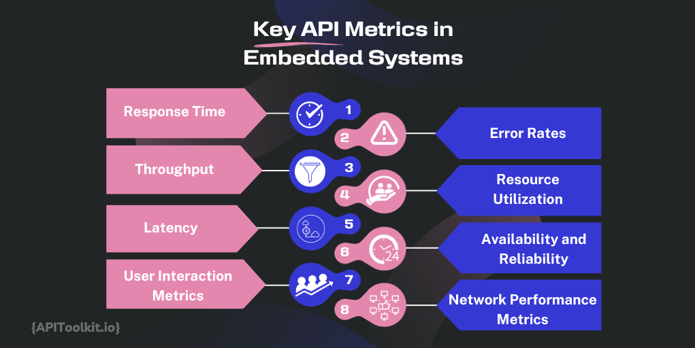

According to Akamai's Tony Lauro, [83% of web traffic involves API calls,](https://apisecurity.io/issue-17-83-web-traffic-apis-query-params-bad-secrets/) many of which are through embedded APIs. Embedded APIs are behind every social media update, every online transaction, and every app that simplifies our daily routines. For developers, these APIs are the tools and building blocks that enable the creation of the seamless digital experiences we often take for granted. For the everyday user, although these APIs are unseen, their impact is felt in the ease and fluidity with which we navigate our digital lives. Going forward we'll uncover the role of embedded APIs, their significance, and the intricate ways they seamlessly integrate into various applications, impacting both developers and users alike.

## The Role of Logs and Metrics in Embedded APIs

Consider a scenario where you're using your favorite app. Every time you interact with it, whether it's scrolling through a feed, making a purchase, or checking the weather, embedded APIs are at work. But how do you ensure that these interactions are smooth and trouble-free? This is where API logs and [metrics](https://apitoolkit.io/blog/metrics-that-matter/) come into play.

For developers, [API logs](https://apitoolkit.io/blog/leveraging-api-logs/) are like detailed journals. They record every interaction, every data exchange – similar to how a diary captures life's events. These logs are invaluable for understanding what happens behind the scenes. If an app crashes or a page fails to load, the logs provide clues, guiding developers to identify and fix the issue, much like a detective solving a mystery.

Metrics, on the other hand, are the signposts of [API performance](https://apitoolkit.io/blog/metrics-that-matter/). They tell us how fast data is being transferred, how many people are using the service at a given time, and how efficiently the API handles these requests. It's akin to checking the health of the app – ensuring it's in top shape to serve users effectively.

Both developers and users, albeit in different ways, rely on the smooth functioning of these APIs. While developers actively engage with logs and metrics to refine and improve the digital services, [users experience](https://apitoolkit.io/blog/improving-user-experience/) the benefits of this work in the form of reliable, efficient, and user-friendly digital interactions. This synergy between development and usage, between backstage work and front-stage experience, is what makes our digital world not just functional, but also enjoyable and intuitive.

## What Are Embedded APIs?

An embedded API (Application Programming Interface) is a type of API that is directly integrated into a software application or platform, enabling it to function as an integral part of the application's ecosystem. This integration allows for seamless interactions and data exchange within the application, enhancing the user experience by making it more streamlined and cohesive. Unlike standalone services, embedded APIs offer improved customization and control, allowing developers to tailor the API's functionalities specifically to the application's needs. This leads to more efficient performance, often with reduced latency, as the data exchange occurs within the same environment.

Furthermore, embedded APIs can be designed to align with the application's security protocols and compliance standards, ensuring consistent handling of security and data. They are commonly used in various applications, such as adding payment processing in shopping apps, integrating mapping services in delivery apps, or incorporating machine learning for personalized recommendations in streaming services, making them a versatile and valuable tool in modern software development.

An embedded API, while being a versatile tool in software development, takes on additional significance in the context of JavaScript and web development. In such scenarios, these APIs are often embedded within web applications or sites, allowing for dynamic and interactive user experiences powered by JavaScript. The relationship between embedded APIs and JavaScript lies in how seamlessly these APIs can be integrated into the JavaScript codebase of a web application.

This integration enables the application to leverage external services or functionalities, such as fetching data from a server, processing payments, or integrating with social media platforms, directly within the client-side JavaScript environment. The result is a fluid, interactive user experience where the API's functionalities feel like a native part of the web application, all while being driven by JavaScript's powerful and flexible programming capabilities. This symbiotic relationship allows developers to extend the capabilities of web applications far beyond what's possible with just HTML and CSS, harnessing the full potential of both the embedded APIs and JavaScript to create rich, dynamic, and highly interactive digital experiences.

## Embedded API Logs

Embedded API logs are a specialized subset of [API logs](https://apitoolkit.io/blog/leveraging-api-logs/), distinctively tailored for APIs that are an integral part of larger applications or systems. Unlike logs from standalone APIs, these logs capture interactions in a more interconnected environment where the API functions as a seamless component of the overall system. This means that every request, response, and error is not just an isolated event but a piece of a larger puzzle, intricately woven into the fabric of the application's ecosystem.

### The Importance of Monitoring Embedded API Logs

Monitoring and analyzing embedded API logs is critical due to their integrated nature. The impacts here are multi-faceted:

1. **Error Detection and Troubleshooting**: In the context of embedded APIs, identifying errors through logs is often more complex due to the interdependent nature of the systems. Developers need to decipher these logs to understand how API issues might affect or be affected by the larger system, ensuring stable and reliable performance.

2. **Performance Optimization**: Performance insights from embedded API logs are crucial as they reflect not just on the API but on the overall application. Optimizing based on these logs can lead to significant improvements in the application's functionality and user experience.

3. **Security Monitoring**: Given that embedded APIs are part of larger systems, security [monitoring](https://apitoolkit.io/blog/the-most-important-metric/) through logs becomes even more crucial. Any security breach in the API could have wider implications for the entire system.

4. **Compliance and Auditing**: Embedded API logs are key in environments with strict regulatory requirements. They provide comprehensive data that is essential for auditing not just the API, but also how it interacts with other system components.

5. **User Behavior Analysis**: Analyzing these logs helps understand how users interact with the API in the context of the larger application, providing insights for more holistic improvements and feature development.

6. **Capacity Planning and Scaling**: Understanding the load and usage patterns from these logs is vital for effective scaling, ensuring the entire system is robust and can handle future demands.

7. **Documentation and Historical Reference**: Embedded API logs offer a historical view of how the API has interacted within the larger system over time, aiding in strategic planning and post-incident analysis.

In essence, embedded API logs provide a more comprehensive and integrated view of an API's operation within a larger system. They are crucial for maintaining the health, security, and efficiency of the system as a whole. By effectively monitoring and analyzing these logs, developers and system administrators can ensure that the APIs, and consequently the entire system, operate optimally and align with user needs and security standards.

## Understanding API Metrics in an Embedded System

In an embedded system, API metrics serve as crucial indicators of the system's [performance](https://apitoolkit.io/blog/metrics-that-matter/), health, and user interaction. These metrics are particularly significant due to the integrated nature of embedded systems, where APIs often interact closely with hardware components and other software layers. Understanding and effectively monitoring these metrics is key to ensuring the system operates efficiently and meets its intended functional requirements.

### Key API Metrics in Embedded Systems

1. **Response Time**: In embedded systems, response time is critical, especially for time-sensitive applications. It measures the time taken for the API to respond to a request, directly impacting system performance and user experience.

2. **Error Rate**: This metric tracks the frequency of errors generated by the API. High error rates can be more impactful in embedded systems, potentially affecting other integrated components and overall system stability.

3. **Throughput**: Essential in resource-constrained embedded systems, throughput measures the number of requests the API can handle over a given period. It's a key indicator of the system's capacity to manage workload efficiently.

4. **Resource Utilization**: Unlike standalone applications, embedded systems often operate with limited resources. Metrics that monitor CPU, memory, and storage usage by the API are critical for ensuring the system remains within operational thresholds.

5. **Latency**: Particularly in real-time embedded systems, latency metrics are vital. They measure the delay in API processing, impacting the timeliness and reliability of the system’s responses.

6. **Availability and Reliability**: These metrics are crucial in embedded systems, especially those deployed in critical applications. They track the uptime and dependability of the API, ensuring it consistently performs as expected.

7. **User Interaction Metrics**: In user-facing embedded systems, metrics like interface response times, user command processing, and user satisfaction levels are important to gauge the effectiveness of the API in facilitating user interactions.

8. **Network Performance Metrics**: For embedded systems connected to a network, metrics related to network performance, such as bandwidth usage, network errors, and connection stability, are important.

9. **Security Metrics**: Given the often critical nature of embedded systems, metrics that monitor security aspects like access attempts, authentication successes/failures, and encryption status are essential.

10. **Device-Specific Metrics**: Depending on the nature of the embedded system, device-specific metrics, such as sensor readings accuracy, actuator response times, or power consumption, might be monitored.

By closely tracking these metrics, engineers and developers can gain a comprehensive understanding of the [API's performance](https://apitoolkit.io/blog/metrics-that-matter/) within the embedded system. This understanding is crucial for troubleshooting, optimizing system resources, enhancing user experience, and ensuring the overall reliability and security of the system. In the context of embedded systems, where APIs often play a pivotal role in the system’s functionality, effective metric [monitoring](https://apitoolkit.io/blog/the-most-important-metric/) can significantly impact the success and longevity of the system.

## The Role of Charts in API Data Representation

Embeddable charts are vital in presenting API data in a manner that is both accessible and informative. They serve the critical function of transforming complex datasets into visual formats that are clear, concise, and interactive, greatly simplifying the task of data interpretation. This visual transformation is crucial in making the data more approachable for a wide range of users, from technical staff like developers and data analysts to decision-makers and stakeholders who may not have a technical background. The integration of these charts directly into applications or dashboards offers real-time insights into various aspects of API performance, including usage trends, response times, error rates, and other key metrics. 

### Types of Charts for API Metrics Visualization

The selection of the right chart type is essential for effectively conveying the intended message and insights derived from the API data. Each chart type has specific strengths and is suited for different kinds of data representation:

1. **Line Charts**: These are particularly effective for showing trends and changes over time. They are ideal for visualizing data like API response times or error rates, where the progression of these metrics can be tracked and analyzed.

2. **Bar Charts**: These charts are excellent for comparative analysis, such as comparing the number of requests handled by different API endpoints or the frequency of errors across various functions.

3. **Pie Charts**: When it comes to illustrating proportions or distributions, pie charts are very effective. They can, for example, demonstrate how traffic is divided among different API endpoints.

4. **Heat Maps**: These are powerful for visualizing complex data sets, especially where it is essential to identify patterns or concentrations in data, such as the distribution of API calls over time or across different geographical locations.

5. **Area Charts**: Functionally similar to line charts, area charts are useful for emphasizing the cumulative impact of data over time, such as the total number of requests served by an API.

6. **Scatter Plots**: Useful for showing the relationship between two variables, scatter plots can help in identifying correlations in API data, like the relationship between the time of day and API call frequency.

7. **Histograms**: These are useful for showing the distribution of a dataset and are particularly effective in analyzing the frequency of API calls within different ranges, such as response time intervals.

8. **Gauges and Meters**: For real-time monitoring of key performance indicators (KPIs), gauges and meters provide an immediate visual cue, such as current API response time or throughput rate.

By strategically incorporating these various types of charts into applications or dashboards, organizations can greatly improve their ability to monitor, analyze, and make informed decisions based on API data. Each chart type provides a unique perspective on the data, enabling a more comprehensive and nuanced understanding of API performance and user interactions.
## Developing Effective Embedded Dashboards

Embedded dashboards are invaluable tools in the realm of data analysis and presentation, serving as centralized platforms for aggregating and displaying data from various sources, particularly embedded APIs. These dashboards are designed to provide a comprehensive overview of key metrics and data points, aiding in effective decision-making and performance monitoring. To achieve this, an effective embedded dashboard integrates several critical components:

1. **Real-Time Data Feeds**: These are essential for ensuring that the information displayed on the dashboard is current and accurate. By pulling data directly from APIs in real-time, these feeds keep the dashboard dynamic and responsive, providing users with the latest information at their fingertips.

2. **Interactive Charts and Graphs**: Visual representations of data, such as charts and graphs, are crucial for making complex data sets accessible and understandable. Interactive elements allow users to engage with the data more deeply, such as by clicking on a chart to drill down into more detailed views or adjusting parameters to see different data slices.

3. **Customizable Widgets**: Personalization is key in dashboard design. Customizable widgets allow users to tailor the dashboard layout to suit their specific needs and preferences. This could include the ability to choose which data points are displayed, how they are formatted, and where they are positioned on the dashboard.

4. **Alerts and Notifications**: Timely [alerts](https://apitoolkit.io/blog/stay-ahead-of-the-curve/) and notifications about critical issues or notable changes in data patterns are integral to a dashboard's functionality. These features enable users to respond promptly to potential problems or to capitalize on emerging opportunities.

5. **User Access Controls**: Security and data integrity are paramount. User access controls ensure that sensitive data is protected and that only authorized personnel can view or interact with certain data sets. This involves setting up permission levels and authentication processes to safeguard data.

6. **Data Integration and Compatibility**: The dashboard should be capable of integrating data from a variety of sources and formats. This includes ensuring compatibility with different API standards and data structures, allowing for a seamless aggregation of information.

7. **Responsive Design**: With the increasing use of mobile devices, it’s important that the dashboard is accessible and fully functional across different devices and screen sizes. A responsive design ensures that users have a consistent experience, whether they’re accessing the dashboard on a desktop, tablet, or smartphone.

8. **Analytical Tools**: Advanced analytical tools, such as predictive analytics or machine learning algorithms, can be integrated to provide deeper insights into the data. These tools can help identify trends, forecast future scenarios, and suggest actionable steps.

A well-designed embedded dashboard does more than just display data; it enhances the understanding and monitoring of key metrics, drives efficient API performance, and provides actionable insights. This leads to informed decision-making and a significant improvement in overall system efficiency and user engagement.

## Integrating Charts into User Interfaces

Embedded charts are invaluable in enhancing the user experience within applications, offering a compelling way to visualize complex data. These charts convert intricate datasets into clear, engaging visuals, making it much easier for users to comprehend and interact with the information presented. The process of integrating these charts into user interfaces is multifaceted and requires careful consideration in several key areas:

1. **Selecting the Right Chart Types**: The choice of chart type is fundamental to effective data representation. Different types of data and the messages they convey require different visual approaches. For instance, line charts are ideal for showing trends over time, while bar charts are better for comparing quantities across different categories. The selection should be based on what best illustrates the data's story, making it as intuitive as possible for the user to grasp the underlying trends and insights.

2. **Ensuring Interactivity**: Interactivity in embedded charts significantly enhances user engagement. Features such as zooming, panning, and filtering allow users to delve deeper into the data, exploring specific aspects that interest them. This level of interactivity not only aids in better understanding but also caters to users' specific informational needs, making the application more user-friendly and adaptable.

3. **Maintaining Aesthetics and Branding**: The visual design of the charts should align with the overall aesthetics and branding of the application. Consistency in design elements like color schemes, fonts, and layout contributes to a cohesive user experience. Well-designed charts that resonate with the application's visual identity not only enhance the aesthetic appeal but also reinforce brand recognition and trust.

4. **Optimizing for Performance**: Performance optimization is crucial, particularly when dealing with large datasets or real-time data. Charts need to load quickly and run smoothly to ensure a seamless user experience. This involves efficient data handling, optimized rendering techniques, and responsive design to ensure that the charts perform well across different devices and screen sizes. The goal is to provide users with immediate, uninterrupted access to data visualizations, irrespective of the complexity or size of the data being handled.

The integration of embedded charts into applications is a strategic process that involves careful selection of chart types, enhancing interactivity, maintaining design consistency with the application’s branding, and optimizing for high performance. When executed effectively, these elements work together to create a more engaging, informative, and user-friendly experience.

## Tools and Technologies for Monitoring and Analysis

The management and optimization of embedded APIs are crucially dependent on the use of a range of specialized tools and technologies. Key among these are API Management Platforms, which oversee API endpoints and usage patterns; Performance Monitoring Tools that track vital metrics like response times; Logging and Diagnostic Tools for detailed API log analysis; Security Tools to guard against cyber threats; and Data Visualization Software for creating clear charts and dashboards. Collectively, these tools, as found in comprehensive solutions like [APIToolkit](https://apitoolkit.io/), are essential in ensuring the health, performance, and security of API systems, thereby maintaining their robustness and efficiency in the digital ecosystem.

In implementing these tools, several best practices ensure their effectiveness and alignment with organizational needs. Integration compatibility is paramount, ensuring that these tools seamlessly mesh with existing API infrastructures. Scalability is another critical factor, allowing tools to adapt as API usage expands. User-friendly interfaces in these solutions facilitate easier [monitoring](https://apitoolkit.io/blog/mastering-monitoring/) and analysis, while customizability ensures that tools and reports can be tailored to specific requirements. Regular updates and maintenance of these tools are essential to keep them performing optimally. Adhering to these guidelines enables organizations to significantly boost the performance, reliability, and security of their embedded APIs, culminating in an enhanced user experience and more streamlined operations.

## Conclusion

In this article, we've delved deep into the complexities of embedded APIs, emphasizing their vital role in the current digital ecosystem. Key highlights include the crucial importance of monitoring API logs and metrics for maintaining performance and reliability, as well as the significant role of embeddable charts and dashboards in effectively visualizing API data. This visualization not only aids in decision-making but also elevates the overall user experience. We also explored essential tools and methodologies necessary for enhancing the performance and security of embedded APIs, framing them as indispensable elements in modern technological infrastructure.

## Keep Reading 

[Metrics that Matter: Key Performance Indicators in API Logs](https://apitoolkit.io/blog/metrics-that-matter/)
[PHP Laravel Cache Setup for Apitoolkit to Avoid SDK Reinit](https://apitoolkit.io/blog/how-to-setup-php-laravel-cache-for-apitoolkit-to-avoid-sdk-reinitialization/)
[From Data to Decisions: Leveraging API Logs for Strategic Insights with APIToolkit](https://apitoolkit.io/blog/leveraging-api-logs/)
[Enhancing Customer Experience Through API Log Insights](https://apitoolkit.io/blog/enhancing-customer-experience/)