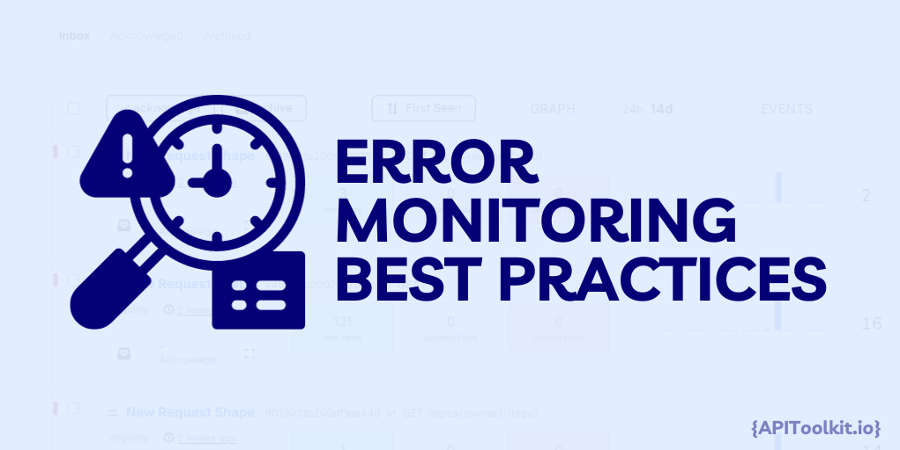
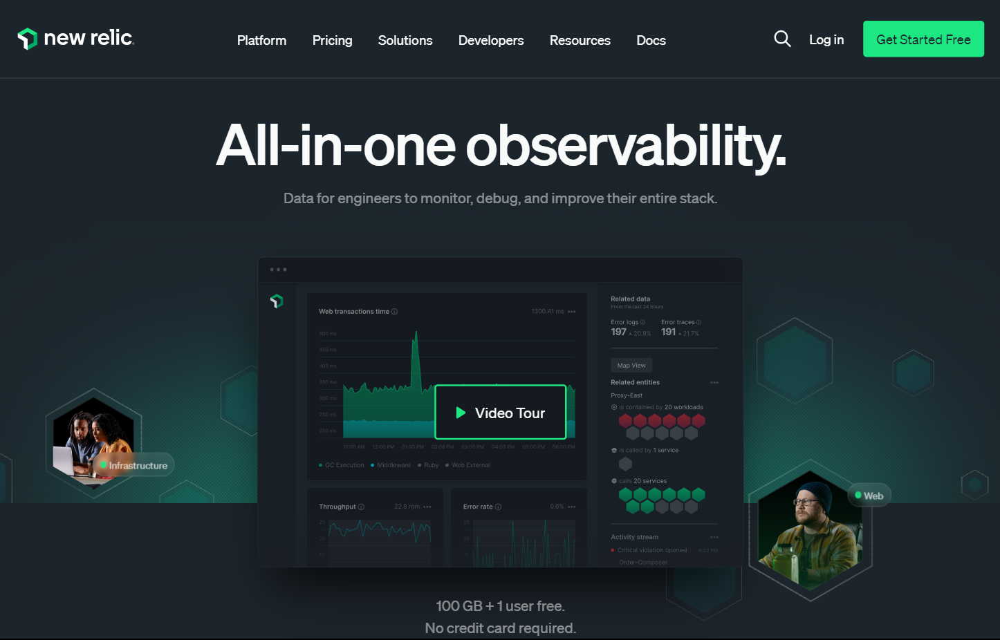
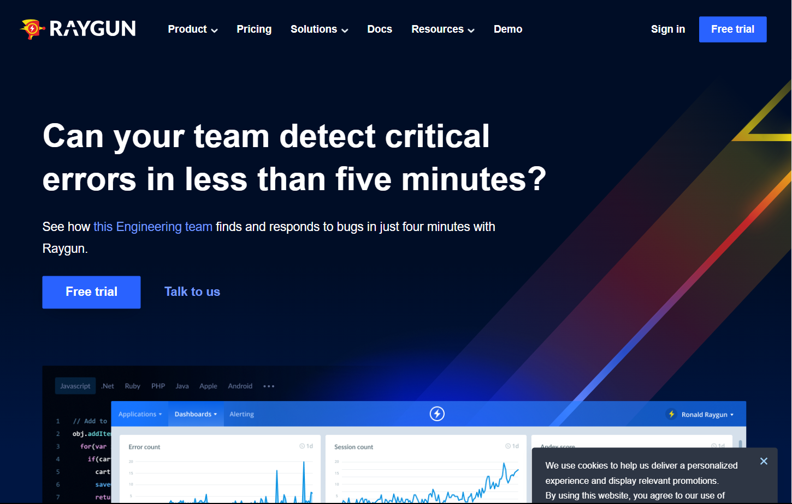

In a world where innovation and change are constants, there's one element that steadfastly holds its ground in ensuring the success and reliability of software systems: Error Monitoring. Though it might sound like a tech-heavy term, its influence in crafting both the user experience and the overall caliber of tech products is profound and far-reaching.To fully grasp the significance of error tracking in the tech arena, it's essential to see it as more than just a bug-hunt. It's an intricate dance of understanding and addressing software issues in ways that fundamentally reshape the development, deployment, and maintenance of software. In our era, where the digital consumer is king, expectations for flawless applications are sky-high, and the tolerance for glitches is low. Here, error monitoring emerges not just as a tool, but as a guardian of user experience and system integrity.

[Error monitoring](https://apitoolkit.io/blog/application-errors-a-guide-to-error-monitoring/) is like having a watchful guard always looking out for problems in your software. It's really useful because it gives you a clear picture of how your software is doing and how people are using it. These details are super valuable because they help you make smarter decisions. When you quickly find and fix these issues, your software becomes more reliable, your customers trust you more, and you stand out in the busy tech world.

In this article, we're going to dive deeper into error monitoring. We'll look at all the details, figure out the best tools to use, and learn the best ways to do it. Whether you're already an expert in tech or just starting, our goal is to give you all the knowledge you need to use error monitoring effectively. It's about more than just fixing mistakes; it's about making your software the best it can be, so it's strong and dependable as technology keeps changing.

## What is Error Monitoring?

[Error Monitoring](https://apitoolkit.io/blog/application-errors-a-guide-to-error-monitoring/), a term often tossed around in tech circles, it's a fundamental component of successful software development. But what does it truly mean? Error Monitoring is a process that involves tracking, identifying, and addressing errors in a software application. it's a proactive strategy that starts from the development phase and continues through the entire lifecycle of the application.

Think of running a really complicated system where lots of things could go wrong. Error [monitoring](https://apitoolkit.io/blog/efficient-endpoint-troubleshoot/) is like having a high-tech security system that's always on the lookout for anything unusual. It keeps track of any mistakes as they happen, tells the right people about them, and sometimes even suggests how to fix them. This constant watch helps keep the application working well, making sure any problems are taken care of quickly and effectively. In simple terms, error monitoring is all about finding, recording, and dealing with mistakes in software applications. It's like having a dedicated guard dog for your system, always alert for any errors or issues that might mess things up. Basically, it's about watching over your application's '[health](https://apitoolkit.io/categories/api-documentation)' to make sure it runs smoothly and does its job well.

### Common Error Types You Should Watch

Going into the world of error monitoring, it's like navigating a sea with various types of waves. Not every wave - or error, in our case - is the same. Some are small ripples, barely noticeable, while others are huge, system-crashing waves. Understanding these different types of errors is crucial for any tech professional, much like a captain understanding the seas. Let's explain these common error types can encounter:

1. **Runtime Errors:** Picture this as hitting an unexpected storm while sailing. These errors pop up when your application is smoothly sailing - or running - and suddenly, something goes wrong, causing it to crash or act bizarrely. Common culprits are like hitting unseen rocks, such as null reference errors or trying to perform impossible tasks like dividing a number by zero.

2. **Compilation Errors:** These are the errors you find when you're preparing to set sail - during the development phase. Imagine trying to read a map with missing or incorrect symbols; that's what a compilation error is like. They're usually syntax errors or mismatches in data types, and they prevent your application from being ready to launch, much like a boat that isn’t seaworthy.

3. **Logic Errors:** These are the trickiest and can be likened to navigating with a faulty compass. The application runs, but it leads you to the wrong destination. The issue here lies in the programming logic - perhaps the instructions or the algorithm has flaws. The application doesn’t crash, but it doesn’t correctly do what it’s supposed to do, taking you off course.

4. **Resource Errors:** Imagine your ship running out of fuel or supplies mid-journey. Resource errors happen when your application exhausts its necessary resources, like memory or storage space. This can drastically slow down your progress or even bring your journey (application) to a standstill.

5. **Connectivity Errors:** In today's world, where applications often rely on external services and networks, connectivity errors are like losing signal to your GPS or radio. They occur when your application fails to establish a connection to external services or networks, leaving you isolated and unable to proceed as planned.

Understanding and identifying these errors is like being a skilled captain who knows how to navigate through calm and stormy waters alike. Each error type requires a different approach to address and resolve, ensuring your application's journey is as smooth and uninterrupted as possible. That's why selecting the right error monitoring tool is not just a matter of preference; it's a strategic decision that can significantly impact the efficiency and reliability of your [software](https://apitoolkit.io/blog/api-observability-software-development-/). 

## Must-Have Features in an Error Tracking System

When evaluating error monitoring solutions, there are several key features to consider that can make or break their effectiveness:

1. **Real-Time Monitoring and Alerts:** The tool should offer real-time error detection and immediate alerts. This enables swift response to issues before they escalate.

2. **Comprehensive Error Reporting:** Detailed reports including error frequency, impact, and trends are crucial for understanding the broader context of the errors.

3. **User-Context Information:** To effectively address errors, knowing who was affected and how can be invaluable. Tools that provide user session data and user actions leading up to the error offer deeper insights.

4. **Integration Capabilities:** The ability to integrate with your existing development tools and workflows (like CI/CD pipelines, project management tools, etc.) is essential for a seamless experience.

5. **Customization and Scalability:** Every project is unique. A good error monitoring tool should offer customization options and scale with your project's growth.

6. **Support for Multiple Platforms and Languages:** If you're working across various platforms and programming languages, your tool should be versatile enough to accommodate them.

## Top Error Monitoring Tools

When examining the landscape of error monitoring tools, several stand out for their unique features and capabilities. Each of these tools offers distinct features and strengths, making them suitable for different needs and environments. Whether you prioritize user experience, comprehensive system analysis, real-time tracking, or API-specific monitoring, there is a tool designed to meet those specific error monitoring requirements. Choosing the right tool involves weighing these features against your specific needs, budget, and the nature of your project. In the next section, we'll explore best practices for utilizing these tools to their fullest potential. Here's a look at some of the top players in the market, including a noteworthy addition:

1. **APIToolkit:** APIToolkit is a notable addition, especially valuable for teams focused on API monitoring. It specializes in tracking API errors and performance, offering insights that are crucial for applications heavily reliant on API integrations. Its targeted approach to API errors makes it a unique and essential tool for modern applications that interact extensively with various APIs.

2. **Sentry:** Sentry is renowned for its robust real-time error tracking capabilities. It integrates seamlessly with a multitude of development environments, making it a versatile choice for teams seeking comprehensive error insights and trend analysis. Its ability to delve into detailed error data makes it a strong candidate for teams dedicated to thorough error resolution.

3. **New Relic:** New Relic distinguishes itself with comprehensive performance monitoring capabilities, including in-depth error reporting. It's particularly suited for larger organizations that require a holistic view of their [software's performance](https://apitoolkit.io/blog/api-observability-software-development-/). With its extensive monitoring tools, New Relic provides valuable insights into not only errors but overall system health.

4. **Raygun:** Raygun is known for its user-centric approach, providing detailed data on user journeys along with error reports. This focus makes it ideal for applications where user experience is a key concern. Raygun helps teams understand how errors affect users, enabling more user-focused solutions.

## Error Monitoring Best Practices

Effective error monitoring is an art that combines the use of the right tools with intelligent strategies and best practices. A proactive approach is key in staying ahead. Automating error logging, alerts, and preliminary diagnostics can significantly boost efficiency. It's not just about setting up systems; it's about creating an environment where errors are detected and addressed promptly and efficiently.

The establishment of clear error handling policies is crucial. Such policies should delineate how various types of errors are managed and by whom. This clarity not only speeds up resolution times but also prevents confusion in the heat of the moment. Moreover, a regular review of error logs shouldn't be underestimated. This practice is not just a reactionary measure for when things go wrong, but a proactive strategy to nip potential issues in the bud.

Another key aspect is the use of error [monitoring](https://apitoolkit.io/blog/rum-vs-synthetic-monitoring/) as a tool for continuous improvement. By analyzing trends and insights from errors, software development processes can be refined and improved. This turns error monitoring into a catalyst for enhancement, rather than just a fix-it tool. Effective alert systems are another cornerstone of efficient error monitoring. It's essential to set up a system that prioritizes and categorizes alerts based on their severity and impact. This helps in focusing on what's truly important. Additionally, customizing alert channels to suit the nature of the error and the team's preferences can make a huge difference in responsiveness and action.

However, it's also important to be wary of alert fatigue. Too many alerts can desensitize the team, turning potentially critical warnings into background noise. Fine-tuning the system to ensure only pertinent and crucial alerts are dispatched is as important as setting up the system itself. Seamlessly integrating error tracking into your workflow is another best practice. This involves linking the [error monitoring](https://apitoolkit.io/blog/application-errors-a-guide-to-error-monitoring/) system with existing development tools, such as JIRA, Slack, or GitHub. Such integration facilitates more efficient tracking and management of errors. It’s also vital to educate the team on how to use these tools effectively and the procedures to follow when an error is detected. Regular feedback loops where developers and the operations team can discuss and review error reports lead to more effective problem-solving.

## Moving From Detection to Correction

Handling errors like a pro involves a blend of technical know-how and strategic thinking. The journey from detecting an error to resolving it is not always straightforward. Prioritizing errors can be overwhelming, but it's manageable with the right approach. Start by assessing the impact of the error - how many users are affected, and is there a security risk? Developing a system to categorize errors helps in swiftly identifying which ones need immediate attention. Historical data can also be a guide in this process, helping to understand which types of errors have the most significant impact.

Teamwork is non negotiable in troubleshooting. Collaborative solutions involving different teams, such as development, QA, and operations, can lead to more effective and innovative solutions. Regular sync-ups ensure everyone is aligned and working toward a common goal. Leveraging the collective knowledge and experience of team members can be invaluable in resolving complex issues.

Learning from mistakes is crucial in turning errors into opportunities. Conducting a post-mortem analysis after resolving an error helps in understanding what went wrong and why. Updating documentation with these learnings and sharing them with the team turns these experiences into a valuable resource for future reference. Cultivating a culture of continuous learning, where errors are viewed as opportunities for growth and innovation, can transform the way a team approaches problem-solving.

Adopting these strategies can revolutionize how your team detects, prioritizes, and resolves [errors](https://apitoolkit.io/blog/how-to-implement-error-monitoring-in-golang/). This approach turns potential challenges into opportunities for growth and learning, setting the stage for continuous improvement and innovation in error monitoring. The subsequent sections will delve into advanced techniques and the impact of emerging technologies in this field.

## Advanced Error Monitoring Techniques

Generally the field of error monitoring is experiencing a groundbreaking transformation, driven by the advent of sophisticated techniques and innovations. This evolution is not just about technical enhancements; it's about redefining how we approach, understand, and resolve software errors. At the heart of this transformation is the integration of artificial intelligence (AI) into error monitoring. Imagine having a forward-thinking assistant that not only keeps a vigilant eye on your systems but also anticipates problems before they even arise. This is what AI brings to the table with its predictive analytics capabilities. By analyzing past error data, AI helps us foresee potential future issues, allowing teams to proactively tackle them. This shift from a reactive to a proactive approach is like having a crystal ball that helps prevent problems, ensuring smoother operations and happier users.

AI's role doesn't stop there. Its ability to detect anomalies, those sneaky issues that often slip under the radar, is like having a super-sleuth on your team, uncovering hidden patterns and unusual behaviors that hint at bigger problems. This early detection is crucial in nipping issues in the bud, saving time, and avoiding potential headaches down the line. Another area where AI shines is in automated root cause analysis. Gone are the days of tediously combing through logs and data to find the needle in the haystack. AI streamlines this process, quickly getting to the bottom of an error. It's like having a smart detective who can solve the mystery in record time, allowing teams to focus on creating great software rather than getting bogged down with troubleshooting.

But with great power comes great responsibility. As we embrace these advanced tools, we must also find a delicate balance between comprehensive monitoring and maintaining system performance. It's a tightrope walk, ensuring that our quest for vigilance doesn't hamper the very systems we're trying to protect. It's about choosing tools that are not just powerful but also wise, gathering essential data without being a burden on system resources. The journey into advanced error monitoring techniques is more than a technological endeavor; it's a journey towards smarter, more efficient, and more proactive software maintenance. It's about empowering teams with the tools and insights they need to not just react to problems, but to anticipate and prevent them. As we continue to explore real-world applications and success stories in error monitoring, we'll see how these advanced strategies are not just theories but practical, impactful solutions that are reshaping the landscape of software development.

## Conclusion

The key to staying ahead in this field is staying informed about the latest tools and techniques, and fostering a culture of continuous learning and innovation within your team. Sharing knowledge and experiences is vital for developing more effective strategies and solutions. Looking forward, integrating emerging technologies like AI and machine learning into error [monitoring](https://apitoolkit.io/blog/stay-ahead-of-the-curve/) processes is essential for adapting to the evolving needs of software and its users. Remember, the ultimate aim is to enhance the user experience, ensuring software not only functions well but also meets the highest standards of quality and reliability. In essence, success in error monitoring comes from a commitment to continuous improvement, a readiness to embrace new technologies, and a focus on delivering a superior user experience. This approach not only keeps you ahead in error monitoring but also drives your software and organization towards greater success.

## Keep Reading

[Top 7 Reasons Why Your Team Should Use A Plug-and-play API Monitoring Tool](https://apitoolkit.io/blog/why-you-need-an-api-monitoring-tool/)

[How to Tackle ANomalies in RESTful APIs the Right Way](https://apitoolkit.io/blog/anomalies-in-restful-apis/)

[API Documentation vs Specification: What It Means for You](https://apitoolkit.io/blog/api-documentation-vs-api-specification/)

[A Comprehensive API Management Strategy for Businesses](https://apitoolkit.io/blog/the-ultimate-api-management-strategy/)

[The Rise of API-as-a-Product (2023)](https://apitoolkit.io/blog/api-as-a-product/)
