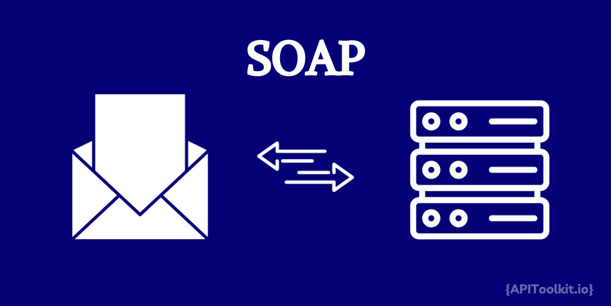
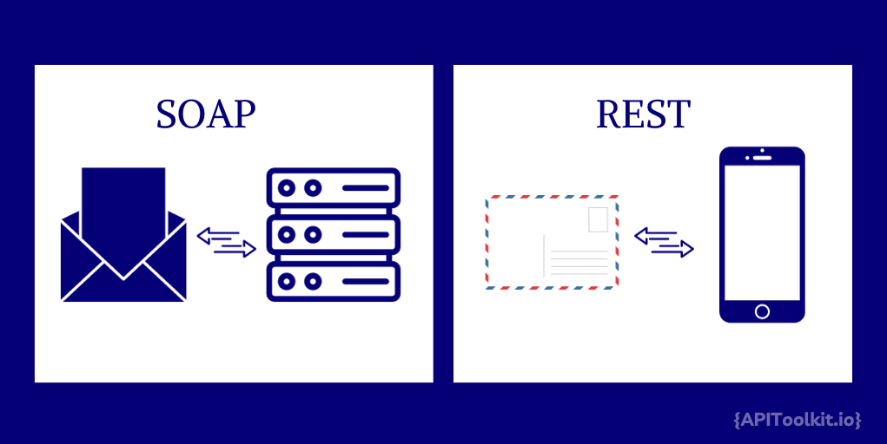

Every day, without us even realizing it, [SOAP APIs](https://apitoolkit.io/blog/everything-about-soap-apis/) quietly but powerfully shape many of our digital interactions. Consider online banking, a routine activity for many. Each time you check your balance or initiate a transaction, there's a good chance that SOAP APIs are at work behind the scenes. These APIs, which stands  for Simple Object Access Protocol, are crucial in securely transmitting your financial data between your bank's website and its internal systems. Their XML-based structure is specifically designed to handle such sensitive information with the utmost security and reliability. This makes SOAP APIs a trusted ally in industries where data integrity and security are not just preferences but necessities. Their widespread use in banking systems is a testament to their ability to manage critical data efficiently, ensuring that our online transactions are both smooth and secure.

Tracing the history of SOAP APIs takes us back to the late 1990s. Initially developed by Microsoft, SOAP has undergone significant evolution over the years. From its inception, it was designed to facilitate distributed computing, and over time it has become more refined and standardized. The evolution of SOAP APIs reflects a broader shift in web services and data interchange methods. From rudimentary communication protocols to the highly structured and secure framework we see today, SOAP [APIs](https://apitoolkit.io/blog/api-observability-software-development-/) have continually adapted to meet the growing demands of complex digital interactions.

Understanding [SOAP APIs](https://apitoolkit.io/blog/everything-about-soap-apis/) requires a deep dive into their technical foundations and operational nuances. As we explore the benefits and strategic implementations of these APIs, we uncover why they remain relevant and widely used in various industries, despite the emergence of newer technologies like REST APIs. The history and evolution of SOAP APIs not only provide insight into the development of web technologies but also offer a glimpse into the future, where adaptability and security continue to be paramount. In the following sections, we will delve deep into the technical workings, [benefits](https://apitoolkit.io/blog/benefits-of-api-integration/), and strategic implementations of SOAP APIs, unraveling why they continue to be an integral part of modern [web services](https://apitoolkit.io/blog/web-api-performance/).

## SOAP APIs: A Technical Overview

[SOAP APIs](https://apitoolkit.io/blog/everything-about-soap-apis/) are much like secure envelopes tailor-made for safely conveying crucial information. They operate using XML-based messages, which can be compared to well-structured letters, ensuring clear and precise communication between different systems. This organized approach is what makes them adept at handling complex data exchanges, offering reliability and consistency in a variety of applications.

The core of a SOAP API lies in its 'SOAP envelope', a term that fittingly describes its role as a secure container for message delivery. This envelope comprises two vital components: the header and the body. The header is tasked with carrying crucial meta-information such as authentication details and transaction controls, which are essential for the accurate processing of the message. The body holds the actual request or response data. It's this stringent structure that bestows SOAP APIs with their acclaimed reliability and security.

Another key aspect of [SOAP APIs](https://apitoolkit.io/blog/everything-about-soap-apis/) is the WSDL, or Web Services Description Language. Imagine this as the instruction manual that comes with the envelope, explaining how to use it effectively. It describes the services offered, how to send requests, and what responses to expect, ensuring that anyone who uses the API can do so efficiently and accurately.

Understanding these aspects of SOAP APIs is like learning the art of sophisticated digital communication. They are especially valuable in scenarios where secure, detailed, and reliable message exchange is crucial. As we explore further, we'll see how these elements come together to benefit businesses and streamline complex digital interactions.

### SOAP Request Example

```xml
POST /WeatherService HTTP/1.1
Host: api.example.com
Content-Type: text/xml; charset=utf-8
Content-Length: length
SOAPAction: "http://api.example.com/GetWeather"

<?xml version="1.0"?>
<soap:Envelope xmlns:soap="http://schemas.xmlsoap.org/soap/envelope/"
               xmlns:web="http://api.example.com/webservice">
    <soap:Header>
        <!-- Header information (like authentication, etc.) -->
    </soap:Header>
    <soap:Body>
        <web:GetWeatherRequest>
            <web:City>New York</web:City>
        </web:GetWeatherRequest>
    </soap:Body>
</soap:Envelope>
```

In this SOAP request:
- The `Envelope` element is the root of the SOAP message.
- The `Header` element is optional and can contain additional information like authentication.
- The `Body` element contains the actual request - in this case, a request for weather information for New York.

### SOAP Response Example

```xml
HTTP/1.1 200 OK
Content-Type: text/xml; charset=utf-8
Content-Length: length

<?xml version="1.0"?>
<soap:Envelope xmlns:soap="http://schemas.xmlsoap.org/soap/envelope/"
               xmlns:web="http://api.example.com/webservice">
    <soap:Body>
        <web:GetWeatherResponse>
            <web:Temperature>75</web:Temperature>
            <web:Condition>Sunny</web:Condition>
        </web:GetWeatherResponse>
    </soap:Body>
</soap:Envelope>
```

In the SOAP response:
- The `Envelope` and `Body` are similar to the request structure.
- The `GetWeatherResponse` element contains the response data - in this case, the temperature and weather condition.

## Benefits of Using SOAP APIs

Adopting SOAP APIs in your digital toolkit is like adding a trusted security guard and a precision engineer to your team. These APIs shine in situations where tight security and flawless reliability are non-negotiable. The benefits of SOAP APIs do not only make [SOAP APIs](https://apitoolkit.io/blog/everything-about-soap-apis/) a preferred choice in various industries but also underscore their significance. Here are some of the key benefits:

- **Enhanced Security**: SOAP APIs inherently support advanced security protocols such as WS-Security, making them highly secure for sensitive data transmission.
- **Strict Standardization**: Governed by rigorous standards, SOAP ensures consistent message formats and communication protocols, reducing complexity in web service interactions.
- **Reliable Data Exchange**: Due to their structured nature, SOAP APIs are known for their reliability in data exchange, especially in heterogeneous systems.
- **Complex Transaction Handling**: SOAP is well-suited for complex transactions and multi-part messages, making it ideal for enterprise-level applications.
- **Legacy System Integration**: SOAP's protocol-based approach facilitates easier integration with legacy systems, which is often a challenge with newer API paradigms.
- **Detailed WSDL Documentation**: The use of [Web](https://apitoolkit.io/blog/web-api-performance/) Services Description Language (WSDL) in SOAP APIs provides a detailed description of the services, ensuring easy integration and long-term maintainability.
- **Error Handling**: SOAP's standard format includes built-in error handling, which makes it easier to manage and troubleshoot issues in web services.
- **Platform and Language Independence**: SOAP APIs can be used across different platforms and programming languages, thanks to their XML-based messaging system.

## Comparative Analysis: SOAP vs. REST APIs



As developers and [businesses](https://apitoolkit.io/blog/how-api-observability-can-boost-your-business-performance/) understanding the key differences between SOAP and REST APIs is crucial when making strategic decisions for projects to help them choose the right communication method.

SOAP APIs as seen earlier are thought of as sending a secure, tracked envelope. They are like registered mail, complete with all the formalities and structures necessary for delivering sensitive, confidential information. Built around XML, SOAP APIs are the go-to choice when your project involves complex transactions or needs to interact with legacy systems. They're like sending a sealed envelope, ensuring that every detail is precisely in place and securely delivered, making them perfect for operations requiring strict data integrity and confidentiality.

REST APIs, on the other hand, are likened to sending a postcard. They offer a more relaxed, straightforward approach, using common web languages and methods that are easier to handle. Think of REST as writing a quick, informative postcard that gets the message across without the need for envelopes or extra layers of security. This approach is especially efficient for applications that need to scale rapidly, like social media platforms or cloud-based services, where the ease of use and flexibility are key.

Choosing between SOAP and [REST](https://apitoolkit.io/blog/rest-api-is-the-future/) for your project boils down to the specific requirements of your application. If your project demands stringent security, has complex transactional requirements, or needs to adhere to strict communication standards, SOAP APIs might be the better choice. However, if you're looking for an API that is easy to implement, scalable, and well-suited for cloud services and public APIs, REST APIs could be more appropriate. Both SOAP and [REST APIs](https://apitoolkit.io/blog/rest-api-workflow/) have their unique strengths and are suited to different types of projects. The decision on which to use should be based on the specific needs of your application, considering factors like security, complexity, scalability, and the nature of the data being transmitted. Successfully implementing SOAP APIs involves navigating a series of best practices and addressing common challenges to harness their full potential. Understanding these strategies is key to ensuring effective and efficient integration of SOAP APIs into your digital infrastructure.

When integrating SOAP APIs, a primary focus should be on understanding and adhering to the standard protocols that define [SOAP](https://apitoolkit.io/blog/everything-about-soap-apis/) communications. This involves a thorough grasp of XML and WSDL (Web Services Description Language), which are central to SOAP API functionality. Ensuring that your development team is proficient in these technologies is crucial. Another best practice is to maintain rigorous testing and quality assurance throughout the SOAP API integration process. Due to the structured nature of SOAP messages, any deviation from the expected format can lead to significant issues. Employing robust testing frameworks and continuous integration/continuous deployment (CI/CD) practices can mitigate these risks. Documenting the API thoroughly is also essential. Good documentation not only aids in easier integration and troubleshooting but also ensures long-term maintainability. This includes detailing the API's functions, parameters, expected responses, and error handling procedures.

## Common Challenges and Solutions

One of the common challenges in implementing SOAP APIs is handling their inherent complexity, especially in comparison to more straightforward API models like REST. To address this, it's advisable to use specialized tools and platforms that simplify SOAP API development and testing. These tools can automate many aspects of SOAP API creation, reducing the learning curve and speeding up the development process.

Another challenge is ensuring interoperability across different systems and platforms. Given SOAP's strict standards, even minor discrepancies can lead to failures in communication. A solution here is to prioritize cross-platform testing and adhere strictly to SOAP standards to ensure seamless interoperability.

Finally, managing performance can be a concern, as SOAP messages tend to be more verbose than their REST counterparts. To mitigate performance issues, optimize the SOAP message structure and leverage caching mechanisms where appropriate. This can significantly improve response times and overall efficiency.

Implementing SOAP APIs effectively requires a combination of technical knowledge, rigorous testing, and thorough documentation. By addressing common challenges with strategic solutions and adhering to best practices, organizations can successfully integrate SOAP APIs into their systems, reaping the [benefits](https://apitoolkit.io/blog/benefits-of-api-integration/) of their robustness and security.

## Conclusion

In this comprehensive exploration of SOAP APIs, we've delved into their technical aspects, benefits, and strategic implementations. We've seen how the robust structure of SOAP APIs, centered around XML and strict standards, offers unparalleled security and reliability, making them an ideal choice for complex and critical operations in various industries.

Comparing SOAP with [REST APIs](https://apitoolkit.io/blog/rest-api-is-the-future/) highlighted the unique strengths of each, providing valuable insights for businesses and developers in choosing the right technology for their specific needs. While SOAP excels in scenarios demanding high security and complex transactions, REST APIs offer simplicity and scalability for different applications.

The strategic implementation of SOAP APIs, with an emphasis on best practices and overcoming common challenges, underscores the importance of detailed planning and execution in leveraging these technologies effectively. From ensuring adherence to standards and thorough documentation to addressing performance and interoperability issues, the successful deployment of SOAP APIs requires a holistic approach.

In conclusion, [SOAP APIs](https://apitoolkit.io/blog/everything-about-soap-apis/) continue to play a vital role in the landscape of web services and data exchange. Their ability to handle intricate and secure data transactions efficiently positions them as a key player in the technological arena. As we move forward, understanding and utilizing the full potential of SOAP APIs will remain crucial for businesses and developers aiming to build robust, secure, and effective digital solutions.

## Keep Reading

[REST APIs are the Future: Compared to RPC, GraphQL, etc](https://apitoolkit.io/blog/rest-api-is-the-future/)
[The Key Metrics to Measure Developer Success for Your API Platform](https://apitoolkit.io/blog/the-key-metrics/)
[Generating Golang API Doc with Swagger](https://apitoolkit.io/blog/generating-golangdoc/)
[Unlocking the Advantages of OpenAPI (Swagger) Specification for API Development](https://apitoolkit.io/blog/open-api-swagger-specification-for-api-development/imdex/)
[The Importance of Streamlining Navigation with Skip Links for API Product Managers and Growth Teams](https://apitoolkit.io/blog/importance-of-streamlining-navigations/)
